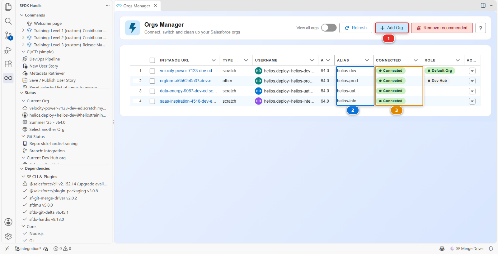
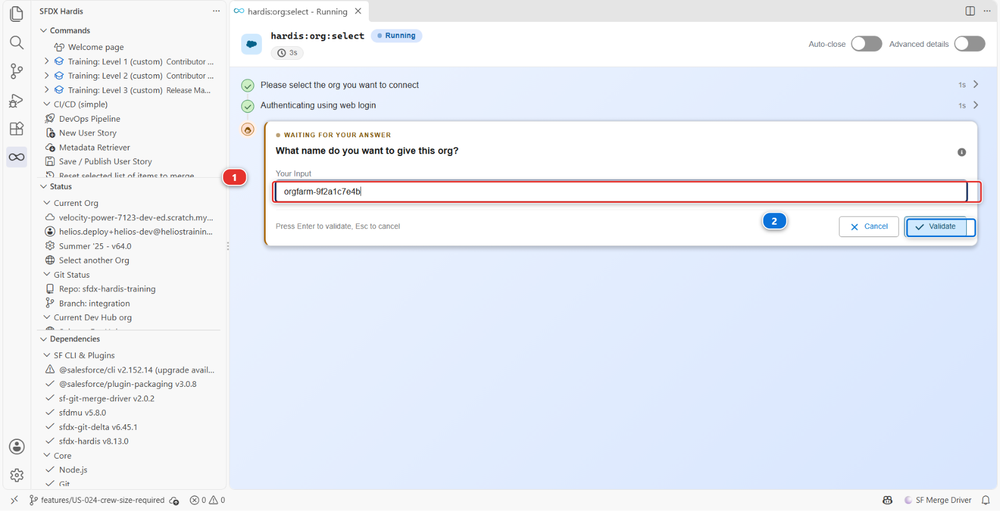
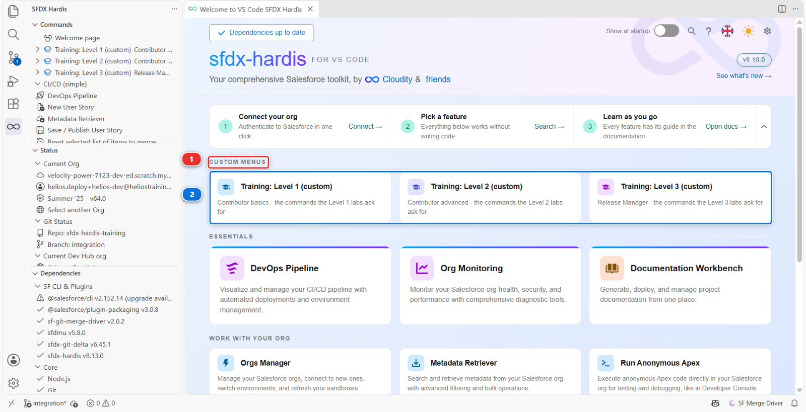
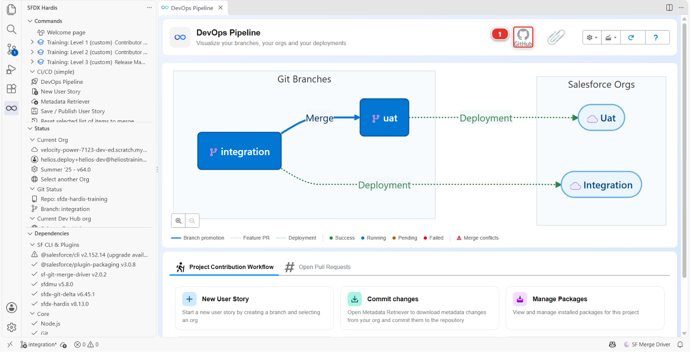
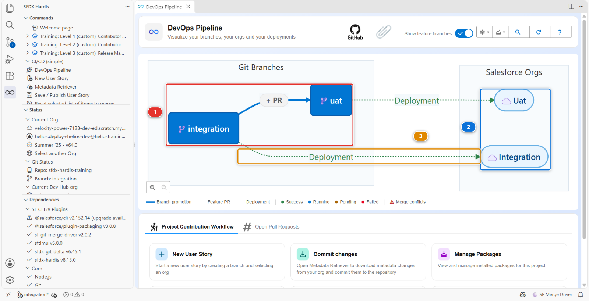

# Lab 1.2 - Create your Dev Hub, scratch orgs and CI/CD pipeline

**Level**: 1 Contributor basics

**Time**: ~30 min, most of it waiting

**You will**: sign up for one free Salesforce org, and let one command turn it into everything the
course needs: three more orgs, a copy of the project, and a pipeline wired to them.

## The situation

**This lab is not the job, and none of it happens on a real project.**

There, all of this exists before you arrive: the orgs were created by whoever set the project up,
the repository has been there for years, and its pipeline has been deploying for months. You would
join, open the project, and start on a ticket.

This course cannot hand you a team's environment, so it has you build a small one. You do two things
by hand, sign up for an org and connect it, and one command does the rest while you read. The work
starts in [Lab 1.3](1-3-start-a-user-story-on-a-git-branch.md), and everything from there on is what a real day looks like.

## Before you start

- [ ] [Lab 1.1](1-1-install-vs-code-and-sfdx-hardis.md) finished: the Setup panel all green
- [ ] A GitHub account
- [ ] An email address you can open

!!! info "If you do not have a GitHub account"
    Making one takes two minutes and costs nothing. Open
    [github.com/signup](https://github.com/signup) and give it an email address, a password and a
    username. GitHub emails you a code to confirm the address, and that is the whole of it: the free
    plan does everything this course needs, and it never asks for a card.

    Choose the username with a little care. It becomes part of the address of everything you put
    there, `github.com/<your-username>/sfdx-hardis-training` in a few minutes, and people do read
    it. Your name, or the handle you already use elsewhere, beats anything you will want to change
    later.

    **If you already have an account, use it.** Personal or work, old or new, it makes no
    difference here. The one thing worth knowing about a work account: some companies restrict what
    their members may fork. If the fork in step 5 is refused, that is why, and a personal account
    gets you past it.

## Steps

### 1. Create your Developer Edition org

Go to [developer.salesforce.com/signup](https://developer.salesforce.com/signup) and sign up. It is
free, it never expires while you use it, and it asks for no credit card.

The form asks for your first name, last name, job title, company and country or region, then three
things that decide whether the signup goes through:

1. **Work email** **(1)**, a real address you can open, because the signup is confirmed by email
2. the tick that accepts the **Main Services Agreement** **(2)**. The tracking-pixel box under it is
   optional, and you can leave it alone
3. **Sign me up** **(3)**


You do not choose a username: it is generated and sent to you. Open the confirmation email and set
a password. The email also carries that username. It looks like an email address but it is not one,
and it is what you log in with. Keep it somewhere.

This is the only org you sign up for, and it has two jobs in this course:

| When           | What this org is                                                             |
|----------------|------------------------------------------------------------------------------|
| Levels 1 and 2 | Your **Dev Hub**: the org that creates the other three, and nothing else     |
| Level 3        | **Production**, the last stop of the pipeline you will have finished by then |

!!! info "Scratch orgs, in one paragraph"
    A **scratch org** is a temporary Salesforce org that a command creates in a couple of minutes,
    from an org called a **Dev Hub**. It starts empty, lives for up to 30 days, and is thrown away
    when you are done. Teams use them because a fresh org nobody has touched is the most honest
    place to test a deployment. A free Developer Edition org can act as a Dev Hub and keep **three
    scratch orgs** alive at a time, which is exactly how many this course uses.

!!! note "A Developer Edition org is deactivated after a long period of inactivity. Finish a level within a few weeks and you will never meet that."

### 2. Connect it in Orgs Manager

Back in VS Code, on the Welcome page, click **Orgs Manager**.



The picture was taken at the end of this lab. For now your table is empty.

!!! info "Connected org, default org"
    An org is **connected** when the Salesforce CLI on your machine holds a token for it: VS Code
    can open it and work in it without asking you for a password. You can have several connected
    orgs at once, and this table lists them all.

    The **default org** is the one of them a command works on when nobody tells it which org to
    use. There is only one at a time, the Status section of the sfdx-hardis panel names it, and
    this panel is where you change it.

1. Click **Add Org** **(1)**. If it asks **Do you want to set the selected org as your default
   org?**, answer **Yes**: that is what points the rest of the course at this org without asking
   again
2. Pick **🌍 Login to another org**, the first entry in the list that opens
3. It asks which address to sign in at, and it suggests the sandbox one. **Change it**: take
   **☢️ Other: Dev org, Production org or DevHub org (login.salesforce.com)**, because a Developer
   Edition org is not a sandbox. Pick the sandbox answer here and the login page refuses your
   username
4. Your browser opens the Salesforce login page. If it already offers usernames you signed in with
   before, click **Log In with Different Username** first, then use the one from the email
5. Salesforce asks **Allow Access?** for the Salesforce CLI. Click **Allow**. This is the screen
   that hands the CLI the token it stores on your machine, so refusing it leaves the org
   unconnected

Back in VS Code, the panel asks you one more thing:



**What name do you want to give this org?** The box **(1)** is already filled with a suggestion,
taken from the org's own web address. On a Developer Edition that address is a string Salesforce
invented, `orgfarm-9f2a1c7e4b` or similar, which tells you nothing about what the org is for.

**Replace it with `helios-prod`**, then click **Validate** **(2)**.

Production may sound like a big name for an empty org. It is the job this org has at the end of the
course, and giving it its final name now means nothing gets renamed later.

That name is called an **alias**, and it is what you will see and click from now on: in this panel,
in the pipeline diagram, everywhere the course names an org. The three orgs step 5 creates get
theirs automatically, and they appear in this table under those names **(2)**, each with a green
**Connected** **(3)**. **This panel is how you connect to an org for the rest of the course**, and
also how you check which org you are pointed at, which saves more confusion than anything else in
this training.

<details markdown="1"><summary>Under the hood: what connecting an org just did</summary>

The panel ran:

    sf hardis:org:select

which opened your browser, let Salesforce authenticate you, and stored an OAuth refresh token in
your user profile (`~/.sfdx`). Nothing is stored in the project, and nothing is committed: the
credential is yours and stays on your machine. Then it named the org:

    sf alias set helios-prod=you.helios@heliostraining.invalid

The alias is the name everything else uses. Every sfdx-hardis command that wants an org accepts
`--target-org helios-prod` from now on, and so does the Salesforce CLI itself.

<!-- command-links:start -->
Command documentation: [hardis:org:select](https://sfdx-hardis.cloudity.com/hardis/org/select/)
<!-- command-links:end -->

</details>

### 3. Get the repository

You need the training project on your machine before the command in step 5 can build anything from
it. Take the team's copy for now: it is read-only, and step 5 turns it into your own.

In VS Code, with no folder open, click the **Source Control** icon **(1)** in the narrow bar down the
left. It offers two buttons. Take **Clone Repository** **(2)**.


Then:

1. Paste `https://github.com/hardisgroupcom/sfdx-hardis-training.git` and press Enter
2. Pick the folder to put it in. VS Code creates a `sfdx-hardis-training` folder inside the one you
   choose, so choose the place you want **every** repository to live from now on. If you have no
   such place yet, make one: `C:\git` on Windows, `~/git` on macOS and Linux. Short path, no
   spaces, not inside OneDrive or any folder that syncs, because a sync client and a git repository
   fight over the same files
3. When it asks, click **Open** to work in the clone

If GitHub asks you to sign in, let VS Code handle it: **Sign in with your browser** is enough.

!!! note "You do not need an empty folder first"
    **Clone Repository** asks where to put the project, so there is nothing to prepare. The two
    buttons in the picture only appear while no folder is open: once one is, the Source Control
    panel shows that folder's changes instead.

!!! tip "In Agentforce Vibes, keep the folder it offers"
    The tab opens on a workspace of its own, already short, already outside any sync client. Take
    the folder the dialog suggests rather than typing a path: there is no `C:\git` to make, and a
    path you invent there is somewhere the tab may not keep.

<details markdown="1"><summary>Under the hood: what opening the folder told the extension</summary>

The extension read a handful of files, and it reads them again whenever they change, so you never
have to reload the window:

- `sfdx-project.json`, which says the Salesforce sources live in `force-app`
- `config/.sfdx-hardis.yml`, the project configuration: major branches, cleaning rules, the
  Training menu
- `config/project-scratch-def.json`, the shape of the scratch orgs this project creates
- `config/branches/`, one file per major branch, saying which org it deploys to

Those branch files are empty of your details until step 5 fills them in.

</details>

### 4. Install the GitHub CLI

!!! tip "In Agentforce Vibes, skip this step"
    `gh` is already installed in the tab. Go straight to step 5: the first command that needs it
    signs you in, and nothing here is missing.

    `gh` is not only for this step, which is why it is worth knowing it is there. The commands
    behind **Publish my work**, **Simulate my teammates**, **Check my work** and **Claim my badge**
    all call it: it opens your Pull Requests, plays your teammates' merges, reads the secrets of
    your fork to check a level, and looks at your star and your repository's visibility when you
    claim.

One tool first, and only for this. The command in step 5 uses the
[GitHub CLI](https://cli.github.com/), called `gh`, to make your copy of the repository and set its
automation up. On its home page, open the install list **(1)** and take the download for your
machine: **Windows - Download MSI** **(2)**, or **macOS - Download binary**. Accept the installer's
defaults.


!!! warning "Restart VS Code after installing it"
    The installer adds `gh` to the **PATH**, and a VS Code that was already open does not see the
    change until it starts again. Close VS Code completely, windows and all, and open it again on
    the project. Skip this and step 5 stops at once, saying the GitHub CLI is not installed.

You never have to run `gh` yourself. The command in step 5 uses it and signs you in through your
browser the first time it needs to.

!!! note "This one is for the course, and for GitHub"
    It is here so that one click can hand you a working pipeline instead of a dozen forms. Nothing
    else in the course needs it, and nothing in sfdx-hardis does: this project happens to live on
    GitHub, and GitLab, Azure DevOps and Bitbucket projects work exactly the same way without it.
    On a real project you would join a repository that already exists, with its automation already
    running, and you would never install this.

### 5. Set up your training environment

Open the Welcome page again. Above the built-in cards there is a **CUSTOM MENUS** heading **(1)**,
holding three cards **(2)**, one per level.



!!! note "Where those cards come from"
    They are not part of the product. Any project can declare its own menus in its
    `config/.sfdx-hardis.yml`, and the extension shows them here, marked `(custom)`, so you can
    always tell a project's commands from the ones sfdx-hardis ships. This project declares one
    menu per level, and each holds only the commands that level uses.

Click **Training: Level 1**, then click **Set up my training environment** **(1)**.

The first time you click a Training card, VS Code does not run it. It asks how you want to allow it
**(2)**, and shows the command it is about to run. A custom menu runs something the project wrote,
not something the extension ships, so the extension refuses to run it behind your back. Read the
line, check it says `node scripts/training.mjs`, then click **Always allow** **(3)**.


**Always allow** answers for the whole menu, not for that one card. The Training entries of the
three levels stop asking, and nothing else does: the extension recognises a Training command by its
shape and by the repository you cloned, so a custom command of any other project still asks you
first, in this folder and in every other.

!!! warning "Read the line before you allow it"
    **Allow once** runs it this time only, **Always allow** remembers it. Either is fine here: you
    can see what it runs, and the repository is the one you cloned. On a project somebody else set
    up, read that line first. It is the only moment anything shows you what a custom menu really
    does.

!!! tip "The first thing it does is sign you in to GitHub"
    Step 1 of the eight below makes your own copy of the repository, and that needs your GitHub
    account. The command stops on a line like `Your one-time code is 5989-F9D9` and opens
    [github.com/login/device](https://github.com/login/device) in your browser. Type the code
    there, then **accept everything github.com asks for**: the authorisation screen and each
    permission it lists. It is asking to create a repository in your account and to write the
    secrets the CI jobs read, which is the whole of what this step does. Come back to VS Code and
    the command carries on by itself, and never asks again.

    If the browser did not open, the address is printed right under the code. In Agentforce Vibes
    it does not open on its own: click the printed link.

!!! tip "Then it asks for one click on GitHub"
    GitHub switches off the workflows of every new fork, behind a banner that no command can
    press. Step 2 of the eight opens the **Actions** tab of your fork in your browser and waits.
    Click **I understand my workflows, go ahead and enable them**, come back to VS Code, and the
    command carries on by itself. Without that click, nothing would ever check or deploy your
    work.

It does not ask which org to use: you connected one, named `helios-prod`, so it takes that one, says
so, and asks only for a yes before it changes anything. Then it works through eight steps and tells
you as it goes:

```text
Developer Edition org: helios-prod

1 of 8  Your own copy of the repository
OK  origin is now your-handle/sfdx-hardis-training, and the shared repository is upstream.

2 of 8  Actions turned on
OK  Actions are on.

3 of 8  Your Dev Hub
OK  helios-prod is a Dev Hub now.

4 of 8  Your three scratch orgs
OK  helios-dev is created, for 30 days.
OK  helios-integration is created, for 30 days.
OK  helios-uat is created, for 30 days.

5 of 8  The Helios app in each of them
OK  helios-dev holds the app, your permission set and the sample data.
...

6 of 8  The credentials the CI jobs use
OK  SFDX_AUTH_URL_INTEGRATION is set on your-handle/sfdx-hardis-training.
OK  SFDX_AUTH_URL_UAT is set on your-handle/sfdx-hardis-training.

7 of 8  Which org each branch deploys to
OK  integration now names the org of every branch, and is pushed.

8 of 8  Changes through a Pull Request, merged once green
OK  integration now takes changes through a Pull Request only, merged once its checks are green.
OK  uat now takes changes through a Pull Request only, merged once its checks are green.
```

Count on fifteen to twenty minutes, nearly all of it steps 4 and 5, when Salesforce creates the orgs
and the app is deployed into all three at once. Nothing prints while that happens. It is not stuck.

!!! tip "In Agentforce Vibes it is much faster"
    The same eight steps took about three minutes in the tab, because the machine running them
    sits next to Salesforce rather than at the end of your home connection. Fifteen to twenty is
    the figure to plan for on a laptop; anything faster is a good surprise.

Running it twice is harmless: every step checks before it acts, and an org that already exists is
kept. If one of the steps cannot be done from here, it says so and tells you which button to click
instead.

<details markdown="1"><summary>Under the hood: what "Set up my training environment" just did</summary>

The card runs one command, declared by this project in `config/.sfdx-hardis.yml` under
`customCommands`:

    node scripts/training.mjs init

which in turn runs real commands you will meet again on real projects. The Dev Hub is one setting,
deployed as metadata. Each scratch org is:

    sf org create scratch --definition-file config/project-scratch-def.json \
      --alias helios-dev --target-dev-hub helios-prod --duration-days 30

and each of them is then seeded:

    sf project deploy start --source-dir force-app --target-org helios-dev
    sf org assign permset --name Helios_Delivery_Manager --target-org helios-dev
    sf hardis:org:data:import --path scripts/data/HeliosBaseline --target-org helios-dev

The order of those three matters, and not in the way you would guess. A metadata deployment grants
**no field level security to anybody**, not even to a System Administrator. Load the data before
assigning the permission set and the load fails on fields the running user cannot see, with an error
message that says nothing about permissions.

The data load is an **upsert on an external id**, so running it twice updates the same 235 records
instead of creating 470. Anything in this course that can be run twice, can be run twice.

It made this folder point at your orgs, in the git-ignored `.sf` directory:

    sf config set target-dev-hub=helios-prod target-org=helios-dev

And it protected `integration` and `uat` with one call to the GitHub API per branch: changes only
through a Pull Request, merged only once its checks are green, for everybody. You will set the same
rule on `preprod` and `main` in [Lab 3.1](../level-3-release-manager/3-1-configure-the-pipeline-up-to-production.md):

    gh api -X PUT repos/<your-handle>/sfdx-hardis-training/branches/integration/protection \
      -F "required_pull_request_reviews[required_approving_review_count]=0" \
      -f "required_status_checks[contexts][]=Simulate Deployment to Major Org" \
      -f "required_status_checks[contexts][]=Mega-Linter" \
      -F enforce_admins=true ...

`enforce_admins` is the part that matters: without it, the owner of the fork, you, could still
merge on red. Setting up the environment and resetting a level lift that protection for the one
push they make to those branches themselves, and put it back straight after.

<!-- command-links:start -->
Command documentation: [hardis:org:data:import](https://sfdx-hardis.cloudity.com/hardis/org/data/import/)
<!-- command-links:end -->

</details>

### 6. What it just did

Seven things, each of them real work on a real project, and none of them yours to repeat:

- **Your own copy of the repository**, its *fork*, under your GitHub account. Your clone pushes
  there now, and still pulls from the team's repository. The fork carries the two branches the
  pipeline uses today, `integration` and `uat`, and `main`. You add `preprod` yourself in
  [Lab 3.1](../level-3-release-manager/3-1-configure-the-pipeline-up-to-production.md)
- **Actions turned on.** GitHub disables workflows on every new fork until the owner says
  otherwise, and a fork with them off looks exactly like a broken course
- **`helios-prod` became a Dev Hub**, which is one switch in Setup, and cannot be switched back
- **Three scratch orgs**, each holding the Helios app, your permission set and the sample data:

| Org                  | What it is for                                                           |
|----------------------|--------------------------------------------------------------------------|
| `helios-dev`         | Your own development org, where you build. Nobody else works in it       |
| `helios-integration` | The shared integration org, where the team's work is merged and deployed |
| `helios-uat`         | User acceptance, where the business tests what integration has collected |

- **Which org each branch deploys to**, written into the project's one configuration file per
  branch, in `config/branches/`, committed on `integration` and pushed to your fork (your own copy of the course repository on GitHub, for example `github.com/my-username/sfdx-hardis-training`). The repository
  could not know that: your orgs did not exist when it was written. It is pushed because the badge
  check clones your fork (`github.com/my-username/sfdx-hardis-training`) and reads what is actually in it. `uat` receives the same files with its
  first promotion, in [Lab 3.5](../level-3-release-manager/3-5-promote-to-uat-and-write-release-notes.md), the way every change reaches it
- **`integration` and `uat` protected.** A Pull Request into either one can only be merged once
  every check GitHub runs on it has finished green, and that rule holds for you too, the owner of
  the fork. On a real project somebody set this up on day one: a merge on a red check deploys
  nothing, or half of something, and the next person to merge finds out
- **A credential for each CI job.** CI jobs are the automated jobs GitHub runs for you, on its own
  machines rather than on yours, and those machines cannot reach a Salesforce org without one. They
  are kept as repository secrets, named `SFDX_AUTH_URL_INTEGRATION` and `SFDX_AUTH_URL_UAT`

!!! warning "Scratch orgs expire after 30 days"
    That is the deal with scratch orgs, and it is fine for a course. If you come back after a month
    and an org is gone, click **Set up my training environment** again, from the Training menu of
    whichever level you are on. It rebuilds only what expired, points the pipeline at the new org and
    updates the secret.

    Do not delete them for fun: a Developer Edition Dev Hub can only create a few new scratch orgs a
    day.

!!! danger "About those credentials, and why they are a deliberate exception"
    An SFDX auth URL embeds a **long-lived OAuth refresh token**. Anyone who reads it has your org
    until you revoke it, and it cannot be rotated without authenticating again. The sfdx-hardis
    documentation says plainly: [never use it for a major
    org](https://sfdx-hardis.cloudity.com/salesforce-devops-setup-auth/).

    That guidance is right, and it is about real major orgs. Here the orgs are throwaway scratch orgs
    holding fictional solar installations, in a repository you own, for a course. The trade is: a
    beginner reaches a working pipeline in their first hour instead of their second day.

    **Lab 3.1 sets up JWT properly for all four orgs, and deletes these secrets.** If you only
    ever do Levels 1 and 2, delete the secrets when you are done: the scratch orgs delete themselves.

### 7. Let the extension talk to GitHub

The command you just ran used the GitHub CLI. The **extension** has its own connection to GitHub,
and it needs one too: without it the pipeline diagram can draw your branches but knows nothing about
your Pull Requests.

On the Welcome page, click **DevOps Pipeline**. At the top of the panel there is a **GitHub icon**
**(1)**. It is **grey** while the extension is not connected, and its tooltip reads **Connect to
GitHub**.



Click it. VS Code asks **How would you like to authenticate to GitHub?** and offers two answers:

- **Sign in with VS Code**, which opens your browser and is what you want here
- **Use Personal Access Token (PAT)**, for a host VS Code cannot sign in to, or an account you keep
  separate

Take **Sign in with VS Code** and approve the request in the browser. The icon turns from grey to
colour, its tooltip becomes **Connected to GitHub**, and the panel gains what it could not show
before: the Pull Requests on your branches, and the **Show feature branches** toggle.

### 8. Look at the pipeline before touching anything



Two branches, two orgs, and arrows. That is the whole of your pipeline today, and it is worth a
minute because every diagram you meet later is this one with more in it.

1. **`integration`** and **`uat`** **(1)** are git branches, the two *major* branches this project
   has so far. Major means the team shares them: everybody's work ends up there, and nobody builds
   directly on them
2. The two boxes on the right **(2)** are the Salesforce orgs those branches own, the ones the setup
   named `helios-integration` and `helios-uat`. The diagram labels them after their branch, so they
   read **Integration** and **Uat**. One branch, one org, and that pairing is what the setup you
   just ran wrote down
3. The **arrows** **(3)** are the deployments, and the way work travels. Whatever reaches
   `integration` is deployed into its org by a robot, without anybody clicking anything. Moving
   work on from `integration` to `uat` is a **promotion**, and it is the release manager's job,
   which is what Level 3 makes you

Nothing else is drawn, because nothing else exists yet. You have no branch of your own in flight
and no Pull Request open, so the diagram has nothing to add. [Lab 1.3](1-3-start-a-user-story-on-a-git-branch.md) puts the first box on the left
of this picture, and from then on it fills up.

Your own `helios-dev` is not in the diagram either, and that is correct: the diagram shows where work
is deployed, and nothing is ever deployed into the org you build in.

!!! note "`preprod` and `main` are missing on purpose"
    Your fork (`github.com/my-username/sfdx-hardis-training`) has a `main` branch, and no
    `preprod` yet, and the diagram shows neither: a branch becomes part of the pipeline only once
    somebody says which org it deploys to, and nobody has.

    That is the shape of this course. Levels 1 and 2 are the work of a contributor, which happens
    between a feature branch and `integration`. Level 3 is the work of a release manager, and its
    first lab wires `preprod` and `main` into this same diagram, with `helios-prod` as production.

## What you should see

Back in the DevOps Pipeline panel, click **Refresh**. `integration` and `uat`, each with its org,
and the GitHub icon at the top in colour rather than grey. In **Orgs Manager**, four orgs:
`helios-prod`, `helios-dev`, `helios-integration` and `helios-uat`, all **Connected**.

That is the whole of the plumbing, and the last of it you will see. From [Lab 1.3](1-3-start-a-user-story-on-a-git-branch.md) on you are doing the
job rather than preparing to do it: a ticket, a branch, a change, a Pull Request, a deployment.

## If it goes wrong

**It says the GitHub CLI is not installed, and you just installed it.**
VS Code was open during the install and does not see it yet. Close VS Code completely, open it
again, and click the card again. If it still says so, install it from
[cli.github.com](https://cli.github.com/), as step 4 shows. In Agentforce Vibes it is already
there, so reload the browser tab instead of restarting VS Code.

**It says the fork could not be created.**
Read what the GitHub CLI said, just above: it names the reason. When GitHub refused the fork, the
usual reasons are a repository of that name already in your account, an organisation account that
does not allow forks, or a sign-in that has not been given permission to create repositories.
Whatever the reason, make the fork yourself, which takes one screen:

1. Open [github.com/hardisgroupcom/sfdx-hardis-training/fork](https://github.com/hardisgroupcom/sfdx-hardis-training/fork)
2. Leave the owner on your own account and the name on `sfdx-hardis-training`
3. **Untick "Copy the `main` branch only"**. The course needs every branch, and this is the single
   most common way a fork ends up unable to work
4. Click **Create fork**, and wait for the page to land on your copy

Then click **Set up my training environment** again: it sees the fork, says so, and carries on with
everything else. If GitHub says the name is taken, open the repository it already has under that
name: if it is an old fork of this course, use it; if it is not, rename it and fork again.

**It says no connected org was found.**
Step 2 is not finished: connect your Developer Edition org in **Orgs Manager** and name it
`helios-prod`.

**It says Dev Hub could not be turned on.**
Open `helios-prod` from **Orgs Manager**, go to **Setup**, type `Dev Hub` in the Quick Find box,
switch **Enable Dev Hub** on, then click the card again.

**It says the Dev Hub already has its active scratch orgs.**
A Developer Edition Dev Hub keeps three alive at once, and something else is using the allowance.
Open `helios-prod`, then **App Launcher > Active Scratch Orgs**, delete the ones this course did not
create, and click the card again.

**It says the daily allowance is used up.**
You created and deleted scratch orgs several times today. The allowance comes back within 24
hours: click the card again tomorrow, and everything already done is kept. Deleting a scratch org
does not give its allowance back, so resist the urge to delete and recreate: **Reset this level**
puts the branches back without touching the orgs, and **Clean up a training org** empties one
without deleting it.

**A command fails with `TotalRequests Limit exceeded`.**
A Developer Edition org answers a fixed number of API calls a day, and a long session of
deployments, seeding and monitoring can use them up. Nothing is broken and nothing is lost: your
work is on your fork. The allowance comes back over the following hours, so this is the moment to
read the Under the hood blocks of the labs you have done, and to come back to the clicking later.

**It says Actions could not be turned on from here, or that workflows are still parked.**
GitHub hides that switch behind a banner with no API, and the command stopped waiting for your
click. Open the **Actions** tab of your fork (`github.com/my-username/sfdx-hardis-training`) and
click **I understand my workflows, go ahead and enable them**. Then click **Set up my training
environment** again, which checks that they run. Its earlier push to `integration` started
nothing, and nothing in Level 1 depends on it: your first merge deploys to `integration` anyway.
A Pull Request you have already opened gets no checks on its own, though: run **Training: Level 1 >
Trigger my workflows** once for it.

**The Actions tab shows no workflows.**
You forked by hand at some point and left "Copy the `main` branch only" ticked. Delete the fork on
GitHub and click **Set up my training environment** again: it never copies the default branch alone.

**The pipeline diagram is empty.**
The extension did not find `config/.sfdx-hardis.yml`. You opened the wrong folder: it must be the
root of the clone, the folder that directly contains `sfdx-project.json`.

**The pipeline shows branches but no Pull Requests.**
The extension is not connected to GitHub. That is step 7, and the icon at the top of the panel is
grey.

**VS Code cannot push and asks for credentials in a loop.**
Sign out of GitHub in VS Code (**Accounts** icon, bottom left) and sign in again with your browser.

## Check your work

Welcome page > **Training: Level 1** > **Check my work**, then pick **Lab 1.2**.

## Go deeper

- [Clone the repository](https://sfdx-hardis.cloudity.com/salesforce-devops-clone-repository/)
- [Create a Git access token](https://sfdx-hardis.cloudity.com/salesforce-devops-git-tokens/)
- [GitHub Actions authentication](https://sfdx-hardis.cloudity.com/salesforce-devops-setup-auth-github/)

[Next: Lab 1.3 - Start a User Story on its own Git branch](1-3-start-a-user-story-on-a-git-branch.md){ .md-button .md-button--primary }
