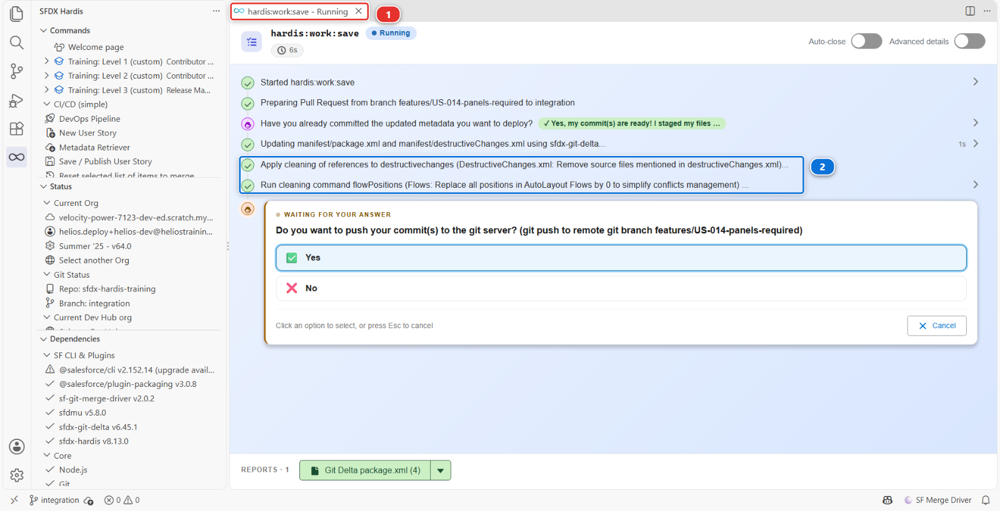

# Lab 1.5 - Retrieve, commit and publish your Salesforce changes

**Level**: 1 Contributor basics

**Time**: ~20 min

**You will**: bring your org changes into the repository, decide which of them belong to your story,
and push a branch that is ready to be reviewed.

## The situation

Your field exists in one org. If your laptop died tonight, so would the story. Publishing is what
turns "it works in my org" into "the team has it".

This is the step where most of the thinking happens in a CI/CD project, and the one people rush.
Go slowly here once, and every following story takes five minutes.

## Before you start

- [ ] [Lab 1.4](1-4-build-a-custom-field-in-your-org.md) finished: the field exists in `helios-dev`, granted to the crew, on the layout
- [ ] You are still on `features/US-014-panels-required`

## Steps

### 1. Bring your changes out of the org

Your field is in Salesforce. Nothing of it is on your machine yet, and git only ever sees what is
on your machine.

In the **DevOps Pipeline** panel, under **Project Contribution Workflow**, click the **Commit
changes** card **(1)**.


It opens the **Metadata Retriever**, which is where every publish starts.

### 2. Ask the org what changed

Check the org **(1)** reads `helios-dev`, the org you built in. **Recent Changes** **(2)** is
already selected: it asks Salesforce what has been modified lately rather than listing the tens of
thousands of components an org contains. Click **Search Metadata** **(3)**.


The count of results is at **(4)**: a few dozen on your org, fewer in the picture. Each row says
what it is, its name, who last touched it and when. Every one of them carries your name, and most of
them are not your story.

!!! info "Why the list is longer than your story"
    A scratch org remembers every component that arrived in it, however it arrived. In Lab 1.2,
    **Set up my training environment** deployed the whole Helios app into `helios-dev` under your
    user, so every object, field and permission set of the app is in this list, dated Lab 1.2. Your
    four changes are the ones dated a few minutes ago.

    Click the **Last Updated Date** column header, twice if needed, so the newest come first. On a
    team org the older rows would be your colleagues and Salesforce moving things on its own. Either
    way it is exactly why the next step is a decision rather than a button.

### 3. Take yours, leave the rest

Sort by **Last Updated Date**, newest first, and find your four. Tick them, and only them,
by name rather than by position: Salesforce touches components of its own, and one of them
landing between yours is exactly the kind of thing this step is about.

1. **PermissionSet** `Helios_Delivery_Manager` **(1)** - the planners' edit access
2. **PermissionSet** `Helios_Delivery_Crew` **(2)** - the crew's read access
3. **Layout** `Installation__c-Installation Layout` **(3)** - the placement, changed when you
   ticked the layout in the field wizard
4. **CustomField** `Installation__c.Panels_Required__c` **(4)** - the field

Then click **Retrieve 4 selected** **(5)**.


Two rules make that decision for you, and they are the whole of this lab:

- **If you did not mean to change it, it does not belong in your story.** Committing it makes your
  Pull Request about something other than US-014, and the reviewer cannot tell which part is yours
- **If you are not sure, leave it out.** Nothing is lost. It is still in your org, and you can
  publish it in a later story once you know what it is

The retriever writes those four components into `force-app/` as files. It changes nothing in
Salesforce and nothing on your branch yet.

!!! note "If it says the retrieve failed because of source conflicts"
    **Failed to retrieve metadata due to source conflicts** means the files on your machine and the
    components in the org both changed since the last time they agreed. Here that is not a
    conflict, it is the point: you changed the org on purpose and the org is right. Take the
    option that overwrites the local files and retrieve again. It matters on a real project, where
    somebody else may have written those files; it does not here, where nothing but your own org
    has touched them.

### 4. Commit what came down

Open the **Source Control** panel **(1)**: in the left bar, the icon drawn as three small circles
joined by lines, like a branch. The four files the
retrieve wrote are waiting there **(2)**.


!!! tip "Read the list as a tree"
    By default the panel lists full paths, and a Salesforce path is long enough to be unreadable.
    The **...** menu at the right of the **Changes** header has **View as Tree**: the same files,
    folded into the folders they live in. Set it once and VS Code remembers it.

Click each one. VS Code opens the file's *diff*, the before and the after side by side, with the
added lines in green and the removed ones in red. Reading the four takes a minute, and it is the
last moment where a mistake is free.

Then put them in the commit **one at a time**. Point at a file: a row of small icons appears at the
right of its name. The **+** is **Stage Changes**, and it moves that one file into a group called
**Staged Changes** just above. Do it for each of the four, and read the name as you click.

!!! danger "Never use Stage All Changes"
    The **+** on the **Changes** group header stages everything the panel can see, including files
    you have never looked at: a stray log, something an installer left behind, a file another
    command wrote while you were working. The panel above shows only your four files, and yours
    will not always be that tidy.

    Staging is the only moment where you decide what your story contains. Doing it file by file
    takes ten seconds and it is the difference between a Pull Request a reviewer can read and one
    that has to be untangled. On a real project this is the habit people notice.

With the four files staged, type a message **(3)** and click **Commit** **(4)**. The button commits
what is staged and leaves everything else alone.

Write the message for the person reviewing tomorrow, not for yourself today. First line short, then
a blank line, then why:

> US-014 Panels Required on Installation
>
> Adds Panels_Required__c on Installation__c so the crew knows how many panels to load.
> Read access for the crew on Helios_Delivery_Crew, edit access for planners on
> Helios_Delivery_Manager, field added to the Installation layout.

That text follows your branch everywhere: it is what the reviewer sees in the Pull Request, and it
is what anybody reading the history of this project in two years will find.

!!! tip "What to do with the file you did not ask for"
    Leave it unstaged and it stays out of your commit, which is enough for now. If you know what it
    is and you know it is rubbish, right-click it and **Discard Changes**. If you do not know what
    it is, leave it alone and ask: a file you cannot explain is a file that does not belong in your
    story, and deleting it blindly is not better than committing it blindly.

Your work is now in the repository, on your branch, on your machine. What is left is to prepare it
for the team, and that is what Save / Publish does.

### 5. Publish it

In the **DevOps Pipeline** panel, click the **Save / Publish** card **(1)**.


The first question is the one that catches everybody out.


Answer **(1)**, *Yes, my commit(s) are ready!*, because they are: you retrieved and committed in the
steps above. **(2)** asks the command to pull the org for you instead, and the third answer explains
what a commit is, which costs nothing to read.

!!! tip "Commit first, every time"
    **(2)** exists for the day you forgot to retrieve and commit. This course never needs it,
    because the habit it teaches is the one above: retrieve with the Metadata Retriever, read the
    diff, stage file by file, commit. Keep that habit and the answer is always **(1)**.

### 6. Read the package before you push

The command pauses before pushing and asks you to confirm **(1)**. Take the pause: this is the
last look you get at your story before it leaves your machine.

Click the **Git Delta package.xml** report at the bottom of the command's panel **(2)**. It is the
list of what your commits changed compared with `integration`, worked out from git, and the
number on the button is how many components it holds: **4**.


You are looking for one block per kind of thing you changed, each naming what it holds. Your four
should all be there: the field `Installation__c.Panels_Required__c`, the layout
`Installation__c-Installation Layout`, and the permission sets `Helios_Delivery_Crew` and
`Helios_Delivery_Manager`.

**This list is your story, as the pipeline sees it.** If a component you expected is missing here,
git does not know you changed it, and it will be missing in integration too: the deployment will
either fail or, worse, succeed while doing half of what you meant. Reading it before every push is
the single habit that separates a contributor who has trouble with deployments from one who does
not.

Then open the whole manifest, `manifest/package.xml`. In the **DevOps Pipeline** panel, click the
**Deployment packages** menu **(1)** in the header, the icon of a box with an arrow, then
**Package XML** **(2)**.


The package viewer opens on the file. Each row is one kind of component, with how many the file
lists. Expand **CustomField** **(1)**: `Installation__c.Panels_Required__c` is in it.


It is much longer than the report, and that is correct: it is the list of **everything this project
deploys**, the whole Helios app, and every story adds its new components to it. Save / Publish just merged your delta into it, which for US-014 means one new
line, `Installation__c.Panels_Required__c`: the layout and the two permission sets were listed
already, because the app has always had them. Every deployment of `integration` sends that whole
file, and Salesforce works out what actually changed.

<details markdown="1"><summary>Under the hood: what those blocks look like</summary>

The viewer reads and writes a plain file, `manifest/package.xml`, and **Edit File** in its header
opens it as text. The file is XML, and every block pairs a list of `members` with the `name` of what they are:

```xml
<types>
    <members>Installation__c.Panels_Required__c</members>
    <name>CustomField</name>
</types>
<types>
    <members>Installation__c-Installation Layout</members>
    <name>Layout</name>
</types>
<types>
    <members>Helios_Delivery_Crew</members>
    <members>Helios_Delivery_Manager</members>
    <name>PermissionSet</name>
</types>
```

Salesforce calls this a manifest, and every deployment tool on the platform reads the same format.
The counter on the report button counts entries rather than blocks, so it can read one more than
you expect when a change pulls its parent object in with it.

`manifest/package.xml` has the same shape, with every component of the app. A project can ask the
pipeline to deploy only the delta instead, with `useDeltaDeployment`, and this one does not: a
full deployment is slower and never forgets anything, which is the right trade for a course.

</details>

### 7. Read what the command did to your files

Go back to the tab of the command. Save / Publish runs in a tab of its own, named
**hardis:work:save** **(1)**, and it is still open next to the package viewer, waiting for your
answer.



Between your answers it printed two lines about cleaning **(2)**: references to deleted components,
and the pixel positions inside Flows. That is the project's
automated cleaning, and it runs on every publish, on everybody's work, so that nobody has to
remember the house rules.

On this story it has almost nothing to do, because you changed a field, a layout and a permission
set, and the rules here are aimed at Profiles and Flows. It also committed what it changed, on top
of your own commit. Level 2 has a whole lab on the day cleaning takes away something you wanted.

<details markdown="1"><summary>Under the hood: what "Save / Publish" just did</summary>

The panel ran:

    sf hardis:work:save

which performed, in order:

1. **Worked out the delta**, the Git Delta package.xml, from the git diff between your branch and
   `integration`, and **merged it into `manifest/package.xml`**. Not from what you ticked in the
   retriever: from what your commits actually changed. Those are usually the same thing, and the
   minute you spend reading the report is the minute you find out when they are not
2. **Applied the cleaning rules** declared in `config/.sfdx-hardis.yml`:

        autoCleanTypes:
          - destructivechanges
          - localfields
          - productrequest
          - flowPositions
          - minimizeProfiles

   `flowPositions` strips the pixel coordinates of flow elements, which change every time anybody
   opens a flow and produce conflicts that mean nothing. `minimizeProfiles` removes from Profiles
   everything that a Permission Set should carry

3. **Removed from Profiles the user permissions** listed under `autoRemoveUserPermissions`, which
   are permissions this project has decided must never travel between orgs through a deployment.
   Profiles only: a Permission Set keeps everything it was given
4. **Committed what it changed**, as `chore(sfdx-hardis): update package content` and
   `chore(sfdx-hardis): clean sfdx project`. Those commits are the tool's, not yours: yours is the
   one you wrote at step 4
5. **Pushed** the branch to your fork (your own copy of the course repository on GitHub, for example `github.com/my-username/sfdx-hardis-training`)

Every one of those steps is configuration, not magic. Everything it did is in
`config/.sfdx-hardis.yml`, and a project that wants different behaviour changes that file.

<!-- command-links:start -->
Command documentation: [hardis:work:save](https://sfdx-hardis.cloudity.com/hardis/work/save/)
<!-- command-links:end -->

</details>

### 8. Push

The command asks before it pushes: that is the question marked **(1)** in the picture at step 6.
Answer **Yes** and the branch goes to your fork (`github.com/my-username/sfdx-hardis-training`). If you answered **No**, open the **Source Control**
panel and click **Publish Branch**.

## What you should see

- The **Git Delta package.xml** report naming your four components and nothing you did not touch:
  the field, the layout and the two permission sets
- `manifest/package.xml` gaining one line, the new field, in a commit the tool made
- Your branch on GitHub, in your fork (`github.com/my-username/sfdx-hardis-training`), under **Branches**
- The DevOps Pipeline panel still without your branch: it draws a branch once it has a Pull
  Request, and yours gets one in [Lab 1.6](1-6-pull-request-deployment-check-and-merge.md)

## If it goes wrong

**Recent Changes lists things I never touched.**
Normal on any org: the deployment [Lab 1.2](1-2-create-your-dev-hub-scratch-orgs-and-pipeline.md) made into this org counts as a change too, and so does
Salesforce's own internal churn. Tick only your four. The **Last Updated Date** column is the
fastest way to tell: sort on it, and yours are on top.

**The retrieve fails with "Failed to retrieve metadata due to source conflicts".**
A scratch org keeps track of what it last exchanged with your project. When the files on your
machine changed behind its back, after **Reset this level** or a branch you threw away, it refuses
to overwrite them without asking. Click **I don't care, overwrite!**: what you want is the org's
version, and git still shows you the diff before anything is committed.

**Recent Changes finds nothing at all.**
You are looking at the wrong org. Check the selector at the top right reads `helios-dev`, and that
the Status section of the sfdx-hardis panel agrees.

**`manifest/package.xml` is empty.**
You have no commit on this branch, so there is no difference for it to describe. Go back to step 4:
retrieving writes files, committing is what puts them on the branch.

**A file you did not touch shows deletions you do not understand.**
That is the automated cleaning doing its job, and Profiles are where you meet it most. Read the
cleaning rules in the Under the hood block above. Nothing is lost in your org: cleaning changes what
is committed, never what is in Salesforce.

**Push is rejected.**
Your fork (`github.com/my-username/sfdx-hardis-training`) moved, usually because you reset a level. Pull first: Source Control panel, **...** menu,
**Pull**.

## Check your work

Welcome page > **Training: Level 1** > **Check my work**, then pick **Lab 1.5**.

It reads the copy of your branch in your fork (`github.com/my-username/sfdx-hardis-training`), the one Save / Publish pushed: the field, the
permission set granting it, and the layout carrying it. A commit that stayed on your machine does
not count, because nobody else can see it.

## Go deeper

- [Publish your User Story](https://sfdx-hardis.cloudity.com/salesforce-devops-publish-user-story/)
- [Automated sources cleaning](https://sfdx-hardis.cloudity.com/salesforce-devops-config-cleaning/)

[Next: Lab 1.6 - Open a Pull Request, pass the deployment check, merge](1-6-pull-request-deployment-check-and-merge.md){ .md-button .md-button--primary }
