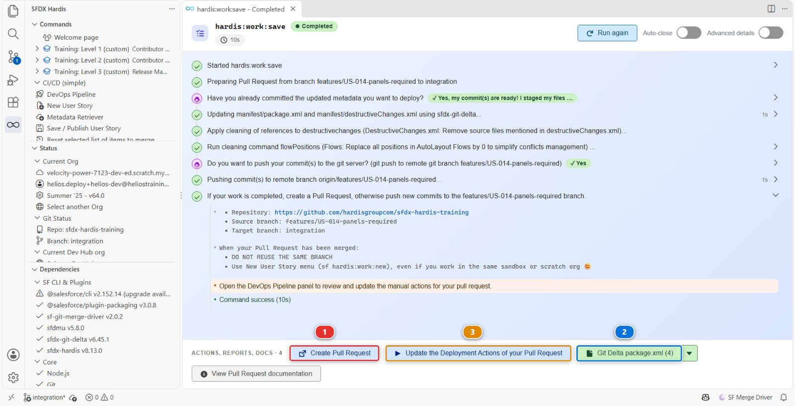
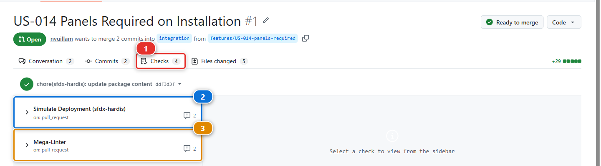
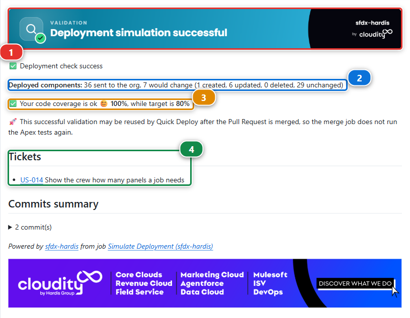
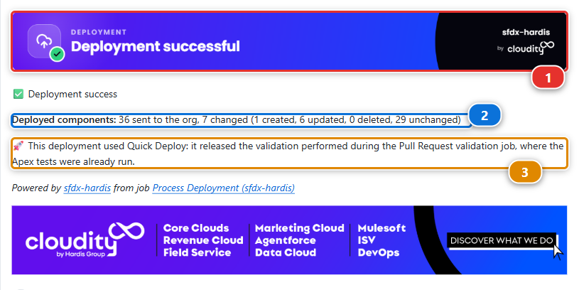

# Lab 1.6 - Open a Pull Request, pass the deployment check, merge

**Level**: 1 Contributor basics

**Time**: ~20 min

**You will**: have a robot check your work before a human does, read what it says, and put US-014
into the shared integration org.

## The situation

Your branch is on GitHub. Now you ask for it to be merged, and something interesting happens: before
anybody looks at it, a job takes your changes and rehearses the deployment into the integration org.
Salesforce compiles everything and runs the tests, then throws the result away rather than keeping
it, so the org is left exactly as it was. The job also runs the linters, and writes the whole verdict
back on the Pull Request.

That is the whole point of this way of working. You find out your deployment fails while it is
still yours to fix, not on release night.

!!! info "Pull Request, in one sentence"
    A Pull Request asks for one branch to be folded into another, yours into `integration` here. It
    is a page on GitHub holding three things: what your branch changes, the result of every check
    that ran on it, and the conversation about whether it should go in. Nothing moves until somebody
    clicks Merge. Everyone shortens it to "PR".

## Before you start

- [ ] [Lab 1.5](1-5-retrieve-commit-and-publish-your-changes.md) finished: the branch is pushed to your fork (your own copy of the course repository on GitHub, for example `github.com/my-username/sfdx-hardis-training`)
- [ ] [Lab 1.2](1-2-create-your-dev-hub-scratch-orgs-and-pipeline.md) finished: **Set up my training environment** turned Actions on and set the CI
      credential

## Steps

### 1. Open the Pull Request

Go back to the panel where **Save / Publish** finished in [Lab 1.5](1-5-retrieve-commit-and-publish-your-changes.md). Along the bottom is a bar of
actions, and the first one is **Create Pull Request** **(1)**. Click it: the extension opens GitHub
on the right page, with base and head already filled in.

Two other things in that bar are worth knowing now, because later labs use them. **(2)** is the
`package.xml` the command generated, the one you read in [Lab 1.5 step 6](1-5-retrieve-commit-and-publish-your-changes.md#6-read-the-package-before-you-push). **(3)** opens the Deployment
Actions of this Pull Request, which is what the whole of [Lab 2.3](../level-2-contributor-advanced/2-3-fix-broken-records-with-an-apex-deployment-action.md) is about.

!!! note "If you closed that panel"
    Nothing is lost, and there are two ways back. Run **Save / Publish my User Story** again: every
    step checks before it acts, there is nothing left to commit or push, and it finishes on the
    same actions bar. Or open your fork (`github.com/my-username/sfdx-hardis-training`) on GitHub,
    which shows a banner offering to open a Pull Request for the branch you just pushed. The
    **+ PR** pill you may have noticed in the DevOps Pipeline diagram is for major branches, not
    for your feature branch.

Check two things before clicking, every single time:

1. **base** is `integration`, in **your** fork
2. **compare** is `features/US-014-panels-required`

!!! danger "Check the base repository"
    GitHub defaults the base of a fork's Pull Request to the **original** repository. If the base
    says `hardisgroupcom/sfdx-hardis-training`, click it and change it to your own fork. A Pull
    Request opened upstream cannot reach your org, will never turn green, and adds noise to a
    repository a few hundred other learners are using.

The title reads **Features/us 014 panels required**: GitHub makes it up from the branch name
whenever a branch carries more than one commit, and yours carries two, the one you wrote and the
one Save / Publish added. Replace it with the first line of the commit message you wrote in
[Lab 1.5 step 4](1-5-retrieve-commit-and-publish-your-changes.md), `US-014 Panels Required on
Installation`.

The description box is not empty: this repository ships a Pull Request template, and GitHub puts it
there for you. **Replace the whole of it.** Under **What this changes**, paste the rest of that
same commit message, the paragraph explaining why; fill in the story id; and say where a reviewer
should look. Delete the comment lines and any heading you have nothing to put under. A template is
a reminder of what to write, not something to hand in as it came.

It is what the reviewer reads first. Click **Create pull request**.

### 2. Watch the checks run

Open the **Checks** tab **(1)**. Two of them matter here, and both start on their own:

| Check                                         | What it does                                                                                |
|-----------------------------------------------|---------------------------------------------------------------------------------------------|
| **Simulate Deployment (sfdx-hardis)** **(3)** | Deploys your metadata into `helios-integration` in validation mode, and runs the Apex tests |
| **Mega-Linter** **(2)**                       | Runs the code quality linters over the repository                                           |

Click either one to read its log while it runs. The deployment check takes about two minutes, and
you can watch it authenticate with your secret, work out what changed, and start the deployment.

!!! warning "No checks at all? Actions are off on your fork"
    If the Checks tab is empty and nothing ever starts, GitHub has not enabled Actions on your
    copy of the repository. It does that to every new fork, on purpose: a fork could otherwise run
    somebody else's workflows in your account the moment you made it. **Set up my training
    environment** turns them on when it can, and says so when it cannot.

    Open the **Actions** tab of your fork (`github.com/my-username/sfdx-hardis-training`) and click
    **I understand my workflows, go ahead and enable them**. One click. Then come back here and
    run **Training: Level 1 > Trigger my workflows**: it pushes a one-line change to your branch,
    which is what makes GitHub start the checks on a Pull Request that opened while Actions were
    off.

    This is a fork thing, and only a fork thing. On a real project you join a repository whose
    automation is already running, and there is nothing to enable.

### 3. Read the sfdx-hardis comment

When the deployment check finishes, sfdx-hardis writes a comment on the **Conversation** tab. It is
the most useful thing on the page.

1. **The banner** **(1)** says whether the simulated deployment succeeded
2. **What would change** **(2)**. Not a list of your files: sfdx-hardis sends the whole package,
   `manifest/package.xml`, and Salesforce answers how much of it differs: `36 sent to the org, 7
   would change (1 created, 6 updated, 0 deleted, 29 unchanged)`. The one created is your field, and the
   updated ones include the layout and the two permission sets you changed
3. **Apex coverage** **(3)**, against the target this project sets
4. **Tickets** **(4)**, the stories it recognised in your branch name and commit messages, each
   with its title and a link to its page in the backlog

Below those, a summary of your commits and the name of the job that wrote the comment.

Under the hood: where the story titles come from

The course has no ticketing tool: its backlog is the ticketing system. `config/.sfdx-hardis.yml`
declares it with three keys of the generic ticketing provider:

- `genericTicketingProviderRegex: "(US-[0-9]{3})"` finds `US-014` in the branch name and the commits
- `genericTicketingProviderUrlBuilder` turns it into the link, `.../BACKLOG/US-014/`
- `genericTicketingProviderDetailsUrlBuilder` points at `.../BACKLOG/US-014.json`, a small file the
  course site publishes for each story. sfdx-hardis reads its `subject` and writes it next to the link

A real project points these keys at its own ticketing tool, or uses the JIRA, Azure Boards or
ServiceNow connector instead.

!!! note "Your counts may differ by one or two"
    The picture is a real comment from a real run of this lab, kept as it came out. A component
    Salesforce stores slightly differently in your org can move from unchanged to updated, and that
    is not a problem: what matters is that your field is the one created.

### 4. Merge

Both checks green, the comment says success. Back on the **Conversation** tab, scroll to the bottom:
the merge box says **All checks have passed** and **No conflicts with base branch**, and the button
is live.

It is live *because* both are green. Setting up your environment in [Lab 1.2](1-2-create-your-dev-hub-scratch-orgs-and-pipeline.md) protected `integration`:
while a check is running or red, the box reads **Merging is blocked** and the button stays grey, for
you as for anybody else. That is the rule of every real pipeline, and here GitHub enforces it rather
than trusting everybody to read the checks first.

The green button has a small arrow on its right **(1)**. Click the arrow, choose **Squash and
merge** **(2)**, then click **Squash and merge** and **Confirm squash and merge**.

Squash turns the commits of your branch into a single commit on `integration`, titled like your
Pull Request. The story shows as one line in the history of `integration` instead of every
intermediate commit you made while building it, and one line is what the release manager reads
when they promote.

!!! warning "Squash is for feature Pull Requests, and for nothing else"
    **Squash and merge** is right in exactly one case: a Pull Request from a **feature branch**, a
    User Story or a fix, into its major branch. Everywhere else, use the plain **Merge pull
    request**: a retrofit, a promotion branch, and every Pull Request from one major branch to the
    next (`integration` to `uat`, `uat` to `preprod`, `preprod` to `main`). Those merges must keep
    the commits as they are, because the next promotion and the next retrofit compare branches
    commit by commit, and a squash there makes git believe the work was never merged. Level 3 comes
    back to this.

GitHub remembers the method you picked last, so check the button label before every merge.

Then delete the branch. GitHub offers a button for it. A merged branch that stays around is one
more thing in everyone's list for no benefit.

!!! note "What the linter is for, and why its comment can show a warning"
    MegaLinter reads the whole repository, not only your change, and reports anything that breaks
    the project's quality rules. It writes its verdict on the Pull Request the same way the
    deployment check does. Your change broke none of them, so the check is green, and the comment
    may still read **Success with warnings**, with a ⚠️ line for a linter the project keeps
    non-blocking, such as the auditor of the GitHub Actions workflow files. Whether a finding fails
    the job is a choice the project makes in `.mega-linter.yml`, and a job that fails blocks the
    merge, like the deployment check. [Lab 2.5](../level-2-contributor-advanced/2-5-pass-code-quality-and-apex-test-coverage.md) has you meet one finding that only warns, and
    one check that blocks.

### 5. Watch the real deployment

Merging into `integration` starts a second job, and this one is not a check: it deploys for real.

Go back to VS Code and open the **DevOps Pipeline** panel. The arrow from the `integration` branch
to its org carries a pill, and while the deployment runs that pill says so and pulses. This is the
screen to watch, and the one you will keep open on a real project: it answers "is my work in the
org yet" without leaving the editor.

The picture was taken later in the course, with teammates' branches on the left of `integration`.
Yours shows only `integration` and `uat`: the pill **(1)** on the arrow to the org is the part to look
at.

The pill is also a link: click it and GitHub opens on the log of that run, **Process Deployment
(sfdx-hardis)**, which takes about three minutes. You do not need to read it today. It is there for
the day something fails, and [Lab 3.3](../level-3-release-manager/3-3-deploy-to-integration-and-read-the-log.md) is the lab that reads one line by line.

When the deployment finishes, it writes a second comment on the Pull Request you just merged:

1. **Deployment successful** **(1)**, and this time the org really changed
2. **What changed** **(2)**, in the same shape as the check said it would: `7 changed` where the
   check said `7 would change`
3. **Quick Deploy** **(3)**. The merge job did not start from nothing. It released the validation
   the Pull Request check had already done, which is why it did not run the Apex tests a second
   time and why it took two minutes rather than five

Then open `helios-integration` from **Orgs Manager** and look at an installation.

`Panels Required` is there. You built it in one org and it arrived in another, and you never
deployed anything by hand.

`helios-uat` does not have it, and it should not yet. Work moves from `integration` to `uat` when a
release manager promotes it, several stories at a time, and that is Level 3.

Under the hood: what the two jobs ran

The Pull Request check ran:

    sf hardis:project:deploy:smart --check

`--check` is a **validation deployment**: Salesforce compiles everything, runs the tests and
reports what it would do, then throws the result away. Your org is not modified. That is why it is
safe to run on every push.

The job after the merge ran the same command **without** `--check`, against the same org. Same
code, same configuration, one flag apart. A check that passes and a deployment that then fails is
rare, and when it happens it is almost always because somebody changed the target org by hand in
between.

Both jobs authenticate first, through the sfdx-hardis hook that reads
`SFDX_AUTH_URL_INTEGRATION`, the secret **Set up my training environment** wrote in [Lab 1.2](1-2-create-your-dev-hub-scratch-orgs-and-pipeline.md). The workflow files are in
`.github/workflows/`, and they are worth reading once: they are about thirty lines each.

The test level comes from `config/.sfdx-hardis.yml`:

    testLevel: RunLocalTests
    apexTestsMinCoverageOrgWide: 80

`RunLocalTests` runs every test in the org except those from managed packages. 75% is the Salesforce
minimum, and this project asks for 80, like most real ones.

<!-- command-links:start -->
Command documentation: [hardis:project:deploy:smart](https://sfdx-hardis.cloudity.com/hardis/project/deploy/smart/)
<!-- command-links:end -->

## What you should see

- The Pull Request merged, with a green sfdx-hardis comment above the merge
- The **Process Deployment (sfdx-hardis)** run green in the Actions tab
- `Panels Required` present on the Installation object in `helios-integration`

That is one full delivery loop. Every story for the rest of your life on this project is this loop.

## If it goes wrong

**The checks never start.**
Actions are still disabled on your fork (`github.com/my-username/sfdx-hardis-training`). GitHub hides
that switch behind a banner no command can reach: open the **Actions** tab of your fork and click
**I understand my workflows, go ahead and enable them**. Re-running **Set up my training
environment** will not do it for you, because there is no API behind that banner.

Your branch was pushed while they were off, so nothing ran on it. **Push it again**, with one more
commit on the branch, and both checks start. Reopening the Pull Request is not enough on its own:
that re-runs the deployment check, while Mega-Linter runs on the push, and the merge stays blocked
on the check that never came.

**The check fails at authentication:** *No authentication found for org integration*.
The secret is missing, misnamed, or truncated. It must be named exactly
`SFDX_AUTH_URL_INTEGRATION` and its value must start with `force://`. The quickest repair is
**Training: Level 1 > Set up my training environment**, which writes it again. Then open the
**Checks** tab of your Pull Request and click **Re-run all jobs**.

**The check fails with `INVALID_CROSS_REFERENCE_KEY` on the permission set.**
The permission set grants a field that is not in your package. You retrieved the permission set
without the field. Redo [Lab 1.5 step 3](1-5-retrieve-commit-and-publish-your-changes.md#3-take-yours-leave-the-rest) and take both.

**The check is stuck as "Expected".**
The workflow is waiting for a job that will never run, usually because the base of the Pull Request
is the original repository and not your fork (`github.com/my-username/sfdx-hardis-training`). Close it and open it again with the right base.

**The merge box says Merging is blocked, and the button is grey.**
A required check is still running, or it failed. Wait for it, or open it from the **Checks** tab,
fix what it reports on your branch, and push again: the checks run again on their own. There is no
way around it, and there is not meant to be.

**A commit you did not make, `chore(megalinter): apply linters fixes`, is on your branch.**
MegaLinter reformatted a file of your Pull Request and pushed the result. GitHub does not start the
checks again for a commit its own robot pushed, so they are missing or red on it and the merge stays
blocked. **Pull** in the **Source Control** panel to bring the robot's commit to your computer, then
run **Training: Level 1 > Trigger my workflows**: a push of yours is what starts the checks again.

**The deployment succeeds but the field is not in the org.**
Look at the deployed components list in the comment. If the field is not there, it is not in
`manifest/package.xml`, and [Lab 1.5 step 6](1-5-retrieve-commit-and-publish-your-changes.md#6-read-the-package-before-you-push) is where you read it.

## Check your work

Welcome page > **Training: Level 1** > **Check my work**, then pick **Lab 1.6**.

## Go deeper

- [Create the Pull Request on GitHub](https://sfdx-hardis.cloudity.com/salesforce-devops-pull-request-github/)
- [Check the Pull Request results](https://sfdx-hardis.cloudity.com/salesforce-devops-handle-merge-request-results/)
- [Solve MegaLinter errors](https://sfdx-hardis.cloudity.com/salesforce-devops-solve-megalinter-errors/)

[Next: Lab 1.7 - Capstone: deliver a User Story on your own](1-7-capstone-deliver-a-user-story-on-your-own.md){ .md-button .md-button--primary }
