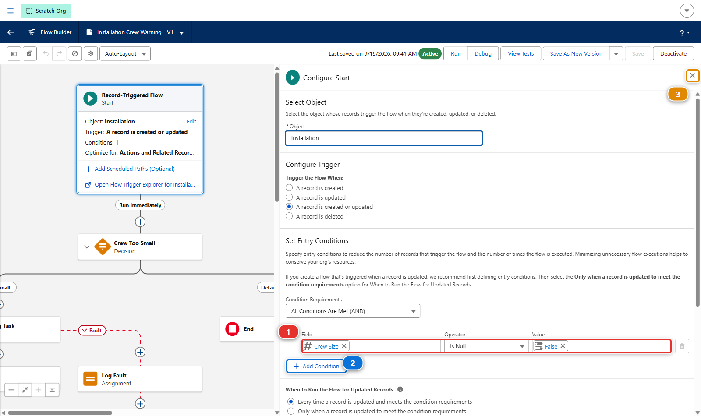
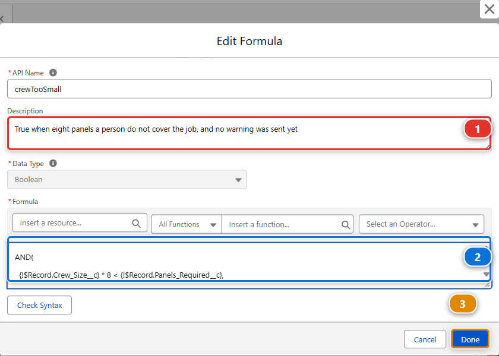
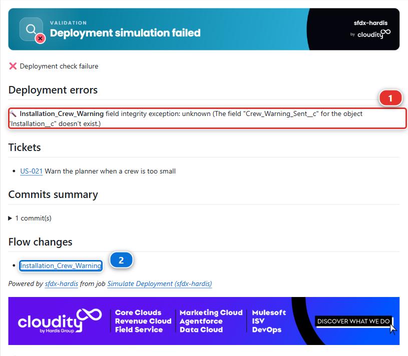
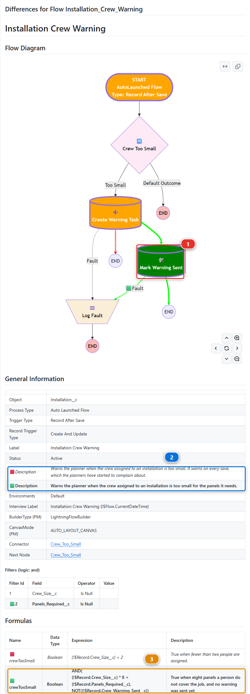
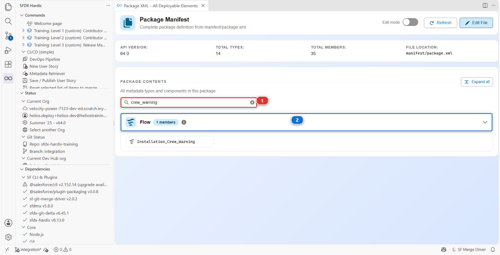
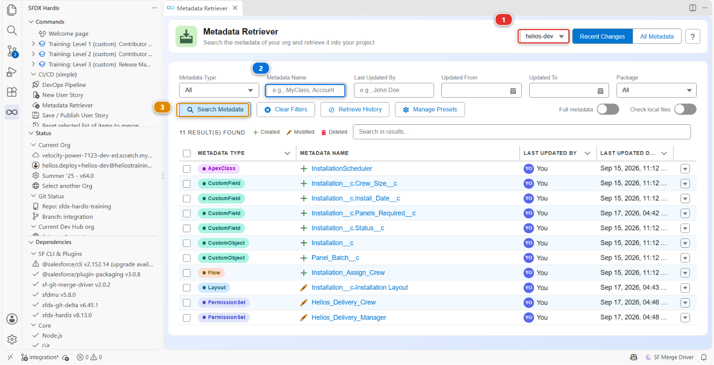
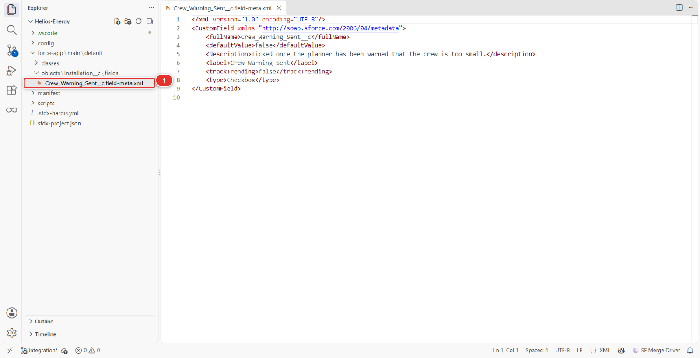

# Lab 2.2 - Fix a deployment error caused by a missing dependency

**Level**: 2 Contributor advanced

**Time**: ~25 min

**You will**: update a flow that already runs in production, meet your first failing deployment
check, read the error properly, and find what your package forgot.

## The situation

> **US-021 - Warn the planner when a crew is too small**
>
> As a planner, I want one warning on the installation when the assigned crew is smaller than the
> panels need, so that I fix it before the van leaves, and not a new task every time I save.

The flow already exists. `Installation Crew Warning` came with the Helios app when you set up your
orgs in Level 1: it creates a task for the planner whenever fewer than two people are assigned, and
it does so on **every** save, which is what the planners complain about. You update it, you
publish it, and the check fails with an error about a field that is right there in front of you in
the org.

This lab is about the gap between "it exists in my org" and "it is in the package".

## Before you start

- [ ] [Lab 2.1](2-1-backpromote-your-teammates-work.md) finished
- [ ] `helios-dev` level with `integration`

## Steps

### 1. Take the story

In the **DevOps Pipeline** panel, under **Project Contribution Workflow** **(1)**, click **New User
Story** **(2)**, the same card as [Lab 1.3](../level-1-contributor-basics/1-3-start-a-user-story-on-a-git-branch.md).


Answer: type **Feature**, name `US-021-crew-size-warning`, org `helios-dev`. The target is
`integration` without asking, as in Level 1.

### 2. Update the warning flow

First, the field the flow needs so it does not warn twice. In `helios-dev`,
**Setup > Object Manager > Installation > Fields & Relationships > New**:

| Setting       | Value                  |
|---------------|------------------------|
| Data Type     | **Checkbox**           |
| Field Label   | `Crew Warning Sent`    |
| Field Name    | `Crew_Warning_Sent__c` |
| Default Value | Unchecked              |

On the field-level security screen, tick **Visible** for **System Administrator** only, and on the
last screen untick **Installation Layout**: nobody but the flow needs this checkbox, so it goes on no
page. That one tick is for you, not for the flow: Flow Builder only offers the fields the person
editing the flow can read, and without it **Crew Warning Sent** is missing from the list of step 2.
The flow itself runs in system mode and needs no grant.

Then the flow. **Setup > Flows**, open **Installation Crew Warning**. It is active, so Flow Builder
opens the running version: every change you make is saved as a **new version**, and the old one
keeps running until you activate yours.


Three changes, and the picture above shows where each one starts:

1. **Start** element: click **Edit** **(1)** on it. Under **Set Entry Conditions**, the flow already
   runs when `Crew Size` is not null **(1)**. Click **Add Condition** **(2)** and add the second one,
   `Panels Required`, **Is Null**, `False`. This panel has no **Done** button: the condition is kept
   as you fill it in, and the **X** **(3)** at the top right closes the panel

    

2. The **Crew Too Small** decision reads a formula resource, `crewTooSmall`. Open the **Toolbox**
   **(2)** at the top left of the canvas, and click `crewTooSmall` under **Formulas**. Update its
   **Description** **(1)**, `True when eight panels a person do not cover the job, and no warning
   was sent yet`, and replace its **Formula** **(2)** with the one below, then **Done** **(3)**:

    

    ```
    AND(
      {!$Record.Crew_Size__c} * 8 < {!$Record.Panels_Required__c},
      NOT({!$Record.Crew_Warning_Sent__c})
    )
    ```

    One person lays about eight panels a day: the crew is too small when eight panels each do not
    cover the job, and the warning goes only if it was not sent yet. Copy it rather than typing it
3. After **Create Warning Task**, click the **+** **(3)** on the line below it, and pick **Update
   Triggering Record** **(1)** under **Shortcuts**. Call the element `Mark Warning Sent`, give it a
   description, and set `Crew Warning Sent` to `True`. Then connect its **fault** path to the
   existing `Log Fault` element, like the task element

    

**Save As New Version** **(4)**. The window it opens holds the description of the flow: replace it
with `Warns the planner when the crew assigned to an installation is too small for the panels it
needs.`, since the flow no longer warns on every save. Then **Activate**, the button that replaces **Deactivate** on the
new version.

!!! info "Why the flow has a fault path at all"
    A record element without one fails silently: the flow stops, the user sees nothing, and the Task
    that was supposed to warn the planner never appears. On a real project the fault path sends the
    message somewhere a person reads. Here it only keeps it, because what the pipeline checks is
    that a fault path exists. The original flow already had one, and your new element follows it.

Test it: open an installation, set `Panels Required` to 40 and `Crew Size` to 2, save. A task
appears in its **Activity**. Save again: no second task. That is the story working, in your org.
The checkbox itself stays out of sight: no permission set grants it, because nobody but the flow
needs it, and the only person who can read it is the administrator who built the flow.

### 3. Publish the flow, and watch the check fail

Retrieve it the way Level 1 taught you: **DevOps Pipeline > Commit changes**, **Recent Changes**,
**Search Metadata**. The story is about the flow, so tick the flow `Installation_Crew_Warning`,
retrieve it, and commit it from **Source Control**.

!!! warning "Look at what you did not retrieve"
    The retriever also listed `Installation__c.Crew_Warning_Sent__c`, the field you created first.
    You left it unticked, and nothing said anything. Carry on and publish anyway: the point of this
    lab is to meet the failure that follows, and to learn to read it.

Then **Save / Publish** **(1)**.


Push, open the Pull Request into `integration` in your fork (your own copy of the course repository on GitHub, for example `github.com/my-username/sfdx-hardis-training`), and wait.

The check fails, and the sfdx-hardis comment on the Pull Request names the component under
**Deployment errors** **(1)**:



```
Installation_Crew_Warning field integrity exception: unknown (The field "Crew_Warning_Sent__c"
for the object "Installation__c" doesn't exist.)
```

Under **Flow changes** **(2)**, the comment links to a second comment of its own: the visual diff of
the flow. It draws the flow, and colours what your story changed. The new **Mark Warning Sent**
element is green **(1)**, and the tables under the diagram mark every changed property with a red
square for the old value and a green one for the new: the description **(2)**, the formula **(3)**.
A reviewer reads your flow change there, without opening Flow Builder or its XML.



Your Pull Request cannot be merged while that check is red: `integration` refuses it, for you as
for anybody.

Read that twice. The field **does** exist. You can see it in the org. You created it ten minutes
ago and the flow you just tested reads it.

### 4. Read the package before you read anything else

When a deployment says something does not exist, the first question is never "is it in the org".
It is **"is it in the package"**.

Open the package: in the **DevOps Pipeline** panel, the **Deployment packages** menu **(1)**, then
**Package XML** **(2)**, as in [Lab 1.5](../level-1-contributor-basics/1-5-retrieve-commit-and-publish-your-changes.md).


Type `Crew_Warning` in its filter box **(1)**. One row is left, **Flow** **(2)**: the package
carries your flow. There is no **CustomField** row at all: the package does not carry
`Installation__c.Crew_Warning_Sent__c`.



The integration org is being sent a flow that reads a field the package does not carry, and the
integration org does not have that field either. From Salesforce's point of view the error is
exactly right.

The package is built from what your commits changed, and the field was never committed: look where
the fields live, `force-app/main/default/objects/Installation__c/fields/`, and it is not there. It
exists in one place only, `helios-dev`, and a pipeline never reads a developer's org.

### 5. Retrieve what the flow depends on

Open the **Metadata Retriever** panel:

1. Check that the org at the top right **(1)** is `helios-dev`
2. Type `Crew_Warning_Sent__c` into **Metadata Name** **(2)**
3. Click **Search Metadata** **(3)**, then tick the field in the results and retrieve it



The field appears under `force-app/main/default/objects/Installation__c/fields/` **(1)**, in the
**Explorer** view of VS Code.



The habit to take away: when you change something that **reads** another component, retrieve that
component too. A flow reads fields, a layout shows them, a permission set grants them. Anything new
among them travels with the story, or the story does not deploy.

### 6. Publish again

The field is in `force-app/` now. Commit it from **Source Control**, then **Save / Publish** again.
`manifest/package.xml` lists both the field and the flow. Push, and the check goes green. Merge it.

<details markdown="1"><summary>Under the hood: why the error said what it said</summary>

The check job ran:

    sf hardis:project:deploy:smart --check

which handed `manifest/package.xml` to Salesforce as a validation deployment: the list Save /
Publish keeps up to date from the git diff between your branch and `integration`. Salesforce compiled the flow, looked for
`Installation__c.Crew_Warning_Sent__c` in the package **and** in the target org, found it in
neither, and refused.

The important part is the order of the two questions:

1. **Is it in the package?** `manifest/package.xml`, and behind it the git diff: what you retrieved
   and committed
2. **Is it in the target org?** Only ask this once the answer to the first is yes

Most deployment errors that say "does not exist" are question 1, and most people spend twenty
minutes on question 2 first.

**The flow went up as a new version.** A flow is versioned in the org: Flow Builder saved yours as
version 2, and the deployment sends its definition. The integration org keeps its version 1 as
history, inactive, exactly like `helios-dev` does.

<!-- command-links:start -->
Command documentation: [hardis:project:deploy:smart](https://sfdx-hardis.cloudity.com/hardis/project/deploy/smart/)
<!-- command-links:end -->

</details>

## What you should see

- `manifest/package.xml` listing `Installation__c.Crew_Warning_Sent__c` and
  `Installation_Crew_Warning`
- The Pull Request check green
- After the merge, the flow present and active in `helios-integration`

## If it goes wrong

**Flow Builder does not offer Crew Warning Sent.**
You created the field with **Visible** unticked for every profile, so you cannot read it, and Flow
Builder only lists the fields you can read. **Setup > Object Manager > Installation > Fields &
Relationships > Crew Warning Sent > Set Field-Level Security**, tick **Visible** for **System
Administrator**, **Save**. Then reload Flow Builder: the field is in the list of **Update Triggering
Record**, and the `crewTooSmall` formula accepts it.

**The retrieve brings nothing.**
The org selector of the Metadata Retriever points at another org. It must read `helios-dev`, where
you created the field.

**The check now fails on the flow being inactive.**
Salesforce will not deploy an active flow over an active flow of the same version in some
configurations. Deactivate the old version in the target org, or bump the flow version in your org
and retrieve again.

**The check fails on a Task field.**
Your Create Records element sets a field the integration org does not have, because you picked
something specific to your org. Simplify: subject and WhatId are enough.

## Check your work

Welcome page > **Training: Level 2** > **Check my work**, then pick **Lab 2.2**.

## Go deeper

- [Solve deployment errors](https://sfdx-hardis.cloudity.com/salesforce-devops-solve-deployment-errors/)
- [Source retrieve issues](https://sfdx-hardis.cloudity.com/salesforce-devops-retrieve/)

[Next: Lab 2.3 - Fix broken records with an Apex deployment action](2-3-fix-broken-records-with-an-apex-deployment-action.md){ .md-button .md-button--primary }
