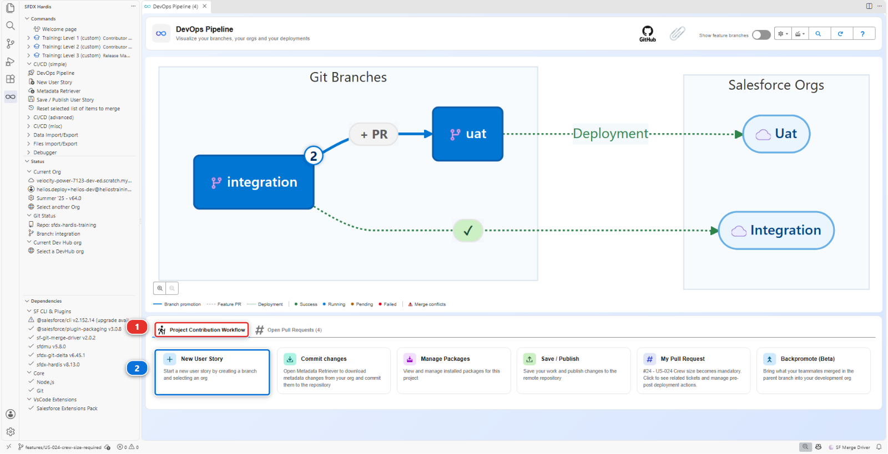
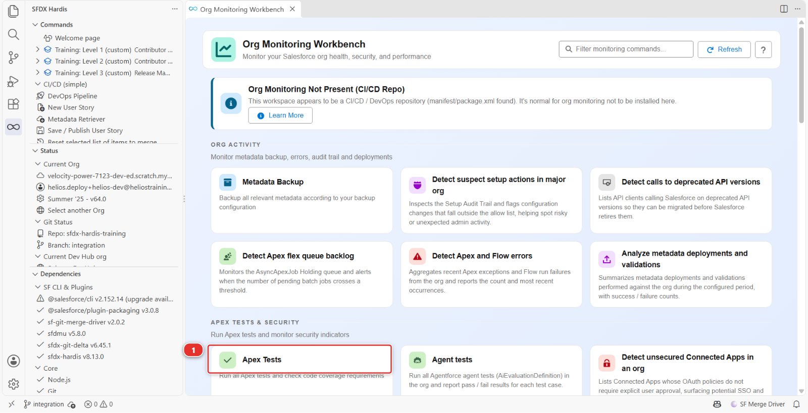

# Lab 2.5 - Pass the code quality gate and Apex test coverage

**Level**: 2 Contributor advanced

**Time**: ~30 min

**You will**: get blocked twice by robots, fix both properly rather than around them, and learn to
run the checks before pushing.

## The situation

> **US-027 - Check several installations against panel availability at once**
>
> As a planner, I want to check a list of installations against panel availability in one go, so
> that I can fill a week of planning without opening every record.

An Apex change in `InstallationScheduler`. Two things will stop you, and neither is about your
metadata being wrong:

1. **PMD**, the Apex code analyzer, run for you by MegaLinter, on a query inside a loop that you are
   about to write by copying an existing pattern. It **blocks** the merge
2. **Code coverage**, because the new branch of logic has no test. It **blocks** too

Both are this project's choices, and both are what real projects choose: the analyzer refuses code
that breaks Salesforce limits, and the tests have to run 80% of the Apex in the org, above the 75%
Salesforce itself requires. Each one tells you what is wrong in a different place, so this lab makes
you meet them one after the other.

!!! note "Admins, this lab is for you too"
    There is Apex in it, and you will not write a line of it: every block is copied from this page
    and pasted into a file. What you practise is what an admin meets on every real project, a
    Pull Request blocked by a code analyzer or by test coverage, and how to read what the robots
    say before asking a developer for help.

## Before you start

- [ ] [Lab 2.4](2-4-ship-reference-data-and-a-batch-with-deployment-actions.md) finished and merged
- [ ] Willing to read fifteen lines of Apex. You do not have to write any: every block in this lab
      is there to be copied, and what the lab is really teaching is how to read what the robots say
      about it

## Steps

### 1. Take the story

**New User Story** **(2)**, under **Project Contribution Workflow** **(1)** of the DevOps Pipeline
panel. Branch `US-027-schedule-by-availability`, target `integration`, org `helios-dev`.



### 2. Add the change the way people actually write it

The planner wants to check several installations at once. Open
`force-app/main/default/classes/InstallationScheduler.cls`, the file the pipeline already deploys,
and paste in the method below, exactly as the developer who wrote it first did. It is the obvious
way to do it, and that is the point:

```apex
    /**
     * The installations from the list that can be scheduled on the given day.
     *
     * @param installationIds the installations to check
     * @param wanted the day the planner wants
     * @return the ids that can take a crew that day
     */
    public static List<Id> schedulableOn(List<Id> installationIds, Date wanted) {
        List<Id> allowed = new List<Id>();
        for (Id installationId : installationIds) {
            for (Panel_Batch__c batch : [
                SELECT Arrival_Date__c
                FROM Panel_Batch__c
                WHERE Installation__c = :installationId
                ORDER BY Arrival_Date__c DESC
                LIMIT 1
            ]) {
                if (batch.Arrival_Date__c != null && wanted >= batch.Arrival_Date__c.addDays(PREPARATION_DAYS)) {
                    allowed.add(installationId);
                }
            }
        }
        return allowed;
    }
```

This one is a file, not an org change, so there is nothing to retrieve: commit
`InstallationScheduler.cls` from the **Source Control** panel, then **Save / Publish**, push, and
open the Pull Request.

### 3. MegaLinter blocks you

```
(Moderate)  pmd:OperationWithLimitsInLoop  force-app/main/default/classes/InstallationScheduler.cls
Avoid operations in loops that may hit governor limits
```

The **Mega-Linter** check of your Pull Request is red, and the merge box reads **Merging is
blocked**. The finding is in the MegaLinter comment on the Pull Request, under **code-analyzer-apex**.
The deployment check next to it is green: the tests still run more than 80% of the org's Apex, at
about 81%. The code deploys, and it is still refused.

A SOQL query inside a `for` loop. Salesforce allows 100 queries per transaction, so this method
works perfectly for a planner checking five installations and throws
`System.LimitException: Too many SOQL queries: 101` the first time somebody checks a hundred and
one. It will pass every test you write and fail on a busy Monday.

The fix is the one Apex pattern worth knowing by heart: **query once, outside the loop, and index
what you get back**.

```apex
    public static List<Id> schedulableOn(List<Id> installationIds, Date wanted) {
        Map<Id, Date> latestArrival = new Map<Id, Date>();
        for (Panel_Batch__c batch : [
            SELECT Installation__c, Arrival_Date__c
            FROM Panel_Batch__c
            WHERE Installation__c IN :installationIds
            AND Arrival_Date__c != null
            ORDER BY Arrival_Date__c ASC
        ]) {
            latestArrival.put(batch.Installation__c, batch.Arrival_Date__c);
        }
        List<Id> allowed = new List<Id>();
        for (Id installationId : installationIds) {
            Date arrival = latestArrival.get(installationId);
            if (arrival != null && wanted >= arrival.addDays(PREPARATION_DAYS)) {
                allowed.add(installationId);
            }
        }
        return allowed;
    }
```

One query, whatever the size of the list.

!!! note "Why a linter is allowed to refuse"
    The loop works in every test and fails in production on the first busy day. Nobody reviewing a
    Pull Request reliably spots it, and the analyzer always does, which is why real projects make it
    blocking. It only refuses findings of Moderate severity and above: the Helios code has none, so
    the only thing that can turn this check red is what you just wrote.

### 4. The tests block you

Push the fix. MegaLinter no longer reports the loop, and its check turns green. Now the deployment
check **fails**:

```
[sfdx-hardis][apextest] Test run code coverage (org wide) 76.92% should be greater than 80%
```

The sfdx-hardis comment says it too, in red: **code coverage is insufficient**. Salesforce alone
would have let it through, at 77% for its 75% floor: the project asks for more, and the check job
holds it to that.

The loop version was short, and the org carried it at 81%. The fix is longer, and every one of its
new lines is a line no test runs. You added a method with three branches and no test. Add them to
`force-app/main/default/classes/InstallationSchedulerTest.cls`:

```apex
    @isTest
    static void schedulableOnRefusesBeforeThePanelsArrive() {
        Installation__c inst = [SELECT Id FROM Installation__c LIMIT 1];
        Test.startTest();
        List<Id> tooEarly = InstallationScheduler.schedulableOn(new List<Id>{ inst.Id }, Date.today());
        List<Id> lateEnough = InstallationScheduler.schedulableOn(new List<Id>{ inst.Id }, Date.today().addDays(60));
        Test.stopTest();
        System.assert(tooEarly.isEmpty(), 'The crew cannot be sent before the panels arrive');
        System.assertEquals(1, lateEnough.size(), 'A date after the buffer is allowed');
    }

    @isTest
    static void schedulableOnIgnoresInstallationsWithNoBatch() {
        Installation__c lonely = new Installation__c(Status__c = 'Planned', Crew_Size__c = 2, External_Id__c = 'TEST-INST-003');
        insert lonely;
        Test.startTest();
        List<Id> allowed = InstallationScheduler.schedulableOn(new List<Id>{ lonely.Id }, Date.today().addDays(30));
        Test.stopTest();
        System.assert(allowed.isEmpty(), 'With no panel batch, nothing can be scheduled');
    }
```

Note what the assertions do: they check the **behaviour the story asked for**, with a message that
says why. A test that only runs the code to lift a percentage is worse than no test, because it
makes the number lie.

The `Crew_Size__c = 2` on the record the second test creates is not decoration. [Lab 2.3](2-3-fix-broken-records-with-an-apex-deployment-action.md) made that
field mandatory, so any test that inserts an installation without it now fails, and a failing test
is a failing deployment. Every test class in the org has to be checked for this, and that is the
real price of making a field required.

### 5. Run the checks before pushing this time

Two round trips through CI to find two things you could have found on your own machine. Do it the
other way round from now on.

**Apex tests** run in an org, and so far your change only exists in the project's files: the Apex
in `helios-dev` is still the old version. Send it there first. In the **Explorer**, right-click
`InstallationScheduler.cls`, then **SFDX: Deploy This Source to Org**, and do the same for
`InstallationSchedulerTest.cls`. It is the Salesforce extension that comes with the extension pack,
and it sends that one file to your default org.

Then, on the Welcome page, click **Org Monitoring**. In the **Apex Tests & Security**
section of the panel that opens, click the **Apex Tests** card **(1)** and pick `helios-dev`.



It runs the org's Apex tests and checks the same coverage threshold the pipeline checks, so you get
the pass, the fail and the percentage without pushing anything. Give it a few minutes: a scratch
org queues its test runs, and the first one of the day can take ten.

!!! note "The banner at the top is expected"
    *Org Monitoring Not Present (CI/CD Repo)* means this repository is a delivery pipeline and not a
    monitoring repository. The cards below it still work against whatever org you pick. Lab 3.8 is
    where monitoring gets a repository of its own.

!!! note "The Apex Tests tab is a different thing"
    A Pull Request in the **DevOps Pipeline** panel can show an **Apex Tests (n) (beta)** tab. It
    runs nothing. It picks which test classes that Pull Request's deployment will run, and it only
    appears on projects that set `enableDeploymentApexTestClasses`. Helios does not: it runs
    `RunLocalTests`, every test in the org, every time.

**Linters**: these are the one check you cannot usefully run on your own machine, because they need
a container image the CI already has. Push, and read what they say on the Pull Request. That is two
minutes of waiting rather than twenty of setting up, and Level 3 shows the release manager's view of
the same report.

<details markdown="1"><summary>Under the hood: the two commands behind those cards</summary>

The Apex Tests card runs the same command the pipeline runs:

    sf hardis:org:test:apex

and the linters, on GitHub's machines, run MegaLinter with the Salesforce flavor. If you ever want
them on your own machine, that is `npx mega-linter-runner --flavor salesforce`, and it needs Docker.

<!-- command-links:start -->
Command documentation: [hardis:org:test:apex](https://sfdx-hardis.cloudity.com/hardis/org/test/apex/)
<!-- command-links:end -->

</details>

### 6. Push and merge

Both green. Merge, and check `helios-integration`.

<details markdown="1"><summary>Under the hood: where these two gates come from</summary>

**The coverage gate** is `config/.sfdx-hardis.yml`:

    testLevel: RunLocalTests
    apexTestsMinCoverageOrgWide: 80
    testCoverageNotBlocking: false

`RunLocalTests` runs every test in the org except managed package ones. The threshold is checked
**org-wide**, not per class, which is why one badly covered class can be carried by the rest of the
org for a while and then suddenly block somebody else's Pull Request. 75% is the Salesforce
minimum, below which no deployment goes through; this project asks for 80, and most real projects
set 80 or 85.

`testCoverageNotBlocking: true` turns the gate into a warning. It exists for projects taking over a
legacy org, and it is a temporary measure, not a setting.

**The linters** are MegaLinter, configured in `.mega-linter.yml`. The Salesforce flavour runs PMD
through Salesforce Code Analyzer on Apex, plus a flow scanner, plus the generic linters. It runs on
the whole repository for a Pull Request into a major branch, which is why a rule can fire on a file
you did not write.

The analyzer refuses because `.mega-linter.yml` says so, with
`SALESFORCE_CODE_ANALYZER_APEX_DISABLE_ERRORS: false`: the shared sfdx-hardis configuration only
reports Apex findings, and a project turns them into a gate. The linter is your team refusing. The
coverage floor is Salesforce refusing, and the project setting only chooses whether to ask for more. Neither of them checks that the code does
the right thing, which is the point: Salesforce is happy to deploy a hardcoded id with 100%
coverage.

</details>

## What you should see

- The **Mega-Linter** check green, and its comment without the loop of `InstallationScheduler.cls`
- The deployment check green, with coverage above 80% in the comment
- `schedulableOn` in `helios-integration`, with one query outside the loop

## If it goes wrong

**MegaLinter fails on files you never touched.**
It lints the whole repository for a Pull Request into a major branch. If a pre-existing problem
surfaces, fix it: you are the one who found it. If it is genuinely out of scope, the escape hatch is
a documented exclusion in `.mega-linter.yml`, never a blanket disable.

**Coverage is still below the threshold after adding tests.**
Coverage is org-wide. Look at the per-class table in the Pull Request comment: another class may be
dragging the average down.

**The Apex Tests card says there is no org.**
It runs against the org you are pointed at. Open **Orgs Manager** and check that `helios-dev` is
your current org, then run the card again.

**The Apex tests pass locally and fail in CI.**
Almost always data. Your dev org has records the integration org does not, or the other way round.
A test has to create the records it needs itself, rather than trusting whatever happens to be in
the org.

## Check your work

Welcome page > **Training: Level 2** > **Check my work**, then pick **Lab 2.5**.

## Go deeper

- [Solve MegaLinter errors](https://sfdx-hardis.cloudity.com/salesforce-devops-solve-megalinter-errors/)
- [Development guidelines](https://sfdx-hardis.cloudity.com/salesforce-devops-work-on-user-story-development/)

[Next: Lab 2.6 - Permission sets, profiles and why a grant disappears](2-6-permission-sets-and-profiles.md){ .md-button .md-button--primary }
