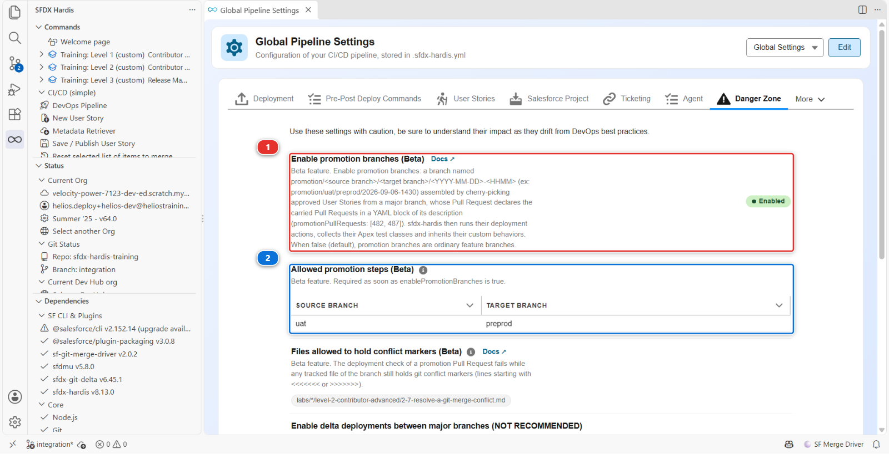
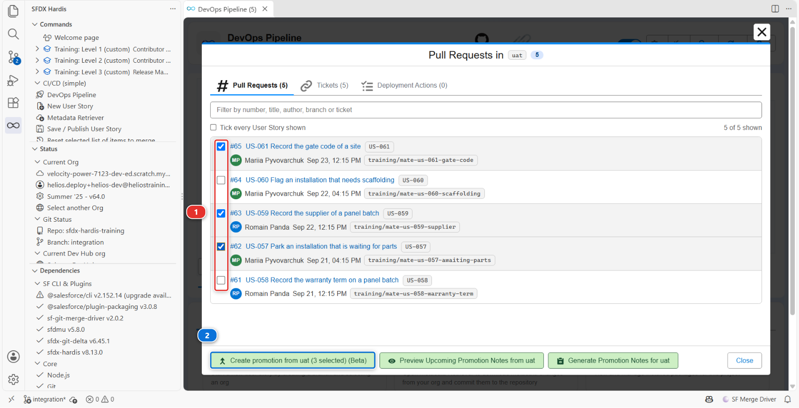
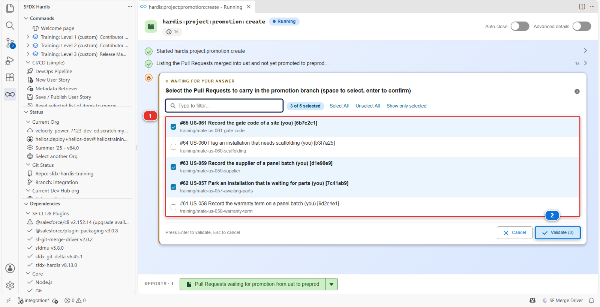
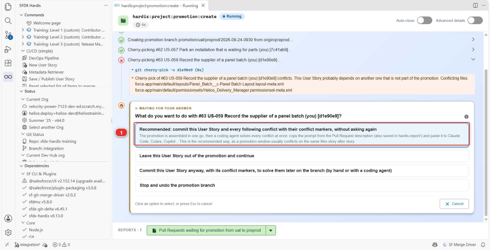
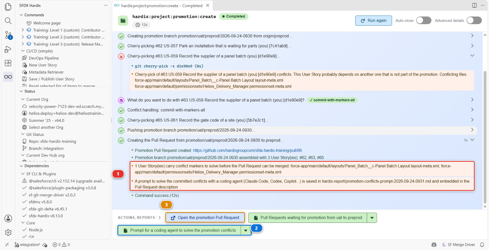
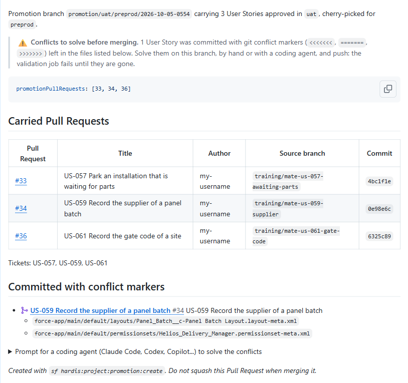
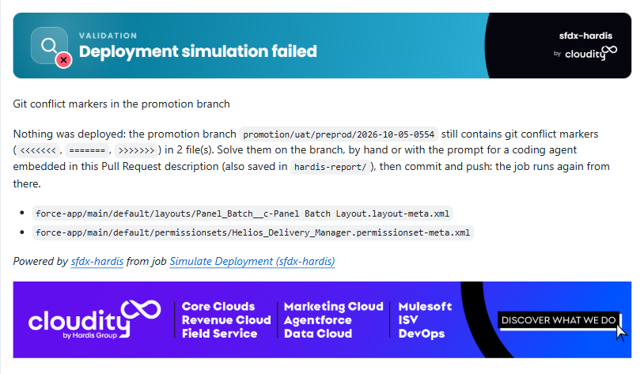
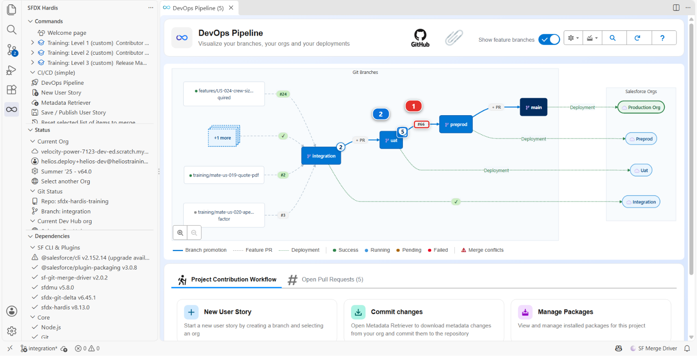
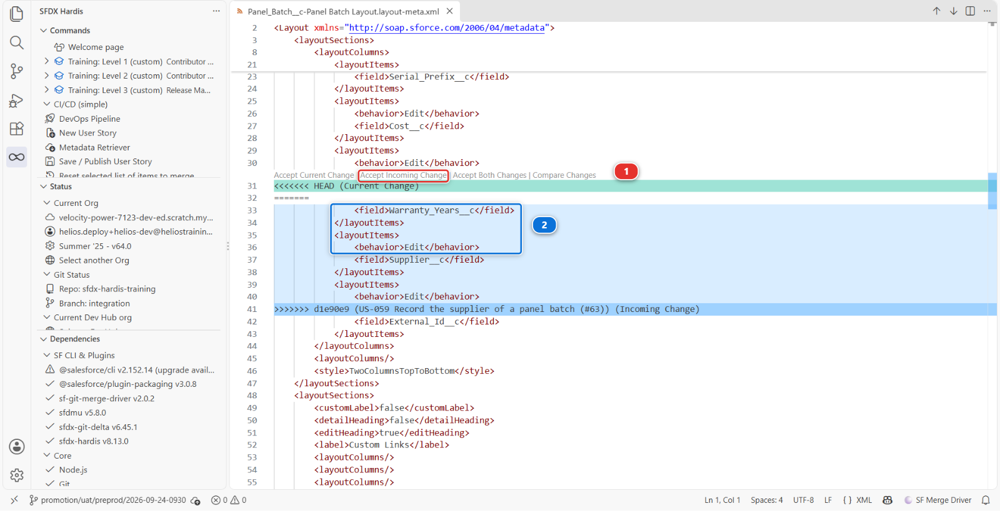

# Lab 3.10 - Promote a subset with promotion branches (Beta)

**Level**: 3 Release Manager

**Time**: ~55 min

**You will**: ship three approved User Stories to preprod while two others stay behind in UAT, solve
the conflict that one of them drags along, and put the pipeline back afterwards, using the one
feature of sfdx-hardis you should hope never to need twice in a row.

## The situation

Five stories landed this week and all five are in UAT.

**US-058**, Romain's, stores the warranty term on a panel batch. It works. Nobody has approved the
wording, because the person who approves wording is away until the middle of next week.

**US-057**, Mariia's, gives planners an *Awaiting Parts* status for an installation held up by a
missing part. The operations lead tested it on Tuesday and signed it off in writing.

**US-059**, Romain's again, stores the supplier on a panel batch. He wrote it the day after US-058,
and put the new field right under the warranty term on the layout, because both come off the same
invoice. The buyer signed it off on Wednesday.

**US-060**, Mariia's, flags an installation that needs scaffolding. It works too, and the operations
lead is holding it: the crews have not been told what to do with a flagged site, and a flag nobody
acts on is worse than no flag.

**US-061**, Mariia's, puts the gate code of the site on the installation. The crew leads tested it
on Tuesday and want it before the weekend.

The release is Thursday and the date does not move: the warehouse cutover depends on the new status
being in production before the weekend.

So you have a release window holding three approved stories and two stories nobody has said yes to,
and the ordinary promotion is all or nothing. It carries `uat` as it stands, US-058 and US-060
included.

!!! warning "This is the exception, and it should stay rare"
    Promoting branches rather than features is the recommended way, and every other lab of this
    level does it. A version whose stories were tested together is the version that was tested.

    A promotion branch breaks that on purpose. After it, `uat` and `preprod` hold different things,
    the orgs behind them drift apart, and production runs a combination nobody ever tested as a
    whole. That is a real cost, paid later, usually by whoever is on call.

    Use it when a date cannot move and an approval has not arrived. Do not build a process on it:
    a team that assembles a promotion branch every week has a sign-off problem, not a tooling
    problem, and the fix is upstream.

## Before you start

- [ ] [Lab 3.9](3-9-generate-the-project-documentation.md) finished
- [ ] All four branches deploying, and the four orgs connected
- [ ] `enablePromotionBranches` and `allowedPromotionSteps` published in
      [Lab 3.1](3-1-configure-the-pipeline-up-to-production.md), and carried up to `preprod` by the promotions of Labs 3.5 and 3.6
- [ ] Nothing waiting in the **Source Control** panel that you still care about

## Steps

### 1. Check the feature is on, and where it is allowed

The two settings this lab needs were published in [Lab 3.1](3-1-configure-the-pipeline-up-to-production.md) and have been travelling up the
pipeline with every promotion since. Look at them before you rely on them.

Open the **DevOps Pipeline** panel, the gear menu, **Pipeline Settings**, scope **Global Settings**,
and the **Danger Zone** tab.



Read the line at the top of that tab before anything else: *Use these settings with caution, be
sure to understand their impact as they drift from DevOps best practices.* The product puts this
feature in the same drawer as delta deployments between major branches, and for the same reason.

**Enable promotion branches (Beta)** **(1)** reads **Enabled**: the feature is on for the whole
project. **Allowed promotion steps (Beta)** **(2)** holds one row, source `uat` and target
`preprod`, and says that is the only step a release manager here may assemble a promotion on.

That second setting is not paperwork. It is why the button you are about to use exists on `uat` and
not on `integration`: a subset is a decision about what goes to the stage in front of production,
and nobody needs to make it on the way into an integration org that is rebuilt from the branch
anyway. `sf hardis:project:promotion:create` refuses to run at all while the list is missing,
rather than guessing that every major branch may promote into every other one.

<details markdown="1"><summary>Under the hood: why a switch published in [Lab 3.1](3-1-configure-the-pipeline-up-to-production.md) matters now</summary>

Both settings are project level, in `config/.sfdx-hardis.yml`:

    enablePromotionBranches: true
    allowedPromotionSteps:
      - source: uat
        target: preprod

The deployment job of a promotion Pull Request runs on the promotion branch, and a promotion branch
is cut from its **target**, so the configuration it reads is the one `preprod` carries. A switch
turned on today in `integration` would not be in `preprod` until a promotion put it there, and until
then the job would treat the promotion Pull Request as an ordinary feature branch: it would still
deploy, and it would quietly ignore the stories the branch declares.

That is why the switch was published in [Lab 3.1](3-1-configure-the-pipeline-up-to-production.md) with the rest of the pipeline configuration, and why
it has been inert ever since: with no promotion branch in the repository, a project with the feature
on behaves exactly like a project with it off.

</details>

### 2. Take in the five stories, in order, and promote them the usual way

Nothing here is new, so it is written short. If a step does not ring a bell, the lab that taught it
is linked.

**Welcome page** > **Training: Level 3** > **Simulate my teammates**, and take the five **one at a
time, in this order, merging each one into `integration` before you take the next**:

1. **US-058 Record the warranty term on a panel batch**
2. **US-057 Park an installation that is waiting for parts**
3. **US-059 Record the supplier of a panel batch**
4. **US-060 Flag an installation that needs scaffolding**
5. **US-061 Record the gate code of a site**


The order is the week as it happened, and it matters twice. US-059 was written on top of US-058:
Romain cut his branch after the warranty term was merged, and put the supplier field right under
it. The simulation refuses to build US-059 while US-058 is not in `integration`, and tells you so.
And the order the stories were merged in is the order the `uat` window lists them in, which step 4
reads from top to bottom.

Review each one with the four questions of [Lab 3.2](3-2-review-a-contributor-pull-request.md) and merge it with **Squash and merge**, as every
feature Pull Request of this course. You do not have to wait for each deployment before merging the
next one: they queue on `integration`. When the last one is green, promote `integration` into `uat`
the way [Lab 3.5](3-5-promote-to-uat-and-write-release-notes.md) did: the **+ PR** chip on the arrow, a title a human can read, **Merge pull request**
and never a squash.

The five stories are now in `uat`, deployed to `helios-uat`, and this is the moment a real week
reaches: everything is testable, and only part of it is approved.

<details markdown="1"><summary>Under the hood: how the simulation knows US-059 needs US-058</summary>

Each teammate story is a scenario under `scripts/simulate/`, and `us-059-supplier/scenario.json`
carries one line the others do not:

    "basedOn": "us-058-warranty-term"

Before cutting the branch from your `integration`, the command checks that every change of US-058
is there: the field file, its row on the layout, its grant on the permission set. Without them, the
patch of US-059 has no line to anchor on, since it places `Supplier__c` after `Warranty_Years__c`.
The check turns a cryptic "cannot be placed" into a sentence naming the story to merge first.

</details>

### 3. Decide, before you touch anything

You have three options and the tool only helps with one of them. Know why you picked it.

| Option                                       | What it costs                                                                                                                                                                                                  | When it is right                                                                                          |
|----------------------------------------------|----------------------------------------------------------------------------------------------------------------------------------------------------------------------------------------------------------------|-----------------------------------------------------------------------------------------------------------|
| **Wait for the approvals**                   | The release slips by a week                                                                                                                                                                                    | Almost always. It is the only option that keeps the orgs aligned                                          |
| **Take US-058 and US-060 back out of `uat`** | Two reverts, each on a feature branch of its own that goes through `integration` and then `uat` like any story, never a commit on `uat` itself, and both stories have to come back later, rebased and retested | When a story is genuinely wrong, not merely unapproved                                                    |
| **Carry US-057, US-059 and US-061 alone**    | `uat` and `preprod` drift apart until the next full promotion, and US-059 has to be pulled off US-058                                                                                                          | When the date is fixed, the approvals are not coming, and the stories left behind are fine where they are |

This week it is the third one, and the reason is written down: the warehouse cutover.

Write that reason somewhere a successor will find it. The Pull Request you are about to create is a
good place, and step 7 comes back to it.

### 4. Pick what goes

Open the **DevOps Pipeline** panel and click the `uat` node. The window that opens is the one
[Lab 3.5](3-5-promote-to-uat-and-write-release-notes.md) used to read a promotion window, with two things on it that were doing nothing until
now.



A **checkbox** on each User Story row **(1)**, and **Create promotion from uat (Beta)** in the
footer **(2)**. Both appear because `uat` is the source of an allowed promotion step and `preprod`
is where it goes.

The window lists the five stories newest first: US-061, US-060, US-059, US-057, US-058. Tick the
**first, the third and the fourth**, US-061, US-059 and US-057, and leave US-060 and US-058 alone.
The button label counts what you ticked: **Create promotion from uat (3 selected) (Beta)**. Click
it.

A command execution tab opens. It lists what is waiting in `uat`, then asks one question, **Select
the Pull Requests to carry in the promotion branch**, with your three stories already ticked **(1)**:
the panel passed your choice to the command, and the command asks you to confirm it rather than
taking it on trust. Read the list once more and confirm **(2)**.



Then read the log, because it is doing something you would otherwise be doing by hand, and this
time it does not get to the end on its own:

```
3 Pull Request(s) selected for the promotion
Creating promotion branch promotion/uat/preprod/2026-09-24-0930 from origin/preprod...
Cherry-picking #62 US-057 Park an installation that is waiting for parts (my-username) [7c41ab9]...
Cherry-picking #63 US-059 Record the supplier of a panel batch (my-username) [d1e90e9]...
Cherry-pick of #63 US-059 Record the supplier of a panel batch (my-username) [d1e90e9] conflicts.
This User Story probably depends on another one that is not part of the promotion. Conflicting files:
force-app/main/default/layouts/Panel_Batch__c-Panel Batch Layout.layout-meta.xml
force-app/main/default/permissionsets/Helios_Delivery_Manager.permissionset-meta.xml
```

The numbers are those of the course's own fork; yours differ, and the story names are what to read.
The cherry-picks go oldest first, so US-057 went in cleanly, and US-059 stopped: it was written on
top of US-058, and `preprod` has never seen US-058. The command asks what to do with it, and offers
four answers **(1)**:



Take the first one, **Recommended: commit this User Story and every following conflict with their
conflict markers, without asking again**. The promotion is assembled whole, conflict included, and
you solve it in one pass on the branch afterwards, in step 6. The other three are for other weeks:
leave the story out, commit this one with its markers but ask again on the next conflict, or stop
and undo everything.

Do not pick **leave this User Story out** because it looks cleaner. The buyer signed US-059 off, and
a promotion that quietly drops an approved story because git found it awkward is a promotion whose
Pull Request lies about the week.

The log goes on to the end:

```
Conflict handling: commit-with-markers-all
#63 US-059 Record the supplier of a panel batch (my-username) [d1e90e9] committed with conflict markers in: force-app/main/default/layouts/Panel_Batch__c-Panel Batch Layout.layout-meta.xml, force-app/main/default/permissionsets/Helios_Delivery_Manager.permissionset-meta.xml. Solve them on the branch before merging
Cherry-picking #65 US-061 Record the gate code of a site (my-username) [5b7e2c1]...
Pushing promotion branch promotion/uat/preprod/2026-09-24-0930...
Creating the Pull Request from promotion/uat/preprod/2026-09-24-0930 to preprod...
Promotion Pull Request created: https://github.com/my-username/sfdx-hardis-training/pull/66
Promotion branch promotion/uat/preprod/2026-09-24-0930 assembled with 3 User Story(ies): #62, #63, #65
1 User Story(ies) carry conflict markers to solve before the Pull Request can be merged: force-app/main/default/layouts/Panel_Batch__c-Panel Batch Layout.layout-meta.xml, force-app/main/default/permissionsets/Helios_Delivery_Manager.permissionset-meta.xml
A prompt to solve the committed conflicts with a coding agent (Claude Code, Codex, Copilot...) is saved in hardis-report/promotion-conflicts-prompt-2026-09-24-0931.md and embedded in the Pull Request description
```

US-061 went in cleanly after the conflict, although it touches the same Installation layout as
US-060, the other story left behind: a conflict needs both changes in the same lines of the same
file, and Mariia put the gate code at the top of the layout and the scaffolding flag further down.

When the run ends, the two last warnings **(1)** say what is left to do, and the bar along the
bottom holds the two things you need next: the prompt for a coding agent, saved as a report file
**(2)**, and **Open the promotion Pull Request** **(3)**.



<details markdown="1"><summary>Under the hood: what the button ran, what the branch name means, and what a conflict is here</summary>

The button ran, in the command execution panel:

    sf hardis:project:promotion:create --source-branch uat --target-branch preprod --pull-requests 62,63,65

`--target-branch` was passed rather than asked because `allowedPromotionSteps` leaves `uat` exactly
one target. With several allowed, the command would have asked. The answer you gave to the conflict
question is what `--on-conflict commit-with-markers` does for every conflict of a run, which is how
an agent or a pipeline gives it.

The branch is named `promotion/<source>/<target>/<YYYY-MM-DD>-<HHMM>`, in UTC, and a `-2`, `-3` is
appended only when that minute is already taken. The shape is fixed and not configurable: the
deployment jobs, the pipeline diagram and the release notes all recognise a promotion by it.

It is cut from `origin/preprod`, not from `uat`. That is the whole trick: a branch that starts from
the target and receives only the chosen commits cannot carry anything you did not choose. The
commits are copied with `git cherry-pick -x`, which keeps the original message and adds a
`(cherry picked from commit ...)` line, so the copy can be traced back to the commit on `uat` that
it came from.

A cherry-pick rewrites the commit SHA, which is why the Pull Request has to declare what it carries
in words: nothing in git links the copy to the Pull Request it came from any more.

The conflict is git being exact, not git being difficult. The commit of US-059 says "after the
Warranty Years row of the layout, add a Supplier row", and "next to the Warranty Years grant of the
permission set, add a Supplier grant". On `preprod` there is no Warranty Years row and no Warranty
Years grant to anchor on, so git stops and writes both versions into the file, between markers:
what `preprod` has on the `<<<<<<< HEAD` side, which is nothing at that spot, and what the story
brought on the `>>>>>>>` side, the Warranty Years entry and the Supplier entry together. Git cuts
the block where the lines stop matching, not where an XML element starts: in the layout, the two
opening lines of the Warranty Years row are also the opening lines of the row that follows on
`preprod`, so they sit just above the markers, and the incoming side runs from the Warranty Years
field to the opening lines of the row after Supplier. The
recommended answer commits the files exactly like that, so the branch can be pushed, the Pull
Request opened, and the decision made where it can be reviewed.

<!-- command-links:start -->
Command documentation: [hardis:project:promotion:create](https://sfdx-hardis.cloudity.com/hardis/project/promotion/create/)
<!-- command-links:end -->

</details>

### 5. Read what it created

Open the Pull Request. It is titled `Promotion uat to preprod (2026-09-24-0930)`, and its
description holds the only thing that makes any of this work, plus, this week, a warning:

````markdown
Promotion branch `promotion/uat/preprod/2026-09-24-0930` carrying 3 User Stories approved in `uat`,
cherry-picked for `preprod`.

> ⚠️ **Conflicts to solve before merging.** 1 User Story was committed with git conflict markers
> (`<<<<<<<`, `=======`, `>>>>>>>`) left in the files listed below. Solve them on this branch, by hand
> or with a coding agent, and push: the validation job fails until they are gone.

```yaml
promotionPullRequests: [62, 63, 65]
```

## Carried Pull Requests

| Pull Request | Title                                                 | Author      | Source branch                         | Commit    |
|--------------|-------------------------------------------------------|-------------|---------------------------------------|-----------|
| #62          | US-057 Park an installation that is waiting for parts | my-username | `training/mate-us-057-awaiting-parts` | `7c41ab9` |
| #63          | US-059 Record the supplier of a panel batch           | my-username | `training/mate-us-059-supplier`       | `d1e90e9` |
| #65          | US-061 Record the gate code of a site                 | my-username | `training/mate-us-061-gate-code`      | `5b7e2c1` |

Tickets: US-057, US-059, US-061

## Committed with conflict markers

- #63 US-059 Record the supplier of a panel batch
  - `force-app/main/default/layouts/Panel_Batch__c-Panel Batch Layout.layout-meta.xml`
  - `force-app/main/default/permissionsets/Helios_Delivery_Manager.permissionset-meta.xml`

<details>
<summary>Prompt for a coding agent (Claude Code, Codex, Copilot...) to solve the conflicts</summary>
...
</details>

_Created with `sf hardis:project:promotion:create`. Do not squash this Pull Request when merging it._
````



The **Author** column is the GitHub account that opened the Pull Request, so on this course it is
your own handle rather than Mariia's or Romain's: the teammate wrote the commit, `Simulate my
teammates` opened the Pull Request with your account. The branch window of the panel shows the
commit author, which is why the two disagree.

The **Title** comes from the Pull Request, read through the git provider API. The command requires
that connection and refuses to start without it, so a promotion behaves the same on GitHub, GitLab,
Bitbucket and Azure DevOps and every carried row names its real story. You never see the refusal
here: the extension passes its own GitHub connection, signed in since
[Lab 1.2](../level-1-contributor-basics/1-2-create-your-dev-hub-scratch-orgs-and-pipeline.md). Outside VS Code, an agent or a job has to be given the token
(`GITHUB_TOKEN`, in the environment or in a `.env` file at the repository root).

**That yaml block is the declaration**, and every job that runs on this Pull Request reads it. It is
how the three stories keep, in `preprod`, everything they would have had in an ordinary promotion:
their deployment actions run, their Apex test classes are selected, their tickets are updated, and
the release notes of `preprod` name the stories rather than the promotion that carried them.

Delete that block and you have a branch with some commits on it and no idea what they are for. Keep
it, and do not hand-edit the numbers: the command wrote what it actually cherry-picked.

**The folded prompt** at the end is the whole conflict, written up for a coding agent: the branch to
check out, the story and its origin commit, the two files, and the rules of a Salesforce metadata
merge. The same text sits in `hardis-report/promotion-conflicts-prompt-<date>.md`, the report file
the command panel offered you. Step 6 uses one or the other.

Now look at the **Checks** of the Pull Request. The **Check deployment** run is red, and the
sfdx-hardis comment says why, in one paragraph:

> ❌ Nothing was deployed: the promotion branch `promotion/uat/preprod/2026-09-24-0930` still
> contains git conflict markers (`<<<<<<<`, `=======`, `>>>>>>>`) in 2 file(s). Solve them on the
> branch, by hand or with the prompt for a coding agent embedded in this Pull Request description
> (also saved in `hardis-report/`), then commit and push: the job runs again from there.
>
> - `force-app/main/default/layouts/Panel_Batch__c-Panel Batch Layout.layout-meta.xml`
> - `force-app/main/default/permissionsets/Helios_Delivery_Manager.permissionset-meta.xml`



That is the safety net: a marker in an XML file is sometimes tolerated by git and always fatal to
Salesforce, so the job stops before it deploys anything, and says so where you are looking rather
than failing silently in a log.

Then go back to the **DevOps Pipeline** panel and look at the diagram.



The promotion in flight is drawn on the arrow between `uat` and `preprod` **(1)**, with its Pull
Request number and its red check, where the **+ PR** chip used to be: it is not a branch of your
pipeline, it is something moving between two of them, and it lives exactly as long as its Pull
Request.

The counter on the `uat` node **(2)** still reads five User Stories waiting, and that is right:
nothing has moved yet. A promotion that is open is a proposal. Merge it, come back, and the counter
reads two, because **a Pull Request appears in one place only**: from then on US-057, US-059 and
US-061 are listed in the window of `preprod`, the branch they reached, and no longer in the window
of `uat`, the branch they left.

### 6. Solve the conflict on the promotion branch

The command left you on the promotion branch: the status bar, bottom left of VS Code, reads
`promotion/uat/preprod/2026-09-24-0930`. That is where the fix goes.

First decide what the fix is, because neither route below decides it for you. The rule the prompt
gives a coding agent is the rule you apply by hand:

> Keep the intent of the story while preserving everything else that exists in `preprod`. A conflict
> usually means the story depends on another story that is not part of this promotion: in that case,
> bring in only the minimum the promoted story needs, never the whole other story.

The intent of US-059 is a Supplier field, on the layout and granted to managers. What it needs from
US-058 is nothing: a supplier row does not need a warranty row above it to work. So in both files
the answer is the same: **keep the Supplier entry, and leave the Warranty Years entry out**. Taking
the Warranty Years entries in would be worse than a wrong merge: `preprod` has no
`Warranty_Years__c` field, so a layout or a permission set naming it fails to deploy.

Two ways to do it. The first is what the product recommends, the second works on any machine.

**With a coding agent.** Click the report file **Prompt for a coding agent to solve the promotion
conflicts** in the bar of the command panel: it opens
`hardis-report/promotion-conflicts-prompt-2026-09-24-0931.md`. Select everything in it and copy.
Open the chat of your coding agent in VS Code, Claude Code, GitHub Copilot Chat in agent mode, Codex
or another, paste the prompt, and send it. It checks out the branch, reads the origin commit of the
story, edits the two files, runs the marker search the prompt asks for, commits with a message that
says what it kept, and pushes. Read its report, then open the commit on the Pull Request and check
that it did what the paragraph above says: Supplier in, Warranty Years out, nothing else touched.
An agent that brought Warranty Years in, or kept both sides, is corrected the same way you would
correct a teammate: tell it, and read again.

**By hand, in the editor.** Open the layout: in the **Explorer**, `force-app` > `main` > `default` >
`layouts` > `Panel_Batch__c-Panel Batch Layout.layout-meta.xml`. VS Code colours the conflict block
and draws four small links above it: **Accept Current Change**, **Accept Incoming Change**, **Accept
Both Changes**, **Compare Changes**.



Click **Accept Incoming Change** **(1)**: the current side, `preprod`, had nothing at that spot, and
the incoming side is the story. That leaves two rows where there was one conflict, Warranty Years
then Supplier. Delete the four lines of the Warranty Years row **(2)**, so the block reads:

```xml
            <layoutItems>
                <behavior>Edit</behavior>
                <field>Cost__c</field>
            </layoutItems>
            <layoutItems>
                <behavior>Edit</behavior>
                <field>Supplier__c</field>
            </layoutItems>
            <layoutItems>
                <behavior>Edit</behavior>
                <field>External_Id__c</field>
            </layoutItems>
```

Save, and do the same in `permissionsets` > `Helios_Delivery_Manager.permissionset-meta.xml`:
**Accept Incoming Change**, then delete the five lines of the `Panel_Batch__c.Warranty_Years__c`
grant, so that the Supplier grant follows the Serial Prefix one:

```xml
    <fieldPermissions>
        <editable>true</editable>
        <field>Panel_Batch__c.Serial_Prefix__c</field>
        <readable>true</readable>
    </fieldPermissions>
    <fieldPermissions>
        <editable>true</editable>
        <field>Panel_Batch__c.Supplier__c</field>
        <readable>true</readable>
    </fieldPermissions>
    <hasActivationRequired>false</hasActivationRequired>
```

Copy both blocks from here rather than typing them: nobody is asked to write XML from memory. Then
search the two files for `<<<<<<<` once more, and commit from the **Source Control** panel, the way
[Lab 1.5](../level-1-contributor-basics/1-5-retrieve-commit-and-publish-your-changes.md) taught: stage the two files with their **+**, and write a message that says what you kept,
because the reviewer of this Pull Request reads the resolution from the commit, not from the diff:

```
fix: solve cherry-pick conflicts of promotion/uat/preprod/2026-09-24-0930

Panel Batch layout (#63): preprod had no Warranty Years row; the story added Supplier under it; kept Supplier after Cost, left Warranty Years out
Helios_Delivery_Manager (#63): preprod had no Warranty Years grant; the story added the Supplier grant next to it; kept Supplier, left Warranty Years out
```

**Commit**, then **Sync Changes** to push.

Whichever route you took, the push starts the check again. It is green this time, and the first
line of the sfdx-hardis comment is the one from an ordinary promotion:

> ℹ️ `promotion/uat/preprod/2026-09-24-0930` is a promotion branch carrying 3 Pull Request(s)
> declared in its description: #62, #63, #65. Deployment actions, Apex test classes and custom
> behaviors of those Pull Requests are processed.

If that line is missing, or says none of the declared Pull Requests could be used, **stop and fix it
before merging**. It means the job did not read the declaration, and the deployment about to run is
the metadata without anything that goes with it.

<details markdown="1"><summary>Under the hood: what the links do, what the job greps, and what the prompt asks of an agent</summary>

The four links come with VS Code, not with sfdx-hardis. They are drawn over any file that contains
the three markers, whether or not git thinks a merge is in progress, which is why they work on a
conflict somebody committed on purpose. **Accept Current Change** keeps the `<<<<<<< HEAD` side,
**Accept Incoming Change** the `>>>>>>>` side, **Accept Both Changes** both, one after the other,
and every one of them removes the markers. None of them knows that the incoming side holds two
entries and that only one belongs, which is the part you did.

The check job runs `git grep` for the opening and closing markers (`<<<<<<<` and `>>>>>>>`, since
a line of `=======` is legitimate in markdown) over every tracked file of the branch, and stops the
deployment with the comment you read in step 5. It reads the files as they are checked out, never
the git history, so it works on the shallow clone a CI job makes. The two files of
[Lab 2.7](../level-2-contributor-advanced/2-7-resolve-a-git-merge-conflict.md) hold markers as teaching material, so this project lists them in
`promotionConflictMarkersIgnoredFiles` of `config/.sfdx-hardis.yml` and the job leaves them alone.

The prompt asks the agent for four things a reviewer can check: touch only the files with markers,
keep the XML well formed with one entry per API name, prove no marker is left with the same
`git grep`, and commit with one line per file saying what the target side had, what the story added
and what was kept. "Solved conflicts" is not a line it may write. The commit message above is that
shape, written by hand.

</details>

### 7. Add the reason, merge, and verify the selectivity in the org

**Edit the description** and put your reason above the generated text, in a sentence the person
reading this in six months can use:

> Warehouse cutover on Monday needs the Awaiting Parts status in production. US-058 stays in UAT
> until the wording is approved, expected Wednesday next week, and US-060 until the crews have
> been briefed.

Then merge with **Merge pull request**. Never a squash: the cherry-picked commits and their trailers
are what the next promotion, the retrofit and the release notes all read.

The **Process Deployment (sfdx-hardis)** run starts on `preprod`. When it is green, open
`helios-preprod` and check both halves of what you did:

- **Setup > Object Manager > Installation > Fields & Relationships**: **Status** offers **Awaiting
  Parts**, and there is a **Gate Code** field. US-057 and US-061 are there. There is no
  **Scaffolding Required** field: US-060 is not
- **Setup > Object Manager > Panel Batch > Fields & Relationships**: there is a **Supplier** field.
  US-059 is there. There is no **Warranty Years** field: US-058 is not, and that is the point
- **Setup > Object Manager > Panel Batch > Page Layouts > Panel Batch Layout**: Supplier sits right
  after Cost, where you put it

Deployed and *only* what you chose deployed are two different checks, and this lab is the one where
the second one matters.

### 8. Count what it cost

Look at the pipeline now, and say out loud what is true:

- `uat` holds five stories. `preprod` holds three of them
- `helios-uat` and `helios-preprod` are no longer the same org, and they will stay different until
  the next full promotion
- Production is about to run a combination of metadata that was never tested as a whole anywhere:
  what `preprod` holds today existed in no org before this morning
- The two files you solved in step 6 now say different things on `preprod` and on `uat`, and git
  will notice again

None of those is a bug. They are the price, and you paid it deliberately for a fixed date. The
failure mode is not paying it once: it is paying it every week, quietly, until nobody can say what
any of the four orgs contains.

Three habits keep it honest:

1. **The promotion Pull Request says why.** You did that in step 7
2. **The promotion is retrofitted right away.** Step 9, and it is not optional this week
3. **The exception ends.** The next ordinary promotion of `uat` carries US-058 and US-060 up, and
   the pipeline is aligned again. [Lab 3.11](3-11-capstone-run-a-weekly-release-cycle.md) is that promotion: both stories are still waiting
   in `uat` on Monday morning, and they go out with everything else

### 9. Retrofit the promotion into integration, right away

The last bullet of step 8 is the reason for this step. On `uat`, the layout says "Cost, Warranty
Years, Supplier". On `preprod`, since your fix, it says "Cost, Supplier". When [Lab 3.11](3-11-capstone-run-a-weekly-release-cycle.md) promotes
`uat` into `preprod` whole, git meets those two lines again and reports the same two files as
conflicting, on a Pull Request between two major branches that nobody may push to. The way out is
the one the promotion branches documentation prescribes after every promotion, and the one
[Lab 3.7](3-7-hotfix-and-retrofit.md) taught after the hotfix: bring `preprod` back down into `integration` now, while the
conflict is small and you still remember what you decided.

**New User Story**, as in [Lab 3.7](3-7-hotfix-and-retrofit.md) step 7: type **Retrofit**, name `US-059-retrofit`, target
`integration`, org `helios-dev`. Then **Git: Fetch** and **Git: Merge...** from the Command Palette,
as in [Lab 3.7](3-7-hotfix-and-retrofit.md) step 8, and pick **origin/preprod** this time, under **remote branches**.

The merge stops on the same two files, which appear under **Merge Changes** in the **Source
Control** panel. Open each one with **Resolve in Merge Editor**, the editor of [Lab 2.7](../level-2-contributor-advanced/2-7-resolve-a-git-merge-conflict.md), and read
the two panes: **Current** is `integration`, with the Warranty Years entry, **Incoming** is
`preprod`, with nothing at that spot. This time the answer is the opposite of step 6: click **Accept
Current** on the block, in both files, then **Complete Merge**. `integration` is where US-058 lives
and where it will be approved from, so its lines stay. Nothing else conflicts, because the three
promoted stories are the same content on both sides.

Both files land under **Staged Changes** with the message `Merge remote-tracking branch
'origin/preprod'` already written. **Commit**, then **Save / Publish User Story** as in [Lab 3.7](3-7-hotfix-and-retrofit.md)
step 9, and open the Pull Request into `integration`, titled `Retrofit: the promotion of US-057,
US-059 and US-061 back down into integration`. Its **Files changed** tab is empty, and that is
right: read the block below. Wait for its check, and merge it with **Merge pull request**.

<details markdown="1"><summary>Under the hood: a Pull Request that changes no file, and why it still matters</summary>

    git checkout -b retrofit/US-059-retrofit origin/integration
    git fetch origin
    git merge origin/preprod
    # keep the integration side of the two files, then commit
    git push -u origin retrofit/US-059-retrofit

The retrofit brings nothing new by content: every line `preprod` holds, `integration` already had,
and the two lines it lacks are the ones you chose to keep out. What the merge commit records is that
`preprod`, as it stands after the promotion, has been looked at and reconciled. From then on git has
a common point for the two branches that is newer than the promotion, and the next merge between
them starts from that point instead of from the week before, when neither branch had any of the five
stories.

Without it, the promotion of `uat` into `preprod` in [Lab 3.11](3-11-capstone-run-a-weekly-release-cycle.md) conflicts on the layout and
the permission set: `preprod` says "add Supplier after Cost", `uat` says "add Warranty Years then
Supplier after Cost", and git does not know that one of those was a decision. With it, that
promotion merges cleanly and carries US-058 and US-060 up the ordinary way.

The rule of thumb is the one of [Lab 3.7](3-7-hotfix-and-retrofit.md): work flows up, and the one thing that flows down is a
retrofit, done the same day as the thing it retrofits.

</details>

<details markdown="1"><summary>Under the hood: what happens to US-058 and US-060 next, and what a promotion looks like from above</summary>

Nothing special. US-058 and US-060 are User Stories merged into `uat` that have not been promoted,
exactly like every other story the day before a release, and the next `uat` into `preprod` Pull
Request carries them the ordinary way.

What sfdx-hardis has to be careful about is the three others, which are in **both** branches by
different routes: merged into `uat`, cherry-picked into `preprod`. The next promotion of `uat` will
bring the original commits up too, and git will merge them cleanly because the content is already
there, and because the retrofit of step 9 told it where the two branches last agreed. The pipeline
diagram and the release notes both know they were already promoted (`promotedAway`), so each one is
listed once, on the branch it really reached, and the notes of the next release do not announce
them twice.

The same expansion works one level up: when `preprod` is promoted to `main`, the merge commit that
arrives carries the promotion, not the stories under it. sfdx-hardis reads the promotion's
declaration and puts the three stories back in scope by name, so their deployment actions run in
production too.

</details>

## What you should see

- A merged Pull Request titled `Promotion uat to preprod (<date>-<time>)`, from a branch named
  `promotion/uat/preprod/<date>-<time>`, with a red check turned green by one commit
- A `promotionPullRequests` block in its description naming US-057, US-059 and US-061 and nothing
  else, with your reason written above it
- A green **Process Deployment (sfdx-hardis)** run on `preprod`
- **Awaiting Parts** in the Status picklist, a **Gate Code** field on Installation and a
  **Supplier** field on Panel Batch in `helios-preprod`, and neither **Warranty Years** nor
  **Scaffolding Required** there
- No `<<<<<<<` left in the two files on `preprod`
- A merged retrofit Pull Request into `integration` with no changed file
- The `uat` node of the diagram counting two User Stories still waiting

## If it goes wrong

**Simulate my teammates refuses US-059 and names US-058.**
US-059 was written on top of US-058, and your `integration` does not hold it yet. Merge the Pull
Request of US-058 first, then take US-059 again. Step 2 gives the order for exactly this reason.

**The uat window has no checkboxes and no Create promotion button.**
Either the feature is off in the configuration your workspace is reading, or `allowedPromotionSteps`
does not name `uat` as a source with `preprod` as a target. Step 1 shows both. A step pointing at a
branch the pipeline does not merge into opens nothing, on purpose.

**The command stops saying the allowed steps are missing.**
`allowedPromotionSteps` is required as soon as `enablePromotionBranches` is on. It is not a default
sfdx-hardis is willing to invent: which branches a release manager may promote between is a decision
about your pipeline.

**The cherry-pick of US-059 did not conflict.**
Something solved it for you, usually the `sf-git-merge-driver` plugin if it is installed on your
machine. Open the **Files changed** tab of the Pull Request and look for `Warranty_Years__c` in the
layout and the permission set. If it travelled, the deployment fails on a field `preprod` does not
have: take it out on the promotion branch the way step 6 does, and push.

**There are no Accept links above the conflict block.**
The file is open in a preview or the block is out of view. Click into the file, scroll to the
`<<<<<<< HEAD` line: the links sit right above it. They come from the built-in **Merge Conflict**
extension of VS Code, which is on unless somebody disabled it.

**The check is still red after your push.**
Search both files for `<<<<<<<`, `=======` and `>>>>>>>`, and read the sfdx-hardis comment: it names
the file that still holds one. If it names the two files of [Lab 2.7](../level-2-contributor-advanced/2-7-resolve-a-git-merge-conflict.md) instead, the job ran an
sfdx-hardis older than the one that reads `promotionConflictMarkersIgnoredFiles`: those files hold
markers as teaching material, and a current version leaves them alone.

**The sfdx-hardis comment does not mention a promotion branch.**
The deployment job read a configuration with the feature off. Check that `preprod` carries
`enablePromotionBranches: true` in `config/.sfdx-hardis.yml`: the branch the job reads is the
promotion branch, which was cut from `preprod`.

**The command stops saying it needs the git provider connection.**
The promotion is assembled from the Pull Requests of `uat`, and only the git provider names them
reliably, so the command refuses to guess without it. In VS Code that connection is the GitHub
sign-in of [Lab 1.2](../level-1-contributor-basics/1-2-create-your-dev-hub-scratch-orgs-and-pipeline.md), and the extension passes it on its own: sign in again if it
was revoked. An agent or a job is given `GITHUB_TOKEN`, in the environment or in a `.env` file at
the repository root, kept out of git.

**The deployment is much bigger than three stories.**
Look at what the branch was cut from. A promotion branch built when `preprod` was behind carries the
difference with it. That is a reason to promote normally more often, not a reason to build a bigger
promotion.

**The retrofit merge conflicts on more than the two files.**
Somebody changed something else on `integration` since the promotion, and the answer is the one of
[Lab 2.7](../level-2-contributor-advanced/2-7-resolve-a-git-merge-conflict.md): keep both intents, file by file. On the two files of this lab, **Accept Current** is the
whole answer.

**Check my work says integration and preprod still disagree.**
The retrofit of step 9 is missing, or it was merged with the `preprod` side kept. Do it again from
**New User Story**, and take the **Current** side in the merge editor.

## Check your work

Welcome page > **Training: Level 3** > **Check my work**, then pick Lab 3.10.

It looks for the three promoted stories on `preprod`, for a promotion branch in its history, for no
conflict marker left in its metadata, and for `integration` being able to take `preprod` back
without a conflict. However you solved the conflict, by hand, with an agent, or in another editor,
passes.

## Go deeper

- [Promotion branches (Beta)](https://sfdx-hardis.cloudity.com/salesforce-devops-promotion-branches/)
- [hardis:project:promotion:create](https://sfdx-hardis.cloudity.com/hardis/project/promotion/create/)
- [Retrofit](https://sfdx-hardis.cloudity.com/salesforce-devops-retrofit/), the step that follows
  every promotion branch
- [Hotfixes](https://sfdx-hardis.cloudity.com/salesforce-devops-hotfixes/), which is the right tool
  for an urgent fix that was never in `uat`

[Next: Lab 3.11 - Capstone: run a weekly release cycle](3-11-capstone-run-a-weekly-release-cycle.md){ .md-button .md-button--primary }
