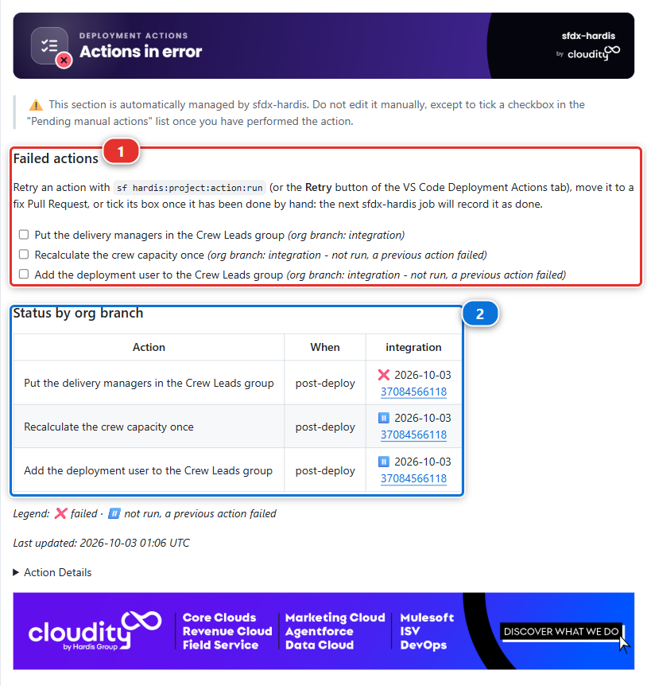
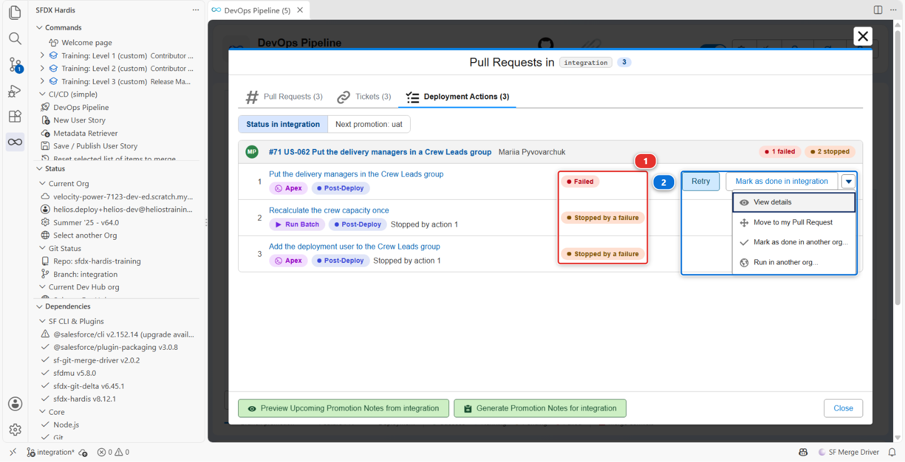
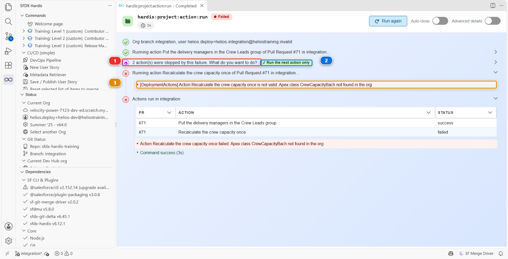
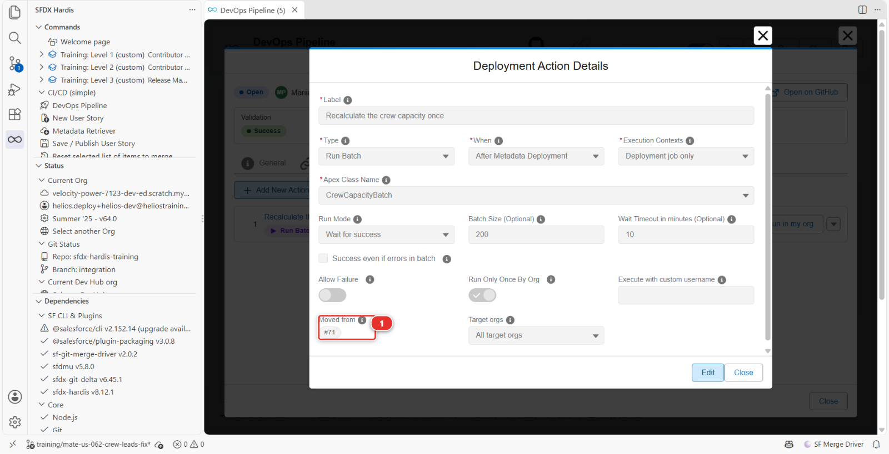
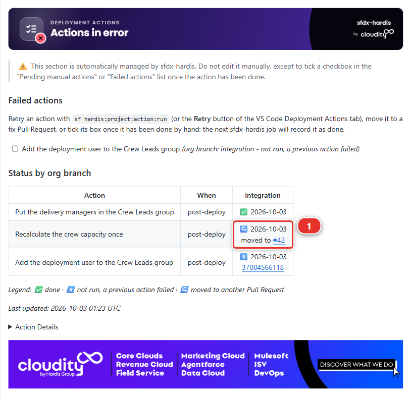

# Lab 3.3 - Read the deployment log, and what .forceignore hides from it

**Level**: 3 Release Manager

**Time**: ~45 min

**You will**: read a deployment log properly, review a Pull Request whose check fails on a field
that is right there in its diff and find the file that hides it, then recover post-deployment
actions that failed after a merge, without deploying again.

## The situation

Merging Mariia's layout fix started a deployment job. Most people watch the colour and move on.

A release manager reads it, because the deployment log is the only place that says what actually
reached the org, and the difference between that and what you thought you were shipping is where
incidents come from.

## Before you start

- [ ] [Lab 3.2](3-2-review-a-contributor-pull-request.md) finished: Mariia's layout fix merged into `integration`

## Part 1: read the log

### 1. Open the job

**Actions** tab of your fork (your own copy of the course repository on GitHub, for example `github.com/my-username/sfdx-hardis-training`), the **Process Deployment (sfdx-hardis)** run that started when you
merged.

Or from VS Code: the **DevOps Pipeline** panel puts the job on the arrow between `integration` and
its org **(1)**, coloured with its status, and the legend under the diagram **(2)** says what each
colour means. Click the marker to open the run.


### 2. Read it in five parts

An sfdx-hardis deployment log has the same shape every time:

**One: authentication.** Which org, which mechanism. After [Lab 3.1](3-1-configure-the-pipeline-up-to-production.md) this says JWT. If it ever says
something else, something changed that you did not change.

**Two: what to deploy.** The package it computed, and where from. This is the interesting part and
step 3 is about it.

**Three: pre-deploy actions.** Anything declared to run before, with its result.

**Four: the Salesforce deployment.** Components deployed, tests run, coverage, duration. On a merge
job, look for `Deployment mode: FULL + Quick Deploy`. The check job of your Pull Request already
validated this exact package, tests included, and the merge job asked Salesforce to apply that
validation rather than deploy again. That is why it takes seconds, and why it runs no test itself.

**Five: post-deploy actions**, then the notification.

### 3. Understand why the package is bigger than the diff

You changed one component. Now read what the job actually sent.

Open the package: **DevOps Pipeline** panel, **Deployment packages** menu, **Package XML**. It lists
the whole Helios app, a few dozen components, and **that is the package**: on this project every deployment to `integration` sends all of it, whatever the diff
said. The log's count of components sent will say so.

That is the default, and it is worth feeling once before you learn the thing that fixes it.

**Delta deployment.** Instead of sending the declared package, sfdx-hardis computes what changed
between the commit already deployed to this org and the new one, and sends only that. A full
Salesforce deployment of a mature project takes 40 minutes; a delta takes 3. The trade is that the
org has to genuinely be at the commit the pipeline thinks it is at.


!!! note "This project has delta off, on purpose"
    `useDeltaDeployment` is absent from `config/.sfdx-hardis.yml`, so every deployment in this
    course sends the full package. Read it for yourself: **DevOps Pipeline**, gear menu,
    **Pipeline Settings**, scope **Global Settings** **(1)**, **Deployment** tab **(2)**.
    **Use Delta Deployment** **(3)** shows **Disabled**.

    The Helios app is about fifty components, so a full deployment costs a minute and delta would save
    nothing while adding a way for the course to fail confusingly on a missing dependency. Turn it
    on when a deployment starts costing you real time, which on a real project is soon. There is a
    second key for promotions between major branches,
    `enableDeltaDeploymentBetweenMajorBranches`, on the **Danger Zone** tab, and it is off by
    default for the same reason: a promotion carries more, and is the riskiest place to send less.

Find the line `Components: N deployed` in the log, under *Deployment summary*. On a standard run of
this course it is a little over fifty. Compare it with the one file of your Pull Request. The gap
is the cost of having delta off, and it is the argument for turning it on.

### 4. Know what Smart Deploy is, and what it is not

"Smart Deploy" is the name of the command, not of a filter. `sf hardis:project:deploy:smart` is the
orchestrator: it decides the package, reuses a validated deployment as a Quick Deploy when it can,
runs the pre and post deployment actions, translates Salesforce errors into advice, and writes the
Pull Request comment. It is smart about the **job**, not about comparing your repository with the
org component by component.

Two things are often assumed to be part of it and are not:

- **Nothing compares each component with the org and drops the identical ones.** There is an opt-in
  mechanism that does something close, `manifest/packageDeployOnChange.xml`, and it only ever looks
  at the components listed in that file. The file does not exist in this project, and it does
  nothing unless it does
- **Cleaning is not a deployment filter.** It ran on a contributor's machine, at commit time. Step 3
  of the under the hood section below is about that

So the honest answer to "why did it deploy fifty components to change one" is: because nothing was
configured to stop it. That is a decision this project made, not a thing the tool does for you.

### 5. Verify in the org, not in the log

Open `helios-integration` from **Orgs Manager**: find it by its alias **(2)**, check it still says
**Connected** **(3)**, then **Open** from the actions menu at the end of its row. If it says
disconnected instead, that same menu offers **Reconnect**, and **Add Org** **(1)** is how you
connect an org the table does not have at all.


Check your change is actually there: open an Installation record, and **Total Capacity (kW)** is
back on the layout, in the right-hand column beside Mariia's cap field.

A log is a claim. The org is the fact. On a real project you check the org after every deployment to
a major environment, and it takes thirty seconds.

## Part 2: what .forceignore hides

### 6. A Pull Request that fails on a field it carries

Romain has a story for the planners. **Training: Level 3** > **Simulate my teammates**, and pick
**US-056 Show the panels each crew member has to lay**. It opens his Pull Request into
`integration`.

Wait for its checks. The deployment check fails, and the sfdx-hardis comment names a field:

```
Installation__c-Installation Layout  In field: field - no CustomField named Installation__c.Crew_Workload__c found
```

Now open **Files changed**. `Crew_Workload__c.field-meta.xml` is there, in the diff. The field is in
the Pull Request, and the deployment says it does not exist.

### 7. Find what the deployment never saw

When a component is in the branch and not in the deployment, the first file to open is
`.forceignore`. It tells the Salesforce CLI what to ignore when retrieving **and** when deploying,
and a component it matches is invisible in both directions, with no error and no warning.

Romain's diff changes it too:

```
# My scratch test fields, never versioned (Romain)
**/objects/Installation__c/fields/Crew_W*.field-meta.xml
```

That line is a pattern, not a file name. The `*` stands for any text, so it matches every field on
Installation whose name starts with `Crew_W`: his scratch test field, and `Crew_Workload__c`, the
field of his own story. The deployment left it out, the layout and the permission set that use it
reached the org without it, and Salesforce refused them.

`.forceignore` is a project-wide file, and the release manager's to guard: one careless line in it
changes what every deployment sends, for everybody, from then on.

### 8. Send it back with the fix named

Leave one review comment on the `.forceignore` line of the diff:

> This wildcard also matches `Crew_Workload__c`, the field of this story, so no deployment ever
> sends it. Name your test field exactly, with no `*`, so nothing else can match by accident.

An exact path ages badly too, but it ages **loudly**: the day the file disappears, nothing else
starts being ignored.

Romain answers: **Simulate my teammates** > **US-056 Romain names his test field exactly in
.forceignore**. It adds his commit to the same Pull Request, the check runs again, and it goes
green. Read the diff of his new commit, then merge.

<details markdown="1"><summary>Under the hood: where the package comes from, and where cleaning really happens</summary>

The job ran:

    sf hardis:project:deploy:smart

and the package it sent was built like this:

1. **Start from `manifest/package.xml`**, the declared package, plus
   `manifest/destructiveChanges.xml` for what is being removed
2. **Delta**, if `useDeltaDeployment` is on: `sfdx-git-delta` computes the changed components
   between the last deployed commit and `HEAD`, and everything else is taken back out of the
   package. `enableDeltaDeploymentBetweenMajorBranches` controls whether the same applies to a
   major-to-major deployment, and is off by default because a promotion to production is the worst
   possible place to discover that the org drifted
3. **The overwrite manager**, when the package holds something `manifest/package-no-overwrite.xml` lists:
   the org is queried, and any component **listed in that file** that the org already has is taken out.
   When nothing in the package matches the list, the org is not queried at all, and the log says so. It is scoped to its
   own list and nothing else, and a component it protects is still created in an org that does not
   have it yet
4. **Deploy-on-change**, if `manifest/packageDeployOnChange.xml` exists: those components, and only
   those, are retrieved from the org and compared, and the unchanged ones are dropped

Steps 2 and 4 are off in this project. Step 3 runs, and its `[NoOverwrite]` lines are in the log, but
none of what Helios deploys is in its list yet, so what Salesforce receives is step 1.

**Cleaning is not in that list, and this is the thing to take away.** The `autoCleanTypes` rules run
inside `sf hardis:work:save`, on a contributor's machine, before the commit. They rewrite the files
on disk and commit the result, which is why [Lab 1.5](../level-1-contributor-basics/1-5-retrieve-commit-and-publish-your-changes.md) could show you the diff they produced. By
the time a deployment runs, there is nothing left to clean: the repository already is the cleaned
version.

Two failure modes worth recognising:

- **The org drifted.** Somebody changed something in the org by hand and the deployment overwrites
  it without a word, because nothing compared. [Lab 3.7](3-7-hotfix-and-retrofit.md) is about that
- **Delta lost a dependency.** Your change needs a component that did not change, so the delta does
  not carry it, and the deployment fails on a reference. The fix is not to disable delta: it is to
  include the dependency, which `manifest/package.xml` is for

<!-- command-links:start -->
Command documentation: [hardis:project:deploy:smart](https://sfdx-hardis.cloudity.com/hardis/project/deploy/smart/), [hardis:work:save](https://sfdx-hardis.cloudity.com/hardis/work/save/)
<!-- command-links:end -->

</details>

## Part 3: when a post-deployment action fails

### 9. Merge a Pull Request whose actions fail after the merge

Mariia has a story made of deployment actions and no metadata. **Training: Level 3** > **Simulate
my teammates**, and pick **US-062 Put the delivery managers in a Crew Leads group**. It opens her
Pull Request into `integration`, with three post-deployment actions in its actions file:

1. **Put the delivery managers in the Crew Leads group**, an Apex script
2. **Recalculate the crew capacity once**, a Run Batch action
3. **Add the deployment user to the Crew Leads group**, an Apex script

Its check goes green. That proves less than it looks: the three actions run during the deployment
job only, after the merge, so the check skipped them. Merge it.

The deployment job goes red. The metadata deployed, then the first action failed, and sfdx-hardis
stopped there: the two others never ran.

### 10. Read what failed, and what did not run

**The job log** names the failure. The Apex script asked the org for a public group named
`Helios_Crew_Leads`, and the org has none:

```
System.QueryException: List has no rows for assignment to SObject
```

Mariia created the group by hand in her own org, in Setup, the way most people create one: nothing
in her Pull Request creates it.

**The Deployment Actions comment** of her Pull Request lists the three actions under **Failed
actions (1)**: ❌ for the one that failed, ⏸️ for the two it stopped, each with a checkbox. The
**Status by org branch** table **(2)** says the same in the `integration` column.



**The DevOps Pipeline**: click `integration`, then the **Deployment Actions** tab. The actions are
grouped by Pull Request, numbered in the order they run. The **Status** column **(1)** gives each
action its state in the org of `integration`, and the failed one carries **Retry** and **Mark as
done in integration** buttons **(2)**. The menu at the end of each row holds the rest, **Move to my Pull Request**
included.



None of them runs the deployment job again: the metadata is in the org already, and a second
deployment would only redo what worked. The right way out depends on why each action failed:

| Why it failed                                    | Way out                       |
|--------------------------------------------------|-------------------------------|
| The org was missing something, and now it has it | **Retry**                     |
| The action itself is wrong                       | Move it to a fix Pull Request |
| Somebody already did it by hand                  | **Mark as done**              |

### 11. Fix the org, then retry

The first action is right: the org is missing its group. Create it in `helios-integration`:

1. Open `helios-integration` from **Orgs Manager**, then **Setup**, type `Public Groups` in the
   Quick Find box, and click **New**
2. **Label** `Crew Leads`, **Group Name** `Helios_Crew_Leads`, then **Save**

The action definition is read from the branch you have checked out. Check out `integration` and
pull it, from the branch name in the status bar and the Source Control panel, so Mariia's actions
file is there.

Back in the **Deployment Actions** tab, click **Retry** on the row of **Put the delivery managers in
the Crew Leads group**. The command runs in VS Code, against `helios-integration`:

- the action runs and goes green, and the command asks what to do with the two actions its failure
  stopped **(1)**
- answer **Run the next action only** **(2)**
- the crew capacity action runs, and fails **(3)**: the class `CrewCapacityBach` does not exist



The Pull Request comment now reads ✅ for the first action, with a note saying you ran it from your
computer, ❌ for the crew capacity action, and ⏸️ for the last one.

<details markdown="1"><summary>Under the hood: what Retry ran</summary>

The button ran:

    sf hardis:project:action:run --pr <number of US-062> --action-id <id> --org-branch integration

- **No deployment.** It runs the one action, with the code a deployment job uses for each action:
  target branch filters, references to the outputs of other actions, validity checks
- **The org comes from the branch.** `integration` names `helios-integration` through the
  `targetUsername` of `config/branches/.sfdx-hardis.integration.yml`, and the command uses that
  org as you connected it in Orgs Manager. The `sf` commands the action starts target it for this run
  only: your default org does not change
- **The result goes to the Pull Request comment**, with your git user name and your Salesforce
  username in the note, through the git provider token VS Code holds. Without one, the command
  refuses to run, because the next deployment would not know the action was done
- **The stopped actions are remembered.** When the deployment job stopped, it recorded the two
  others as `not-run`, linked to the failed one: that is how the command knew what to offer next
- An action with a `customUsername` runs as that user. When your computer is not connected with
  it, the command asks you to log in with it, and checks you did

<!-- command-links:start -->
Command documentation: [hardis:project:action:run](https://sfdx-hardis.cloudity.com/hardis/project/action/run/)
<!-- command-links:end -->

</details>

### 12. A wrong definition goes back to its author

Retrying the crew capacity action will fail every time: its class name has a typo, in a file of a
Pull Request that is merged. Editing that file on `integration` would not help either: a deployment
only reads the actions of the Pull Requests it deploys.

Send it back. Comment on Mariia's merged Pull Request:

> The crew capacity action names `CrewCapacityBach`, which does not exist: it should be
> `CrewCapacityBatch`. Can you move it to a fix Pull Request?

She fixes it the way the product offers: from her new branch, **Move to my Pull Request** in the
menu of the failed row moves the action into the actions file of her own Pull Request, with the
same id, and she corrects the class name there.

**Simulate my teammates** > **US-062 Mariia fixes the crew capacity action**. Review her Pull
Request:

- **Files changed**: the action left the actions file of US-062 and arrived in the file of the new
  Pull Request, with `className: CrewCapacityBatch` and `movedFrom` set to the number of US-062
- still in **Files changed**: a new file, `groups/Helios_Crew_Leads.group-meta.xml`, and one more
  block in `manifest/package.xml`. A public group is metadata like any other, and Mariia put hers in
  the sources. In `integration` the deployment finds the group you created in step 11 and keeps
  it, under the label `Crew Leads`. In `uat`, `preprod` and production, where nobody created anything, the deployment
  creates it before the actions run. Without that file, the first action would fail in each of
  them the way it failed here
- the **Deployment Actions** tab of her Pull Request: open the action, and the editor shows where
  it comes from, under **Moved from (1)**



Merge it. Its deployment job runs the action, from the new Pull Request, and goes green. Open the
Deployment Actions comment of US-062 again: the crew capacity action reads ↪️ **moved to** the fix
Pull Request **(1)**, with a link, instead of a red cell nobody could clear.



When both Pull Requests go to `uat` together, in [Lab 3.5](3-5-promote-to-uat-and-write-release-notes.md), US-062 no longer carries the action, and it
runs once, from the fix.

### 13. Mark as done what was done by hand

The last action adds the deployment user to Crew Leads. Retrying it would work, but doing it takes
twenty seconds, so do it by hand, the way a release manager does when a release cannot wait:

1. In `helios-integration`, **Setup** > **Public Groups** > **Crew Leads** > **Edit**
2. Add your user to **Selected Members**, then **Save**

Then, in the **Deployment Actions** tab, open the menu of **Add the deployment user to the Crew
Leads group** and click **Mark as done in integration**. Nothing opens: sfdx-hardis records it in the background
as done in `integration`, with a note naming you, and ticks its checkbox in the Pull Request
comments. The button reads **Marking as done...** until the action shows **Done** in the tab.

The next deployment to `integration` skips it. In `uat` and beyond it still runs, because nobody
did it there.

Ticking its checkbox in the **Failed actions** list of the Pull Request comment does the same,
recorded by the next sfdx-hardis job: use it when you are on GitHub rather than in VS Code.

<details markdown="1"><summary>Under the hood: what the three ways out leave behind</summary>

- **Retry** ran `sf hardis:project:action:run`, as in step 11
- **Move to my Pull Request** ran, on Mariia's side:

        sf hardis:project:action:update --scope pr --pr-id <US-062> --when post-deploy --action-id <id> --move-to-pr <her Pull Request>

  It removes the action from `scripts/actions/.sfdx-hardis.<US-062>.yml`, adds it to the file of her
  Pull Request with `movedFrom: <US-062>`, and keeps its id. When a deployment carries both, the
  original copy is dropped, and the run of the copy writes ↪️ in the comment of US-062
- **Mark as done** ran:

        sf hardis:project:action:set-status --pr <US-062> --action-id <id> --org-branch integration --status success

  The status becomes `success`, which is what makes later deployments skip it, and the note keeps
  the truth: *Not run in CI, then closed by hand by you (your username) on the date*

Everything lives in the "Deployment Actions" comment of the Pull Request that owns the action: no
Salesforce object, nothing to install. That comment is also where a release manager looks before a
promotion, to see what is still red.

<!-- command-links:start -->
Command documentation: [hardis:project:action:run](https://sfdx-hardis.cloudity.com/hardis/project/action/run/), [hardis:project:action:update](https://sfdx-hardis.cloudity.com/hardis/project/action/update/), [hardis:project:action:set-status](https://sfdx-hardis.cloudity.com/hardis/project/action/set-status/)
<!-- command-links:end -->

</details>

## What you should see

- A green **Process Deployment (sfdx-hardis)** run on `integration`
- A log where you can name how many components went, and why that number is not one
- The change present in `helios-integration`
- Romain's US-056 merged, `Crew_Workload__c` in `helios-integration`, and no wildcard left in
  `.forceignore`
- Mariia's US-062 and its fix merged, and in its Deployment Actions comment: ✅ for the first
  action with a note saying you ran it, ↪️ for the crew capacity action, ✅ for the last one with a
  note saying you closed it by hand
- In `helios-integration`, a **Crew Leads** public group holding the delivery managers and you
- `force-app/main/default/groups/Helios_Crew_Leads.group-meta.xml` on `integration`, so the next
  orgs get the group from the deployment

## If it goes wrong

**The deployment failed after the check passed.**
Something changed between the two: the org, or another deployment landing first. Read the error, and
check whether somebody deployed by hand.

**The log says "nothing to deploy".**
With delta off that should not happen on this project, because the package is declared rather than
computed. If it does, check that `manifest/package.xml` is still in the branch and still lists
something.

**The job never started.**
The workflow only triggers on pushes to major branches. Check that the merge really landed on
`integration`.

**Romain's check still fails after his second commit.**
The check ran on the merge of his branch with `integration` as it was when he pushed. If you
changed `.forceignore` on `integration` in the meantime, click **Update branch** on his Pull
Request: GitHub merges `integration` into it, and the check runs again.

**The Deployment Actions tab has no Status column, or no Retry in the menu.**
The status comes from sfdx-hardis, which needs a recent version and your GitHub connection: update
it from the **Dependencies** panel, and check the git provider icon of the DevOps Pipeline is
connected. A row offers Retry only when its action failed or was stopped, after the deployment.

**Retry says no org of helios-integration is connected.**
Connect `helios-integration` in **Orgs Manager**, then click **Retry** again.

**Retry says it cannot find the action.**
The definition is read from your checked out branch: check out `integration` and pull it, so
Mariia's actions file is there.

**The first action fails again after you created the group.**
Check the **Group Name**: it must be `Helios_Crew_Leads` exactly. The label can be anything.

**Mariia's fix stops with "not merged in your fork".**
Her fix moves an action out of the actions file of US-062, named after its Pull Request number:
merge US-062 first.

## Check your work

Welcome page > **Training: Level 3** > **Check my work**, then pick **Lab 3.3**.

## Go deeper

- [Deploy to major orgs](https://sfdx-hardis.cloudity.com/salesforce-devops-deploy-major-branches/)
- [Smart Deploy internals](https://sfdx-hardis.cloudity.com/salesforce-devops-smart-deployment/)
- [Recover a failed deployment action](https://sfdx-hardis.cloudity.com/salesforce-devops-work-on-user-story-deployment-actions/#recover-a-failed-action)

[Next: Lab 3.4 - Three Pull Requests collide: choose the merge order](3-4-merge-colliding-pull-requests.md){ .md-button .md-button--primary }
