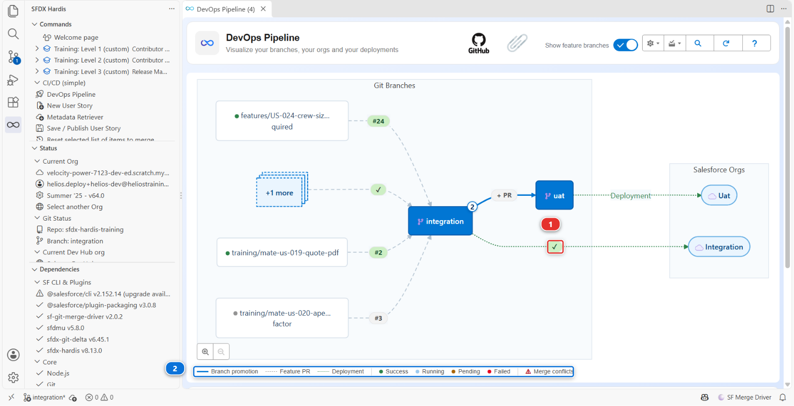
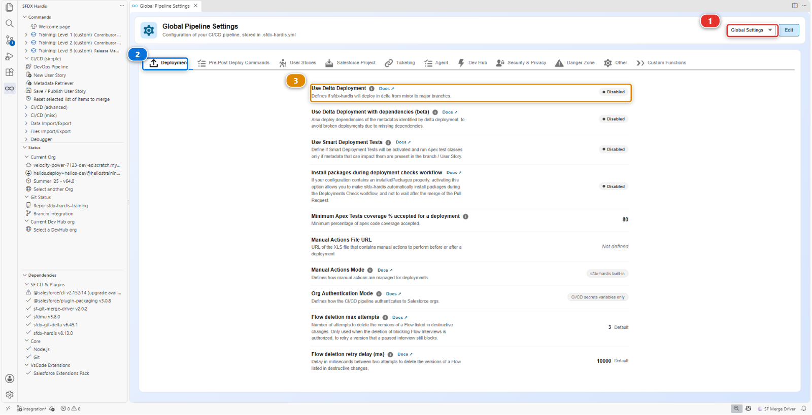

# Lab 3.3 - Read the deployment log, and what .forceignore hides from it

**Level**: 3 Release Manager

**Time**: ~25 min

**You will**: read a deployment log properly, then review a Pull Request whose check fails on a field
that is right there in its diff, and find the file that hides it.

## The situation

Merging Mariia's layout fix started a deployment job. Most people watch the colour and move on.

A release manager reads it, because the deployment log is the only place that says what actually
reached the org, and the difference between that and what you thought you were shipping is where
incidents come from.

## Before you start

- [ ] [Lab 3.2](3-2-review-a-contributor-pull-request.md) finished: Mariia's layout fix merged into `integration`

## Part 1: read the log

### 1. Open the job

**Actions** tab of your fork (your own copy of the course repository on GitHub, for example `github.com/my-username/sfdx-hardis-training`), the **Process Deployment (sfdx-hardis)** run that started when you
merged.

Or from VS Code: the **DevOps Pipeline** panel puts the job on the arrow between `integration` and
its org **(1)**, coloured with its status, and the legend under the diagram **(2)** says what each
colour means. Click the marker to open the run.



### 2. Read it in five parts

An sfdx-hardis deployment log has the same shape every time:

**One: authentication.** Which org, which mechanism. After [Lab 3.1](3-1-configure-the-pipeline-up-to-production.md) this says JWT. If it ever says
something else, something changed that you did not change.

**Two: what to deploy.** The package it computed, and where from. This is the interesting part and
step 3 is about it.

**Three: pre-deploy actions.** Anything declared to run before, with its result.

**Four: the Salesforce deployment.** Components deployed, tests run, coverage, duration. On a merge
job, look for `Deployment mode: FULL + Quick Deploy`. The check job of your Pull Request already
validated this exact package, tests included, and the merge job asked Salesforce to apply that
validation rather than deploy again. That is why it takes seconds, and why it runs no test itself.

**Five: post-deploy actions**, then the notification.

### 3. Understand why the package is bigger than the diff

You changed one component. Now read what the job actually sent.

Open the package: **DevOps Pipeline** panel, **Deployment packages** menu, **Package XML**. It lists
the whole Helios app, a few dozen components, and **that is the package**: on this project every deployment to `integration` sends all of it, whatever the diff
said. The log's count of components sent will say so.

That is the default, and it is worth feeling once before you learn the thing that fixes it.

**Delta deployment.** Instead of sending the declared package, sfdx-hardis computes what changed
between the commit already deployed to this org and the new one, and sends only that. A full
Salesforce deployment of a mature project takes 40 minutes; a delta takes 3. The trade is that the
org has to genuinely be at the commit the pipeline thinks it is at.



!!! note "This project has delta off, on purpose"
    `useDeltaDeployment` is absent from `config/.sfdx-hardis.yml`, so every deployment in this
    course sends the full package. Read it for yourself: **DevOps Pipeline**, gear menu,
    **Pipeline Settings**, scope **Global Settings** **(1)**, **Deployment** tab **(2)**.
    **Use Delta Deployment** **(3)** shows **Disabled**.

    The Helios app is about fifty components, so a full deployment costs a minute and delta would save
    nothing while adding a way for the course to fail confusingly on a missing dependency. Turn it
    on when a deployment starts costing you real time, which on a real project is soon. There is a
    second key for promotions between major branches,
    `enableDeltaDeploymentBetweenMajorBranches`, on the **Danger Zone** tab, and it is off by
    default for the same reason: a promotion carries more, and is the riskiest place to send less.

Find the line `Components: N deployed` in the log, under *Deployment summary*. On a standard run of
this course it is a little over fifty. Compare it with the one file of your Pull Request. The gap
is the cost of having delta off, and it is the argument for turning it on.

### 4. Know what Smart Deploy is, and what it is not

"Smart Deploy" is the name of the command, not of a filter. `sf hardis:project:deploy:smart` is the
orchestrator: it decides the package, reuses a validated deployment as a Quick Deploy when it can,
runs the pre and post deployment actions, translates Salesforce errors into advice, and writes the
Pull Request comment. It is smart about the **job**, not about comparing your repository with the
org component by component.

Two things are often assumed to be part of it and are not:

- **Nothing compares each component with the org and drops the identical ones.** There is an opt-in
  mechanism that does something close, `manifest/packageDeployOnChange.xml`, and it only ever looks
  at the components listed in that file. The file does not exist in this project, and it does
  nothing unless it does
- **Cleaning is not a deployment filter.** It ran on a contributor's machine, at commit time. Step 3
  of the under the hood section below is about that

So the honest answer to "why did it deploy fifty components to change one" is: because nothing was
configured to stop it. That is a decision this project made, not a thing the tool does for you.

### 5. Verify in the org, not in the log

Open `helios-integration` from **Orgs Manager**: find it by its alias **(2)**, check it still says
**Connected** **(3)**, then **Open** from the actions menu at the end of its row. If it says
disconnected instead, that same menu offers **Reconnect**, and **Add Org** **(1)** is how you
connect an org the table does not have at all.


Check your change is actually there: open an Installation record, and **Total Capacity (kW)** is
back on the layout, in the right-hand column beside Mariia's cap field.

A log is a claim. The org is the fact. On a real project you check the org after every deployment to
a major environment, and it takes thirty seconds.

## Part 2: what .forceignore hides

### 6. A Pull Request that fails on a field it carries

Romain has a story for the planners. **Training: Level 3** > **Simulate my teammates**, and pick
**US-056 Show the panels each crew member has to lay**. It opens his Pull Request into
`integration`.

Wait for its checks. The deployment check fails, and the sfdx-hardis comment names a field:

```
Installation__c-Installation Layout  In field: field - no CustomField named Installation__c.Crew_Workload__c found
```

Now open **Files changed**. `Crew_Workload__c.field-meta.xml` is there, in the diff. The field is in
the Pull Request, and the deployment says it does not exist.

### 7. Find what the deployment never saw

When a component is in the branch and not in the deployment, the first file to open is
`.forceignore`. It tells the Salesforce CLI what to ignore when retrieving **and** when deploying,
and a component it matches is invisible in both directions, with no error and no warning.

Romain's diff changes it too:

```
# My scratch test fields, never versioned (Romain)
**/objects/Installation__c/fields/Crew_W*.field-meta.xml
```

That line is a pattern, not a file name. The `*` stands for any text, so it matches every field on
Installation whose name starts with `Crew_W`: his scratch test field, and `Crew_Workload__c`, the
field of his own story. The deployment left it out, the layout and the permission set that use it
reached the org without it, and Salesforce refused them.

`.forceignore` is a project-wide file, and the release manager's to guard: one careless line in it
changes what every deployment sends, for everybody, from then on.

### 8. Send it back with the fix named

Leave one review comment on the `.forceignore` line of the diff:

> This wildcard also matches `Crew_Workload__c`, the field of this story, so no deployment ever
> sends it. Name your test field exactly, with no `*`, so nothing else can match by accident.

An exact path ages badly too, but it ages **loudly**: the day the file disappears, nothing else
starts being ignored.

Romain answers: **Simulate my teammates** > **US-056 Romain names his test field exactly in
.forceignore**. It adds his commit to the same Pull Request, the check runs again, and it goes
green. Read the diff of his new commit, then merge.

<details markdown="1"><summary>Under the hood: where the package comes from, and where cleaning really happens</summary>

The job ran:

    sf hardis:project:deploy:smart

and the package it sent was built like this:

1. **Start from `manifest/package.xml`**, the declared package, plus
   `manifest/destructiveChanges.xml` for what is being removed
2. **Delta**, if `useDeltaDeployment` is on: `sfdx-git-delta` computes the changed components
   between the last deployed commit and `HEAD`, and everything else is taken back out of the
   package. `enableDeltaDeploymentBetweenMajorBranches` controls whether the same applies to a
   major-to-major deployment, and is off by default because a promotion to production is the worst
   possible place to discover that the org drifted
3. **The overwrite manager**, when `manifest/package-no-overwrite.xml` lists something: the org is queried, and
   any component **listed in that file** that the org already has is taken out. It is scoped to its
   own list and nothing else, and a component it protects is still created in an org that does not
   have it yet
4. **Deploy-on-change**, if `manifest/packageDeployOnChange.xml` exists: those components, and only
   those, are retrieved from the org and compared, and the unchanged ones are dropped

Steps 2 and 4 are off in this project. Step 3 runs, and its `[NoOverwrite]` lines are in the log, but
none of what Helios deploys is in its list yet, so what Salesforce receives is step 1.

**Cleaning is not in that list, and this is the thing to take away.** The `autoCleanTypes` rules run
inside `sf hardis:work:save`, on a contributor's machine, before the commit. They rewrite the files
on disk and commit the result, which is why [Lab 1.5](../level-1-contributor-basics/1-5-retrieve-commit-and-publish-your-changes.md) could show you the diff they produced. By
the time a deployment runs, there is nothing left to clean: the repository already is the cleaned
version.

Two failure modes worth recognising:

- **The org drifted.** Somebody changed something in the org by hand and the deployment overwrites
  it without a word, because nothing compared. [Lab 3.7](3-7-hotfix-and-retrofit.md) is about that
- **Delta lost a dependency.** Your change needs a component that did not change, so the delta does
  not carry it, and the deployment fails on a reference. The fix is not to disable delta: it is to
  include the dependency, which `manifest/package.xml` is for

<!-- command-links:start -->
Command documentation: [hardis:project:deploy:smart](https://sfdx-hardis.cloudity.com/hardis/project/deploy/smart/), [hardis:work:save](https://sfdx-hardis.cloudity.com/hardis/work/save/)
<!-- command-links:end -->

</details>

## What you should see

- A green **Process Deployment (sfdx-hardis)** run on `integration`
- A log where you can name how many components went, and why that number is not one
- The change present in `helios-integration`
- Romain's US-056 merged, `Crew_Workload__c` in `helios-integration`, and no wildcard left in
  `.forceignore`

## If it goes wrong

**The deployment failed after the check passed.**
Something changed between the two: the org, or another deployment landing first. Read the error, and
check whether somebody deployed by hand.

**The log says "nothing to deploy".**
With delta off that should not happen on this project, because the package is declared rather than
computed. If it does, check that `manifest/package.xml` is still in the branch and still lists
something.

**The job never started.**
The workflow only triggers on pushes to major branches. Check that the merge really landed on
`integration`.

**Romain's check still fails after his second commit.**
The check ran on the merge of his branch with `integration` as it was when he pushed. If you
changed `.forceignore` on `integration` in the meantime, click **Update branch** on his Pull
Request: GitHub merges `integration` into it, and the check runs again.

## Check your work

Welcome page > **Training: Level 3** > **Check my work**, then pick **Lab 3.3**.

## Go deeper

- [Deploy to major orgs](https://sfdx-hardis.cloudity.com/salesforce-devops-deploy-major-branches/)
- [Smart Deploy internals](https://sfdx-hardis.cloudity.com/salesforce-devops-smart-deployment/)

[Next: Lab 3.4 - Three Pull Requests collide: choose the merge order](3-4-merge-colliding-pull-requests.md){ .md-button .md-button--primary }
