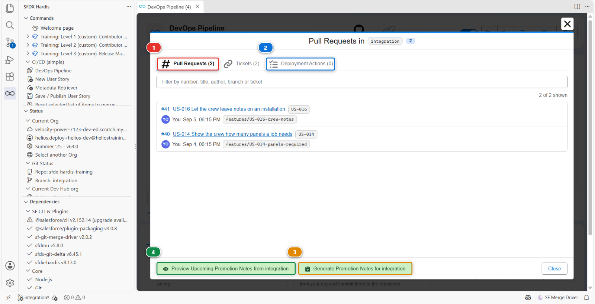
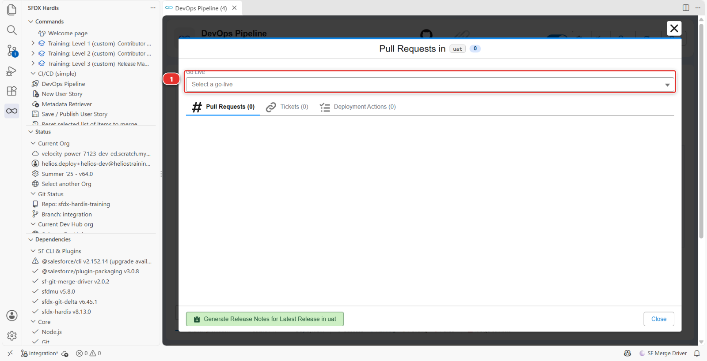
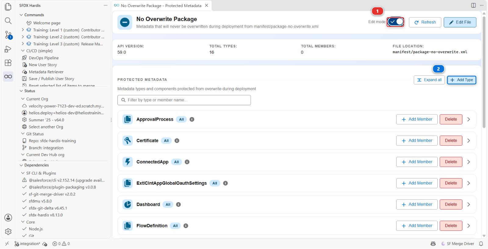
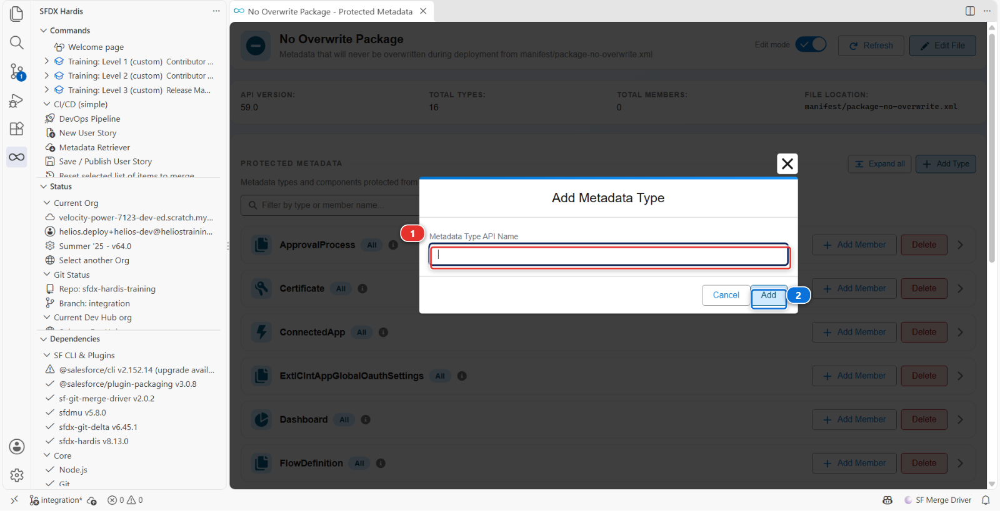
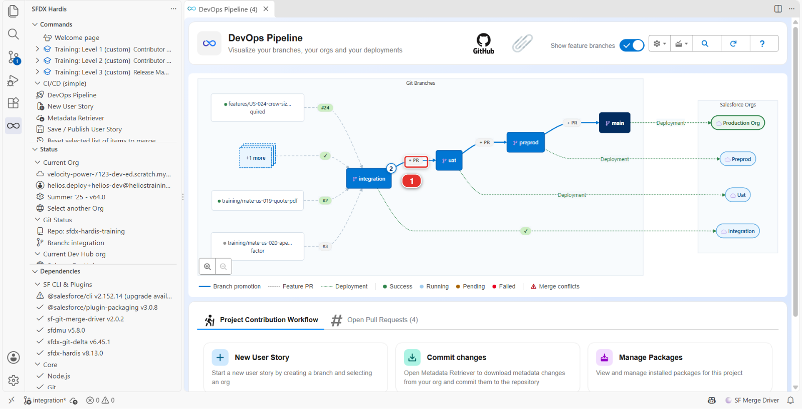
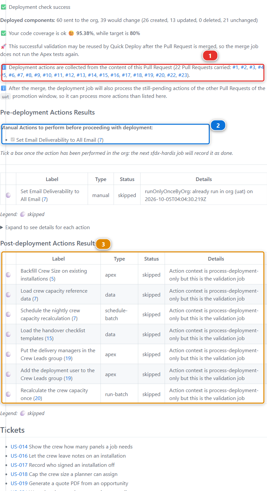
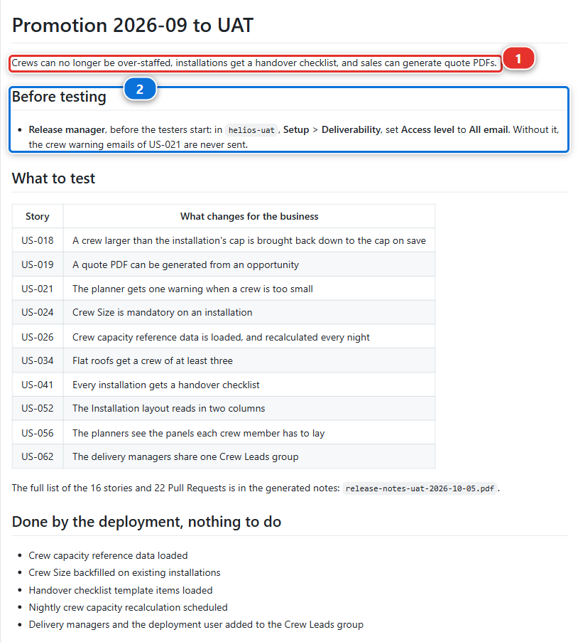

# Lab 3.5 - Promote to UAT and write the release notes

**Level**: 3 Release Manager

**Time**: ~35 min

**You will**: protect a setting UAT keeps for itself, make your first promotion between two major
branches, read the deployment actions it carries, and produce the document the business actually
reads.

## The situation

Everything the team built this week is in `integration`. The business testers work in UAT. Monday
morning they expect to find this week's work there, with a note saying what changed.

A promotion between major branches is not a contributor Pull Request. It carries several stories at
once, it may carry deployment actions declared weeks ago by different people, and the org it
deploys to has real testers in it.

## Before you start

- [ ] [Lab 3.4](3-4-merge-colliding-pull-requests.md) finished: US-018 and US-019 merged into `integration`
- [ ] `helios-uat` connected: the scratch org Level 1 created, configured as the `uat` org since then
- [ ] JWT authentication working for `uat` ([Lab 3.1](3-1-configure-the-pipeline-up-to-production.md))

## Steps

### 1. See what you are about to ship

Open the **DevOps Pipeline** panel and click the `integration` node in the diagram. A window opens
on that branch, titled **Pull Requests in integration**.



**Pull Requests** **(1)** is the list that matters: every Pull Request merged into `integration`
since the last promotion to `uat`, with who merged it and when. That list **is** the release. Read
it before you create anything: if a story in it should not go out this week, now is the moment, not
after the deployment.

**Deployment Actions** **(2)** is the list of actions those Pull Requests carried, gathered in one
place, and step 4 comes back to it. **Tickets** beside it is the same again for the stories, each with its
title, read from the backlog the project declares as its ticketing system. A fourth tab, **Apex Tests**, appears only on a project that sets
`enableDeploymentApexTestClasses`, and this one does not.

The footer holds the two buttons step 7 uses: **(3)** generates the notes for what has already been
promoted, **(4)** previews the notes for what has not.

!!! note "Empty, with a Go Live selector instead?"
    The window shows what is waiting to be promoted **to the next stage**. A branch that has no next
    stage, meaning its `mergeTargets` is empty, has nothing to promote, so the panel shows a **Go
    Live** selector **(1)** and the release notes of a go-live already merged into it instead:

    

    On `main` that is the normal view and always will be: production is the end of the pipeline.

    On `integration` it means the branch file lost its merge target, which it has had since Lab 1.2.
    Click **Training: Level 3 > Set up my training environment**, which writes it again. It
    refreshes the org and the login URL of a file that already exists and leaves the rest alone, so
    what you set in Lab 3.1 survives.

### 2. Protect what UAT keeps for itself

One component of the Helios app is meant to be different in every org: the remote site setting
`Helios_Warehouse`, the address of the warehouse stock system the panel batches are booked with.
Production talks to the real warehouse, UAT to the warehouse's test system. An admin set that address
in UAT by hand, and the repository holds the production one.

See it for yourself: in `helios-uat`, **Setup > Remote Site Settings**, open `Helios_Warehouse`,
**Edit**, and set **Remote Site URL** to `https://warehouse-test.helios.invalid`, the way
the UAT admin did. **Save**.

Now the promotion. It sends the whole package, remote site setting included, and would put the
production address back in UAT without a word. The **overwrite manager** is for exactly this:
anything listed in `manifest/package-no-overwrite.xml` is taken out of the deployment when the target
org already has it, and created when it does not.

Helios already has that file: it is the list every sfdx-hardis project starts with. It protects the
components an org keeps for itself almost everywhere, reports and dashboards maintained in
production, connected apps, named credentials, certificates. Remote site settings are not in it yet,
and you do not have to write XML to add them. In the **DevOps Pipeline** panel, open the
**Deployment packages** menu, the one that opened **Package XML** in [Lab 1.5](../level-1-contributor-basics/1-5-retrieve-commit-and-publish-your-changes.md), and pick **No
Overwrite**. The package viewer opens on that list. Turn **Edit mode** on **(1)**, then click
**Add Type** **(2)**.



Type `RemoteSiteSetting`, the name Salesforce gives this kind of component, in **Metadata Type API
Name** **(1)**, and click **Add** **(2)**.



The new **RemoteSiteSetting** row has an **Add member** button: click it, type `Helios_Warehouse`,
and **Add**. The viewer added a `RemoteSiteSetting` block to `manifest/package-no-overwrite.xml`
for you. The file has the shape of `manifest/package.xml`: one block per kind of component, its
members listed by name, or `*` for all of them. **Edit File** opens it as text, if you want to see it.

Then **Training: Level 3** > **Publish my pipeline configuration**, and merge its Pull Request once
green, as in [Lab 3.1](3-1-configure-the-pipeline-up-to-production.md): the list of what must never be overwritten is pipeline configuration, like the
rest.

!!! note "Created where missing, never overwritten where present"
    A new org, a fresh sandbox for instance, has no `Helios_Warehouse` yet, and the deployment creates
    it from the repository. From then on it belongs to that org. The overwrite manager does not
    compare versions: present means protected.

### 3. Create the promotion Pull Request

In the **DevOps Pipeline** diagram, the arrow from `integration` to `uat` carries a **+ PR** chip
**(1)**. Click it: GitHub opens on a new Pull Request from `integration` into `uat`, both branches
already filled in.



The chip is there because no Pull Request is open on that arrow. Once you create one, the chip is
replaced by the Pull Request number and its status.

!!! note "Not the promotion button of the branch window"
    A branch window can also show a **Create promotion from <branch> (Beta)** button and a checkbox
    on every row. This project turns that feature on ([Lab 3.1](3-1-configure-the-pipeline-up-to-production.md)), but `allowedPromotionSteps` allows
    one step only, `uat` to `preprod`, so the window of `integration` has neither. You will meet
    both on the window of `uat` in step 7.

    That feature carries a **subset** of what is waiting, and it exists for the week the business
    signs off one story and not the one next to it. What you are doing here is promoting
    everything, which is what a plain Pull Request from one branch to the next carries, and what
    you should be doing almost every week. [Lab 3.10](3-10-promote-a-subset-with-promotion-branches.md) is the exception.

Title it for the humans who will read it, not for git, and call it a **promotion**:

> Promotion 2026-09: crew capacity cap, quote PDF

**Release** is the word for the Pull Request into `main`, production, and for nothing else. The
business reads "release" as "it is live", and a Pull Request into `uat` puts nothing live. Keep the
two words apart and a list of Pull Requests reads like the history of what reached production.

Merge it with **Merge pull request**, never with a squash: a promotion carries every commit of the
stories it promotes, and the next promotion, the retrofit and the release notes all need to find
them one by one ([Lab 1.6](../level-1-contributor-basics/1-6-pull-request-deployment-check-and-merge.md)).

### 4. Read the deployment actions it carries

Once the check runs, the sfdx-hardis comment gains two sections, **Pre-deployment Actions Results**
and **Post-deployment Actions Results**. What a promotion adds on top is the paragraph naming the
scope **(1)**: every Pull Request it carries, each one a link.



Every action any contributor declared on any of the merged stories is collected into one table, with
its label, its type, its status and a link back to the Pull Request it came from. Anything needing a
human gets a **checklist above the table**, headed *Manual Actions to perform before proceeding with
deployment* or *after deployment*. The two checklists land on different jobs: the check job carries
the before one **(2)**, so you can act on it while deciding, and the merge job carries the after
one. The post-deployment actions **(3)** read **skipped** on the check: a check changes nothing in
the org, so they wait for the merge.

**Read it before merging.** Two things to look for:

| What you see      | What it means for you                                                                                   |
|-------------------|---------------------------------------------------------------------------------------------------------|
| A **manual step** | Somebody has to click something in UAT. That somebody is you, and it will not happen unless you plan it |
| A **data import** | Records will be written to UAT. Testers may have their own records there                                |

You cannot edit a contributor's action from here: it belongs to their Pull Request and to every org
after this one, so a wrong action is fixed in a new Pull Request rather than in this promotion.

The checklist is the exception, and it is not decoration. **Tick a box once you have done the thing
in the org**, and the next sfdx-hardis job reads the box back and records the action as done. Leave
it unticked and the next promotion will still be asking you for it.

A **before** step also holds the merge: while the deliverability step of US-026 is not marked as
done in `uat`, the check of the promotion stops red, right after its pre-deployment actions. Do the
click in `helios-uat`, tick its box (or **Mark as done in uat** in the VS Code **Deployment
Actions** tab), then **Re-run all jobs** on the check: it records the step and goes green.

### 5. Merge and watch the deployment

Merge the promotion. The **Process Deployment (sfdx-hardis)** run starts, this time on `uat`.

This is the first deployment to this org through the pipeline, so it will be larger than the ones to
integration: UAT is behind by everything the team has done. Expect several minutes.

The deliverability step is a **pre-deploy** one: its place is before the merge, as step 4 says,
and the check did not go green until you ticked it. This job skips it: *Skipping Set Email
Deliverability to All Email ...: already run in uat*.

Then read the log for the overwrite manager, above the deployment, among the lines that start
with `[NoOverwrite]`:

```
Type RemoteSiteSetting: 1 item(s) skipped because they already exist in the target org (protected), 0 item(s) to deploy
```

`helios-uat` already has `Helios_Warehouse`, so the promotion left it out of the package, and the
**Final package.xml to deploy** printed right after it has one item fewer.

### 6. Verify with a tester's eyes

Open `helios-uat` and check the two stories are genuinely usable, not just deployed:

- A crew larger than the cap is brought back down to the cap when you save. The rule runs when a
  planned installation gets its crew, and UAT has none left planned since the crew size backfill of
  [Lab 2.3](../level-2-contributor-advanced/2-3-fix-broken-records-with-an-apex-deployment-action.md), so make one: on any installation, set `Status` to `Planned`, `Crew Capacity Cap` to 3 and
  `Crew Size` to 6, in the same edit, and save. It reads 3, and it has moved on to `Scheduled`
- The quote PDF permission is on the manager permission set
- **Setup > Remote Site Settings** still says `https://warehouse-test.helios.invalid` for
  `Helios_Warehouse`: the promotion left it alone

Deployed and usable are different states, and the gap between them is almost always a permission or
a piece of reference data.

### 7. Generate the release notes

Open the **DevOps Pipeline** panel and click the `uat` node, the same way you clicked `integration`
in step 1. In the footer of that window, the left button now reads **Generate Promotion Notes for
uat**. Click it.

This window has the checkboxes and the **Create promotion from uat (Beta)** button the note
above mentioned, because `uat` is the source of the one promotion step this project allows. Ignore
both until [Lab 3.10](3-10-promote-a-subset-with-promotion-branches.md).

It asks one question, **Select the merge commit for this release or promotion**, listing the merges
that landed on `uat`, newest first. Take the top one, **Merge pull request #N from
*your-handle*/integration**: the promotion you have just merged. The notes cover what that merge
brought into `uat`, and nothing before it.

The button is named after what the branch is. `uat` merges into `preprod`, so what arrived there is
a promotion. On a branch with no merge target, `main`, the same button reads **Generate Release
Notes for Latest Release in main**, and once you pick a go-live in the selector at the top of the
window it reads **Generate Release Notes for** that go-live.

Next to it, **Preview Upcoming Promotion Notes from uat** does the same thing for what has not been
promoted yet. It is the one to use on a Wednesday, when somebody asks
what Thursday's release will contain.

You get a markdown document listing the Pull Requests, their authors, their stories and the manual
steps, generated from the merge history rather than from anybody's memory. It lands under
`hardis-report/release-notes/`, in a folder named after the release tag and the date, or after the
target branch and the date when there is no tag, so here `uat-<date>`. Markdown and PDF every time,
plus a spreadsheet when there is anything to put in it.

On this promotion, the generated notes open like this:

```
# Promotion Notes - uat

| Metric           | Value |
|------------------|-------|
| Pull Requests    | 22    |
| Tickets          | 16    |
| Contributors     | 1     |
| Added / Modified | 38    |
```

The count includes the Pull Requests that carry no story: the configuration ones of [Lab 3.1](3-1-configure-the-pipeline-up-to-production.md) and
of step 2, and the promotion itself. Yours depends on how you got here: a little over 20 after walking
Levels 1 and 2, far fewer after **Reset this level**, which starts Level 3 without their Pull
Requests.

Then come a table of the tickets, one of the Pull Requests with their authors and merge dates, the
metadata changed by type, and the deployment actions with their status in `uat`: the manual
deliverability step **success**, ticked before the merge, the imports and the schedule
**success**.

Read it and then improve it. Generated notes are a complete list, and a release note the business
reads needs two things the generator cannot know:

1. **One sentence at the top saying what this release is for.** "Crews can no longer be
   over-staffed, and sales can generate quote PDFs."
2. **The manual steps, stated as instructions to a named person**, not as a technical list

Then give them to the people who read them. Open the promotion Pull Request you merged, **...** at
the top right of its description, **Edit**, and paste the improved notes in place of the one-line
description. A merged Pull Request stays editable, and it is where the release is: its link is what
you send the business, and what the release notes of the next promotion point back to.



The sentence **(1)** says what the promotion is for, in the business's words. The manual step **(2)**
names who does it, where, and what breaks if nobody does. The rest is a short table of what to test,
and a pointer to the full generated list for whoever wants it.

<details markdown="1"><summary>Under the hood: what generated the notes, and what a promotion really is</summary>

The command was:

    sf hardis:doc:release-notes --mode post --target-branch uat

which walks the git history between two references, collects the merge commits, matches each one
with its Pull Request through the git provider API, and pulls the title, author, body and declared
deployment actions.

**That API call is the part that can quietly fail.** The command needs a git provider token, taken
from the environment (`GITHUB_TOKEN` or `CI_SFDX_HARDIS_GITHUB_TOKEN` on GitHub). With no token it
does not stop: it warns, collects zero Pull Requests, and writes you a perfectly formatted document
with nothing in it. An empty release note is more often a missing token than an empty release.

**This is also why a promotion is never squashed.** The notes find each story from the commit its
Pull Request left on `integration`, a merge commit or the single commit of a squash alike: that is
why a feature Pull Request can be squashed. A promotion squashed into `uat` would replace all of
those commits by one that no story produced, and the notes of `uat` would name the promotion and
nothing it carried. The DORA report in [Lab 3.6](3-6-release-to-production-and-read-dora-metrics.md) leans on the same link.

**A promotion is an ordinary Pull Request.** There is no special promotion machinery in the default
setup: `integration` into `uat` is a branch merged into another branch, and the deployment job on
`uat` behaves like the one on `integration`. What differs is only what the configuration says about
`uat`: its org, its merge targets, and whether delta deployment applies between major branches
(`enableDeltaDeploymentBetweenMajorBranches`, off by default, because a promotion is the worst
moment to discover the target org drifted).

There is a Beta feature for teams who have to promote a **subset** of what is waiting, rather than
everything: [promotion
branches](https://sfdx-hardis.cloudity.com/salesforce-devops-promotion-branches/). [Lab 3.10](3-10-promote-a-subset-with-promotion-branches.md) uses
it, deliberately late, because it makes sense once you have done a few releases the ordinary way.

<!-- command-links:start -->
Command documentation: [hardis:doc:release-notes](https://sfdx-hardis.cloudity.com/hardis/doc/release-notes/)
<!-- command-links:end -->

</details>

## What you should see

- The `uat` branch carrying everything `integration` had
- A green **Process Deployment (sfdx-hardis)** run on `uat`
- Both stories working in `helios-uat`
- `Helios_Warehouse` in `helios-uat` still pointing at the test warehouse
- The release notes in the description of the promotion Pull Request

## If it goes wrong

**The deployment job to uat is red on "Put the delivery managers in the Crew Leads group".**
Your fork dates from before 2026-10-05, when Mariia's fix in [Lab 3.3](3-3-deploy-to-integration-and-read-the-log.md) did not ship the Crew Leads public group
yet: `helios-uat` has none, and her first action looks for it. The metadata is deployed, so do not
deploy again. Recover it the way [Lab 3.3](3-3-deploy-to-integration-and-read-the-log.md) taught: create the group in `helios-uat` (**Setup** >
**Public Groups** > **New**, group name `Helios_Crew_Leads`), then in the **DevOps Pipeline** panel
click `uat`, **Deployment Actions** tab, **Retry** on the failed action, and answer **Run all the
next actions**. Create the same group in `helios-preprod` and `helios-prod` before their promotions
in [Lab 3.6](3-6-release-to-production-and-read-dora-metrics.md).

**The check fails with authentication errors for uat.**
[Lab 3.1](3-1-configure-the-pipeline-up-to-production.md) for the `uat` branch: the secrets, and the pre-authorisation of the External Client App in
`helios-uat`.

**The deployment fails on something that worked in integration.**
The orgs differ. Usually UAT is missing a feature, a licence, or a component somebody deleted there
by hand. Read the error and check the org.

**The promotion Pull Request shows hundreds of files.**
That is expected on a first promotion: UAT is behind by the whole history. It settles after this
one.

**The release notes are empty.**
Three causes, in order of likelihood: the wrong merge commit was picked, so check that the top of
the list was the promotion; no git provider token in the environment, so the Pull Request lookup
returned nothing and only warned; or the merges were squashed, so there is no link to look up.

## Check your work

Welcome page > **Training: Level 3** > **Check my work**, then pick **Lab 3.5**.

## Go deeper

- [Deploy to major orgs](https://sfdx-hardis.cloudity.com/salesforce-devops-deploy-major-branches/)
- [Release Notes](https://sfdx-hardis.cloudity.com/hardis/doc/salesforce-devops-release-notes/)

[Next: Lab 3.6 - Release to production and read your DORA metrics](3-6-release-to-production-and-read-dora-metrics.md){ .md-button .md-button--primary }
