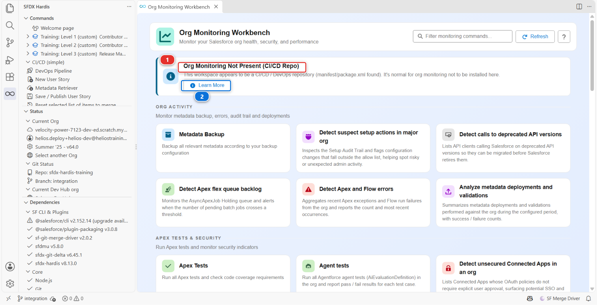
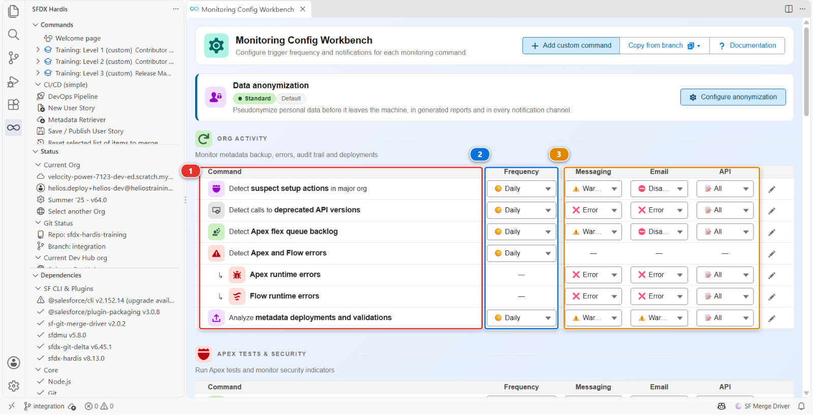
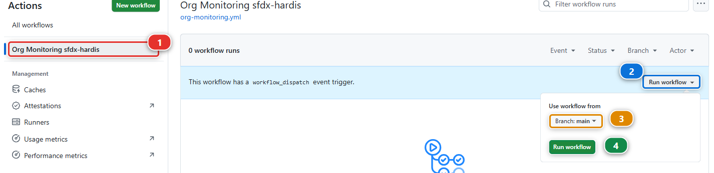
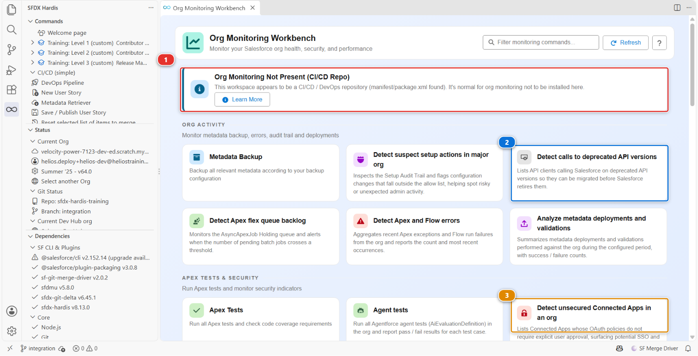

# Lab 3.8 - Monitor your production org

**Level**: 3 Release Manager

**Time**: ~35 min

**You will**: set up nightly monitoring on production, read its first report, and decide what is
worth being told about.

## The situation

You now know what shipped and when. You do not know what state production is in between releases.

On an org Victor ran for two years, that would mean: inactive users still holding licences, a
Connected App nobody remembers authorising, Apex on an API version four years old, a scheduled job
that has been failing every night since March. Nobody is looking, because looking means remembering
to look.

Monitoring is the part of the release manager job that happens when nothing is being released.

## Before you start

- [ ] [Lab 3.7](3-7-hotfix-and-retrofit.md) finished
- [ ] `helios-prod` connected in **Orgs Manager**
- [ ] An empty GitHub repository of your own, with `monitoring` in its name
- [ ] About 20 of those 35 minutes will be the first monitoring run

## Steps

### 1. Create the second repository yourself, first

Monitoring **always** lives in its own repository, separate from the one your pipeline deploys
from. Not usually, not by preference: always. This is the part people get wrong, and it is the part
that is expensive to undo once a year of nightly commits has piled up in the wrong place.

`sf hardis:org:configure:monitoring` does not create that repository for you. It checks the name of
the one it is standing in, and if that name does not contain `monitoring` it asks
**Do you use a separate repository for your monitoring deployment sources?**, with two answers:

- *Yes, I'm sure because I know what I'm doing, like Roman 😊*, which carries on regardless
- *Mmmmm no, let me create another repo with the word "monitoring" in its name !*, which stops the
  command

**Take the second one.** The question exists because the command cannot be certain from a name
alone, not because the two are alternatives. In a repository whose name does contain `monitoring`
the question is never asked at all, which is the state you want to be in before you start.

So, before anything else: create an empty private repository called
`sfdx-hardis-training-monitoring` on GitHub. Then clone it the way [Lab 1.2](../level-1-contributor-basics/1-2-create-your-dev-hub-scratch-orgs-and-pipeline.md) cloned this
one: **File > Open Folder** on an empty folder, **Source Control** panel, **Clone Repository**,
and paste the address from the green **Code** button of your new repository. Nothing in this lab
happens in the repository you have been working in all course.

Why two repositories, and it is the same reason real projects do it:

| Reason                | Detail                                                                                                                         |
|-----------------------|--------------------------------------------------------------------------------------------------------------------------------|
| Different permissions | Monitoring holds credentials for production. Every contributor has access to the source repository, and does not need this one |
| Different rhythm      | Monitoring commits every night. Mixing that history with your source history makes both unreadable                             |
| Different content     | Monitoring stores nightly org backups. It grows, and it should not grow inside the repository people clone every day           |

Your source repository and your monitoring repository are two different things with two different
audiences. If you ever find yourself about to answer yes to that question, the right move is to stop
and create the second repository, however late it feels.

### 2. Run the configuration

From the monitoring repository, open the **Org Monitoring Workbench** from the Welcome page and click
**Install Org Monitoring**.

!!! note "No such button?"
    Then you are in the wrong folder. Open the same panel from the repository you have been working
    in all course and you get this instead:

    

    **Org Monitoring Not Present (CI/CD Repo)** **(1)** is the panel telling you it will not install
    monitoring here, and **Learn More** **(2)** is all it offers. A project that has recorded where
    its monitoring repository lives gets an **Open Monitoring Repository** button beside it. The
    install button only exists where the thing it installs belongs.

It runs in a command panel and asks its questions one at a time, the way [Lab 3.1](3-1-configure-the-pipeline-up-to-production.md) did:

1. **Did you configure the sfdx-hardis monitoring pre-requisites on your Git server ?** The second
   answer, *ℹ️ No, bring me to the documentation!*, opens that page and ends the command, so read it
   first if you have not
2. **Please select or connect to the org that you want to monitor** - `helios-prod`. As in [Lab 3.1](3-1-configure-the-pipeline-up-to-production.md),
   making it the default org restarts the command, so pick it again in the new panel
3. **What is the address of the CI/CD repository that deploys to this org? (optional)** - the
   address of your fork, `https://github.com/<your-handle>/sfdx-hardis-training`. It is the mirror
   of step 8: the monitoring repository records where the pipeline lives, so that a coding agent
   opened in it can search your fork and its workflow runs too
4. **Branch monitoring_... does not exist on the remote server. Do you want to push it?** - yes.
   This one comes before the certificate, not after, and it only appears the first time
5. Then the certificate questions from [Lab 3.1](3-1-configure-the-pipeline-up-to-production.md), unchanged and in the same order: self-signed,
   let sfdx-hardis configure the External Client App, encrypted certificate as a file, then the same
   stop while you store the two secrets, this time in the **monitoring** repository, then the name,
   the contact email and the profile of the app. The profile list is in the language of the org's
   user, as in [Lab 3.1](3-1-configure-the-pipeline-up-to-production.md)
6. **Do you want to save the configuration on the remote server (auto-commit)?** - yes

Last, it writes the workflow on `main` and says so: *The monitoring workflow on main now runs
monitoring_...*. GitHub only schedules the workflows of the default branch, and only offers **Run
workflow** for those, so the workflow that runs every monitored org lives on `main` and lists each
monitoring branch.

It never asks for a repository name to create or for a git provider, because it creates neither: the one address it asks for, your fork, it only records. The authentication is the same code as [Lab 3.1](3-1-configure-the-pipeline-up-to-production.md): External Client App, JWT, two secrets to store,
this time in the **monitoring** repository. The key lands in `./.ssh/` rather than
`config/branches/.jwt/`, and the configuration in a `.sfdx-hardis.yml` at the repository root, on a
branch called `monitoring_` plus the org's domain, cut from `main`. The repository was empty, so it
first gives `main` an empty commit to start from. One branch per monitored org is how one repository
watches several.

### 3. Choose what it watches

Open the **Monitoring Config Workbench** panel. One row per check, and six columns: **Command**
**(1)**, **Frequency** **(2)**, then **Messaging**, **Email** and **API** **(3)**, which are the
severity each channel is sent at, and a last column of per-row actions.

There are around thirty checks, they come from the product rather than from your configuration file,
and they are all on by default at frequencies the product chose: some daily, some weekly, some
monthly. That is the right default and the wrong long-term setting.

For a first run, leave it all on. You are about to find out which of them say something useful about
**this** org, and that is not knowable in advance.

### 4. Run it once by hand

Do not wait for tonight. The workflow, **Org Monitoring sfdx-hardis**, is scheduled at `0 0 * * *`
(midnight UTC) and also accepts a manual run. In the monitoring repository, open **Actions**, click
**Org Monitoring sfdx-hardis** **(1)** in the list on the left, then **Run workflow** **(2)**. Leave
the branch on `main` **(3)** and click the green **Run workflow** **(4)**.

The run appears in the list a few seconds later: click it to follow it.

It takes a while, most of it the org backup. When it finishes, the repository holds a full source
backup of production and a set of reports.

### 5. Read the first report

Open the **Org Monitoring Workbench** panel in VS Code, pointed at the monitoring repository.

Check the banner first **(1)**. **Org Monitoring Not Present (CI/CD Repo)** means you opened the
wrong folder: this panel reads the monitoring repository, not the one you have been working in all
course. Open the monitoring repository and the banner goes.

Under the monitored org, the panel shows the **Deployment repository** you gave the command in
step 2: click it to open your fork in a new VS Code window. Had you left that question empty, the
panel would offer **Set deployment repository** instead. It is optional either way.

Each check is a card, and the two worth opening first are **Detect calls to deprecated API versions**
**(2)** and **Detect unsecured Connected Apps in an org** **(3)**.

Be honest about what you are looking at. `helios-prod` is a Developer Edition org that is a few days
old, with one user in it and an app you deployed yourself. Nothing seeds it with the findings a
two-year-old org has, and a report that comes back nearly clean is not a broken report.

Nearly clean, not clean: the first run is red. The **Monitoring** job fails on **Detect if org
limits are close to be reached**, with one limit at 100%: `ActiveScratchOrgs`, 3 of 3. `helios-prod`
is also your Dev Hub, and your three training scratch orgs use every slot it has. That is a true
finding, the kind a limit check exists for: on a real Dev Hub it means nobody on the team can create
a scratch org until one expires.

And **Detect unsecured Connected Apps** has one too: **Salesforce CLI**, marked *Unsecured*. It is the
app every `sf org login` goes through, yours included, and on a Developer Edition org it is open to
any user who can log in. On a production org that is the first finding to take to the security team:
an admin can restrict it to approved users, and the CLI keeps working for them.

What you are reading for is the **shape** of each finding, so that you recognise it on a real org:

| Finding on a real org           | What it actually means                                                     |
|---------------------------------|----------------------------------------------------------------------------|
| **Inactive users still active** | Licences being paid for, and accounts that can still log in                |
| **An unsecured Connected App**  | Something can reach your production data and nobody remembers approving it |
| **Apex on an old API version**  | It will break at a Salesforce release, on a date you do not control        |

The one finding you should genuinely expect here is in the **backup** rather than in a check: the
validation rule [Lab 3.7](3-7-hotfix-and-retrofit.md) hotfixed is in the org with its new formula, and now it is in the monitoring
repository's git history, dated. That is the answer to "when did that change", and it is the part of
monitoring that pays for itself first.

### 6. Decide what is noise, which is the actual skill

This is the step that decides whether monitoring survives six months.

Go through every finding and put it in one of three buckets:

| Bucket                     | What you do                                                 | Example                                 |
|----------------------------|-------------------------------------------------------------|-----------------------------------------|
| **Act now**                | Fix it this week                                            | The unsecured Connected App             |
| **Track**                  | Put it in the backlog as a story                            | The old API version                     |
| **Silence, with a reason** | Turn it off in the configuration, with a comment saying why | A check that does not apply to this org |

On `helios-prod`, `ActiveScratchOrgs` goes in **Track**: it is real, it is expected for as long as
the course runs, and it expires with the scratch orgs. Silencing the whole limits check for it would
hide every other limit with it, which is exactly the inconvenient kind of silencing.

**Silencing is legitimate.** A monitoring report with forty findings that nobody acts on is worse
than no monitoring, because it teaches the team that the report is noise. A report with four
findings that all matter gets read every morning.

What is not legitimate is silencing something because it is inconvenient. Write the reason in the
configuration file, and the next person can disagree with you knowingly.

### 7. Route one notification

A report nobody opens is not monitoring.

Configure **one** channel: Slack, Teams, Google Chat or email. One is enough, and more than one on
day one means the same message arriving twice and being ignored in both places.

Back in the **Monitoring Config Workbench**, the **Messaging**, **Email** and **API** columns hold
the severity each channel is sent at, per check. Set them so that only failures and critical findings
are sent. A nightly "everything is fine" message is read for a week and filtered forever after.

Those settings are written as `notificationConfig` in the monitoring repository's `.sfdx-hardis.yml`,
one entry per notification type, merged over the product's defaults.

### 8. Make it findable

The next release manager will need the monitoring repository on their first day, and the one place
they will look is the project. Back in the source repository: **DevOps Pipeline** > gear menu >
**Pipeline Settings**, scope **Global Settings**, tab **Salesforce Project**. **Monitoring
repository**: **Edit**, paste the address of your monitoring repository,
`https://github.com/<your-handle>/sfdx-hardis-training-monitoring`, and **Save**. Then **Training:
Level 3** > **Publish my pipeline configuration**: it is pipeline configuration, like the rest.

From then on, the **Org Monitoring Workbench** opened from the source repository offers **Open
Monitoring Repository** instead of a dead end.

Under the hood: what runs every night

The command was:

    sf hardis:org:configure:monitoring

and it copied in the CI files for **every** git provider at once, not only GitHub. The workflow it
generated for GitHub has four jobs:

1. **Backup** runs first, on its own: `sf hardis:org:monitor:backup` retrieves the whole org in
   source format and commits it. The git history of that repository becomes an answer to "what
   changed in production, and when", which nothing else gives you. When the retrieve is done, the
   same command regenerates the project documentation of [Lab 3.9](3-9-generate-the-project-documentation.md) before it finishes
2. Then three jobs in parallel, each waiting only on the backup: `sf hardis:org:test:apex`,
   MegaLinter, and `sf hardis:org:monitor:all`

`monitor:all` is where the checks live. It runs the `sf hardis:org:diagnose:*` commands itself, one
per check, then applies the thresholds and sends the notifications. You will not find them listed in
the workflow.

`monitoringCommands` in the monitoring repository's `.sfdx-hardis.yml` is **not** the list of checks:
the list is built into the product, around thirty of them, and this key only overrides entries by key
or appends new ones. Leaving it empty still runs everything. `monitoringDisable` is the per-check
off switch, by the check's key rather than its label, and setting a check's `frequency` to `off`
takes it out of the run too.
`notificationConfig` decides what is sent where, and at what severity.

The nightly backup is the underrated part. When somebody asks "when did that validation rule
change", the answer is a `git log` on the monitoring repository, and it works even for changes
nobody made through the pipeline.

The backup also writes an `AGENTS.md` at the root of the monitoring branch, and a `CLAUDE.md`
pointing at it. It explains the repository to a coding agent: what each folder holds, what the
backup skips, how to read the history, which checks run. With `deploymentRepository` set, it also
tells the agent how to clone your fork next to it, read-only, find the branch that deploys to
`helios-prod`, and read the workflow runs of both repositories. That is what lets an agent answer
"was this change deployed by the pipeline, or made directly in production?".

If your organisation runs Grafana, the results can feed [ready-made
dashboards](https://sfdx-hardis.cloudity.com/salesforce-monitoring-grafana-v2/). That is out of
scope here, and worth knowing exists.

<!-- command-links:start -->
Command documentation: [hardis:org:configure:monitoring](https://sfdx-hardis.cloudity.com/hardis/org/configure/monitoring/), [hardis:org:monitor:backup](https://sfdx-hardis.cloudity.com/hardis/org/monitor/backup/), [hardis:org:test:apex](https://sfdx-hardis.cloudity.com/hardis/org/test/apex/), [hardis:org:monitor:all](https://sfdx-hardis.cloudity.com/hardis/org/monitor/all/)
<!-- command-links:end -->

## What you should see

- A second repository, created by you, with an **Org Monitoring sfdx-hardis** workflow run: the
  backup, the Apex tests and MegaLinter green, and the Monitoring job red on `ActiveScratchOrgs`
- A full source backup of `helios-prod` committed in it
- A first report you have read and triaged, however short it is
- One notification channel configured
- `monitoringRepository` in `config/.sfdx-hardis.yml` on `integration`, pointing at it
- `deploymentRepository` in the monitoring branch's `.sfdx-hardis.yml`, pointing back at your fork,
  and an `AGENTS.md` at the root of that branch

## If it goes wrong

**The monitoring workflow fails at authentication.**
Same as [Lab 3.1](3-1-configure-the-pipeline-up-to-production.md): the External Client App needs the user pre-authorised, and the secrets have to be in
the **monitoring** repository, not the source one.

**Actions offers no Run workflow for Org Monitoring sfdx-hardis.**
The workflow is not on `main`. The command writes it there at the end, on GitHub, and says so. If it
said it could not, copy `.github/workflows/org-monitoring.yml` from the monitoring branch to `main`
and follow the `MANUAL` comments in it.

**The backup times out.**
A large org takes a long time. On a Developer Edition org it should not, so if it does, look at
which metadata type it is stuck on and exclude it.

**Notifications never arrive.**
The webhook is wrong, or the threshold is above what the report produced. Lower the threshold
temporarily to prove the channel works, then raise it again.

**The report has forty findings.**
Expected on a first run against any real org, and unlikely on a Developer Edition org a few days
old. Step 6 is the lab either way.

**The command refuses to run.**
You told it you are not in a separate monitoring repository, which is the right answer when you are
not. Go back to step 1 and make the monitoring one.

## Check your work

Welcome page > **Training: Level 3** > **Check my work**, then pick **Lab 3.8**.

## Go deeper

- [Org Monitoring](https://sfdx-hardis.cloudity.com/salesforce-monitoring-home/)
- [Monitoring on GitHub](https://sfdx-hardis.cloudity.com/salesforce-monitoring-config-github/)
- [Grafana dashboards](https://sfdx-hardis.cloudity.com/salesforce-monitoring-grafana-v2/)

[Next: Lab 3.9 - Generate the Salesforce project documentation](3-9-generate-the-project-documentation.md){ .md-button .md-button--primary }
