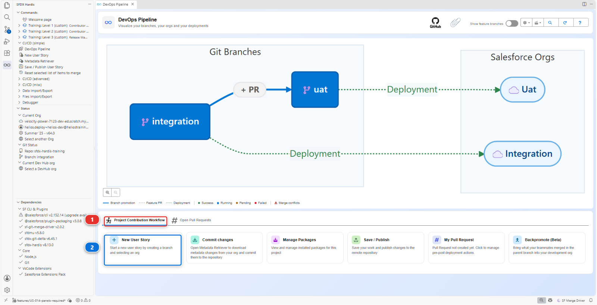
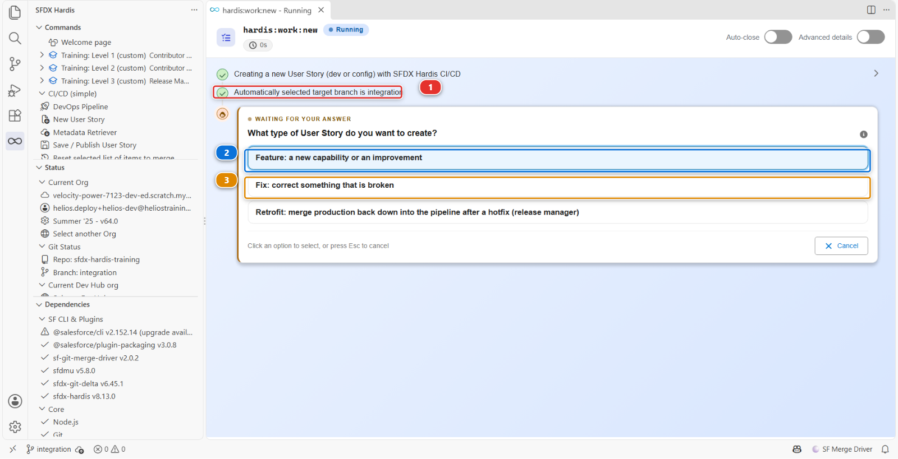
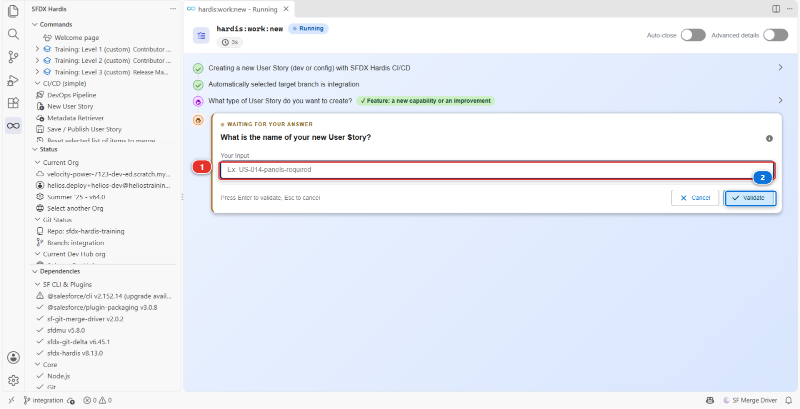
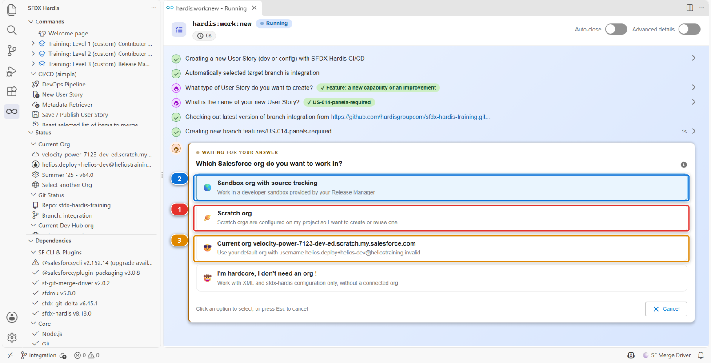
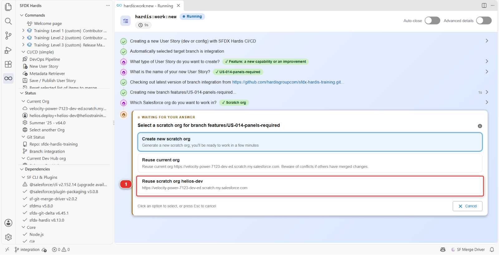
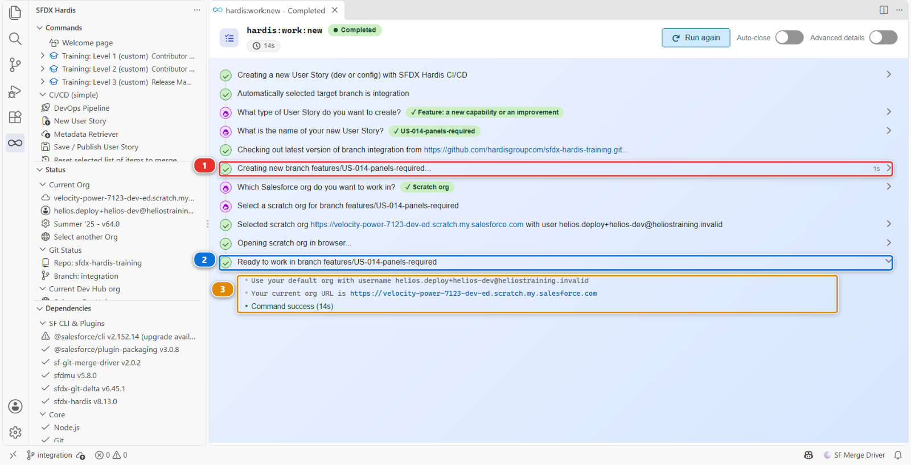

# Lab 1.3 - Démarrer une User Story sur sa propre branche Git

**Niveau** : 1 Contributeur, les bases

**Durée** : ~10 min

**Vous allez** : prendre votre premier ticket et atterrir sur une branche propre, pointée vers votre
org de dev.

## La situation

Le backlog est dans [BACKLOG.md](../../../BACKLOG.md). Votre première story est tout en haut :

> **US-014 - Show the crew how many panels a job needs**
>
> As a delivery crew member, I want to see the number of panels required on the installation
> record, so that I load the right quantity on the van.
>
> Critères d'acceptation :
>
> - Un champ Panels Required existe sur Installation
> - Il est visible pour le permission set de l'équipe de pose
> - Les planificateurs peuvent le renseigner
> - Il apparaît sur la page d'enregistrement Installation

Petite exprès. Ce qui compte dans ce lab n'est pas le champ, c'est la boucle que vous êtes sur le
point d'apprendre et de répéter pendant tout le reste de votre carrière sur ce projet.

!!! info "La branche, en une phrase"
    Une branche est une ligne de travail nommée à l'intérieur du repository. La vôtre démarre comme une
    copie exacte de ce que l'équipe a en ce moment. Vous y changez ce que votre story demande, et la
    version de l'équipe reste telle quelle jusqu'à ce que votre Pull Request y remerge la vôtre :
    c'est ainsi que deux personnes travaillent sur deux stories en même temps sans se marcher
    dessus. L'extension crée la branche, vous bascule dessus et la pousse plus tard, vous ne tapez
    donc jamais une commande Git.

## Avant de commencer

- [ ] [Lab 1.2](1-2-create-your-dev-hub-scratch-orgs-and-pipeline.md) terminé : votre fork (votre copie personnelle du repository du cours sur GitHub, par
      exemple `github.com/my-username/sfdx-hardis-training`) est cloné, et `integration` et `uat`
      nomment leurs orgs
- [ ] `helios-dev` listée comme **Connected** dans **Orgs Manager**

## Les étapes

### 1. Démarrer la User Story

Sur la Welcome page, ouvrez le panneau **DevOps Pipeline** et faites défiler au-delà du diagramme
jusqu'au **Project Contribution Workflow** **(1)**. Cliquez sur la carte **New User Story** **(2)**.



!!! tip "Vous ne voyez pas les cartes ?"
    Elles sont sous le diagramme des branches. Faites défiler vers le bas dans le panneau.

L'extension pose quatre questions, un écran à la fois. Chacune apparaît dans son propre panneau, et
chaque réponse que vous donnez reste visible au-dessus de la question suivante : vous voyez donc
toujours ce que vous lui avez dit. Avant la première, elle vous dit quelque chose au lieu de
demander.

### 2. Où va le travail

La première ligne sous l'en-tête indique **Automatically selected target branch is integration**
**(1)**. Ce n'est pas une question, parce qu'il n'y a rien à choisir : ce projet déclare
`integration` comme seule branche qu'un contributeur a le droit de cibler, dans
`availableTargetBranches`. Le [Lab 3.1](../level-3-release-manager/3-1-configure-the-pipeline-up-to-production.md) ajoute `preprod`, là où démarrent les correctifs urgents, et à
partir de là la commande demande, en proposant les deux. Sous cette ligne, la première vraie question
attend déjà. Deux de ses réponses, **(2)** et **(3)**, sont celles entre lesquelles vous choisissez :
l'étape suivante parle d'elles.



Vous ne devinez jamais où va votre travail : la commande le dit d'abord, l'écrit, et chaque étape
suivante le relit.

### 3. De quel genre de travail il s'agit

**What type of User Story do you want to create?** Prenez **Feature: a new capability or an
improvement** **(2)** : US-014 ajoute quelque chose qui n'était pas là. **Fix: correct something that
is broken** **(3)** sert à corriger quelque chose de déjà livré. Les deux réponses sont formulées par
ce projet, dans `branchPrefixChoices`.

La troisième réponse, **Retrofit**, est celle du release manager. Elle fait redescendre un hotfix de
production dans la pipeline, et le [Lab 3.7](../level-3-release-manager/3-7-hotfix-and-retrofit.md)
est l'endroit où elle sert. Ici, n'y touchez pas.

La réponse devient la première partie du nom de votre branche, `features/` ou `fix/`, pour que
quiconque regarde la liste des branches voie d'un coup d'œil quel genre de travail est en cours.

### 4. Comment l'appeler

**What is the name of your new User Story?** Tapez-le dans la zone **(1)** et cliquez sur
**Validate** **(2)** :

```
US-014-panels-required
```



L'exemple grisé à l'intérieur de la zone n'est pas de la décoration : ce projet déclare un motif
auquel les noms doivent correspondre, et l'exemple est un nom qui y correspond. Tapez autre chose,
`Panels Required` par exemple, et la commande vous dit ce qu'elle attendait et redemande.

### 5. L'org dans laquelle vous allez construire

**Which Salesforce org do you want to work in?** Prenez **Scratch org** **(1)** : `helios-dev` en est
une, créée au [Lab 1.2](1-2-create-your-dev-hub-scratch-orgs-and-pipeline.md).



Les autres réponses sont pour d'autres projets. **Sandbox org with source tracking** **(2)** est ce
qu'utilisent la plupart des équipes, une sandbox de développeur distribuée par le release manager.
Le source tracking veut dire que l'org tient à jour une note de ce qui y a changé depuis votre
dernière synchronisation, ce qui vous évite de chercher. **Current org** **(3)** désigne l'org vers
laquelle votre projet pointe, par son adresse : c'est `helios-dev` aujourd'hui, mais une adresse ne
vous dit rien, ne comptez donc pas dessus. La dernière réponse sert à éditer directement les fichiers
du projet, sans org du tout.

Puis la liste des orgs qu'elle pourrait attacher. Prenez **Reuse scratch org helios-dev** **(1)**.



C'est l'org que le [Lab 1.2](1-2-create-your-dev-hub-scratch-orgs-and-pipeline.md) a remplie avec l'application Helios, et celle que vous allez modifier à la
main dans Setup. La liste ne propose ni `helios-integration` ni `helios-uat` : la commande sait que
ces deux-là appartiennent à des branches majeures, et construire directement dans une org partagée
est exactement ce que toute cette façon de travailler existe pour empêcher.

La réponse du milieu, **Reuse current org**, atterrirait sur la même org ici, par son adresse plutôt
que par son nom. Prenez celle qui est nommée : une adresse ne vous dit rien sur l'org dont il s'agit.

!!! danger "Ne prenez jamais Create new scratch org ici"
    C'est la première réponse, et sur un vrai projet c'est souvent la bonne. Ici, elle demanderait
    une quatrième scratch org à votre Dev Hub, et un Dev Hub Developer Edition n'en garde que trois
    vivantes : la commande échoue après une longue attente, sans rien à montrer.

### 6. Lire ce qu'elle vous dit à la fin

La commande ouvre `helios-dev` dans votre navigateur : vous pouvez laisser cet onglet pour le
[Lab 1.4](1-4-build-a-custom-field-in-your-org.md). Puis elle se termine et affiche ce qu'elle a fait. Lisez-le plutôt que de le fermer.



- la branche qu'elle a créée et sur laquelle elle vous a basculé **(1)**
- la confirmation que vous êtes prêt à travailler dessus **(2)**
- l'org qu'elle a attachée à cette User Story, par nom d'utilisateur et par URL **(3)**

Ces trois lignes méritent un coup d'œil à chaque fois. Un nom de branche qui n'est pas celui que vous
attendiez, ou une org qui n'est pas celle que vous vouliez, c'est un problème qui coûte trente
secondes maintenant et un après-midi plus tard.

<details markdown="1"><summary>Sous le capot : ce que "New User Story" vient de faire</summary>

Le panneau a lancé :

    sf hardis:work:new

qui a fait six choses, dans cet ordre :

1. **Choisi la branche cible.** Avec une seule entrée dans `availableTargetBranches` elle prend
   celle-là sans demander ; avec plusieurs elle demande, et elle retient la réponse pour cette
   branche
2. **Récupéré et mis à jour la branche cible.** `git fetch`, puis `git checkout integration` et
   `git pull`, pour que votre branche parte de ce que l'équipe a maintenant plutôt que de ce que vous
   aviez la semaine dernière. C'est l'étape que les gens sautent à la main et regrettent une semaine
   plus tard
3. **Créé la branche**, nommée d'après vos réponses :
   `git checkout -b features/US-014-panels-required`
4. **Écrit votre configuration utilisateur** dans `config/user/.sfdx-hardis.<votre-utilisateur>.yml`,
   en y notant l'org de cette User Story. Ce fichier est ignoré par git : il est à vous, personne
   d'autre n'en a besoin
5. **Sélectionné l'org** comme cible par défaut des commandes suivantes
6. **Ouvert l'org** dans votre navigateur, puisque vous êtes sur le point d'y travailler

La liste des scratch orgs est celle des orgs créées par votre Dev Hub par défaut, que le [Lab 1.2](1-2-create-your-dev-hub-scratch-orgs-and-pipeline.md) a
réglé sur `helios-prod`, moins celles nommées dans `config/branches/`. Rien ici n'amène ce qui est
sur `integration` dans votre org : cela s'appelle un backpromote, et le Niveau 2 commence par là.

Le préfixe de branche `features/` et le motif de nom viennent de `config/.sfdx-hardis.yml` :

    branchPrefixChoices:
      - value: features
        title: "Feature: a new capability or an improvement"
      - value: fix
        title: "Fix: correct something that is broken"
    newTaskNameRegex: '^US-\d{3}-[a-z0-9-]+$'

Changez ces deux réglages et chaque contributeur reçoit des questions différentes. C'est ainsi qu'un
projet impose une convention sans que personne ait à s'en souvenir.

<!-- command-links:start -->
Documentation de la commande : [hardis:work:new](https://sfdx-hardis.cloudity.com/hardis/work/new/)
<!-- command-links:end -->

</details>

## Ce que vous devez voir

Trois choses, toutes visibles sans quitter VS Code :

1. **En bas à gauche de la barre d'état** : la branche est maintenant
   `features/US-014-panels-required`
2. **Le panneau sfdx-hardis, section Status** : *Current Org* nomme la scratch org que vous avez
   choisie. Il affiche le nom propre de l'org, celui que Salesforce a inventé, et non l'alias
   `helios-dev` : vérifiez donc le nom d'utilisateur plutôt que de chercher l'alias que vous
   connaissez
3. **Le panneau DevOps Pipeline** : `integration` et `uat`, inchangés. **Votre nouvelle branche
   n'y est pas, et c'est normal.** Le diagramme dessine les branches majeures et les Pull Requests
   ouvertes vers elles, et votre branche n'a encore ni Pull Request ni org à elle. Elle apparaîtra
   au [Lab 1.6](1-6-pull-request-deployment-check-and-merge.md), au moment où vous ouvrirez la
   Pull Request

Si les deux premières se contredisent, arrêtez-vous et corrigez-le maintenant plutôt qu'après avoir
construit quelque chose.

## En cas de problème

**La commande refuse le nom.**
Le motif qu'utilise ce projet est `US-014-panels-required` : trois chiffres, puis des mots en
minuscules séparés par des tirets. `US14-PanelsRequired` est rejeté exprès.

**Un fichier que vous éditiez a disparu.**
Vous avez modifié quelque chose avant de démarrer, et `hardis:work:new` n'emporte jamais du travail
qui traîne sur une branche neuve : il le met de côté dans un *stash*, et le dit dans son panneau, en
nommant les fichiers. Pour les récupérer sur la nouvelle branche : panneau **Source Control**, le
menu **...** en haut, **Stash**, puis **Pop Latest Stash**.

**La liste des orgs n'affiche pas `helios-dev`.**
La scratch org a expiré : elles vivent 30 jours. Recliquez sur **Training: Level 1 > Set up my
training environment**. Il crée une nouvelle `helios-dev` avec l'application Helios, et laisse tout
le reste en l'état.

**Elle échoue avec un message sur la limite de scratch orgs.**
Vous avez pris **Create new scratch org**. Rien n'a été créé et rien n'est cassé : redémarrez la User
Story et prenez **Reuse scratch org helios-dev**.

## Vérifiez votre travail

Welcome page > **Training: Level 1** > **Check my work**, puis choisissez le **Lab 1.3**.

Il cherche votre branche de story, `features/US-014-...`, la seule chose que ce lab laisse derrière
lui. Votre travail n'a pas encore atteint `integration`, et rien ici ne s'y attend : c'est le
[Lab 1.6](1-6-pull-request-deployment-check-and-merge.md).

!!! tip "Dans Agentforce Vibes, si le panneau dit que le contenu est bloqué"
    Un IDE dans le navigateur perd parfois le cadre dans lequel tourne un panneau, et affiche *the
    content is blocked* à la place de la commande. Rien ne cloche dans votre travail : rechargez
    l'onglet du navigateur et recliquez sur **Check my work**. Cela arrive à n'importe quel
    panneau, pas seulement à celui-ci.

## Pour aller plus loin

- [Démarrer une User Story](https://sfdx-hardis.cloudity.com/salesforce-devops-create-new-user-story/)
- [La boucle du contributeur en une page](https://sfdx-hardis.cloudity.com/salesforce-devops-use-home/)

[Suite : Lab 1.4 - Construire un champ personnalisé dans votre org Salesforce](1-4-build-a-custom-field-in-your-org.md){ .md-button .md-button--primary }
