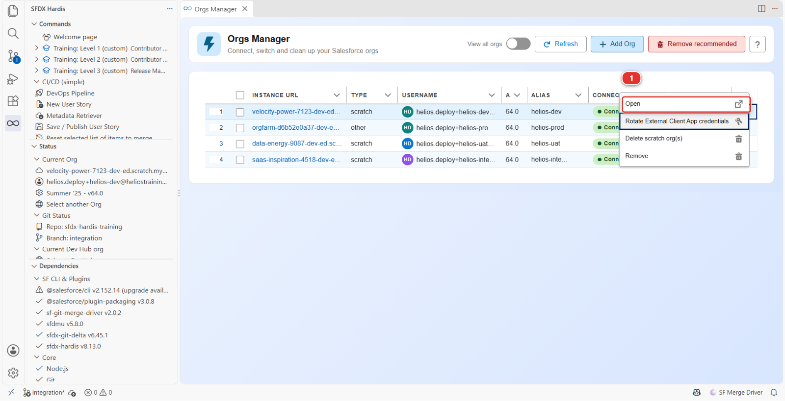

# Lab 1.4 - Construire un champ personnalisé dans votre org Salesforce

**Niveau** : 1 Contributeur, les bases

**Durée** : ~15 min

**Vous allez** : construire US-014 comme un admin construit n'importe quoi, en cliquant dans
Salesforce Setup, et le vérifier sur de vrais enregistrements.

## La situation

Vous avez une branche et une org. Passez maintenant au vrai travail. Rien dans ce lab n'est propre au
CI/CD : c'est de la configuration Salesforce ordinaire. La seule règle est **où** vous le faites :
dans `helios-dev`, votre propre org, jamais dans l'org partagée.

## Avant de commencer

- [ ] [Lab 1.3](1-3-start-a-user-story-on-a-git-branch.md) terminé : vous êtes sur `features/US-014-panels-required`
- [ ] La section Status du panneau sfdx-hardis affiche `helios-dev` comme org courante

## Les étapes

### 1. Ouvrir votre org

Dans **Orgs Manager**, trouvez la ligne dont la colonne **ALIAS** dit `helios-dev`. Lisez l'alias,
pas l'adresse : aucune des adresses ne dit à quoi sert l'org. L'org Developer Edition a une chaîne
`orgfarm-` inventée par Salesforce, et les scratch orgs ont deux mots au hasard et un nombre : vos
quatre orgs se ressemblent donc partout sauf dans cette colonne.

Au bout de cette ligne, cliquez sur le chevron. Il ouvre tout ce que vous pouvez faire sur cette org,
et la première entrée est **Open** **(1)**.

Votre navigateur ouvre l'org, déjà connecté. Pas de mot de passe, pas de page de connexion :
l'extension a utilisé l'identifiant qu'elle a rangé quand vous avez connecté l'org au [Lab 1.2](1-2-create-your-dev-hub-scratch-orgs-and-pipeline.md).

Ouvrir l'org depuis ce panneau plutôt que depuis un favori est une habitude à prendre. C'est la
différence entre "l'org que je voulais" et "l'org qui se trouvait ouverte dans cet onglet".

### 2. Créer le champ

Dans Salesforce : **Setup > Object Manager > Installation**, puis **Fields & Relationships** **(1)**
dans la colonne de gauche, puis **New** **(2)**.

La liste que vous voyez est l'objet avant votre modification. `Panels Required` est ce que vous êtes
sur le point d'y ajouter.

| Paramètre      | Valeur                                                        |
|----------------|---------------------------------------------------------------|
| Data Type      | **Number**                                                    |
| Field Label    | `Panels Required`                                             |
| Length         | 4                                                             |
| Decimal Places | 0                                                             |
| Field Name     | `Panels_Required` (Salesforce le remplit depuis le label)     |
| Description    | `How many panels the crew has to load for this installation.` |
| Help Text      | `Ask the planner if this is empty.`                           |
| Required       | **non**                                                       |

La case **Field Name** est ce que Salesforce appelle le nom d'API, et il la remplit depuis le label
au fur et à mesure que vous tapez. Elle affiche `Panels_Required`, sans le `__c` : Salesforce
ajoute ce suffixe à chaque champ personnalisé au moment de l'enregistrement, et la suite de ce
cours, fichiers de métadonnées compris, appelle le champ `Panels_Required__c`.

L'écran de sécurité au niveau des champs arrive avec **Visible** déjà coché pour presque tous les
profils. Décochez-les : la case dans l'en-tête de la colonne **Visible** bascule toute la colonne,
donc cliquez une fois pour tout cocher et une seconde fois pour ne rien laisser coché. Cliquez
ensuite sur **Next**. Vous allez accorder ce champ par un permission set, pas par un profil, et le [Lab 2.6](../level-2-contributor-advanced/2-6-permission-sets-and-profiles.md)
explique pourquoi cette distinction compte plus qu'il n'y paraît.

Sur l'écran de présentation de page, **Installation Layout** est déjà coché, et c'est ce qui met le
champ sur l'enregistrement. Laissez-le tel quel.

Cliquez sur **Save**.

!!! tip "Remplissez Description et Help Text"
    Deux secondes maintenant, et la documentation de projet générée au Lab 3.9 se lit comme quelque
    chose écrit par un être humain. Les descriptions vides sont la raison la plus fréquente pour
    laquelle cette documentation ne sert à rien.

### 3. L'accorder à l'équipe de pose, et aux planificateurs

Les critères d'acceptation disent que l'équipe de pose doit le voir, et que les planificateurs
doivent pouvoir le renseigner. Personne ne l'a encore, pas même vous : vous n'avez rien accordé, et
un champ qu'aucune permission n'accorde est invisible pour tout le monde, y compris l'administrateur
qui l'a créé.

**Setup > Permission Sets > Helios Delivery Crew**, puis **Object Settings** **(1)** et
**Installations**, puis **Edit**.

**Field Permissions** est le tableau qui compte, une ligne par champ, et **Read Access** **(2)** est
la colonne pour laquelle vous êtes là. Cette image a été prise avant que le champ existe,
`Panels Required` n'y est donc pas encore : après votre modification il apparaît dans cette liste,
par ordre alphabétique.

Trouvez `Panels Required` et cochez **Read Access**. Laissez **Edit Access** décoché : un membre de
l'équipe de pose lit combien de panneaux charger, il ne décide pas du nombre.

**Save**.

Puis les mêmes écrans sur **Helios Delivery Manager**, le permission set des planificateurs. C'est
aussi celui que **Set up my training environment** vous a donné, et c'est ce qui vous permet de voir
l'application Helios tout court. Cochez à la fois **Read Access** et **Edit Access** sur
`Panels Required` : les planificateurs sont ceux qui décident du nombre. **Save**.

Sautez cette étape et l'étape 4 ne vous montre rien : vous chercheriez un champ que votre propre
permission set n'accorde pas.

### 4. Le mettre là où les gens regarderont

Le champ est sur la présentation de page, celle qu'utilisent les pages Salesforce à l'ancienne. La
page d'enregistrement Installation est une page Lightning, et la colonne de champs à sa gauche est
cette présentation de page : vous avez donc déjà fini.

Ouvrez n'importe quelle installation (**App Launcher > Helios Delivery > Installations**, prenez
`INST-00001`) et regardez le bas de cette colonne. `Panels Required` est là, vide, avec à côté de
son nom le petit **i** du texte d'aide que vous avez écrit.

### 5. Le tester sur de vraies données

Un champ vide ne prouve rien. Mettez-y un nombre.

L'onglet **Installations** **(1)** est la façon de revenir à cette liste depuis n'importe où dans
l'application. À droite de l'enregistrement se trouve le **Panel delivery timeline** **(2)**, qui
liste les palettes réservées pour cette installation avec leurs quantités. L'image a été prise avant
que cette story existe, sur une installation sans palette réservée : il n'y a donc pas non plus de
Panels Required dans sa colonne. La plupart des installations ont deux ou trois palettes.

1. Sur `INST-00001`, cliquez sur le crayon à droite de **Panels Required**, tapez le nombre auquel
   la timeline aboutit, et cliquez sur **Save** en bas de la page. Cette page n'a pas de bouton
   **Edit** : chaque champ se modifie sur place, avec son propre crayon
2. Regardez les deux nombres côte à côte. Sur une vraie story, vous demanderiez au planificateur si
   ce champ doit être saisi ou calculé à partir des palettes. Ici, la saisie est ce que demande la
   story, et cette question est exactement celle qu'un bon contributeur pose avant de construire quoi
   que ce soit

Faites de même sur deux autres installations, pour avoir quelque chose à regarder après le
déploiement.

## Ce que vous devez voir

Sur trois installations : une valeur `Panels Required`, visible dans la colonne de champs,
enregistrée sans erreur.

Et dans VS Code, **rien du tout**. Le repository ne sait encore rien de tout cela. Vos modifications
vivent dans une org et nulle part ailleurs, et c'est exactement l'état auquel le [Lab
1.5](1-5-retrieve-commit-and-publish-your-changes.md) existe pour mettre fin.

## En cas de problème

**Object Manager ne liste pas Installation.**
Vous êtes dans la mauvaise org. Vérifiez la section Status dans VS Code, puis rouvrez l'org depuis
**Orgs Manager**.

**Vous cliquez sur Open et aucun onglet de navigateur n'apparaît.**
Les anciennes versions de l'extension pouvaient échouer à ouvrir l'org sans dire pourquoi. Mettez
l'extension à jour, c'est à cela que sert **Auto Update** dans le
[Lab 1.1](1-1-install-vs-code-and-sfdx-hardis.md), et cliquez de nouveau sur **Open**. En attendant,
il existe une seconde entrée : dans la section **Status** du panneau sfdx-hardis, sous **Current
Org**, cliquez sur la première ligne, l'adresse de l'org. Elle ouvre votre org par défaut, qui est
`helios-dev` ici.

**Orgs Manager affiche vos scratch orgs comme déconnectées, et propose Reconnect au lieu d'Open.**
Les anciennes versions de l'extension ne lisaient que la sonde de connexion, qu'une scratch org ne
porte jamais : c'est son Dev Hub qui répond pour elle. Mettez l'extension à jour, ce à quoi sert
**Auto Update** au [Lab 1.1](1-1-install-vs-code-and-sfdx-hardis.md), puis cliquez sur **Refresh**
dans le panneau. Les orgs vont bien dans les deux cas, et **Reconnect** vous aurait reconnecté pour
rien.

**Le champ n'apparaît pas sur la page d'enregistrement.**
Vous avez sauté l'étape de présentation de page. **Setup > Object Manager > Installation > Page
Layouts > Installation Layout**, glissez `Panels Required` dans la section Information, **Save**.

**L'enregistrement échoue avec une erreur de règle de validation.**
L'org Helios a une règle qui refuse de déplacer une date d'installation dans le passé. Si vous avez
modifié la date par accident, remettez-la à une date future.

**Le permission set n'a pas d'Object Settings pour Installation.**
Un permission set ne liste un objet qu'à partir du moment où quelque chose y est accordé. Servez-vous
plutôt de **Field Permissions** en haut de la page : choisissez-y `Installation`, et l'objet apparaît
avec ses champs.

## Vérifiez votre travail

Welcome page > **Training: Level 1** > **Check my work**, puis choisissez le **Lab 1.4**.

Rien de votre travail n'a encore quitté l'org, le contrôle lit donc l'org elle-même : il demande à
`helios-dev` si `Panels_Required__c` existe sur Installation et si `Helios_Delivery_Crew` peut le
lire. Le repository apprend l'existence du champ au lab suivant.

## Pour aller plus loin

- [Travailler dans votre org](https://sfdx-hardis.cloudity.com/salesforce-devops-work-on-user-story/)
- [Règles de configuration](https://sfdx-hardis.cloudity.com/salesforce-devops-work-on-user-story-configuration/)

[Suite : Lab 1.5 - Récupérer, commiter et publier vos modifications Salesforce](1-5-retrieve-commit-and-publish-your-changes.md){ .md-button .md-button--primary }
