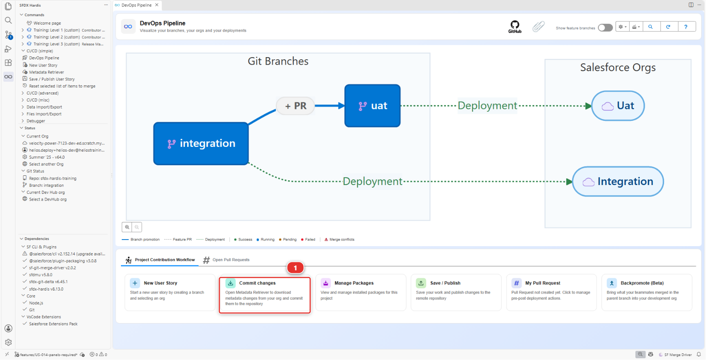
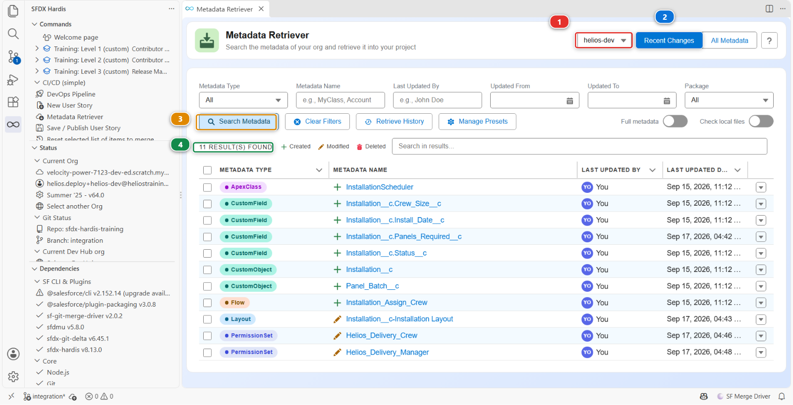
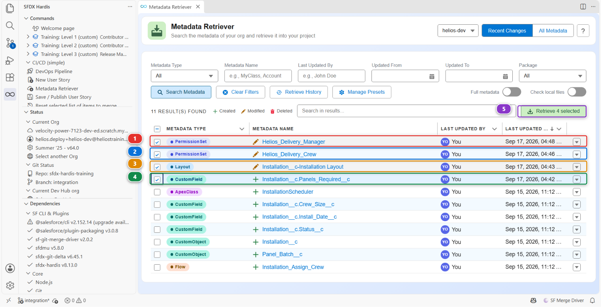
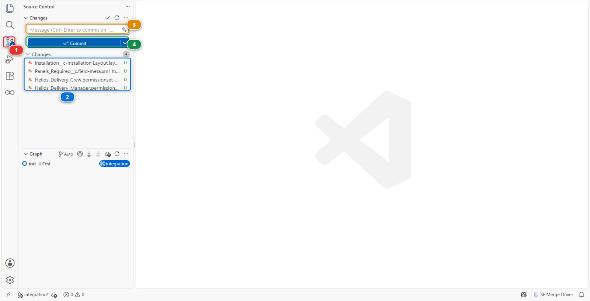
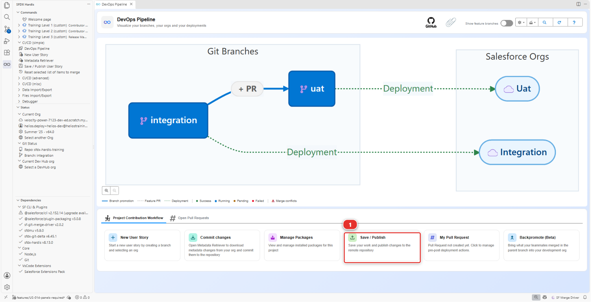
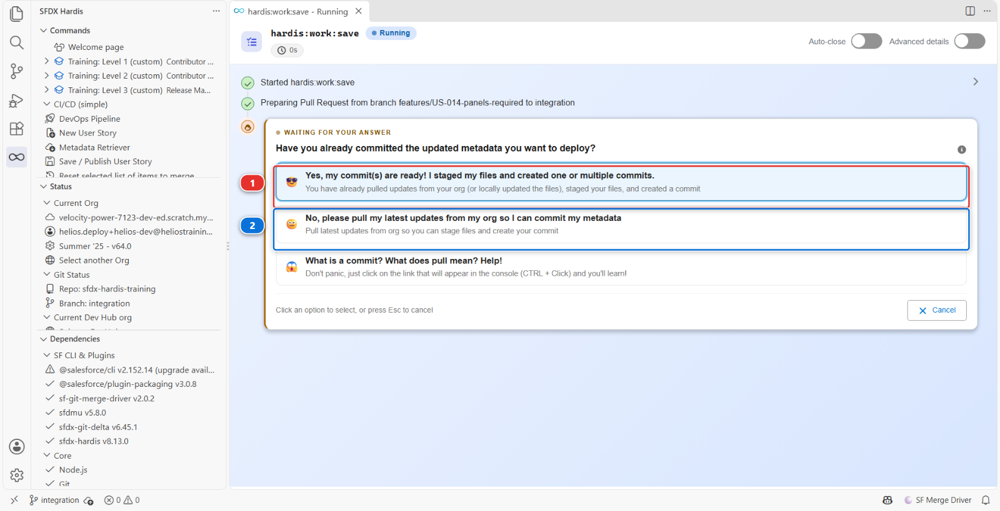
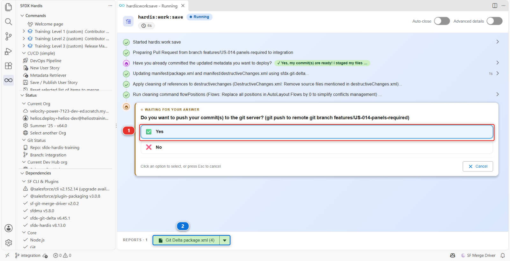
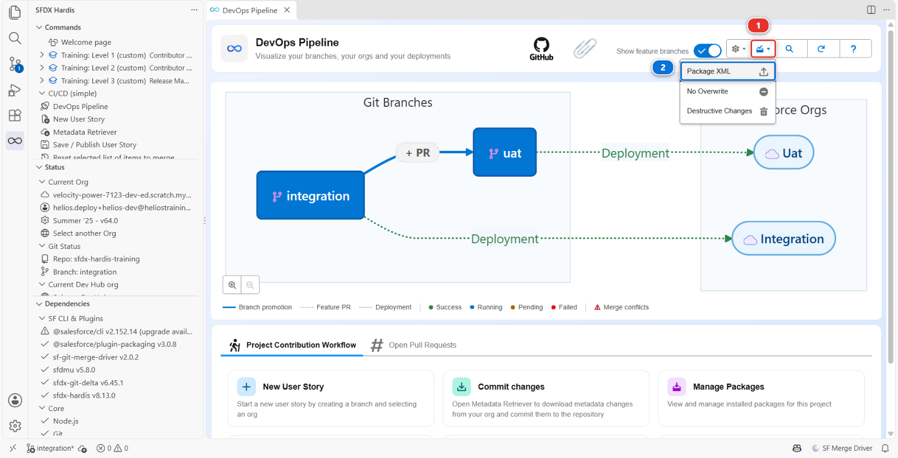
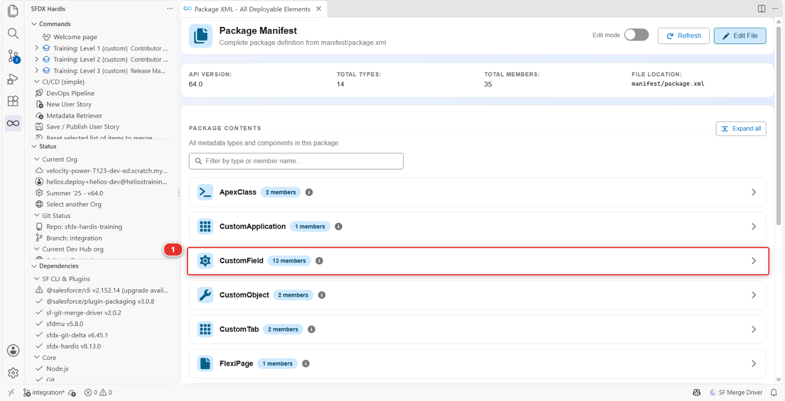

# Lab 1.5 - Récupérer, commiter et publier vos modifications Salesforce

**Niveau** : 1 Contributeur, les bases

**Durée** : ~20 min

**Vous allez** : rapatrier vos modifications d'org dans le repository, décider lesquelles appartiennent
à votre story, et pousser une branche prête à être relue.

## La situation

Votre champ existe dans une seule org. Si votre portable rendait l'âme ce soir, la story aussi.
Publier, c'est ce qui transforme "ça marche dans mon org" en "l'équipe l'a".

C'est l'étape où se concentre l'essentiel de la réflexion dans un projet CI/CD, et celle que les gens
expédient. Allez lentement cette fois-ci, et chaque story suivante prendra cinq minutes.

## Avant de commencer

- [ ] [Lab 1.4](1-4-build-a-custom-field-in-your-org.md) terminé : le champ existe dans `helios-dev`, accordé à l'équipe de pose, sur la
      présentation de page
- [ ] Vous êtes toujours sur `features/US-014-panels-required`

## Les étapes

### 1. Sortir vos modifications de l'org

Votre champ est dans Salesforce. Rien de lui n'est encore sur votre machine, et git voit uniquement
ce qui est sur votre machine.

Dans le panneau **DevOps Pipeline**, sous **Project Contribution Workflow**, cliquez sur la carte
**Commit changes** **(1)**.



Elle ouvre le **Metadata Retriever**, par lequel commence chaque publication.

### 2. Demander à l'org ce qui a changé

Vérifiez que l'org **(1)** indique `helios-dev`, celle dans laquelle vous avez construit.
**Recent Changes** **(2)** est déjà sélectionné : il demande à Salesforce ce qui a été modifié
récemment plutôt que de lister les dizaines de milliers de composants que contient une org. Cliquez
sur **Search Metadata** **(3)**.



Le nombre de résultats est en **(4)** : quelques dizaines sur votre org, moins sur l'image. Chaque
ligne dit ce qu'elle est, son nom, qui l'a touchée en dernier et quand. Toutes portent votre nom, et
la plupart ne sont pas votre story.

!!! info "Pourquoi la liste est plus longue que votre story"
    Une scratch org se souvient de chaque composant qui y est arrivé, quelle qu'en soit la voie. Au
    Lab 1.2, **Set up my training environment** a déployé toute l'application Helios dans
    `helios-dev` sous votre utilisateur : chaque objet, champ et permission set de l'application est
    donc dans cette liste, daté du Lab 1.2. Vos quatre modifications sont celles datées d'il y a
    quelques minutes.

    Cliquez sur l'en-tête de colonne **Last Updated Date**, deux fois si besoin, pour que les plus
    récentes soient en premier. Sur une org d'équipe, les lignes plus anciennes seraient vos
    collègues et Salesforce déplaçant des choses tout seul. Dans les deux cas, c'est exactement
    pourquoi l'étape suivante est une décision et non un bouton.

### 3. Prendre les vôtres, laisser le reste

Triez par **Last Updated Date**, du plus récent au plus ancien, et retrouvez vos quatre.
Cochez-les, et elles seules, par leur nom plutôt que par leur position : Salesforce modifie
des composants de son côté, et l'un d'eux qui se glisse entre les vôtres est exactement ce
dont cette étape parle :

1. **PermissionSet** `Helios_Delivery_Manager` **(1)** - l'accès en écriture des planificateurs
2. **PermissionSet** `Helios_Delivery_Crew` **(2)** - l'accès en lecture de l'équipe de pose
3. **Layout** `Installation__c-Installation Layout` **(3)** - le placement, modifié quand vous avez
   coché la présentation de page dans l'assistant de champ
4. **CustomField** `Installation__c.Panels_Required__c` **(4)** - le champ

Puis cliquez sur **Retrieve 4 selected** **(5)**.



Deux règles prennent cette décision à votre place, et elles sont tout ce lab :

- **Si vous n'avez pas voulu le modifier, il n'a rien à faire dans votre story.** Le commiter rend
  votre Pull Request parlante d'autre chose que US-014, et le relecteur ne peut plus dire quelle
  partie est la vôtre
- **Dans le doute, laissez-le de côté.** Rien n'est perdu. C'est toujours dans votre org, et vous
  pourrez le publier dans une story ultérieure une fois que vous saurez ce que c'est

Le retriever écrit ces quatre composants dans `force-app/` sous forme de fichiers. Il ne change rien
dans Salesforce et rien sur votre branche pour l'instant.

!!! note "S'il dit que la récupération a échoué à cause de conflits de sources"
    **Failed to retrieve metadata due to source conflicts** veut dire que les fichiers de votre
    machine et les composants de l'org ont changé tous les deux depuis leur dernier accord. Ici ce
    n'est pas un conflit, c'est le but : vous avez modifié l'org exprès, et c'est l'org qui a
    raison. Prenez l'option qui écrase les fichiers locaux et relancez la récupération. Cela
    compte sur un vrai projet, où quelqu'un d'autre a pu écrire ces fichiers ; pas ici, où rien
    d'autre que votre propre org n'y a touché.

### 4. Commiter ce que vous avez rapatrié

Ouvrez le panneau **Source Control** **(1)** : dans la barre de gauche, l'icône dessinée comme trois
petits cercles reliés par des traits, à la manière d'une branche. Les quatre fichiers écrits par la
récupération y attendent **(2)**.



!!! tip "Lisez la liste en arborescence"
    Par défaut le panneau affiche les chemins complets, et un chemin Salesforce est assez long pour
    être illisible. Le menu **...** à droite de l'en-tête **Changes** propose **View as Tree** :
    les mêmes fichiers, repliés dans les dossiers où ils vivent. Réglez-le une fois et VS Code s'en
    souvient.

Cliquez sur chacun. VS Code ouvre le *diff* du fichier, l'avant et l'après côte à côte, avec les
lignes ajoutées en vert et les lignes supprimées en rouge. Lire les quatre prend une minute, et c'est
le dernier moment où une erreur est gratuite.

Puis mettez-les dans le commit **un par un**. Pointez un fichier : une rangée de petites icônes
apparaît à droite de son nom. Le **+** est **Stage Changes**, et il déplace ce fichier-là dans un
groupe appelé **Staged Changes** juste au-dessus. Faites-le pour chacun des quatre, et lisez le nom
au moment où vous cliquez.

!!! danger "N'utilisez jamais Stage All Changes"
    Le **+** sur l'en-tête du groupe **Changes** stage tout ce que le panneau voit, y compris des
    fichiers que vous n'avez jamais regardés : un log qui traîne, quelque chose qu'un installeur a
    laissé, un fichier écrit par une autre commande pendant que vous travailliez. Le panneau
    ci-dessus n'affiche que vos quatre fichiers, et les vôtres ne seront pas toujours aussi rangés.

    Le staging est le seul moment où vous décidez de ce que contient votre story. Le faire fichier
    par fichier prend dix secondes et c'est la différence entre une Pull Request qu'un relecteur peut
    lire et une qu'il faut démêler. Sur un vrai projet, c'est l'habitude que les gens remarquent.

Les quatre fichiers stagés, tapez un message **(3)** et cliquez sur **Commit** **(4)**. Le bouton
commite ce qui est stagé et laisse tout le reste tranquille.

Écrivez le message pour la personne qui relira demain, pas pour vous aujourd'hui. Première ligne
courte, puis une ligne vide, puis le pourquoi :

> US-014 Panels Required on Installation
>
> Adds Panels_Required__c on Installation__c so the crew knows how many panels to load.
> Read access for the crew on Helios_Delivery_Crew, edit access for planners on
> Helios_Delivery_Manager, field added to the Installation layout.

Ce texte suit votre branche partout : c'est ce que le relecteur voit dans la Pull Request, et c'est
ce que trouvera quiconque lira l'historique de ce projet dans deux ans.

!!! tip "Que faire du fichier que vous n'avez pas demandé"
    Laissez-le hors du staging et il reste hors de votre commit, ce qui suffit pour l'instant. Si
    vous savez ce que c'est et que vous savez que c'est sans intérêt, faites un clic droit dessus et
    **Discard Changes**. Si vous ne savez pas ce que c'est, laissez-le tranquille et demandez : un
    fichier que vous ne savez pas expliquer est un fichier qui n'a rien à faire dans votre story, et
    le supprimer à l'aveugle ne vaut pas mieux que le commiter à l'aveugle.

Votre travail est maintenant dans le repository, sur votre branche, sur votre machine. Il reste à le
préparer pour l'équipe, et c'est ce que fait Save / Publish.

### 5. Le publier

Dans le panneau **DevOps Pipeline**, cliquez sur la carte **Save / Publish** **(1)**.



La première question est celle qui piège tout le monde.



Répondez **(1)**, *Yes, my commit(s) are ready!*, parce qu'ils le sont : vous avez récupéré et
commité aux étapes ci-dessus. **(2)** demande à la commande de tirer l'org à votre place, et la
troisième réponse explique ce qu'est un commit, ce qui ne coûte rien à lire.

!!! tip "Commitez d'abord, à chaque fois"
    **(2)** existe pour le jour où vous avez oublié de récupérer et de commiter. Ce cours n'en a
    jamais besoin, parce que l'habitude qu'il enseigne est celle du dessus : récupérer avec le
    Metadata Retriever, lire le diff, stager fichier par fichier, commiter. Gardez cette habitude et
    la réponse est toujours **(1)**.

### 6. Lire le package avant de pousser

La commande marque une pause avant de pousser et vous demande de confirmer **(1)**. Profitez de la
pause : c'est le dernier coup d'œil que vous aurez sur votre story avant qu'elle quitte votre
machine.

Cliquez sur le rapport **Git Delta package.xml** en bas du panneau de la commande **(2)**. C'est la
liste de ce que vos commits ont changé par rapport à `integration`, calculée à partir de git, et le
nombre sur le bouton est le nombre de composants qu'elle contient : **4**.



Vous cherchez un bloc par type de chose que vous avez modifiée, chacun nommant ce qu'il contient. Vos
quatre doivent toutes y être : le champ `Installation__c.Panels_Required__c`, la présentation de page
`Installation__c-Installation Layout`, et les permission sets `Helios_Delivery_Crew` et
`Helios_Delivery_Manager`.

**Cette liste est votre story, telle que la pipeline la voit.** Si un composant que vous attendiez
manque ici, git ne sait pas que vous l'avez modifié, et il manquera aussi en intégration : le
déploiement échouera, ou pire, réussira en ne faisant que la moitié de ce que vous vouliez. La lire
avant chaque push est la seule habitude qui sépare un contributeur qui a des ennuis de déploiement
d'un contributeur qui n'en a pas.

Ouvrez ensuite le manifeste complet, `manifest/package.xml`. Dans le panneau **DevOps Pipeline**,
cliquez sur le menu **Deployment packages** **(1)** de l'en-tête, l'icône d'une boîte avec une
flèche, puis sur **Package XML** **(2)**.



Le visualiseur de package s'ouvre sur le fichier. Chaque ligne est un type de composant, avec le
nombre que le fichier en liste. Dépliez **CustomField** **(1)** :
`Installation__c.Panels_Required__c` y est.



Il est bien plus long que le rapport, et c'est correct : c'est la liste de **tout ce que ce projet
déploie**, l'application Helios entière, et chaque story y ajoute ses nouveaux composants. Save /
Publish vient d'y fusionner votre delta, ce qui pour US-014 veut dire une seule ligne nouvelle,
`Installation__c.Panels_Required__c` : la présentation de page et les deux permission sets y étaient
déjà, parce que l'application les a toujours eus. Chaque déploiement d'`integration` envoie ce
fichier entier, et Salesforce calcule ce qui a réellement changé.

<details markdown="1"><summary>Sous le capot : à quoi ressemblent ces blocs</summary>

Le visualiseur lit et écrit un fichier ordinaire, `manifest/package.xml`, et **Edit File** dans son
en-tête l'ouvre en texte. Le fichier est du XML, et chaque bloc associe une liste de `members` au
`name` de ce qu'ils sont :

```xml
<types>
    <members>Installation__c.Panels_Required__c</members>
    <name>CustomField</name>
</types>
<types>
    <members>Installation__c-Installation Layout</members>
    <name>Layout</name>
</types>
<types>
    <members>Helios_Delivery_Crew</members>
    <members>Helios_Delivery_Manager</members>
    <name>PermissionSet</name>
</types>
```

Salesforce appelle cela un manifeste, et tous les outils de déploiement de la plateforme lisent le
même format. Le compteur du bouton de rapport compte les entrées et non les blocs, il peut donc en
afficher une de plus que prévu quand une modification entraîne son objet parent avec elle.

`manifest/package.xml` a la même forme, avec tous les composants de l'application. Un projet peut
demander à la pipeline de ne déployer que le delta à la place, avec `useDeltaDeployment`, et celui-ci
ne le fait pas : un déploiement complet est plus lent et n'oublie jamais rien, ce qui est le bon
compromis pour une formation.

</details>

### 7. Lire ce que la commande a fait à vos fichiers

Remontez dans le panneau de la commande. Entre vos réponses, elle a affiché quelques lignes à propos
du nettoyage : des références à des composants supprimés, et les positions en pixels à l'intérieur
des Flows. C'est le nettoyage automatique du projet, et il tourne à chaque publication, sur le
travail de tout le monde, pour que personne n'ait à se souvenir des règles de la maison.

Sur cette story il n'a presque rien à faire, parce que vous avez modifié un champ, une présentation
de page et un permission set, et que les règles d'ici visent les Profiles et les Flows. Il a aussi
commité ce qu'il a modifié, par-dessus votre propre commit. Le Niveau 2 a tout un lab sur le jour où
le nettoyage enlève quelque chose que vous vouliez garder.

<details markdown="1"><summary>Sous le capot : ce que "Save / Publish" vient de faire</summary>

Le panneau a lancé :

    sf hardis:work:save

qui a effectué, dans cet ordre :

1. **Calculé le delta**, le Git Delta package.xml, à partir du diff git entre votre branche et
   `integration`, et **l'a fusionné dans `manifest/package.xml`**. Pas à partir de ce que vous avez
   coché dans le retriever : à partir de ce que vos commits ont réellement changé. C'est
   habituellement la même chose, et la minute passée à lire le rapport est la minute où vous
   découvrez que ce n'est pas le cas
2. **Appliqué les règles de nettoyage** déclarées dans `config/.sfdx-hardis.yml` :

        autoCleanTypes:
          - destructivechanges
          - localfields
          - productrequest
          - flowPositions
          - minimizeProfiles

   `flowPositions` retire les coordonnées en pixels des éléments de flow, qui changent chaque fois
   que quelqu'un ouvre un flow et produisent des conflits qui ne veulent rien dire.
   `minimizeProfiles` retire des Profiles tout ce qu'un Permission Set devrait porter

3. **Retiré des Profiles les permissions utilisateur** listées sous `autoRemoveUserPermissions`, que
   ce projet a décidé de ne jamais laisser voyager d'une org à l'autre par un déploiement. Les
   Profiles uniquement : un Permission Set garde tout ce qu'on lui a donné
4. **Commité ce qu'il a modifié**, sous `chore(sfdx-hardis): update package content` et
   `chore(sfdx-hardis): clean sfdx project`. Ces commits sont ceux de l'outil, pas les vôtres : le
   vôtre est celui que vous avez écrit à l'étape 4
5. **Poussé** la branche sur votre fork (votre copie personnelle du repository du cours sur GitHub, par
   exemple `github.com/my-username/sfdx-hardis-training`)

Chacune de ces étapes est de la configuration, pas de la magie. Tout ce qu'il a fait est dans
`config/.sfdx-hardis.yml`, et un projet qui veut un autre comportement change ce fichier.

<!-- command-links:start -->
Documentation de la commande : [hardis:work:save](https://sfdx-hardis.cloudity.com/hardis/work/save/)
<!-- command-links:end -->

</details>

### 8. Pousser

La commande demande avant de pousser : c'est la question marquée **(1)** sur l'image de l'étape 6.
Répondez **Yes** et la branche part sur votre fork
(`github.com/my-username/sfdx-hardis-training`). Si vous avez répondu **No**, ouvrez le panneau
**Source Control** et cliquez sur **Publish Branch**.

## Ce que vous devez voir

- Le rapport **Git Delta package.xml** nommant vos quatre composants et rien que vous n'ayez touché :
  le champ, la présentation de page et les deux permission sets
- `manifest/package.xml` gagnant une ligne, le nouveau champ, dans un commit fait par l'outil
- Votre branche sur GitHub, dans votre fork (`github.com/my-username/sfdx-hardis-training`), sous
  **Branches**
- Le panneau DevOps Pipeline toujours sans votre branche : il dessine une branche dès qu'elle a une
  Pull Request, et la vôtre en reçoit une au [Lab 1.6](1-6-pull-request-deployment-check-and-merge.md)

## En cas de problème

**Recent Changes liste des choses que je n'ai jamais touchées.**
Normal sur n'importe quelle org : le déploiement que le [Lab 1.2](1-2-create-your-dev-hub-scratch-orgs-and-pipeline.md) a fait dans cette org compte aussi
comme une modification, et le brassage interne de Salesforce également. Ne cochez que vos quatre. La
colonne **Last Updated Date** est le moyen le plus rapide de trancher : triez dessus, et les vôtres
sont en haut.

**La récupération échoue avec "Failed to retrieve metadata due to source conflicts".**
Une scratch org garde trace de ce qu'elle a échangé en dernier avec votre projet. Quand les fichiers
de votre machine ont changé dans son dos, après un **Reset this level** ou une branche que vous avez
jetée, elle refuse de les écraser sans demander. Cliquez sur **I don't care, overwrite!** : ce que
vous voulez, c'est la version de l'org, et git vous montre quand même le diff avant que quoi que ce
soit ne soit commité.

**Recent Changes ne trouve rien du tout.**
Vous regardez la mauvaise org. Vérifiez que le sélecteur en haut à droite indique `helios-dev`, et
que la section Status du panneau sfdx-hardis dit la même chose.

**`manifest/package.xml` est vide.**
Vous n'avez aucun commit sur cette branche, il n'y a donc aucune différence à décrire. Revenez à
l'étape 4 : récupérer écrit des fichiers, commiter est ce qui les met sur la branche.

**Un fichier que vous n'avez pas touché montre des suppressions que vous ne comprenez pas.**
C'est le nettoyage automatique qui fait son travail, et les Profiles sont là où vous le rencontrez le
plus. Lisez les règles de nettoyage dans le bloc Sous le capot ci-dessus. Rien n'est perdu dans votre
org : le nettoyage change ce qui est commité, jamais ce qui est dans Salesforce.

**Le push est rejeté.**
Votre fork (`github.com/my-username/sfdx-hardis-training`) a bougé, en général parce que vous avez
réinitialisé un niveau. Tirez d'abord : panneau Source Control, menu **...**, **Pull**.

## Vérifiez votre travail

Welcome page > **Training: Level 1** > **Check my work**, puis choisissez le **Lab 1.5**.

Il lit la copie de votre branche dans votre fork (`github.com/my-username/sfdx-hardis-training`),
celle que Save / Publish a poussée : le champ, le permission set qui l'accorde, et la présentation de
page qui le porte. Un commit resté sur votre machine ne compte pas, parce que personne d'autre ne
peut le voir.

## Pour aller plus loin

- [Publier votre User Story](https://sfdx-hardis.cloudity.com/salesforce-devops-publish-user-story/)
- [Nettoyage automatique des sources](https://sfdx-hardis.cloudity.com/salesforce-devops-config-cleaning/)

[Suite : Lab 1.6 - Ouvrir une Pull Request, passer le contrôle de déploiement, merger](1-6-pull-request-deployment-check-and-merge.md){ .md-button .md-button--primary }
