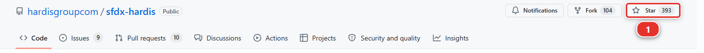

# Lab 1.7 - Épreuve finale : livrer une User Story tout seul

**Niveau** : 1 Contributeur, les bases

**Durée** : ~25 min

**Vous allez** : refaire toute la boucle sans pas-à-pas, la seule façon de savoir si vous l'avez
apprise.

## La situation

Deuxième ticket, deuxième jour. Personne ne va vous tenir la main sur celui-ci.

> **US-016 - Let the crew leave notes on an installation**
>
> As a delivery crew member, I want a free text notes field and a list view of my open
> installations, so that I hand over cleanly to the next shift.
>
> Critères d'acceptation :
>
> - Un champ **Crew Notes** existe sur Installation, texte long, modifiable par l'équipe de pose
> - Il est sur la présentation de page Installation, là où l'équipe de pose peut le voir
> - Une vue de liste **Open Installations** existe sur Installation, pour tous les utilisateurs
> - Le permission set de l'équipe de pose accorde le champ

## Avant de commencer

- [ ] [Lab 1.6](1-6-pull-request-deployment-check-and-merge.md) terminé : US-014 est mergée dans `integration` et déployée
- [ ] Le panneau Source Control ne montre plus rien à commiter

## Ce qu'il faut faire

Pas de clics numérotés cette fois. La boucle, dans l'ordre :

1. **Démarrez la User Story.** Branche `US-016-crew-notes`, cible `integration`, puis **Scratch
   org** et **Reuse scratch org helios-dev**. Votre org a déjà US-014, puisque vous l'y avez
   construite
2. **Construisez-la dans `helios-dev`**
   - Un champ **Long Text Area** `Crew_Notes__c` sur `Installation__c`, 4000 caractères, avec une
     description et un help text
   - Accordez-lui **Read** et **Edit** sur `Helios Delivery Crew`, parce que c'est un membre de
     l'équipe de pose qui écrit les notes. Personne d'autre ne le voit pour le moment : le tour
     des planificateurs vient au Niveau 2
   - Sur la présentation de page Installation
   - Une vue de liste sur Installation appelée **Open Installations**, visible par tous les
     utilisateurs, avec **Filter by Owner** sur **All installations**, filtrée sur un statut autre
     que Completed, et affichant le compte, le statut, la date d'installation et Panels Required
3. **Faites un retrieve.** **Commit changes**, **Recent Changes**, **Search Metadata**, et prenez
   le champ, la présentation de page, la vue de liste et le permission set. Rien d'autre.
   Commitez-les
4. **Publiez**, et lisez le rapport **Git Delta package.xml** avant de pousser. Quatre choses,
   toutes à vous
5. **Ouvrez la Pull Request** vers `integration` dans votre propre fork, faites-la passer au vert,
   mergez
6. **Vérifiez l'org d'intégration** après le job de déploiement

## Attention aux pièges :)

**Le permission set et le champ voyagent ensemble.** Si vous récupérez le champ et oubliez le
permission set, le déploiement réussit et personne ne voit le champ. Si vous récupérez le permission
set et oubliez le champ, le déploiement échoue franchement, parce qu'un permission set ne peut pas
accorder quelque chose qui n'existe pas. Prenez les deux, à chaque fois. C'est la même paire que vous
avez prise au [Lab 1.5](1-5-retrieve-commit-and-publish-your-changes.md), et la vue de liste a la même habitude : elle nomme Panels Required, il lui
faut donc ce champ déjà présent dans l'org cible, ce qui est le cas depuis le [Lab 1.6](1-6-pull-request-deployment-check-and-merge.md).

## Ce que vous devez voir

Dans `helios-integration`, après le déploiement de merge :

- `Crew Notes` accordé, **Read** et **Edit**, sur le permission set **Helios Delivery Crew** :
  **Setup > Permission Sets > Helios Delivery Crew > Object Settings > Installations**. Vous ne
  verrez pas le champ sur l'enregistrement vous-même : vous portez le permission set des
  planificateurs, et cette story ne le leur accorde pas
- **Open Installations** dans le sélecteur de vues de liste de l'onglet Installations

## En cas de problème

Tout ce qu'il vous faut est dans les Labs 1.3 à 1.6. Les échecs sont les mêmes, et les sections
**En cas de problème** de ces labs les couvrent. Résistez à l'envie de relire tout le lab : allez
chercher la seule étape sur laquelle vous bloquez.

Si votre repository finit dans un état que vous n'arrivez pas à démêler, Welcome page >
**Training: Level 1** > **Reset this level** le remet au début du Niveau 1 et vous pouvez refaire
l'épreuve finale proprement. S'en servir n'est pas échouer. Ne pas s'en servir et abandonner, si.

## Vérifiez votre travail

Welcome page > **Training: Level 1** > **Check my work**, puis choisissez **Everything in level 1, capstone included**.

Six contrôles doivent passer. Les lignes de reçu qu'il affiche sont votre relevé de progression, et
la demande de badge ci-dessous les reprend toute seule.

## Demandez votre badge

Vous avez terminé le Niveau 1.

Welcome page > **Training: Level 1** > **Claim my badge**.

Il recontrôle d'abord le niveau entier et refuse de demander quoi que ce soit qui ne passe pas : une
demande qui serait rejetée est une demande qui ne vaut pas la peine d'être ouverte. Puis il ouvre le
formulaire de demande du repository de formation dans votre navigateur, avec le niveau, votre nom
d'utilisateur, votre fork (votre copie personnelle du repository du cours sur GitHub, par exemple
`github.com/my-username/sfdx-hardis-training`) et vos reçus déjà remplis. Un champ reste vide :
choisissez votre niveau dans la liste **Level**, car GitHub ne pré-remplit pas une liste déroulante
depuis un lien et le formulaire refuse d'être soumis tant qu'elle affiche *None*. Cochez ensuite les
trois cases et cliquez sur **Create**.

Ces trois cases sont à vous de cocher, et rien ne les coche à votre place. Elles disent que votre
fork (`github.com/my-username/sfdx-hardis-training`) est public et que votre pseudo GitHub devient
public dans le repository de formation, ce qui est une décision à propos de votre nom plutôt qu'une
formalité.

!!! tip "Si ce cours vous a servi"
    [hardisgroupcom/sfdx-hardis](https://github.com/hardisgroupcom/sfdx-hardis) est le projet open
    source dont parle tout ce cours. Une étoile est ce qui permet à un projet comme celui-ci de
    rester visible : ouvrez sa page et cliquez sur **Star** **(1)**, en haut à droite. Donnez une étoile si
    vous avez aimé ce cours !

    

Un job clone ensuite votre fork (`github.com/my-username/sfdx-hardis-training`), rejoue sur lui tous
les contrôles ci-dessus, et répond sur l'issue. Personne ne le relit à la main, cela prend donc
généralement deux minutes. Si quelque chose ne se vérifie pas, le commentaire nomme le lab exact et
ce qu'il a cherché, vous corrigez, et vous modifiez l'issue pour le relancer.

Votre fork (`github.com/my-username/sfdx-hardis-training`) doit être **public** pour que l'audit
puisse le lire. S'il est privé, la commande propose de le rendre public.

!!! note "C'est un badge, pas une certification"
    Il n'y a ici ni examen ni accréditation. Partagez-le dans *Featured* sur LinkedIn, pas dans
    *Licenses & certifications*.

!!! tip "La mettre en bannière LinkedIn"
    [Trailhead Banner](https://thb.nabondance.me/) dessine une image de couverture LinkedIn à partir
    d'un nom d'utilisateur Trailblazer, et il y affiche le badge sfdx-hardis le plus élevé que vous
    avez réclamé ici. Tapez votre nom d'utilisateur, générez l'image, et mettez-la en bannière de
    votre profil LinkedIn.

## La suite

Le Niveau 1 vous a appris la boucle quand tout se passe bien. Le Niveau 2 est l'autre moitié : le
déploiement qui échoue sur une dépendance dont vous ignoriez l'existence, le champ qu'on ne peut pas
rendre obligatoire, le collègue qui a modifié le même flow que vous.

Il est recommandé pour tout contributeur, et **obligatoire** avant le Niveau 3.

[Continuer vers le Niveau 2 - Contributeur avancé](../level-2-contributor-advanced/index.md){ .md-button .md-button--primary }
