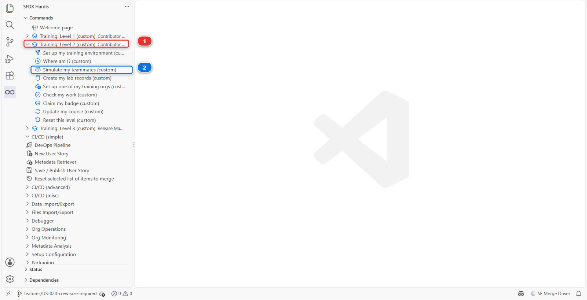
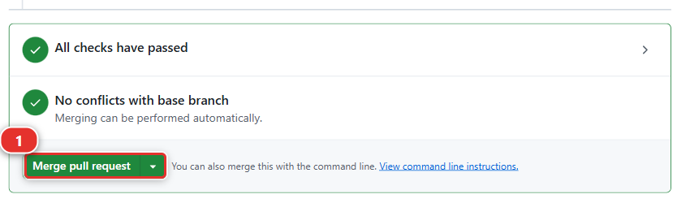
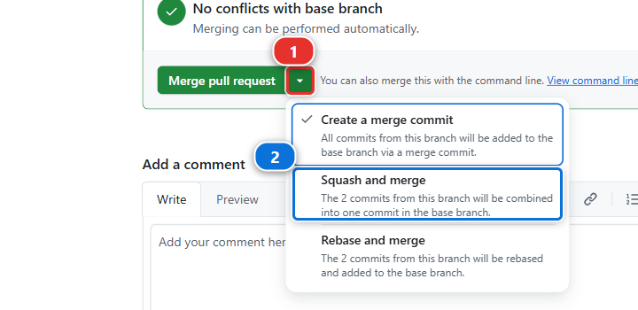
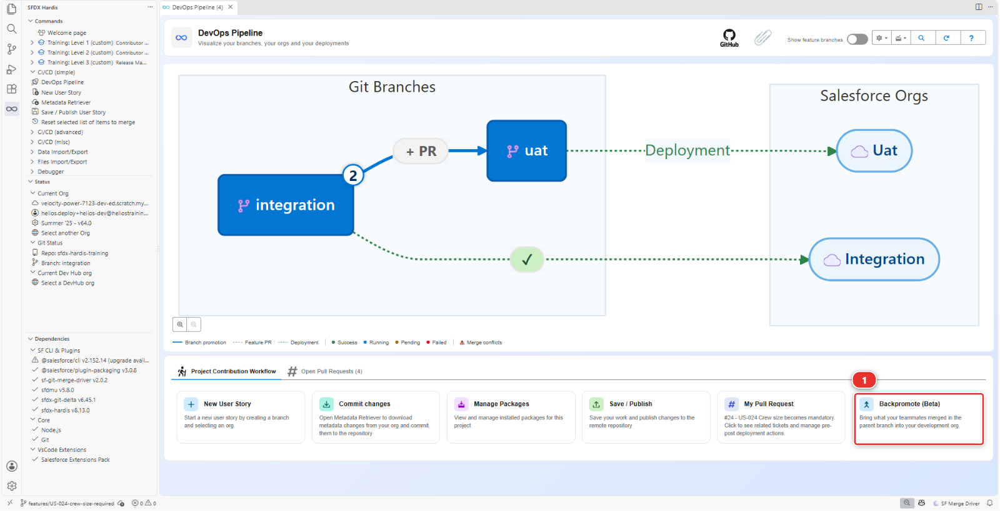
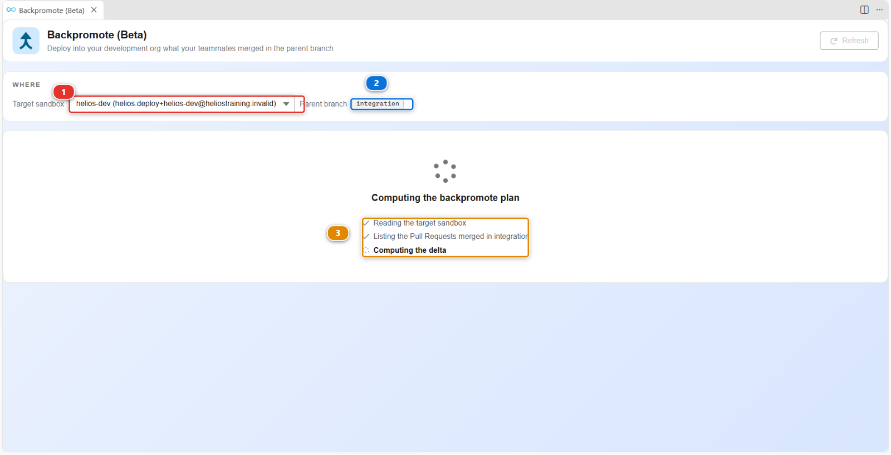
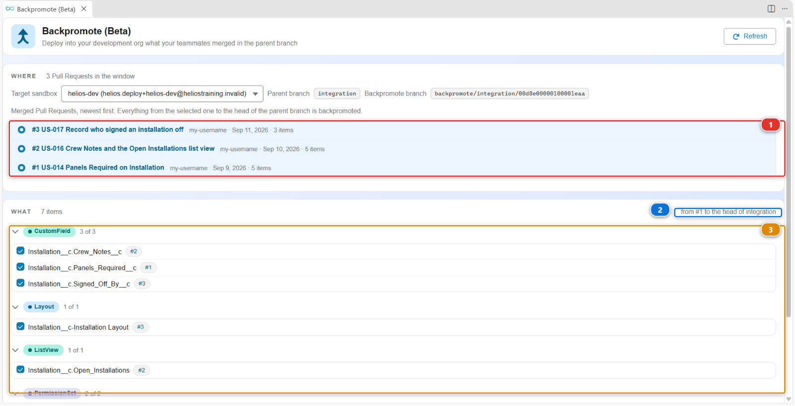
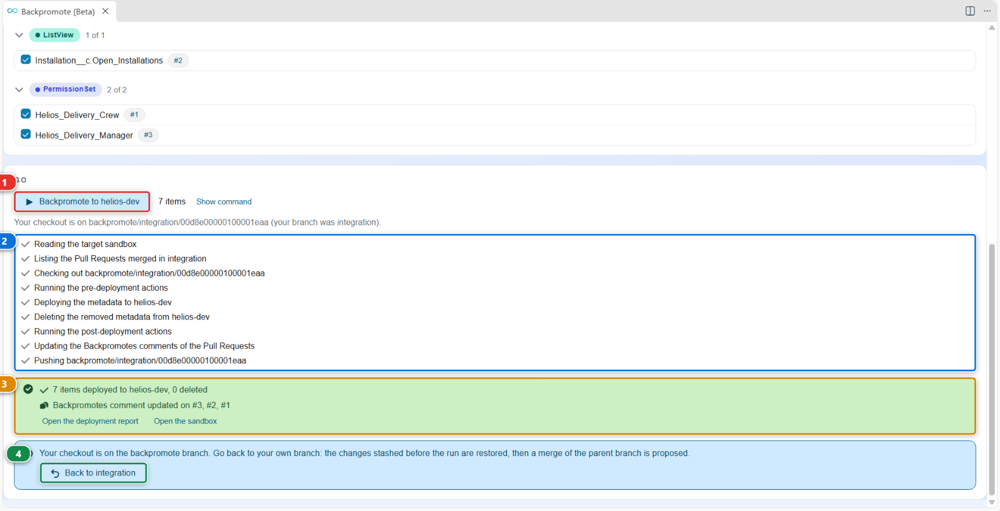

# Lab 2.1 - Backpromote : remettre votre org de dev au niveau de l'équipe

**Niveau** : 2 Contributeur avancé

**Durée** : ~15 min

**Vous allez** : rapatrier dans votre propre org de dev la story mergée par un collègue, décider
quoi garder quand l'outil vous le demande, et apprendre ce qu'un backpromote ne fera jamais pour
vous.

## La situation

Vous étiez absent deux semaines. Pendant ce temps, Romain a mergé une story dans `integration`, et
elle a été déployée. Votre org `helios-dev` ressemble encore au jour de votre départ.

Construisez votre story suivante là-dessus et vous produirez un diff plein de choses qui ressemblent
à des suppressions, parce que votre org n'a pas ce que celle de tout le monde a. C'est la façon la
plus courante pour un contributeur de défaire par accident le travail d'un collègue.

## Avant de commencer

- [ ] Niveau 1 terminé, ou **Training: Level 2 > Reset this level** sur le niveau 2
- [ ] `helios-dev` connectée dans **Orgs Manager**
- [ ] Aucune modification non commitée à laquelle vous tenez

## Les étapes

### 1. Rapatrier le travail de votre collègue

Les deux semaines d'absence doivent exister avant que vous puissiez les rattraper. Romain n'existe
pas, mais son travail si : la formation le rejoue dans **votre propre** fork, sous la forme d'une
Pull Request que vous mergez.

#### 1a. Lancer Simulate my teammates

Dans la liste des commandes sfdx-hardis, dépliez **Training: Level 2** **(1)** et cliquez sur
**Simulate my teammates** **(2)**. La même entrée se trouve sur la page Welcome, sous
**Training: Level 2**.

Un panneau de commande s'ouvre et pose trois questions. Répondez ainsi :

| Question                               | Réponse                                                     |
|----------------------------------------|-------------------------------------------------------------|
| Which teammate work do you need?       | **US-017 Record who signed an installation off**            |
| Create it?                             | **Yes**                                                     |
| Merge it for you once its checks pass? | **Yes**, sauf si vous voulez la merger vous-même (étape 1b) |

Si VS Code demande d'abord comment autoriser la commande Training, choisissez **Always allow**,
comme dans [Lab 1.2](../level-1-contributor-basics/1-2-create-your-dev-hub-scratch-orgs-and-pipeline.md).

La commande crée la branche `training/mate-us-017-sign-off` à partir de votre `integration` actuelle,
commite la modification de Romain sous son nom, la pousse sur votre fork GitHub et ouvre la Pull
Request. Le panneau affiche son adresse : gardez-la, elle sert à l'étape 1b.

Avec **Yes** à la dernière question, le panneau attend ensuite les deux checks de la Pull Request,
deux à quatre minutes environ, et la merge dès qu'ils sont verts tous les deux. Il écrit
**Pull Request merged into its base branch**, puis **Done**. Vous pouvez sauter l'étape 1b et passer
directement à l'étape 2. Si vous la mergez vous-même sur GitHub pendant que le panneau attend, il
s'en aperçoit et s'arrête là aussi.

S'il dit qu'un check a échoué, ou qu'il n'a pas pu merger, rien n'est perdu : la Pull Request est
toujours ouverte, et l'étape 1b permet de terminer.

Sous le capot : ce que Simulate my teammates a fait

L'entrée Training a lancé :

    node scripts/training.mjs simulate --level 2

Elle a appliqué le jeu de patches de `scripts/simulate/us-017-sign-off/` à votre copie de travail,
l'a commité avec le nom et l'email de Romain, a poussé la branche et ouvert la Pull Request avec
`gh pr create`. Vos propres modifications non commitées, s'il y en avait, ont été mises de côté
d'abord et remises en place à la fin.

Avec **Yes** au merge, elle vous a d'abord rendu votre propre branche, puis a demandé à GitHub
l'état des checks de la Pull Request toutes les vingt secondes (`gh pr checks`), et lancé
`gh pr merge --squash` dès qu'ils étaient tous verts, **Simulate Deployment to Major Org** et
**Mega-Linter** compris. La même règle que le bouton : la branche `integration` de votre fork est
protégée, et GitHub refuserait le merge tant qu'un check est rouge ou en cours.

#### 1b. Ou la relire et la merger vous-même sur GitHub

Seulement si vous avez répondu **No**, ou si le panneau n'a pas pu merger.

1. Ouvrez la Pull Request : cliquez sur l'adresse affichée par le panneau, ou ouvrez votre fork sur
   GitHub (`github.com/my-username/sfdx-hardis-training`), cliquez sur l'onglet **Pull requests**,
   puis sur **US-017 Record who signed an installation off**
2. Cliquez sur **Files changed** **(1)**. La liste des fichiers à gauche **(2)** en contient trois :
   le nouveau champ `Signed_Off_By__c`, le permission set `Helios_Delivery_Manager` et le layout
   `Installation`. Chaque ligne du diff **(3)** est une modification, verte quand elle est ajoutée et
   rouge quand elle est supprimée. Romain ne fait qu'ajouter : le champ, l'accès en lecture et en
   modification dessus, et le champ sur le layout. C'est cela, la relecture : vérifier que la Pull
   Request fait ce que dit son titre, et rien d'autre

   

   L'image montre une Pull Request d'un collègue plus tardive, US-052 : la vôtre montre les trois
   fichiers de Romain, et les onglets et les boutons sont les mêmes.

3. Revenez sur l'onglet **Conversation** et descendez en bas de la page. Tant qu'un check tourne
   encore, la boîte indique **Merging is blocked** : attendez, la page se met à jour toute seule.
   Quand elle indique **All checks have passed**, le bouton **Merge pull request** **(1)** est actif

   

4. Cliquez sur la petite flèche **(1)** à droite du bouton vert, choisissez **Squash and merge**
   **(2)**, puis cliquez sur **Squash and merge** et **Confirm squash and merge**. Le badge en haut
   de la page devient violet et indique **Merged**

   

C'est le même merge qu'au [Lab 1.6](../level-1-contributor-basics/1-6-pull-request-deployment-check-and-merge.md), étape 4. Un
check qui échoue ici n'est pas de votre faute et n'est pas à corriger : relancez **Simulate my
teammates**, elle recrée la branche et la Pull Request.

#### 1c. Où vous en êtes

La Pull Request de Romain est le dernier merge dans `integration` sur GitHub. C'est le seul travail
que votre org n'a pas : le backpromote l'apporte, et rien d'autre.

En dessous, la forme que prennent vos propres stories du Niveau 1 dépend de la façon dont vous êtes
arrivé au Niveau 2 :

| Vous êtes arrivé au Niveau 2 en | Vos stories du Niveau 1 dans `integration` sont                                                                                                            |
|---------------------------------|------------------------------------------------------------------------------------------------------------------------------------------------------------|
| Faisant le Niveau 1             | Des Pull Requests de votre fork, comme **#1 US-014** et **#2 US-016**                                                                                      |
| **Reset this level**            | Un seul commit, **chore: the state a level 2 learner starts from**, en général suivi de **Keep my pipeline configuration**, qui garde les noms de vos orgs |

Dans les deux cas, `helios-dev` doit déjà les contenir, parce que le layout de Romain place son champ
à côté de `Crew_Notes__c`, et un déploiement vers une org qui n'a pas ce champ échoue. Vérifiez-le
maintenant : dans `helios-dev`, **Setup** > **Object Manager** > **Installation** > **Fields &
Relationships** liste **Panels Required** et **Crew Notes**.

Ils y sont si vous avez construit le Niveau 1 dans cette org. S'ils n'y sont pas, ce qui est le cas
quand vous avez rejoint la formation au Niveau 2, mettez-les-y avant l'étape 2 : avec `integration`
en checkout (son nom est dans le coin en bas à gauche de VS Code), lancez **Training: Level 2** >
**Set up one of my training orgs** sur `helios-dev`. Il déploie l'application depuis la branche sur
laquelle vous êtes, et cette branche contient le Niveau 1.

### 2. Ouvrir Backpromote

Dans le panneau **DevOps Pipeline**, sous **Project Contribution Workflow**, cliquez sur la carte
**Backpromote (Beta)** **(1)**.

Il calcule son plan avant de vous montrer quoi que ce soit :

1. **Target sandbox** **(1)** est l'org dans laquelle le travail est rapatrié, `helios-dev`
2. **Parent branch** **(2)** est l'endroit d'où il vient, `integration` telle qu'elle est sur
   GitHub : le panneau fait le fetch lui-même, inutile de faire un pull avant
3. Les trois lignes **(3)** lisent votre org, listent les Pull Requests mergées dans `integration`,
   et calculent la différence entre les deux

"Backpromote" désigne la direction, et c'est elle qui compte : le travail remonte normalement
**vers le haut**, de votre branche vers integration, puis uat, puis production. Un backpromote le
fait **redescendre**, d'une branche majeure vers votre propre environnement, pour que vous
construisiez sur ce que l'équipe a et non sur ce dont vous vous souvenez.

### 3. Voir à quel point vous êtes en retard

Le bloc **WHERE** en haut du panneau y répond, et c'est le seul endroit qui le fasse. Il compte les
lignes, de celle que vous choisissez à l'étape 4 jusqu'à la plus récente : pour la seule story de
Romain, il indique **1 Pull Request in the window**.

Cette première fois, rien n'est choisi pour vous, parce que rien n'a jamais été rapatrié dans
`helios-dev`. Une fois qu'un backpromote a tourné, le panneau s'en souvient et choisit la ligne
mergée juste après, et le compteur dit alors exactement le retard de votre org. C'est ce compteur,
pas votre mémoire, qui vous dit si un rafraîchissement est nécessaire. Un lundi après une semaine
d'absence, il mérite d'être lu avant toute chose.

### 4. Choisir ce qu'on rapatrie

Quand le plan est prêt, le panneau se remplit. Ce qui a été mergé dans `integration` est listé du
plus récent au plus ancien **(1)** : choisissez la ligne du haut, celle de Romain, **US-017 Record
who signed an installation off**. Tout ce qui va de la ligne choisie jusqu'à la tête
d'`integration` **(2)** est rapatrié : cette seule ligne est donc exactement ce qui manque à votre
org.

Seule une ligne qui commence par un numéro, une Pull Request de votre fork, peut être choisie. Un
clic sur une autre ligne ne fait rien :

- **chore: the state a level 2 learner starts from** et **Keep my pipeline configuration**, si vous
  avez fait un reset : des commits, pas des Pull Requests
- des dizaines de commits du cours lui-même, dont votre `integration` a hérité quand vous avez fait
  votre copie du repository. Certains se terminent par un numéro entre parenthèses, comme
  **(#77)** : c'est une Pull Request du repository du cours, pas de votre fork. Votre org les a déjà

Sous la liste, la métadonnée que votre choix rapatrie est listée par type, chaque élément avec sa
propre case **(3)**. C'est ce qui a changé dans `integration` entre cette ligne et sa tête, pas une
comparaison avec votre org : pour la story de Romain, trois éléments, le champ, le layout et le
permission set.

L'image a été prise sur un fork qui a fait le Niveau 1 sans reset, en partant de **#1 US-014** : sa
fenêtre contient donc trois Pull Requests et plus d'éléments. La vôtre, partie de celle de Romain,
en contient une.

Parcourez la liste plutôt que de cliquer sur "tout" :

| Ce que vous voyez                                  | Ce qu'il faut faire                                                    |
|----------------------------------------------------|------------------------------------------------------------------------|
| De la métadonnée de la story de Romain             | **Prenez-la.** C'est tout l'objet de la manœuvre                       |
| Quelque chose que vous êtes en train de construire | **Laissez-le.** Un backpromote écraserait votre travail en cours       |
| Quelque chose que vous ne reconnaissez pas du tout | **Prenez-le.** Si c'est sur `integration`, c'est la vérité de l'équipe |

Pour un fichier que les deux côtés ont modifié, le panneau propose une troisième réponse à côté de
**Overwrite** et **Keep org version** : **Merge**. Il écrit le fichier avec les deux versions
dedans, balisées, et vous choisissez entre elles dans l'éditeur de merge de VS Code, exactement
comme le [Lab 2.7](2-7-resolve-a-git-merge-conflict.md) vous fait résoudre un conflit de Pull Request. Servez-vous-en quand les deux
modifications sont réelles et qu'il vous faut les deux.

La règle en cas d'hésitation : `integration` gagne. C'est la réalité partagée, et votre org en est
une copie que vous avez le droit de modifier temporairement.

### 5. Le lancer et lire le résultat

Cliquez sur **Backpromote to helios-dev** **(1)**. Le panneau déroule l'exécution étape par étape
**(2)**, et quand il a fini il vous dit ce qui s'est passé **(3)**.

Lisez le résumé plutôt que la couleur :

- combien d'éléments ont atteint votre org, et combien en ont été supprimés
- sur quelles Pull Requests il a écrit son historique, pour que le backpromote suivant sache où
  commencer

La story de Romain ne porte aucune deployment action. Quand celles que vous ramenez en portent, le
résumé dit aussi combien ont tourné, ont été sautées ou ont échoué, et **combien d'actions manuelles
vous attendent dans la sandbox**, ce que rien ne peut faire à votre place.

Cliquez ensuite sur **Back to `<votre branche>`** **(4)**. C'est le dernier bouton du panneau et
celui que les gens ratent, et la note suivante explique pourquoi il compte.

Sous le capot : ce que Backpromote vient de faire

Le panneau a lancé :

    sf hardis:work:backpromote

qui a :

1. Fait un fetch de votre fork et lu `origin/integration`, la branche telle qu'elle est sur GitHub,
   jamais votre copie locale
2. Construit un plan : les composants qu'`integration` a modifiés entre la ligne choisie et sa tête,
   et pour chacun s'il est ajouté, modifié ou supprimé
3. Déployé ceux que vous avez sélectionnés dans votre org de dev, avec le même moteur de déploiement
   que la CI
4. Noté ce qu'il a fait, pour qu'une deuxième exécution ne refasse pas le même travail

Trois choses qu'il ne fait délibérément **pas**, et les connaître économise un après-midi :

- **Il n'apporte pas d'enregistrements tout seul.** Il déploie de la métadonnée, et il lance les
  deployment actions que les Pull Requests mergées ont déclarées, ce qui est l'endroit où vivrait un
  chargement de données. Si la story d'un collègue avait besoin de données de référence et que
  personne n'a déclaré d'action pour cela, ces données ne sont pas dans votre org, et aucun
  déploiement ne les y mettra jamais. Le [Lab 2.4](2-4-ship-reference-data-and-a-batch-with-deployment-actions.md) traite exactement de ce problème
- **Il n'annule pas ce que vous avez fait à la main.** Si vous avez modifié dans votre org quelque
  chose qu'`integration` a aussi modifié, le déploiement l'écrase. C'est pour cela que vous lisez la
  liste
- **Il ne touche pas aux orgs partagées.** Un backpromote refuse une org de production, et toute org
  dans laquelle déploie une branche majeure. Il n'écrit jamais que dans une sandbox de développeur,
  une scratch org ou une org Developer Edition

Et une chose qu'il fait et que personne n'attend la première fois :

!!! warning "Il vous laisse sur la branche de backpromote"
    Le déploiement tourne depuis une branche appelée `backpromote/integration/<votre org>`, et **le
    checkout y reste quand la commande se termine**. Le panneau le dit, et propose le bouton
    **Back to `<votre branche>`** **(4)** pour le défaire : il restaure les modifications qu'il avait
    mises de côté avant l'exécution, puis propose un merge de la branche parente.

    Prenez ce bouton. Si vous ne le faites pas, **New User Story** repart quand même de la cible que
    vous choisissez, rien ne casse donc, mais ce que vous aviez en cours reste rangé derrière une
    branche que vous avez oubliée. La branche sur laquelle vous êtes est toujours dans le coin en bas
    à gauche de VS Code.

L'historique n'est pas sur votre ordinateur non plus. sfdx-hardis note ce qui a atteint votre sandbox
dans un **commentaire Backpromotes** sur chaque Pull Request qu'il a rapatriée, pour que le
backpromote suivant sache où commencer, depuis n'importe quelle machine et n'importe quel collègue.
C'est aussi pourquoi la commande a besoin d'un token de fournisseur git : sans lui, elle ne peut pas
lire son propre historique, et elle s'arrête.

<!-- command-links:start -->
Documentation de la commande : [hardis:work:backpromote](https://sfdx-hardis.cloudity.com/hardis/work/backpromote/)
<!-- command-links:end -->

## Ce que vous devez voir

Ouvrez `helios-dev` et vérifiez que la story de Romain y est : ouvrez une installation, son champ
**Signed Off By** est en bas de la colonne des champs, sous **Crew Notes**.

## En cas de problème

**Simulate my teammates dit qu'aucun check n'a tourné sur la Pull Request.**
L'onglet Checks de la Pull Request est vide : GitHub Actions est désactivé sur votre fork.
Le [Lab 1.6](../level-1-contributor-basics/1-6-pull-request-deployment-check-and-merge.md), étape 2, explique comment l'activer.
Mergez-la ensuite vous-même, étape 1b.

**Le panneau dit "Nothing to commit".**
La modification de Romain est déjà dans votre `integration` : vous l'avez mergée plus tôt, et le
panneau affiche l'adresse de cette Pull Request mergée. Passez à l'étape 2.

**Le panneau dit qu'il n'y a rien à backpromoter.**
Votre org est déjà au niveau d'`integration`, ce qui arrive si vous venez de terminer le Niveau 1
dans la même org. Rien à faire : passez à la suite.

**Un clic sur une ligne de la liste ne fait rien.**
Cette ligne n'est pas une Pull Request de votre fork : c'est un commit du reset, ou du cours. Seule
une ligne qui commence par un numéro peut être choisie, étape 4.

**Le déploiement échoue sur `Crew_Notes__c` ou `Panels_Required__c`.**
`helios-dev` n'a pas vos stories du Niveau 1. Mettez-les-y comme le dit l'étape 1c, puis relancez
le backpromote.

**Le déploiement échoue sur un composant qui dépend d'autre chose.**
Prenez l'ensemble complet plutôt qu'un sous-ensemble. La métadonnée a des dépendances, et une demi-
story ne se déploie souvent pas.

**Votre propre travail en cours a été écrasé.**
Il était dans la liste et vous l'avez pris. Reconstruisez-le dans l'org : il est toujours dans votre
branche si vous l'aviez commité, et le déploiement n'a changé que l'org.

## Vérifiez votre travail

Welcome page > **Training: Level 2** > **Check my work**, puis choisissez le **Lab 2.1**.

## Pour aller plus loin

- [Backpromote](https://sfdx-hardis.cloudity.com/salesforce-devops-backpromote/)

[Suite : Lab 2.2 - Corriger une erreur de déploiement due à une dépendance manquante](2-2-fix-a-missing-dependency-deployment-error.md){ .md-button .md-button--primary }
