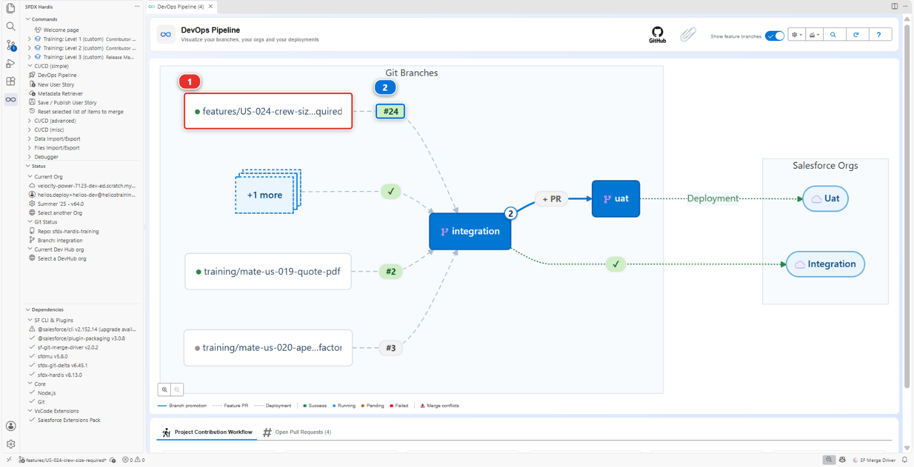
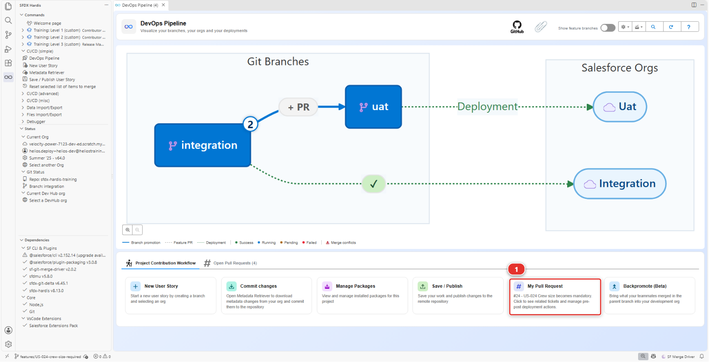
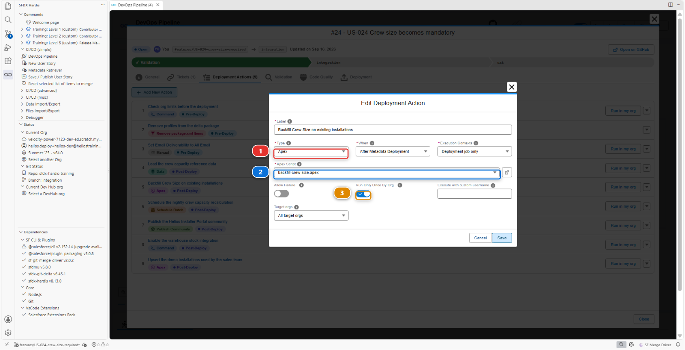
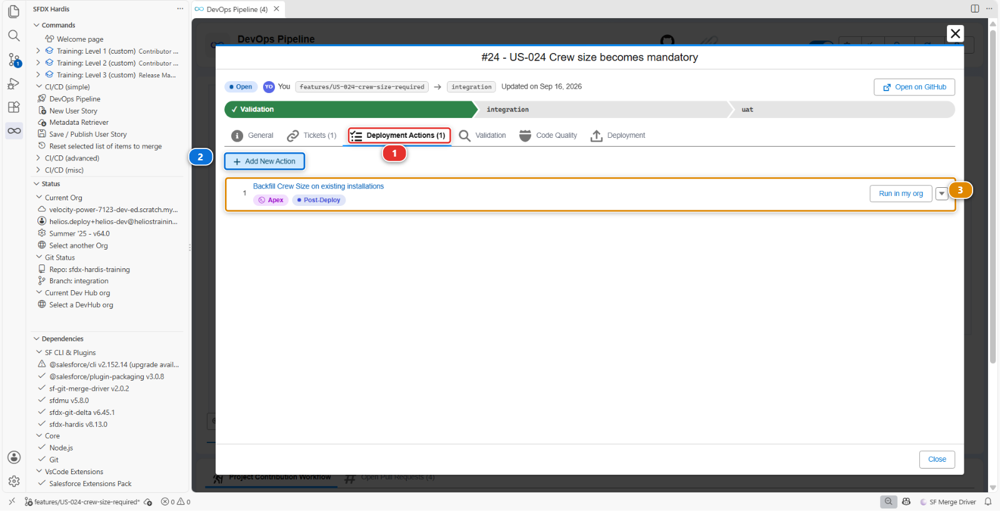

# Lab 2.3 - Réparer des enregistrements cassés avec une deployment action Apex

**Niveau** : 2 Contributeur avancé

**Durée** : ~30 min

**Vous allez** : rencontrer un échec qu'aucune correction de métadonnée ne résout, et découvrir
l'outil qui existe pour cela : une deployment action.

## La situation

> **US-024 - Crew size becomes mandatory**
>
> As a planner, I want Crew Size to be mandatory on every installation, so that no job is scheduled
> without a crew.
>
> Critères d'acceptation :
>
> - Crew Size est obligatoire
> - Les enregistrements existants sont remplis avec la valeur par défaut de 2

Une case à cocher dans Setup. Puis deux choses arrivent, et c'est la seconde qui compte.

Le déploiement échoue, pour une raison qui n'a rien à voir avec vos données. Vous corrigez cela en
une minute. Le déploiement passe ensuite au vert, et vous venez de casser en silence trente
enregistrements d'installation pour tout le monde, sans que rien ne vous le dise nulle part.

Ce lab parle de l'écart entre un déploiement vert et un déploiement sûr.

## Avant de commencer

- [ ] [Lab 2.2](2-2-fix-a-missing-dependency-deployment-error.md) terminé et mergé
- [ ] `helios-dev` au niveau d'`integration`

## Les étapes

### 1. Prendre la story et faire la chose évidente

**New User Story** **(2)**, sous **Project Contribution Workflow** **(1)** du panneau DevOps
Pipeline. Nom `US-024-crew-size-required`, org `helios-dev`.


Dans `helios-dev` : **Setup > Object Manager > Installation > Fields & Relationships > Crew Size >
Edit**, cochez **Required**, **Save**.

Salesforce vous avertit au sujet des appels API et Apex, vous demande de **Confirm**, et
l'enregistre. Pas un mot sur vos données, alors que la plupart des installations de votre org n'ont pas de
crew size. Retenez-le : c'est tout ce lab.

Faites un retrieve du champ avec **Commit changes** (le champ, rien d'autre), commitez-le, **Save /
Publish**, poussez, et ouvrez la Pull Request.

### 2. Lire le premier échec

```
Helios_Delivery_Crew     You cannot deploy to a required field: Installation__c.Crew_Size__c
Helios_Delivery_Manager  You cannot deploy to a required field: Installation__c.Crew_Size__c
```

Pas un mot sur vos données. Le problème vient des permission sets.

Un champ **universally required** n'a pas de sécurité au niveau du champ à accorder : il est visible
et obligatoire pour tout le monde, par définition. Donc à l'instant où le champ devient obligatoire,
chaque entrée de sécurité au niveau du champ qui le mentionne devient invalide, et le déploiement
refuse les permission sets plutôt que le champ.

La correction prend une minute, et l'org l'a déjà faite : dans `helios-dev` les entrées ont disparu
des deux permission sets à l'instant où le champ est devenu obligatoire. Faites-en un retrieve :
**Commit changes**, cochez `Helios_Delivery_Crew` et `Helios_Delivery_Manager`, récupérez. Source
Control montre chacun d'eux perdant son entrée `Crew_Size__c` et rien d'autre. Commitez, **Save /
Publish** à nouveau. Le commentaire sfdx-hardis le disait même, sous chaque erreur, avec un lien vers
la règle.

!!! note "C'est une bonne erreur"
    Elle est précise, elle nomme les deux composants fautifs, et la correction est évidente une fois
    la règle connue. La plupart des erreurs de déploiement Salesforce sont ainsi : elles ont l'air de
    parler de ce que vous avez modifié, et elles parlent de quelque chose qui y faisait référence.

### 3. Le regarder passer au vert, et comprendre pourquoi c'est le problème

Le contrôle passe. **Ne mergez pas encore.**

Ouvrez `helios-dev`, trouvez une installation sans crew size, changez n'importe quoi dessus, et
enregistrez.

```
Required fields are missing: [Crew_Size__c]
```

**Salesforce impose un champ obligatoire à l'enregistrement, pas sur les données déjà présentes.** Il
a parfaitement accepté de rendre le champ obligatoire alors que la plupart des installations
l'avaient vide, et le contrôle vert dit la même chose : `helios-integration` a trente installations
sans crew size, et le déploiement rendrait chacune d'elles impossible à enregistrer. Pas seulement
pour vous, pour tout le monde, pour n'importe quelle modification, jusqu'à ce que quelqu'un leur
mette un crew size.

Rien n'a échoué. Aucun contrôle n'est passé au rouge. Mergez maintenant, et la première personne à
l'apprendre est un planificateur qui n'arrive pas à enregistrer un enregistrement.

**Tout ce que vous devez faire à la main dans une org, vous devrez le faire dans toutes les orgs.**
C'est à cela que sert une deployment action.

### 4. Découper la story en deux mouvements

La forme de la correction, et c'est la forme de la plupart des problèmes du type "les données sont
en travers" :

1. Rendre les données valides
2. Rendre le champ obligatoire

Les deux peuvent voyager dans la même Pull Request, tant que la première tourne dans chaque org que
la story atteint. C'est exactement ce qu'est une **deployment action** : quelque chose que le
pipeline lance autour du déploiement, dans chaque org, sans que personne ouvre Setup.

### 5. Ajouter le remplissage

Trente installations dans `helios-integration`, mais une org de production peut en contenir des
millions, et une deployment action tourne aussi en production. Un script qui met à jour tous les
enregistrements d'un coup s'arrête à la première limite de gouverneur Salesforce rencontrée :
10 000 enregistrements mis à jour dans une transaction, dix secondes de traitement. Le travail part
donc dans un **batch**, que Salesforce déroule par lots de 200 enregistrements, chacun dans sa propre
transaction, quelle que soit la taille de la table.

Vous n'avez pas à l'écrire. Depuis `scripts/apex/samples/` du repository, copiez ces quatre fichiers
dans `force-app/main/default/classes/`, dans l'Explorer, par copier-coller :

- `CrewSizeBackfillBatch.cls` et `CrewSizeBackfillBatch.cls-meta.xml` : le batch. Il donne l'équipe
  par défaut de deux personnes à toute installation qui n'en a pas
- `CrewSizeBackfillBatchTest.cls` et `CrewSizeBackfillBatchTest.cls-meta.xml` : son test. Salesforce
  ne déploie pas d'Apex sans test, et le [Lab 2.5](2-5-pass-code-quality-and-apex-test-coverage.md) parle de cette barrière

Puis le script que l'action lance : créez le fichier `scripts/apex/backfill-crew-size.apex` et
copiez-y ceci.

```apex
// Starts the backfill as a batch: the script returns at once, and Salesforce
// works through the installations without a crew size, 200 at a time.
Id jobId = Database.executeBatch(new CrewSizeBackfillBatch(), 200);
System.debug('Crew size backfill started, batch job ' + jobId);
```

Deux choses à remarquer, parce que ce sont elles qui rendent cela sûr à lancer en production :

- Le batch ne touche que les enregistrements réellement faux (`WHERE Crew_Size__c = null`)
- Le script dit ce qu'il a démarré, pour que le log de déploiement soit lisible après coup

### 6. Le déclarer comme deployment action

Ouvrez le panneau **DevOps Pipeline**. Il y a deux chemins vers votre Pull Request, et les deux
arrivent au même endroit.

Dans le diagramme : activez **Show feature branches** en haut à droite, désactivé tant que vous ne le
demandez pas, et votre propre branche apparaît à côté des branches majeures. Votre branche de feature
**(1)**, et sur la flèche qui en part la pastille numérotée **(2)**. Cliquez sur la pastille.



Ou faites défiler jusqu'à **Project Contribution Workflow** et cliquez sur la carte **My Pull
Request** **(1)**, qui pointe toujours vers la Pull Request de la branche sur laquelle vous êtes.



La Pull Request s'ouvre. Allez sur son onglet **Deployment Actions**, cliquez sur **Add New Action**,
et dans la boîte **Edit Deployment Action** mettez le **Type** **(1)** sur **Apex**.



Remplissez-la :

| Champ                | Valeur                                         |
|----------------------|------------------------------------------------|
| Label                | `Backfill Crew Size on existing installations` |
| When                 | **After Metadata Deployment**                  |
| Apex Script          | `backfill-crew-size.apex`                      |
| Execution Contexts   | **Deployment job only**                        |
| Target orgs          | **All target orgs**                            |
| Run Only Once By Org | **oui**                                        |

**Apex Script** **(2)** est une liste déroulante de ce qu'il a trouvé sous `scripts/apex/`, pas un
chemin en texte libre : le fichier doit donc exister dans votre branche avant d'y apparaître.
**Run Only Once By Org** **(3)** est le commutateur juste en dessous.

**Deployment job only**, parce que le contrôle de Pull Request est une répétition : il valide la
métadonnée et ne change rien dans l'org. Un script qui met à jour trente enregistrements le fait pour
de vrai, il attend donc le merge. Le contrôle liste quand même l'action dans son commentaire, marquée
sautée, pour que le relecteur la voie venir.

**Save**. L'action rejoint la liste de l'onglet **Deployment Actions**, dont le compteur **(1)**
augmente d'une unité. **Add New Action** **(2)** reste là pour la suivante, et votre ligne **(3)**
porte une pastille **Post-Deploy** sous son libellé.



!!! tip "Run Only Once By Org"
    Cochez-le dès que le script est une correction ponctuelle plutôt que quelque chose qui doit se
    produire à chaque déploiement. sfdx-hardis note ce qu'il a lancé dans chaque org : le remplissage
    part donc une fois en intégration, une fois en UAT, une fois en production, et plus jamais.
    Laissez-le décoché pour un script qui ne fait aucun mal s'il tourne deux fois et qui est censé
    tourner à chaque déploiement.

### 7. Vérifier l'ordre

L'action tourne **après** le déploiement, et ici ce n'est pas un détail. Le script démarre
`CrewSizeBackfillBatch`, et cette classe voyage dans le déploiement même auquel l'action est
attachée : avant le déploiement, l'org cible ne l'a pas, et un script qui s'en sert ne compile pas.

Pendant quelques minutes après le déploiement, les installations sans crew size ne peuvent pas être
enregistrées, comme vous l'avez vu dans `helios-dev`. Puis le batch leur en a donné un. Cette fenêtre
est le prix de l'ordre, et sur une table de plusieurs millions de lignes, elle mérite d'être annoncée
aux planificateurs avant la mise en production.

!!! tip "Comment décider pre ou post, à chaque fois"
    Demandez-vous ce que l'action a besoin de trouver déjà présent. Une action qui utilise une
    classe, un objet ou un champ que la story apporte est post-deploy : ils n'existent qu'une fois le
    déploiement fait, et c'est le cas de ce lab et du Lab 2.4. Le pre-deploy est pour ce qui doit
    arriver avec l'org telle qu'elle était, avant que quoi que ce soit change : désactiver un job
    planifié avec lequel le déploiement entrerait en collision, par exemple. La réponse n'est jamais
    une habitude, c'est cette question.

### 8. Le commiter, et le regarder tourner

Des fichiers attendent dans **Source Control**, aucun commité : les quatre fichiers de classe et le
script Apex que vous avez créés à l'étape 5, et l'action que l'éditeur a écrite sous
`scripts/actions/`, dans un fichier nommé d'après votre Pull Request. Commitez-les tous, puis
**Save / Publish**.

Le contrôle repasse, et son commentaire a maintenant un tableau **Post-deployment Actions Results** :
votre remplissage, **skipped**, parce que c'est le job de validation. Mergez.

Le job de déploiement vers `integration` le lance, pour de vrai, juste **après** le déploiement :
ouvrez son log dans l'onglet **Actions** et vous y trouvez le déploiement, puis l'action qui démarre,
puis la ligne `System.debug` de votre script, `Crew size backfill started, batch job ...`. Une minute
plus tard, chaque installation de `helios-integration` porte un crew size, et personne n'a ouvert
Setup.

`helios-dev` a toujours ses crew sizes vides, et c'est normal : le prochain backpromote lance les
actions des Pull Requests qu'il rapatrie, celle-ci comprise.

<details markdown="1"><summary>Sous le capot : où l'action est stockée et comment elle tourne</summary>

L'éditeur a écrit un fichier YAML nommé d'après votre Pull Request, sous `scripts/actions/` :

    commandsPostDeploy:
      - id: 3f6d0a52-24b1-4c1a-9a0e-5b7f02400001
        label: Backfill Crew Size on existing installations
        type: apex
        parameters:
          apexScript: scripts/apex/backfill-crew-size.apex
        context: process-deployment-only
        runOnlyOnceByOrg: true

L'`id` est celui que l'éditeur a généré en créant l'action : le vôtre est différent. Ne le changez jamais : c'est grâce à lui que sfdx-hardis sait dans quelles orgs l'action a déjà tourné.

`sf hardis:project:deploy:smart` le lit, et autour du déploiement Salesforce il :

1. Rassemble les actions de chaque Pull Request incluse dans ce déploiement
2. Lance celles de `commandsPreDeploy`, dans l'ordre, dont cette story n'a aucune
3. Déploie la métadonnée
4. Lance celles de `commandsPostDeploy`
5. Note dans l'org cible quelles actions `runOnlyOnceByOrg` sont déjà parties, pour que le
   déploiement suivant les saute

`context` décide quels jobs la lancent : `all` pour le job de validation comme pour le job de
déploiement, ou `check-deployment-only` / `process-deployment-only` pour l'un des deux. Les orgs dans
lesquelles elle tourne sont une paire de clés séparée, `includeTargetBranches` et
`excludeTargetBranches`. Laissez-les de côté et l'action tourne sur toutes les cibles, ce qu'une
correction de données veut en général. Un script "réinitialiser l'utilisateur d'intégration de la
sandbox" nomme d'habitude ses branches.

Parce que les actions vivent dans le repository et voyagent avec la Pull Request, la même séquence
se rejoue en UAT et en production des mois plus tard, sans que personne se souvienne qu'elle
existait. C'est toute la valeur de la chose : **la connaissance est dans le repository, pas dans la
tête de quelqu'un.**

<!-- command-links:start -->
Documentation de la commande : [hardis:project:deploy:smart](https://sfdx-hardis.cloudity.com/hardis/project/deploy/smart/)
<!-- command-links:end -->

</details>

## Ce que vous devez voir

- Le commentaire de la Pull Request listant la deployment action qu'il a lancée, au-dessus du
  résultat du déploiement
- `Crew Size` obligatoire dans `helios-integration`, avec les trente installations portant une valeur
- Une installation que vous pouvez toujours enregistrer, ce qui est tout l'objectif
- Aucune étape manuelle effectuée par qui que ce soit dans quelque org que ce soit

## En cas de problème

**L'action n'apparaît pas dans l'onglet Deployment Actions.**
Le panneau lit la Pull Request depuis votre fork (votre copie personnelle du repository du cours sur
GitHub, par exemple `github.com/my-username/sfdx-hardis-training`). Si la Pull Request a été ouverte
vers le repository d'origine, il ne peut pas la voir. Fermez-la et rouvrez-la avec la bonne base.

**Le script Apex échoue avec `Invalid type: CrewSizeBackfillBatch`.**
La classe n'est pas dans l'org où le script a tourné. Soit l'action tourne **avant** le déploiement,
alors que la classe n'existe pas encore, soit les fichiers de classe n'ont pas été commités avec la
story.

**Le déploiement échoue toujours sur les permission sets.**
Ils portent encore des `fieldPermissions` pour `Installation__c.Crew_Size__c`. Un champ obligatoire
ne peut en avoir aucune. Republiez depuis une org où le champ est déjà obligatoire, ou supprimez les
deux blocs à la main.

**Le script a tourné, et les enregistrements sont toujours impossibles à enregistrer une minute plus
tard.**
Le batch tourne encore, ou il a échoué. Dans l'org, **Setup > Apex Jobs** liste
`CrewSizeBackfillBatch` avec son statut et ses erreurs.

**L'action a tourné mais rien n'a changé.**
`runOnlyOnceByOrg` est coché et elle a déjà tourné dans cette org lors d'une tentative précédente.
C'est le comportement correct. Décochez-le temporairement si vous avez besoin de relancer pendant vos
essais.

## Vérifiez votre travail

Welcome page > **Training: Level 2** > **Check my work**, puis choisissez le **Lab 2.3**.

## Pour aller plus loin

- [Deployment actions](https://sfdx-hardis.cloudity.com/salesforce-devops-work-on-user-story-deployment-actions/)

[Suite : Lab 2.4 - Livrer des données de référence et un batch avec des deployment actions](2-4-ship-reference-data-and-a-batch-with-deployment-actions.md){ .md-button .md-button--primary }
