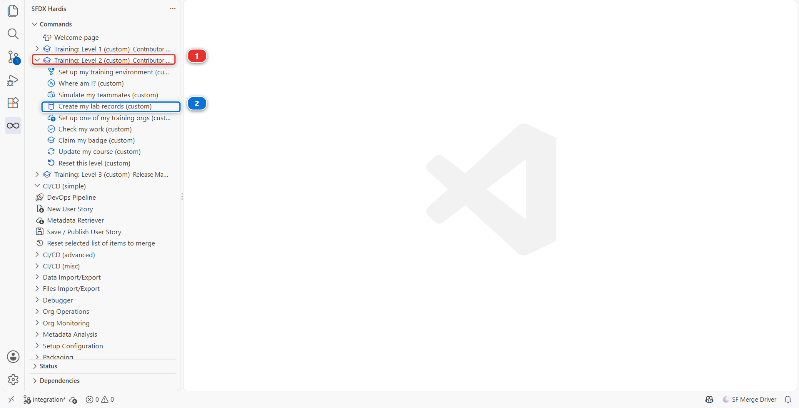
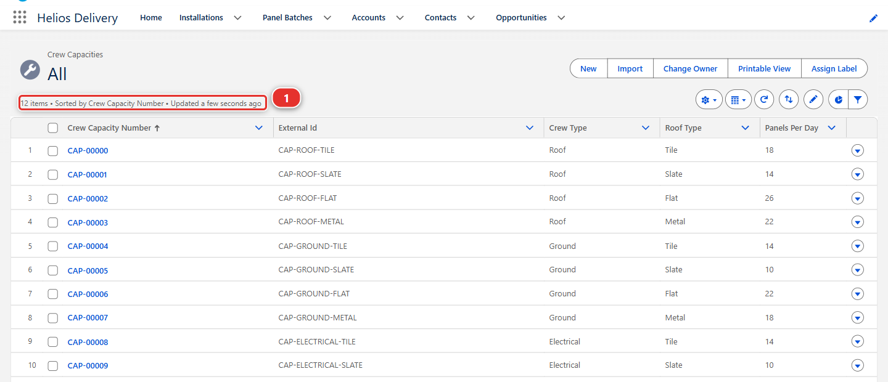
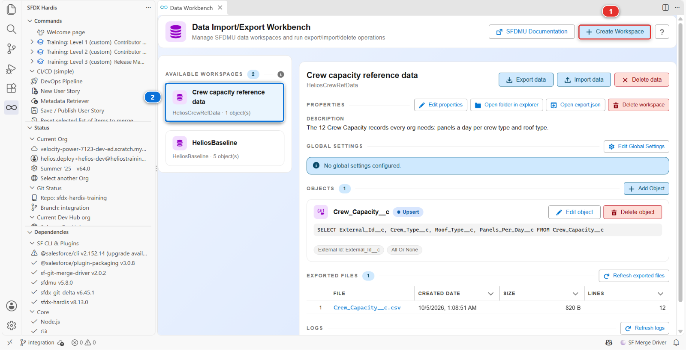
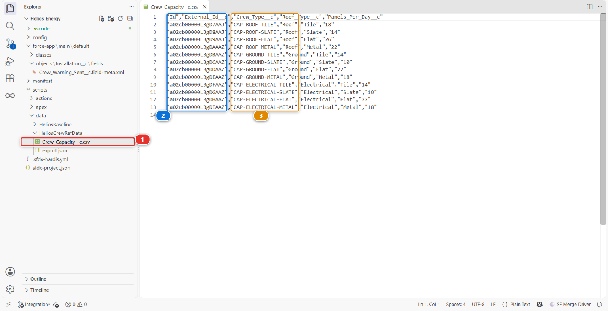
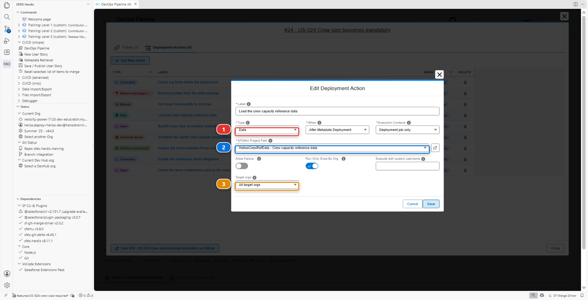
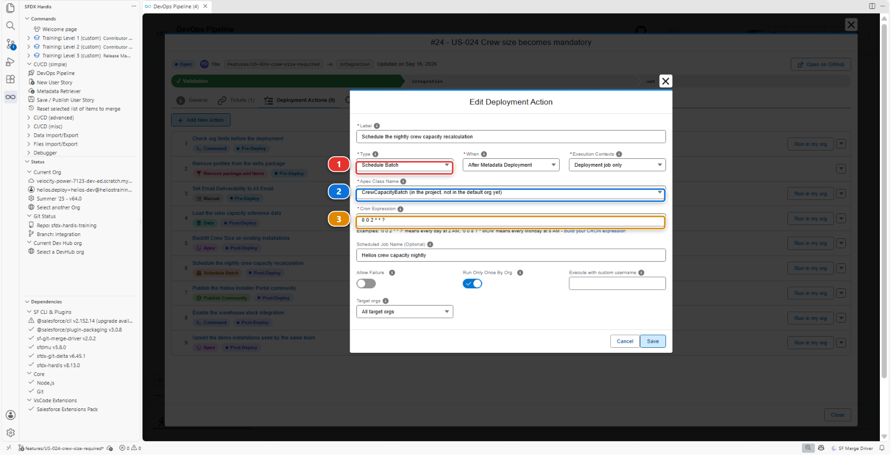
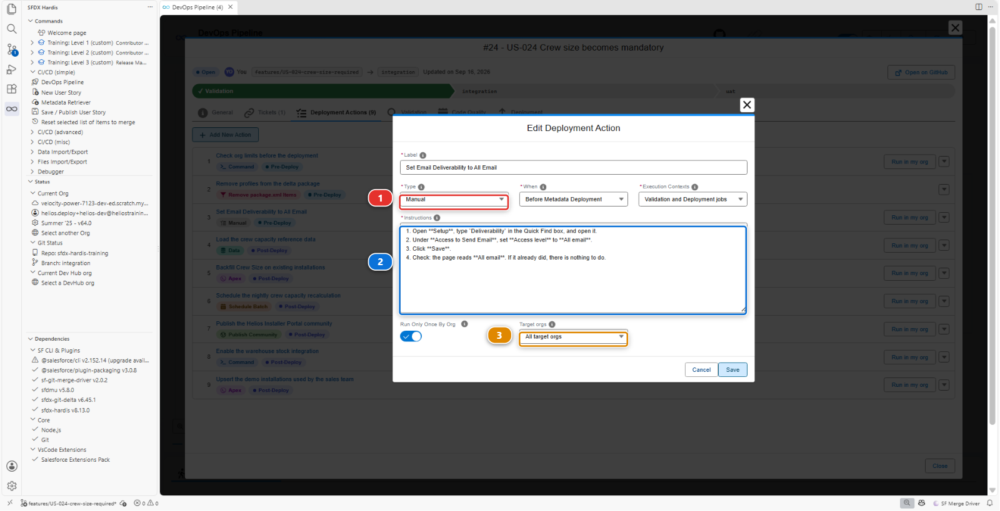
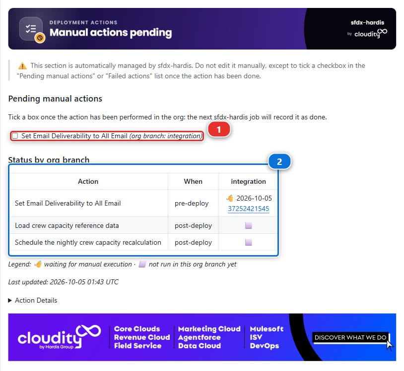

# Lab 2.4 - Livrer des données de référence et un batch avec des deployment actions

**Niveau** : 2 Contributeur avancé

**Durée** : ~30 min

**Vous allez** : rencontrer la pire espèce d'échec, celle où rien n'échoue, et la corriger avec trois
deployment actions de trois types différents.

## La situation

> **US-026 - Crew capacity reference data and nightly recalculation**
>
> As a planner, I want capacity rules per crew type and a nightly job that recalculates them, so
> that the planning board is right every morning and I get a summary of it in my inbox.
>
> Critères d'acceptation :
>
> - 12 enregistrements Crew Capacity existent dans chaque org
> - Le batch est planifié toutes les nuits
> - Le planificateur reçoit l'e-mail de synthèse du matin

Vous le construisez, le déploiement est vert, tout le monde valide, et trois semaines plus tard un
planificateur dit que le tableau ne s'est jamais mis à jour. La métadonnée est arrivée. Rien d'autre.

**Un déploiement transporte de la métadonnée. Il ne transporte pas d'enregistrements, pas de jobs
planifiés, et rien de ce qu'un humain a dû cliquer dans Setup.** Chacune de ces choses doit être
déclarée, sinon elle arrive une fois dans votre org et nulle part ailleurs, pour toujours.

## Avant de commencer

- [ ] [Lab 2.3](2-3-fix-broken-records-with-an-apex-deployment-action.md) terminé et mergé
- [ ] `helios-dev` au niveau d'`integration`

## Les étapes

### 1. Prendre la story et construire la métadonnée

**New User Story** **(2)**, sous **Project Contribution Workflow** **(1)** du panneau DevOps
Pipeline. Nom `US-026-crew-capacity-data`, org `helios-dev`.


Dans `helios-dev`, créez :

- Un objet personnalisé **Crew Capacity** (`Crew_Capacity__c`), avec :
  - `External_Id__c`, Text 40, **External Id**, **Unique**
  - `Crew_Type__c`, Picklist : `Roof`, `Ground`, `Electrical`
  - `Roof_Type__c`, Picklist : `Tile`, `Slate`, `Flat`, `Metal`
  - `Panels_Per_Day__c`, Number 3,0
- Un onglet pour lui, pour retrouver les enregistrements dans l'application : **Setup > Tabs**,
  **New** sous **Custom Object Tabs**, objet **Crew Capacity**, n'importe quel style d'onglet. Gardez
  la visibilité par profil que propose l'assistant. Sur le dernier écran, **Add to Custom Apps**,
  décochez **Include Tab** en haut de la liste, puis cochez **Helios Delivery** seule : les autres
  applications n'en ont pas l'usage
- Une classe Apex `CrewCapacityBatch` qui recalcule `Total_Capacity_kW__c` sur les installations
  planifiées et que Salesforce peut lancer selon une planification, plus sa classe de test
  `CrewCapacityBatchTest`. **Vous n'avez pas à les écrire.** Copiez-les depuis
  `scripts/apex/samples/` du repository : ce qu'elles calculent importe bien moins ici que le fait que
  quelqu'un doive les planifier dans chaque org, ce qui est tout l'objet du lab
- Les accès, sur **Helios Delivery Manager** : **Read**, **Create** et **Edit** sur Crew Capacity,
  **Read** et **Edit** sur ses quatre champs, et sous **Tab Settings** sur la même page, **Available**
  et **Visible**. Les planificateurs entretiennent ces nombres, et c'est aussi le permission set que
  porte l'utilisateur de la pipeline dans chaque org : sans lui, le chargement de données de
  l'étape 4 trouverait des champs qu'il n'a pas le droit d'écrire. Le réglage d'onglet est ce qui
  affiche l'onglet dans les autres orgs, là où la visibilité par profil gardée dans l'assistant ne
  voyage jamais

Puis les enregistrements. Helios prend en charge 12 combinaisons, trois types d'équipe par quatre
types de toiture, et chacune a besoin d'un enregistrement Crew Capacity qui dit combien de panneaux
par jour cette équipe pose sur cette toiture. Saisir douze enregistrements n'apprend rien de ce dont
parle ce lab, alors le menu Training les crée : **Training: Level 2** **(1)** > **Create my lab
records** **(2)**, choisissez **Lab 2.4 - the 12 Crew Capacity records**, puis **helios-dev**, et
répondez **Yes** à **Create them?**.



Le panneau vérifie d'abord que votre objet et ses quatre champs sont dans l'org, puis crée les
enregistrements, les liste, et termine par un lien **See them in the org**. Ouvrez-le, ou ouvrez
l'onglet **Crew Capacity** de l'application Helios Delivery et choisissez la vue de liste **All** :
elle indique **12 items** **(1)**, de `CAP-ROOF-TILE` à `CAP-ELECTRICAL-METAL`.
Si le panneau dit qu'un champ manque, terminez d'abord l'objet, puis relancez-le : il met à jour les
mêmes douze enregistrements au lieu d'en créer d'autres.



<details markdown="1"><summary>Sous le capot : comment les enregistrements ont été créés</summary>

L'entrée du menu a lancé :

    node scripts/training.mjs records

qui a chargé `scripts/lab-records/lab-2-4/Crew_Capacity__c.csv` dans `helios-dev` avec
`sf data upsert bulk`, en rapprochant sur `External_Id__c`, et a ajouté une vue de liste **All** à
l'objet s'il n'en avait pas, pour que le lien ait une liste à ouvrir. Sur un vrai projet, quelqu'un saisit ces
enregistrements dans l'org, ou les charge depuis un tableur : dans les deux cas ils n'existent que
dans une org, et c'est le problème que la suite de ce lab résout.

</details>

### 2. Publier et regarder rien échouer

Récupérez l'objet, ses champs, son onglet, l'application `Helios_Delivery`, les deux classes Apex et
`Helios_Delivery_Manager` avec **Commit changes**, commitez-les, puis **Save / Publish**, poussez,
Pull Request. Le contrôle est vert. Mergez. Le déploiement est vert.

Ouvrez maintenant `helios-integration` et regardez :

- L'onglet **Crew Capacity** est dans l'application Helios Delivery, **avec zéro enregistrement**
- `CrewCapacityBatch` existe, **planifié nulle part**
- Personne n'a vérifié que l'org a le droit d'envoyer l'e-mail de synthèse du batch

La fonctionnalité est dans l'org et complètement inerte. C'est pire qu'un échec, parce qu'un échec,
lui, vous prévient.

### 3. Construire un data workspace pour les enregistrements de référence

La story est mergée, donc ce qui manque part dans une deuxième Pull Request pour la même story.
**New User Story**, nom `US-026-crew-capacity-actions`, org `helios-dev` : une branche de suite est
la façon dont une équipe termine une story, et sfdx-hardis le dit lui-même à la fin de chaque
Save / Publish, **ne réutilisez pas la même branche**.

Sur la Welcome page, cliquez sur **Data Workbench**. Le panneau qui s'ouvre s'intitule **Data
Import/Export Workbench**. **Create Workspace** **(1)** est en haut à droite, et les workspaces que
le projet porte déjà sont listés à gauche **(2)** : `HeliosBaseline` est celui dont se sert le menu
Training pour alimenter votre org.

Un workspace est un dossier de fichiers CSV plus la recette qui dit quel objet chacun remplit et
comment. Il est exécuté par [SFDMU](https://github.com/forcedotcom/SFDX-Data-Move-Utility), le chargeur de
données qu'utilise sfdx-hardis, et rien dedans n'est propre à une org.



La capture a été prise à la fin de cette étape : elle montre déjà `HeliosCrewRefData` sous
`HeliosBaseline`. La vôtre ne montre que `HeliosBaseline` tant que vous ne l'avez pas créé.

Créez un nouveau workspace :

1. **Create Workspace** **(1)**, et remplissez ses trois champs :
   - **Workspace Name** : `HeliosCrewRefData`, le nom de son dossier sous `scripts/data/`
   - **Display Label** : `Crew capacity reference data`, le nom qu'affichent les panneaux, par
     exemple quand vous choisissez ce workspace dans une action de déploiement à l'étape 4
   - **Description** : `The 12 Crew Capacity records every org needs: panels a day per crew type and
     roof type.`
2. **Add Object**, et collez ceci dans **SOQL Query**. Elle nomme l'objet et les quatre champs que
   vous avez créés :

    ```sql
    SELECT External_Id__c, Crew_Type__c, Roof_Type__c, Panels_Per_Day__c FROM Crew_Capacity__c
    ```

3. **Operation** : **Upsert**
4. **External Id (for Upsert)** : `External_Id__c`

Puis **Export data**. Il pose deux questions : s'il faut utiliser votre org par défaut, `helios-dev`,
et si vous confirmez l'export. Oui aux deux. Le panneau tire vos 12 enregistrements dans
`scripts/data/HeliosCrewRefData/Crew_Capacity__c.csv`.

Ouvrez ce fichier **(1)** et lisez-le. Douze lignes, une colonne par champ, chacune avec un
identifiant externe stable **(3)**, et une colonne `Id` en premier **(2)** : les identifiants d'enregistrement de `helios-dev`,
qui ne veulent rien dire ailleurs et que l'import ignore, parce qu'il fait correspondre sur
l'identifiant externe. Ce fichier est désormais versionné, relu et déployé comme n'importe quelle
autre source. Les dossiers `logs`, `reports` et `target` que l'export a aussi écrits à côté sont
ignorés par git : rien à commiter de ce côté.



!!! tip "Pourquoi l'identifiant externe n'est pas facultatif"
    `Upsert` sur `External_Id__c` veut dire que lancer l'import deux fois met à jour les mêmes douze
    enregistrements au lieu d'en créer douze de plus. Sans identifiant externe stable, l'import n'est
    pas rejouable, et un import qui n'est pas rejouable ne peut pas faire partie d'une pipeline.

### 4. Déclarer les trois actions

Les actions appartiennent à une Pull Request, elle doit donc exister d'abord : commitez le workspace,
son `export.json` et le fichier CSV, **Save / Publish**, et ouvrez la Pull Request. Ouvrez-la ensuite
dans le panneau **DevOps Pipeline**, onglet **Deployment Actions**, et ajoutez-en trois.

**Un : charger les données de référence.**



| Champ              | Valeur                              |
|--------------------|-------------------------------------|
| Type               | **Data**                            |
| Label              | `Load crew capacity reference data` |
| When               | After Metadata Deployment           |
| SFDMU Project Path | `HeliosCrewRefData`                 |
| Execution Contexts | Deployment job only                 |
| Target orgs        | All target orgs                     |

**Deployment job only**, pas les deux jobs, parce qu'un job de validation est une répétition : il
contrôle la métadonnée et ne change rien. Un import écrit des enregistrements pour de vrai, il n'a
donc rien à faire pendant un contrôle.

**Type** **(1)** décide des champs que montre le reste de la boîte. **SFDMU Project Path** **(2)**
est une liste déroulante des workspaces sous `scripts/data/`, il nomme donc `HeliosCrewRefData`
plutôt que son chemin. **Target orgs** **(3)** sur **All target orgs** veut dire toutes les orgs dans
lesquelles la pipeline déploie.

**Deux : planifier le batch.**



| Champ                         | Valeur                                             |
|-------------------------------|----------------------------------------------------|
| Type                          | **Schedule Batch**                                 |
| Label                         | `Schedule the nightly crew capacity recalculation` |
| Apex Class Name               | `CrewCapacityBatch`                                |
| Cron Expression               | `0 0 2 * * ?` (chaque nuit à 02:00)                |
| Scheduled Job Name (Optional) | `Helios crew capacity nightly`                     |
| Run Only Once By Org          | oui                                                |

**Schedule Batch** **(1)** remplace le champ de script par deux champs à lui : **Apex Class Name**
**(2)**, une liste déroulante des classes planifiables du projet, et **Cron Expression** **(3)**, que
la boîte explique avec des exemples sous le champ.

**Trois : celle que personne ne peut automatiser.**



Certaines choses n'ont pas d'API. La délivrabilité des e-mails est la plus connue : le droit pour une
org d'envoyer des e-mails tout court est un réglage de Setup qu'aucun déploiement ne peut changer. Le
batch envoie au planificateur une synthèse quand il a fini, et dans une org où la délivrabilité n'est
pas sur **All email**, cet e-mail est jeté sans un mot.

| Champ        | Valeur                                  |
|--------------|-----------------------------------------|
| Type         | **Manual**                              |
| Label        | `Set Email Deliverability to All Email` |
| When         | **Before Metadata Deployment**          |
| Instructions | les quatre lignes numérotées ci-dessous |
| Target orgs  | All target orgs                         |

```
1. Open **Setup**, type `Deliverability` in the Quick Find box, and open it.
2. Under **Access to Send Email**, set **Access level** to **All email**.
3. Click **Save**.
4. Check: the page reads **All email**. If it already did, there is nothing to do.
```

Sur vos scratch orgs, c'est déjà sur **All email**, l'étape prend donc dix secondes. Sur un vrai
projet, c'est l'étape que les gens oublient : chaque rafraîchissement de sandbox remet une sandbox
sur **System email only**, et le premier signe est un planificateur qui demande pourquoi la synthèse
n'arrive plus.

**Manual** **(1)** ne laisse qu'un champ qui compte, **Instructions** **(2)**, une zone multiligne
qui accepte le Markdown : numérotez les clics, et terminez par ce que la personne doit voir après.
**Target orgs** **(3)** reste sur **All target orgs**, parce que ce clic est nécessaire dans chaque
org.

**When** est sur **Before Metadata Deployment**, contrairement aux deux autres. L'org doit avoir le
droit d'envoyer des e-mails avant que quoi que ce soit qui en envoie y arrive : la personne qui merge
fait donc ce clic d'abord, puis merge. Une étape manuelle déclarée avant le déploiement est listée en
premier dans le commentaire de la Pull Request, c'est là qu'elle la lit.

Une étape manuelle ne fait rien. Elle **apparaît dans le commentaire de la Pull Request et dans le
rapport de déploiement**, de sorte que la personne qui livre en production est prévenue, dans la
livraison elle-même, qu'il y a un clic à faire. C'est la différence entre une étape manuelle qui est
faite et une qui vit dans une page Confluence que personne n'ouvre.

Écrivez-la donc pour quelqu'un qui n'a jamais vu votre story : chaque clic, dans l'ordre, avec les
noms exacts à l'écran, et ce que la page montre une fois que c'est fait, comme les quatre lignes
ci-dessus. Le release manager la fait dans une org que vous n'avez jamais ouverte, souvent le jour
de la livraison. S'il doit deviner ce que vous vouliez, il devinera, et une mauvaise supposition en
production est pire que pas d'étape du tout.

### 5. Lire le commentaire de la Pull Request

L'éditeur a écrit les trois actions dans `scripts/actions/`, dans un fichier nommé d'après votre Pull
Request. Commitez-le, **Save / Publish**.

Quand le contrôle se termine, sfdx-hardis publie un commentaire **Deployment Actions** sur la Pull
Request :



- **Pending manual actions** **(1)** : votre étape de délivrabilité, avec une case à cocher, pour
  `integration`. Faites le clic dans l'org, puis cochez la case : le job suivant l'enregistre comme
  faite
- **Status by org branch** **(2)** : une ligne par action, avec son moment. L'étape de délivrabilité,
  **pre-deploy**, attend quelqu'un ; l'import et la planification, **post-deploy**, sont marqués
  **skipped**, parce qu'un contrôle ne change rien

Mergez, et regardez le job de déploiement : l'import de données tourne, le batch est planifié, et
l'étape manuelle reste en attente jusqu'à ce qu'une personne dise qu'elle est faite.

### 6. Vérifier dans l'org d'intégration

Ne vous contentez pas de la coche verte. **Ouvrez l'org et regardez :**

- L'onglet **Crew Capacity** de l'application Helios Delivery, sur sa vue de liste **All**, a 12
  enregistrements
- **Setup > Scheduled Jobs** liste `Helios crew capacity nightly`
- L'étape manuelle est listée comme restant à faire, parce que vous ne l'avez pas faite

Faites l'étape manuelle à la main dans `helios-integration`, puis cochez sa case sous **Pending
manual actions** dans le commentaire de votre Pull Request. Un job lit les cases des Pull Requests
qu'il déploie : cette case est donc enregistrée par le prochain job qui porte US-026, la promotion
vers `uat` du [Lab 3.5](../level-3-release-manager/3-5-promote-to-uat-and-write-release-notes.md). D'ici là, sa ligne sous **Status by org branch** reste en
attente, et c'est normal. Sur une vraie release, la personne qui merge fait le clic et coche la case
avant de merger, et le job de déploiement l'enregistre aussitôt. C'est tout l'intérêt : vous l'avez faite **parce que la pipeline vous l'a
dit**, pas parce que vous vous en êtes souvenu.

!!! warning "Si les enregistrements ne sont pas là et que le job était vert"
    Lisez le log de déploiement à la recherche de la ligne **Listing Post-deployment actions**. Quand
    elle est suivie de *No post-deployment actions defined*, c'est que les actions n'ont jamais été
    trouvées, et que le déploiement a joyeusement continué sans elles.

    C'est arrivé pour de vrai pendant l'écriture de ce cours. Le job de CI n'arrivait pas à lire son
    propre historique git, l'outil ne pouvait donc pas déterminer quelles Pull Requests le merge
    emportait, et il a signalé aucune action plutôt qu'un échec. C'est corrigé dans ce projet, et
    sfdx-hardis s'arrête maintenant au lieu de continuer. L'habitude que cela laisse mérite d'être
    gardée : quand une fonctionnalité arrive vide, cherchez cette ligne dans le log avant d'accuser
    l'import.

!!! danger "Un import de données réussit quand l'objet est absent"
    Celle-là mérite d'être connue pour le reste de votre carrière, parce que c'est SFDMU qui se
    comporte comme prévu et que cela ressemble exactement à un succès :

    ```
    [WARNING] Describe failed for {Crew_Capacity__c}: The requested resource does not exist
    [WARNING] {Crew_Capacity__c} is missing in the Target.
    [WARNING] {Crew_Capacity__c} Object will be excluded from the process.
    [WARNING] Object set 1 has no objects to process after validation. Skipping.
    ===== MIGRATION JOB ENDED =====
    Command succeeded.
    Exit code 0 (SUCCESS).
    ```

    **Exit code 0.** L'action est signalée comme exécutée, le job est vert, et pas un enregistrement
    n'a été écrit. Si l'objet n'a jamais atteint l'org, pour quelque raison que ce soit, l'import
    censé le remplir ne dit rien de plus fort qu'un avertissement que personne ne lit.

    C'est pourquoi le contrôle de cette étape porte sur les enregistrements et non sur la coche, et
    c'est pourquoi ces deux lignes `WARNING` valent d'être cherchées dans un log de déploiement quand
    une fonctionnalité arrive vide.

L'habitude derrière tout cela : **un déploiement vert prouve que la métadonnée est entrée, et ne
prouve rien d'autre.** L'org est la seule chose qui vous dise qu'une action a tourné.

<details markdown="1"><summary>Sous le capot : les trois types d'action</summary>

Les trois sont des entrées du même fichier YAML sous `scripts/actions/` :

    commandsPreDeploy:
      - id: email-deliverability
        label: Set Email Deliverability to All Email
        type: manual
        parameters:
          instructions: |
            1. Open **Setup**, type `Deliverability` in the Quick Find box, and open it.
            ...
    commandsPostDeploy:
      - id: load-crew-capacity
        label: Load crew capacity reference data
        type: data
        parameters:
          sfdmuProject: HeliosCrewRefData
        context: process-deployment-only
      - id: schedule-crew-capacity
        label: Schedule the nightly crew capacity recalculation
        type: schedule-batch
        parameters:
          className: CrewCapacityBatch
          cronExpression: "0 0 2 * * ?"
          jobName: Helios crew capacity nightly
        context: process-deployment-only
        runOnlyOnceByOrg: true

L'import de données lance SFDMU via `sf hardis:org:data:import`, la commande même dont se sert le
menu Training pour alimenter votre org. L'action de planification lance de l'Apex anonyme qui appelle
`System.schedule`. L'action manuelle ne lance rien du tout et ne produit que du texte.

Remarquez ce qu'elles ont en commun : **ce sont des fichiers du repository, relus dans une Pull
Request, rejoués à l'identique dans chaque org.** Un collègue peut lire le diff et voir que cette
story a besoin de données, d'un job et d'un clic, information qui autrement n'existe que dans la
tête de celui qui l'a construite.

<!-- command-links:start -->
Documentation de la commande : [hardis:org:data:import](https://sfdx-hardis.cloudity.com/hardis/org/data/import/)
<!-- command-links:end -->

</details>

## Ce que vous devez voir

- Douze enregistrements Crew Capacity dans `helios-integration`
- `Helios crew capacity nightly` dans **Setup > Scheduled Jobs**
- L'étape manuelle listée dans le rapport de déploiement, cochée par vous

## En cas de problème

**L'onglet Crew Capacity manque dans l'application de `helios-integration`.**
L'onglet ou l'application `Helios_Delivery` n'était pas dans votre Pull Request, ou l'onglet n'est
pas **Visible** sous **Tab Settings** de `Helios_Delivery_Manager`. La visibilité par profil réglée
dans l'assistant reste dans `helios-dev`. Corrigez-le là, récupérez l'élément manquant, et publiez à
nouveau.

**L'import de données échoue sur la sécurité au niveau des champs.**
L'utilisateur de CI ne peut pas écrire les champs : l'autorisation de l'étape 1 manque dans
`Helios_Delivery_Manager`, ou n'a jamais atteint le repository. Un déploiement n'accorde de lui-même
aucune permission de champ à qui que ce soit. Ajoutez-les dans `helios-dev`, récupérez le permission
set, et publiez à nouveau.

**L'import crée des doublons à chaque exécution.**
L'opération est `Insert` et non `Upsert`, ou l'identifiant externe n'est pas renseigné. Ouvrez le
workspace dans le panneau **Data Workbench** et corrigez les deux là.

**L'action de planification échoue avec `Invalid cron expression`.**
Le cron Salesforce a des secondes et un champ jour de la semaine : `0 0 2 * * ?`, pas `0 2 * * *`.

**Le batch est planifié deux fois.**
`runOnlyOnceByOrg` est décoché et le déploiement a tourné deux fois. Supprimez le doublon dans
**Setup > Scheduled Jobs** et cochez-le.

## Vérifiez votre travail

Welcome page > **Training: Level 2** > **Check my work**, puis choisissez le **Lab 2.4**.

## Pour aller plus loin

- [Data workspaces avec SFDMU](https://sfdx-hardis.cloudity.com/salesforce-devops-agent-data-workspaces/)
- [Deployment actions](https://sfdx-hardis.cloudity.com/salesforce-devops-work-on-user-story-deployment-actions/)

[Suite : Lab 2.5 - Passer la barrière de qualité de code et la couverture de tests Apex](2-5-pass-code-quality-and-apex-test-coverage.md){ .md-button .md-button--primary }
