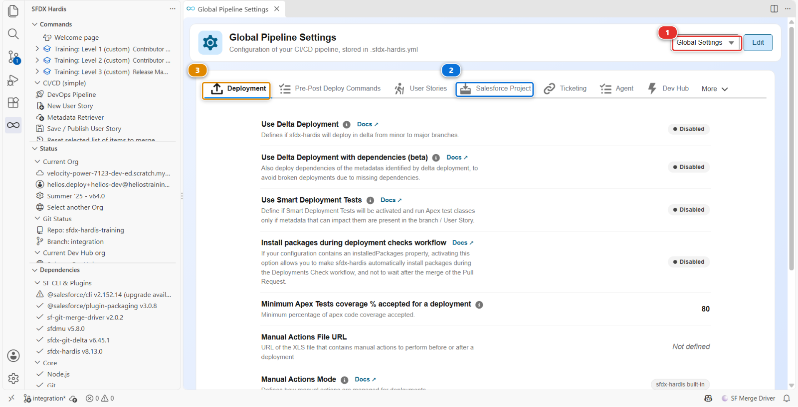

# Lab 2.6 - Permission sets, profils, et pourquoi une autorisation disparaît

**Niveau** : 2 Contributeur avancé

**Durée** : ~25 min

**Vous allez** : courir après une permission qui s'évapore entre un déploiement vert et l'org cible,
et découvrir qu'elle a été retirée exprès.

## La situation

> **US-033 - Crews can read the panel batch cost**
>
> As a delivery crew member, I want to see the cost of the batch I am installing, so that I report
> damage with the right value.

Vous accordez la permission, vous publiez, le contrôle est vert, le déploiement est vert, et la
permission n'est pas dans l'org d'intégration. Rien n'a échoué. Rien ne vous a averti.

C'est le mode de défaillance qui fait perdre confiance dans une pipeline, et il s'explique
entièrement.

## Avant de commencer

- [ ] [Lab 2.5](2-5-pass-code-quality-and-apex-test-coverage.md) terminé et mergé
- [ ] `helios-dev` au niveau d'`integration`

## Les étapes

### 1. Prendre la story et la faire comme un admin le ferait

**New User Story** **(2)**, sous **Project Contribution Workflow** **(1)** du panneau DevOps
Pipeline. Nom `US-033-batch-cost-visibility`, org `helios-dev`.

Les équipes de pose se connectent avec le profil **Helios Crew**. C'est l'un des deux profils que
porte ce repository, à côté d'`Admin`, le profil System Administrator : dans le panneau **DevOps
Pipeline**, ouvrez le menu **Deployment packages**, puis **Package XML**, et la ligne **Profile**
liste les deux.

Dans `helios-dev`, la voie rapide : **Setup > Object Manager > Panel Batch > Fields & Relationships >
Cost > Set Field-Level Security**, cochez **Visible** pour le profil **Helios Crew**, **Save**.

C'est ainsi que la plupart des gens accordent une permission, et c'est là-dessus que ce lab est
construit.

Faites-en un retrieve comme d'habitude : **Commit changes**, **Recent Changes**, **Search Metadata**,
cochez le profil `Helios Crew`, récupérez, et commitez-le depuis **Source Control**. Puis
**Save / Publish**, poussez, Pull Request, vert, merge.

### 2. Découvrir qu'il ne s'est rien passé

Ouvrez `helios-integration` et vérifiez la sécurité au niveau du champ de **Panel Batch > Cost** : la
colonne **Helios Crew** n'est pas cochée. La permission n'y est pas.

Retournez à la Pull Request. Le commentaire dit succès, et le profil fait partie des composants
déployés. Sauf que ce qui a été déployé n'est pas ce que vous avez commité.

### 3. Lire votre propre diff

Votre commit contenait la permission. Vous l'avez vue dans le diff avant de cliquer sur Commit.

Ouvrez le panneau **Source Control**, regardez l'historique de votre branche, et lisez le commit que
**Save / Publish** a fait après le vôtre, `chore(sfdx-hardis): clean sfdx project`. Il ressort
aussitôt la permission que vous aviez ajoutée, avec toutes les autres sections du fichier qu'un
permission set pourrait porter. Ce qui reste est ce que seul un profil peut contenir.

C'est un réglage de projet appelé **minimizeProfiles**, l'une des règles de nettoyage que ce projet a
activées, et vous pouvez le voir dans le panneau **Pipeline Settings**, onglet **Salesforce
Project**.

### 4. Comprendre pourquoi un projet ferait une chose pareille

Les profils sont le pire type de métadonnée à versionner, pour trois raisons qui mordent toutes en
même temps :

1. **Ils sont énormes et ils sont partagés.** Un seul fichier de profil liste toutes les permissions
   d'objet, de champ, d'onglet, d'application et de classe de l'org. Deux personnes qui travaillent
   sur deux stories sans rapport produisent chacune un diff de mille lignes du même fichier, et elles
   entrent en conflit à chaque fois
2. **Un profil récupéré dit non à ce qu'il n'avait pas.** Il liste les champs et objets de votre
   package avec `false` partout où le profil n'avait pas accès au moment de la récupération. Si un
   collègue en a accordé un depuis, déployer votre fichier **le lui éteint**, en silence
3. **Ce que vous récupérez dépend de votre package.** Un profil est récupéré avec seulement les
   permissions des composants de votre package : le même profil a donc une tête différente selon qui
   l'a récupéré et quand

`minimizeProfiles` retire des profils tout ce qu'un permission set pourrait porter à la place, en
laissant les profils ne contenir que ce qui ne peut vraiment vivre nulle part ailleurs : les plages
horaires de connexion, les plages d'adresses IP, les types d'enregistrement par défaut, les
affectations de présentation de page.

La pipeline n'a donc pas perdu votre travail. Elle a refusé de le transporter, parce que le
transporter finirait par supprimer celui de quelqu'un d'autre.

!!! note "Pourquoi les profils restent quand même dans le repository"
    Retirer les profils des sources serait la mauvaise conclusion. Un utilisateur se connecte avec un
    profil, et ce que seul un profil contient, l'application par défaut, la présentation de page de
    chaque objet, les réglages d'onglets, les plages horaires de connexion, doit être identique dans
    chaque org. `Admin` et `Helios Crew` restent donc dans `force-app/main/default/profiles/`,
    restent dans `manifest/package.xml`, et sont déployés avec tout le reste.

    Ils restent **courts** exprès. Un profil récupéré en entier liste des centaines de permissions
    utilisateur, et Salesforce en ajoute et en retire à chaque release, trois fois par an : un profil
    complet commité au printemps peut échouer au déploiement à l'automne sur une permission qui
    n'existe plus. La version courte ne nomme que ce que ce projet a décidé, et `minimizeProfiles` la
    garde courte à chaque fois que quelqu'un en publie un.

### 5. Le faire comme le projet l'attend

Refaites l'autorisation là où elle a sa place. Votre première Pull Request est mergée, celle-ci est
donc une deuxième pour la même story : **New User Story**, nom `US-033-crew-permission-set`, org
`helios-dev`.

Dans `helios-dev` : **Setup > Permission Sets > Helios Delivery Crew > Object Settings > Panel
Batches > Edit**, cochez **Read Access** sur `Cost`, **Save**.

Récupérez le **permission set** cette fois, commitez-le, **Save / Publish**, et ouvrez la Pull
Request. Le rapport **Git Delta package.xml** nomme `Helios_Delivery_Crew`.

Rien à ranger : le profil que vous avez publié à l'étape 1 reste dans le repository, nettoyé, et il
continue d'être déployé comme il l'a toujours été.

Le contrôle passe au vert. Mergez, et vérifiez `helios-integration` : **Setup > Permission Sets >
Helios Delivery Crew > Object Settings > Panel Batches**, `Cost` est lisible. Chaque membre d'équipe
de pose porte ce permission set, quel que soit son profil.

### 6. Regarder l'autre protection, tant que vous y êtes

Ouvrez le panneau **DevOps Pipeline**, puis **Pipeline Settings** dans le menu engrenage. Laissez le
sélecteur de portée **(1)** sur **Global Settings** : ce sont des règles de projet, identiques pour
chaque branche.

Les réglages sont groupés en onglets. Deux d'entre eux font le travail que vous venez de rencontrer,
et il vaut la peine de savoir lequel fait quoi :

| Réglage                            | Onglet                         | Ce dont il protège                                                                                        |
|------------------------------------|--------------------------------|-----------------------------------------------------------------------------------------------------------|
| `autoCleanTypes: minimizeProfiles` | **Salesforce Project** **(2)** | Un profil qui porte des permissions dont la place est sur un permission set                               |
| `autoRemoveUserPermissions`        | **Salesforce Project** **(2)** | Des permissions utilisateur précises qui ne doivent jamais voyager entre orgs, quel qu'en soit le porteur |

Les deux tournent sur votre machine, au moment où vous publiez : ils décident de ce que votre commit
transporte. L'onglet voisin, **Deployment** **(3)**, décide comment la pipeline l'envoie dans chaque
org. Celui-là appartient au release manager, et le Niveau 3 est là où vous le rencontrez.

Sous le capot : ce que le nettoyage a vraiment fait au fichier

La passe de nettoyage de `hardis:work:save` a parcouru le profil que vous aviez commité, et pour
`minimizeProfiles` elle a réécrit son XML dans un commit à part.

Des sections entières sont supprimées, parce qu'un permission set peut toutes les porter :

`agentAccesses`, `classAccesses`, `customMetadataTypeAccesses`, `customPermissions`,
`externalDataSourceAccesses`, `fieldPermissions`, `flowAccesses`, `objectPermissions`,
`pageAccesses`, `ServicePresenceStatusAccesses`.

Trois sections sont allégées plutôt que supprimées, en gardant seulement les entrées qu'un permission
set ne sait pas exprimer :

| Section                   | Ce qui survit                                                                                     |
|---------------------------|---------------------------------------------------------------------------------------------------|
| `recordTypeVisibilities`  | seulement les entrées marquées `default` (ou `personAccountDefault`)                              |
| `applicationVisibilities` | seulement l'application par défaut, et les applications explicitement cachées (`visible` à false) |
| `userPermissions`         | seulement les permissions explicitement **désactivées**, plus tout ce qui est sur le profil Admin |

Et certaines sections ne sont jamais touchées, parce que rien d'autre ne peut les contenir :
`loginHours`, `loginIpRanges`, `layoutAssignments`, `tabVisibilities`, `custom`, `userLicense`.

Un profil a donc toujours un rôle dans cette pipeline. Simplement beaucoup plus petit.

Rien n'a été retiré de votre org. Le nettoyage change **ce que le repository transporte**, jamais ce
que Salesforce contient. Votre autorisation à la mode admin est toujours dans `helios-dev`, et c'est
exactement pour cela que le lab vous demande de la refaire sur le permission set plutôt que de
réparer le fichier à la main.

La règle à retenir : **si une permission peut vivre sur un permission set, mettez-la là.** Ce n'est
pas une opinion de sfdx-hardis, c'est ce que Salesforce recommande depuis des années, et cette pipeline
l'impose au lieu d'espérer.

<!-- command-links:start -->
Documentation de la commande : [hardis:work:save](https://sfdx-hardis.cloudity.com/hardis/work/save/)
<!-- command-links:end -->

## Ce que vous devez voir

- `Cost` accordé sur le permission set **Helios Delivery Crew** dans `helios-integration`
- `Admin` et `Helios Crew` toujours dans `force-app/main/default/profiles/`, sans aucune permission
  de champ dedans

## En cas de problème

**L'édition du permission set n'affiche pas le champ Cost.**
Le champ n'est pas dans les object settings du permission set tant que l'objet n'est pas accordé.
Accordez d'abord la lecture sur **Panel Batch**.

**Le déploiement échoue avec `INSUFFICIENT_ACCESS` sur le permission set.**
L'utilisateur de CI ne peut pas accorder une permission qu'il n'a pas lui-même. Affectez
**Helios Delivery Manager** à l'utilisateur de l'org d'intégration, ce que fait
**Training: Level 2 > Set up one of my training orgs**.

**Le profil revient long de mille lignes.**
Il a été commité après une récupération et n'est jamais passé par le nettoyage. Vérifiez que
`minimizeProfiles` est toujours listé dans l'onglet **Salesforce Project** de **Pipeline Settings**,
puis refaites **Save / Publish**. Ne raccourcissez pas le fichier à la main.

## Vérifiez votre travail

Welcome page > **Training: Level 2** > **Check my work**, puis choisissez le **Lab 2.6**.

## Pour aller plus loin

- [Profils et permission sets](https://sfdx-hardis.cloudity.com/salesforce-devops-work-on-user-story-profiles/)

[Suite : Lab 2.7 - Résoudre un conflit de merge Git avec un collègue](2-7-resolve-a-git-merge-conflict.md){ .md-button .md-button--primary }
