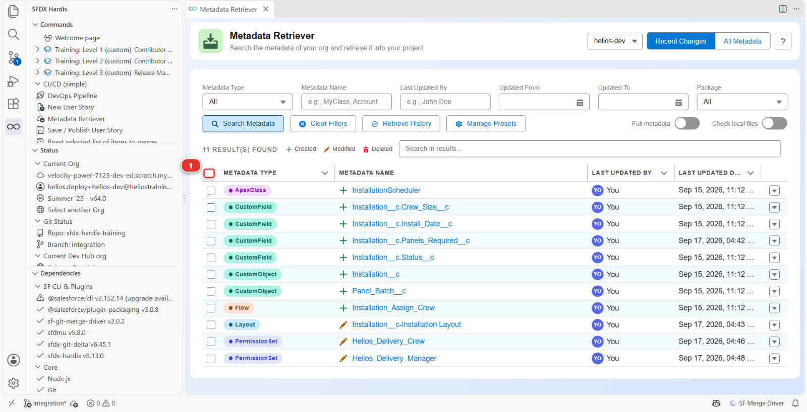
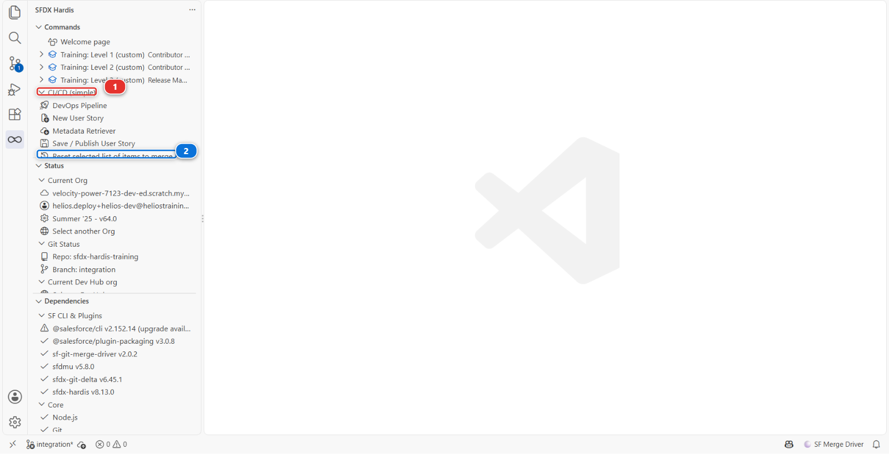
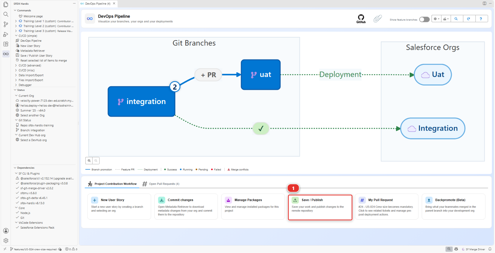

# Lab 2.8 - Se remettre d'avoir commité la mauvaise métadonnée

**Niveau** : 2 Contributeur avancé

**Durée** : ~20 min

**Vous allez** : sur-sélectionner exprès au moment de publier, voir ce que cela fait à une Pull
Request, et apprendre les deux chemins de récupération.

## La situation

Il est tard, le Metadata Retriever a quatre-vingt-dix lignes, et la case de l'en-tête les sélectionne
toutes d'un clic. Vous la prenez, vous récupérez, vous commitez, vous publiez, et votre Pull Request
propose maintenant de modifier quatre-vingts choses que vous n'avez jamais regardées.

Personne ne peut relire cela. Pire, certaines de ces quatre-vingts sont le travail d'autres personnes
tel qu'il existait dans votre org avant que vous la rafraîchissiez, ce qui veut dire que merger votre
Pull Request les ferait revenir en arrière en silence.

Ce lab est court et c'est celui dont vous vous servirez vraiment.

## Avant de commencer

- [ ] [Lab 2.7](2-7-resolve-a-git-merge-conflict.md) terminé et mergé
- [ ] Rien en attente dans le panneau **Source Control** auquel vous teniez encore

## Les étapes

### 1. Faire le désordre exprès

**New User Story** **(2)**, sous **Project Contribution Workflow** **(1)** du panneau DevOps
Pipeline. Nom `US-038-installation-notes-tidy`, org `helios-dev`.

Dans `helios-dev`, faites une petite vraie modification : sur la présentation de page Installation,
déplacez `Crew Size` au-dessus d'`Install Date`.

Ouvrez maintenant **Commit changes**, cherchez les modifications récentes, et cette fois cliquez sur
la case de l'**en-tête du tableau** **(1)**, qui sélectionne toutes les lignes d'un coup.
Récupérez-les toutes, commitez-les toutes depuis **Source Control**, publiez et poussez.

Dans une org où Agentforce est activé, la liste peut aussi porter des lignes `GenOpAgentConfig`, aux
noms de vos flows. Salesforce CLI ne connaît pas encore ce type, donc la récupération s'arrête et le
nomme : décochez ces lignes et relancez la récupération.

### 2. Regarder ce que vous avez fait

Regardez le rapport **Git Delta package.xml** que la publication a proposé : bien plus que l'unique
présentation de page que votre story a modifiée. Ouvrez la Pull Request et lisez le diff.

Au minimum il y a **un profil**, `Admin`, le profil System Administrator. Le repository le porte
court, quelques lignes, et il est revenu plus long de plusieurs centaines de lignes : chaque champ que
vous avez créé dans Setup depuis le Niveau 1 a donné à ce profil une sécurité au niveau du champ, et
une récupération de toute l'org ramène tout cela avec. Ce qui vient d'autre dépend de ce qu'a vécu
votre org, et une récupération de toute l'org sur un vrai projet en emporte généralement une partie
:

- **une vue de liste** restée d'une story antérieure, toujours dans votre org, ou une **transaction
  security policy** que Salesforce a créée tout seul
- **des fichiers Apex et LWC qui ne diffèrent que par leur dernier saut de ligne** : Salesforce le
  supprime, le repository le garde
- **un champ dont la description affiche maintenant `&apos;` là où elle affichait `'`** : le même
  texte, écrit autrement

Rien de tout cela n'est votre story, et une partie voyagerait vers toutes les orgs. Et quand votre
org est en retard sur `integration`, ce qui est le cas dès qu'un collègue a mergé depuis votre
dernier backpromote, la même récupération ramène leurs composants tels qu'ils étaient avant : le diff
se lit alors comme des **suppressions**, et le merger défait leur travail. Voilà le vrai dégât : une
sélection trop large ajoute du bruit, et elle peut proposer de défaire du travail.

### 3. Récupérer : réinitialiser la sélection

Tout le reste de ce cours est une carte dans un panneau. Celle-ci ne l'est pas : elle n'a pas de
carte, et le seul chemin pour l'atteindre est la vue **SFDX HARDIS** de la barre de gauche, qui liste
toutes les commandes sfdx-hardis, qu'un panneau les expose ou non.

Ouvrez-la, puis **CI/CD (simple)** **(1)**, puis **Reset selected list of items to merge** **(2)**.

Elle fait plus que ce que son nom laisse entendre, et savoir exactement quoi vous évite de la défaire
deux fois. En une passe, elle :

1. **Défait chaque commit** que votre branche a fait depuis qu'elle a quitté `integration`, sans
   toucher à un seul fichier. Les commits disparaissent, vos modifications restent, sous vos yeux,
   comme si vous n'aviez jamais publié
2. **Vide ce qui était en attente pour le prochain commit**, pour que rien n'attende
3. **Restaure `manifest/package.xml` et `manifest/destructiveChanges.xml`** aux versions du point de
   branchement, ce qui est ce qui efface réellement la sélection
4. **Marque votre branche comme pouvant être écrasée sur GitHub**, parce que ce que vous avez en
   local ne correspond plus à ce que vous avez poussé

Elle vous demande d'abord de confirmer la réinitialisation, et elle refuse net si vous êtes sur la
branche dans laquelle vous alliez merger.

Après cette seule commande, le commit trop large a donc disparu et le déplacement de présentation de
page est de retour devant vous, non commité, dans le panneau **Source Control**. Rien de ce qui est à
vous n'est perdu : la modification est dans Salesforce, et le fichier est toujours sur votre disque.

### 4. Traiter ce que vous avez déjà poussé

**Rien à cliquer dans cette étape.** C'est une décision à prendre avant l'étape 5, et dans ce lab
elle est déjà prise pour vous : personne n'a relu votre Pull Request, vous êtes donc dans le premier
cas ci-dessous, et l'étape 5 fait ce qu'elle dit. Lisez quand même le second cas, c'est celui dans
lequel un vrai projet vous mettra.

En local vous êtes propre. La branche sur GitHub ne l'est pas : elle porte encore le commit trop
large, parce que la réinitialisation n'a changé que la copie de votre machine.

**Personne ne l'a relue** (le cas normal, et le vôtre ici) : la branche corrigée passe par-dessus
quand vous republiez à l'étape 5. C'est ce que la réinitialisation a autorisé, et la publication le
fait sans demander. L'erreur disparaît de l'historique comme si elle n'avait jamais eu lieu, ce qui, sur votre
propre branche de feature avant relecture, est exactement ce que vous voulez.

**Quelqu'un l'a déjà relue**, ou la branche est partagée : ne faites pas de force push. Réécrire
l'historique sous un relecteur est la façon dont un commentaire de revue finit attaché à un commit
qui n'existe plus. Commitez plutôt l'état corrigé comme un nouveau commit, pour que le diff montre
l'erreur et sa correction, les deux visibles.

!!! danger "Le force push est pour une branche que vous seul avez touchée"
    La règle ne porte pas sur git, elle porte sur les gens. Posez-vous une question : est-ce que
    quelqu'un d'autre a tiré cette branche, ou l'a commentée ? Si oui, l'historique est partagé et
    vous ajoutez dessus. Si non, elle est à vous et vous pouvez la ranger.

### 5. Publier à nouveau, correctement

Tout ce que le retrieve a rapatrié est toujours dans vos fichiers, non commité. Dans le
panneau **Source Control**, stagez **un seul fichier**, la présentation de page. Commitez-le, puis
jetez le reste : clic droit sur **Changes**, **Discard All Changes**.

Puis **Save / Publish** **(1)** à nouveau.

Le rapport **Git Delta package.xml** ne nomme plus qu'un composant, la présentation de page, et la
publication pousse par-dessus l'ancienne branche sans demander : la réinitialisation l'a autorisé. La
Pull Request montre maintenant un fichier, votre présentation de page.

### 6. L'habitude qui évite cela

Trois vérifications, une dizaine de secondes chacune, avant chaque push :

1. **Lisez le rapport Git Delta package.xml.** S'il contient des entrées que vous ne savez pas
   expliquer, arrêtez-vous
2. **Comptez les fichiers du panneau Source Control.** Une story d'un champ fait deux à quatre
   fichiers. Quatre-vingts n'est jamais correct
3. **Parcourez le diff à la recherche de suppressions.** Les ajouts sont en général les vôtres. Les
   suppressions sont en général celles de quelqu'un d'autre

Sous le capot : ce qu'est vraiment "la sélection"

La commande derrière l'entrée de menu est :

    sf hardis:work:resetselection

Il n'y a aucune liste d'éléments cochés stockée quelque part. **Votre sélection, ce sont vos
commits.** Ce que vous avez choisi dans le Metadata Retriever est devenu des fichiers, les fichiers
que vous avez commités sont devenus la branche, et `hardis:work:save` calcule le delta à partir du
diff git entre cette branche et la branche cible, et l'ajoute à `manifest/package.xml`.
Sélectionnez-en trop et le diff est trop large, parce que le diff est tout ce qu'il y a.

C'est pourquoi la correction doit toucher git, et pourquoi cette commande fait exactement trois
choses :

    git reset --soft <point de branchement>     défaire les commits, garder tous les fichiers
    git checkout <point de branchement> -- manifest/   remettre package.xml comme il était
    setConfig('user', { canForcePush: true })   autoriser le prochain push à réécrire la branche

Rien ne touche votre org, et rien ne touche vos fichiers.

La raison pour laquelle une sélection trop large produit des suppressions mérite d'être dite
clairement. Si votre org est en retard sur `integration` et que vous récupérez tout depuis elle, les
fichiers récupérés sont plus anciens que ce qui est sur `integration`, et le diff se lit comme
"enlever ce qu'ils ont ajouté". Un backpromote avant de commencer ([Lab 2.1](2-1-backpromote-your-teammates-work.md)) est ce qui évite cela.

<!-- command-links:start -->
Documentation des commandes : [hardis:work:resetselection](https://sfdx-hardis.cloudity.com/hardis/work/resetselection/), [hardis:work:save](https://sfdx-hardis.cloudity.com/hardis/work/save/)
<!-- command-links:end -->

## Ce que vous devez voir

- Le rapport **Git Delta package.xml** ne nommant qu'un seul `Layout`
- Un diff de Pull Request d'un seul fichier : la présentation de page
- Votre modification de présentation de page toujours présente dans `helios-dev`

## En cas de problème

**La réinitialisation dit que vous avez des modifications en attente.**
Publiez-les ou jetez-les d'abord dans le panneau **Source Control**, puis relancez la
réinitialisation.

**Après la nouvelle publication, le rapport Git Delta nomme encore plusieurs composants.**
Vous avez commité plus que la présentation de page après la réinitialisation. Tout ce que le
retrieve a rapatrié est toujours dans vos fichiers, et seul ce que vous commitez entre dans
le package : réinitialisez à nouveau, et stagez un seul fichier.

**Vous avez déjà mergé la mauvaise Pull Request.**
Annulez-la sur `integration` avec le bouton **Revert** que GitHub propose sur une Pull Request
mergée, puis refaites la story proprement. N'essayez pas de réparer `integration` à la main.

## Vérifiez votre travail

Welcome page > **Training: Level 2** > **Check my work**, puis choisissez le **Lab 2.8**.

## Pour aller plus loin

- [Publier votre User Story](https://sfdx-hardis.cloudity.com/salesforce-devops-publish-user-story/)
- [Nettoyer un repository à la main](https://sfdx-hardis.cloudity.com/salesforce-devops-manual-repo-clean/)

[Suite : Lab 2.9 - Épreuve finale : livrer une User Story qui a tout](2-9-capstone-deliver-a-user-story-that-has-it-all.md){ .md-button .md-button--primary }
