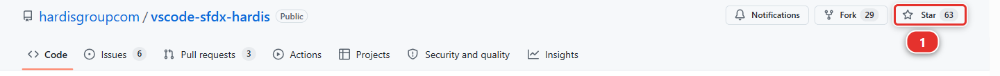

# Lab 3.11 - Épreuve finale : mener un cycle de release hebdomadaire

**Niveau** : 3 Release Manager

**Durée** : ~45 min

**Vous allez** : faire une semaine entière d'une traite, sans pas-à-pas, et finir avec quelque chose
que vous pourriez montrer à quelqu'un.

## La situation

Lundi matin. Deux Pull Requests attendent, le métier attend une livraison jeudi, et personne ne va
vous dire dans quel ordre faire les choses.

## Avant de commencer

- [ ] Labs 3.1 à 3.10 terminés
- [ ] Les quatre orgs de la pipeline fonctionnelles, les quatre branches qui déploient

## La semaine

### Lundi : recevoir ce que les contributeurs vous ont envoyé

Deux Pull Requests attendent. **US-020**, ouverte depuis le [Lab 3.4](3-4-merge-colliding-pull-requests.md) et toujours en échec. Et une
nouvelle de Romain : **Training: Level 3** > **Simulate my teammates**, et choisissez
**US-055 Install Date says which day it means**.

Deux autres choses attendent, et pas dans une Pull Request : **US-058**, la durée de garantie, et
**US-060**, le signal d'échafaudage, posées dans `uat` depuis le [Lab 3.10](3-10-promote-a-subset-with-promotion-branches.md) parce que la
promotion branch est passée à côté. La formulation a été validée pendant le week-end et les équipes
ont été informées lundi. Rien à en faire aujourd'hui, et c'est jeudi que cela compte.

Pour chacune des deux :

- Lisez le commentaire sfdx-hardis
- Lisez le diff avec les quatre questions du [Lab 3.2](3-2-review-a-contributor-pull-request.md) : est-ce que cela correspond à la story, est-ce
  que quelque chose disparaît, les permissions sont-elles sur un permission set, est-ce réversible
- Mergez-la ou renvoyez-la avec un commentaire, et dites pourquoi

US-020 échoue toujours à son contrôle. Elle reste chez son auteur, avec l'échec nommé. Ne la corrigez
pas vous-même : vous relisez et mergez ce que les contributeurs envoient, et vous ne l'écrivez pas à
leur place.

### Mardi : merger et déployer en integration

Mergez ce qui est prêt, dans un ordre que vous savez justifier. Regardez le déploiement, lisez ce
qu'il a envoyé et ce qu'il a sauté, et vérifiez l'org ensuite.

### Mercredi : promouvoir en UAT

Créez la promotion d'`integration` vers `uat`. Lisez les deployment actions qu'elle transporte
**avant** de merger, et faites les étapes manuelles ensuite.

Vérifiez dans `helios-uat` que les stories sont utilisables, pas seulement déployées.

### Jeudi : livrer en production

Promouvez d'abord `uat` vers `preprod`, et vérifiez que `helios-preprod` se comporte bien. Créez
ensuite la livraison, la Pull Request de `preprod` vers `main`, intitulée `Release ...`. Lisez la
ligne de compteurs du commentaire sfdx-hardis et arrêtez-vous si quelque chose est supprimé auquel
vous ne vous attendiez pas. Mergez, regardez, vérifiez, faites les étapes manuelles.

Tout ce que le [Lab 3.7](3-7-hotfix-and-retrofit.md) a posé sur `preprod` est déjà dans `main`, cette livraison ne devrait donc pas
le redéplacer. Lisez la ligne de compteurs avec cela en tête : ce qui sort cette semaine est le help
text de Romain, les retrofits qui remontent depuis `integration`, et US-058 et US-060, qui attendent
dans `uat` depuis le [Lab 3.10](3-10-promote-a-subset-with-promotion-branches.md). `deleted: 0` reste le nombre sur lequel s'arrêter.

**Cette promotion est aussi ce qui met fin à l'exception.** US-057, US-059 et US-061 sont parties
seules vers `preprod` la semaine dernière ; celle-ci transporte US-058 et US-060 de manière
ordinaire, et `uat` et `preprod` contiennent de nouveau la même chose. Elle merge sans conflit parce
que l'étape 9 du [Lab 3.10](3-10-promote-a-subset-with-promotion-branches.md) a retrofité la promotion dans `integration` le jour même : les
deux fichiers résolus sur la promotion branch retrouvent leurs originaux avec un point commun que
git connaît. Vérifiez-le plutôt que de le supposer : le nœud `uat` du diagramme compte zéro User
Story en attente une fois la promotion mergée, et `helios-preprod` a enfin un champ Warranty Years
sur Panel Batch. Une promotion branch qui n'est jamais suivie d'une promotion complète, c'est ainsi
qu'une pipeline cesse d'être une pipeline.

Générez ensuite les notes de version de la livraison vers `main`, ajoutez en haut la phrase qui dit à
quoi sert cette livraison, et mettez-les dans la description de la Pull Request de `preprod` vers
`main`, comme le [Lab 3.5](3-5-promote-to-uat-and-write-release-notes.md) l'a fait pour `uat`.

### Vendredi : mesurer

Mettez `helios-prod` comme org par défaut dans **Orgs Manager**, pour que le rapport mesure la
production et non votre sandbox, puis lancez le rapport DORA et comparez-le à la ligne de base que
vous avez prise au [Lab 3.6](3-6-release-to-production-and-read-dora-metrics.md).

Relisez ensuite votre semaine, et répondez pour vous-même à trois questions, celles que poserait un
successeur :

- Qu'est-ce qui est sorti cette semaine, et où sont ses notes de version ? Dans la description de la
  Pull Request de livraison
- Qu'est-ce qui n'est pas sorti, et pourquoi ? US-020, renvoyée avec son échec nommé
- Qu'avez-vous dû faire à la main ? Chaque étape manuelle est une candidate à une deployment action
  la prochaine fois

## Ce qui fait de ceci l'épreuve finale

Rien ici n'est nouveau. Chaque étape est un lab que vous avez fait. Ce qui est nouveau, c'est que
**personne ne vous a dit l'ordre**, et l'ordre est le métier.

Trois décisions que vous avez dû prendre sans qu'un lab vous le dise :

1. Quelles Pull Requests entrent dans cette livraison et lesquelles attendent
2. Si celle qui échoue bloque la livraison
3. Si les étapes manuelles sont acceptables, ou si la livraison attend que quelqu'un les automatise

Ces trois-là sont la raison d'être d'un release manager. L'outillage s'occupe de tout le reste, ce
qui est bien l'intérêt de l'avoir.

## Ce que vous devez voir

- Deux Pull Requests relues, une mergée, une renvoyée avec une raison
- `integration`, `uat`, `preprod` et `main` portant toutes la livraison, dans cet ordre, chacune par
  son propre déploiement
- Les notes de version dans la description de la Pull Request de livraison, avec une phrase humaine
  en haut
- Un deuxième rapport DORA à comparer avec la ligne de base du [Lab 3.6](3-6-release-to-production-and-read-dora-metrics.md)
- `uat` qui compte zéro User Story en attente : US-058 et US-060 ont rattrapé les trois stories
  promues avant elles, et la pipeline est alignée de nouveau

## En cas de problème

**Un contrôle échoue et nomme un lab que vous êtes sûr d'avoir fait.**
Lisez ce qu'il dit avoir cherché. Les contrôles vérifient des résultats sur la branche
`integration`, pas des efforts : une story construite dans votre org mais jamais mergée ne compte
pas, et une story mergée dans une branche qui n'est pas `integration` non plus.

**Le contrôle du [Lab 3.7](3-7-hotfix-and-retrofit.md) dit que le hotfix n'est pas dans `integration`.**
Le hotfix a atteint `main` dans la partie 2 du [Lab 3.7](3-7-hotfix-and-retrofit.md), et la partie 3 est ce qui le ramène. Si vous
vous êtes arrêté après la livraison, revenez faire le retrofit : le contrôle lit les deux branches,
parce qu'un correctif que la production a et qu'`integration` n'a pas est un correctif que la
prochaine story retire en silence.

**Une simulation de collègue dit qu'il n'y a rien à commiter.**
Cette story est déjà mergée. Chaque story de collègue se merge une fois par niveau, et celles
qu'utilise le Niveau 3 sont listées dans chaque lab. Rien ne va mal : passez à la suite.

**La promotion de `uat` vers `preprod` de jeudi signale des conflits.**
Le retrofit de l'étape 9 du [Lab 3.10](3-10-promote-a-subset-with-promotion-branches.md) manque, et git retrouve les deux fichiers de la promotion
sans rien qui lui dise quel côté était une décision. Faites ce retrofit maintenant, de `preprod`
vers `integration`, puis promouvez de nouveau `integration` vers `uat` avant de promouvoir `uat` : le
conflit a disparu, parce que `uat` porte alors la réconciliation.

**Un déploiement est vert et la fonctionnalité n'est pas dans l'org.**
Ouvrez le log et trouvez **Listing Post-deployment actions**. S'il dit qu'aucune n'était définie,
c'est que les actions n'ont jamais tourné, et le [Lab 2.4](../level-2-contributor-advanced/2-4-ship-reference-data-and-a-batch-with-deployment-actions.md) explique quoi en faire. Un job vert prouve
que la métadonnée est entrée et rien d'autre.

**Tout cela est trop long pour une seule séance.**
C'est censé être une semaine. Arrêtez-vous à la fin de n'importe quel jour : chacun se termine sur
quelque chose de mergé, et aucun ne reporte un état inachevé sur le suivant.

## Vérifiez votre travail

Welcome page > **Training: Level 3** > **Check my work**, puis choisissez
**Everything in level 3, capstone included**.

Onze contrôles.

## Demandez votre badge

Welcome page > **Training: Level 3** > **Claim my badge**.

Une demande de Niveau 3 rejoue **d'abord les audits des Niveaux 1 et 2**. C'est ainsi que le
prérequis est imposé, parce qu'un Trailmix ne peut rien conditionner. La commande lance ces mêmes
audits sur votre machine avant d'ouvrir quoi que ce soit : vous l'apprenez donc ici plutôt que sur
l'issue.

!!! tip "Si ce cours vous a servi"
    [hardisgroupcom/vscode-sfdx-hardis](https://github.com/hardisgroupcom/vscode-sfdx-hardis) est
    l'extension par laquelle est passé chaque clic de ce cours. Une étoile est ce qui permet à un
    projet open source de rester visible : ouvrez sa page et cliquez sur **Star** **(1)**, en haut à
    droite. Donnez une étoile si vous avez aimé ce cours !

    

Le badge s'appelle **sfdx-hardis Release Manager**.

!!! tip "La mettre en bannière LinkedIn"
    [Trailhead Banner](https://thb.nabondance.me/) dessine une image de couverture LinkedIn à partir
    d'un nom d'utilisateur Trailblazer, et il y affiche le badge sfdx-hardis le plus élevé que vous
    avez réclamé ici. Tapez votre nom d'utilisateur, générez l'image, et mettez-la en bannière de
    votre profil LinkedIn.

## Que faire de tout cela

Trois choses à faire dans la semaine qui suit, par ordre d'utilité :

**Un : emportez la checklist d'installation vers votre propre projet.** La
[checklist d'installation](https://sfdx-hardis.cloudity.com/salesforce-devops-setup-checklist/) est
la liste de tout ce dont une vraie pipeline a besoin. Vous en avez maintenant fait l'essentiel une
fois. Parcourez-la sur le projet où vous travaillez réellement et comptez ce qui manque.

**Deux : supprimez vos orgs de formation, ou gardez-les délibérément.** Les scratch orgs se
suppriment toutes seules au bout de 30 jours. Les deux orgs Developer Edition qui contiennent une
entreprise solaire fictive peuvent très bien rester comme terrain d'essai, et `helios-prod` reste un
Dev Hub d'où créer des scratch orgs. Si vous les gardez, supprimez les secrets
`SFDX_AUTH_URL_INTEGRATION` et `SFDX_AUTH_URL_UAT` s'ils traînent encore, et souvenez-vous que les
certificats JWT de votre fork (votre copie personnelle du repository du cours sur GitHub, par
exemple `github.com/my-username/sfdx-hardis-training`) sont de vrais identifiants vers de vraies
orgs.

**Trois : gardez les promotion branches comme exception.** Le [Lab 3.10](3-10-promote-a-subset-with-promotion-branches.md) vous en a fait
assembler une, et cette semaine a remis la pipeline en place. Sur un vrai projet la pression va dans
l'autre sens : le premier sous-ensemble est accepté pour une bonne raison, le deuxième parce que le
premier a marché, et au bout d'un trimestre plus personne ne sait ce que contient chaque org. Si vous
vous retrouvez à en assembler une toutes les semaines, ce qu'il faut corriger est la validation, pas
l'outillage.

## Merci

Si un lab était flou, faux, ou supposait quelque chose qu'il n'aurait pas dû, dites-le : ouvrez une
issue sur le repository de formation. Les labs les plus difficiles à suivre sont en général ceux que
personne n'a signalés.

## Pour aller plus loin

- [Guide du release manager](https://sfdx-hardis.cloudity.com/salesforce-devops-release-home/)
- [Checklist d'installation pour un vrai projet](https://sfdx-hardis.cloudity.com/salesforce-devops-setup-checklist/)
- [Branches de promotion (Beta)](https://sfdx-hardis.cloudity.com/salesforce-devops-promotion-branches/)
