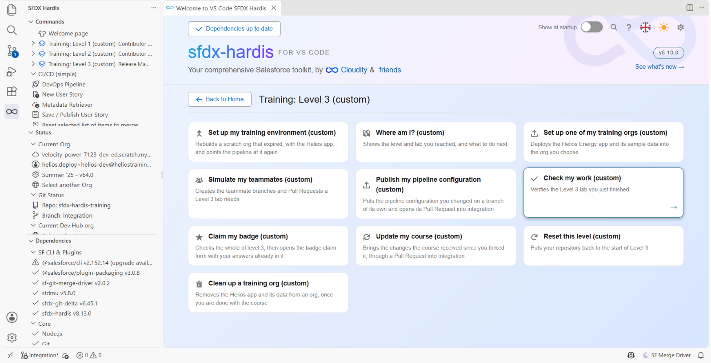
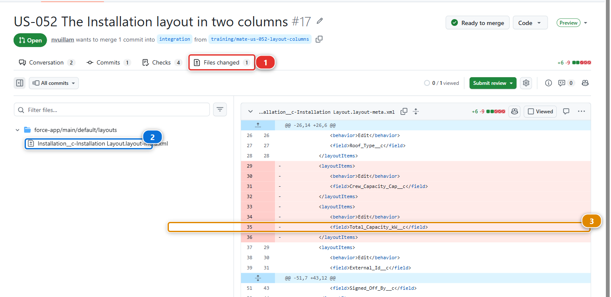

# Lab 3.2 - Relire et merger la Pull Request d'un contributeur

**Niveau** : 3 Release Manager

**Durée** : ~25 min

**Vous allez** : relire le travail de quelqu'un d'autre, trouver ce que le robot n'a pas vu, demander
une correction, et merger.

## La situation

Mariia a une nouvelle story, **US-052 - The Installation layout in two columns** : les
planificateurs font défiler la section Information de chaque installation pendant que sa deuxième
colonne reste vide. Sa Pull Request est ouverte, ses contrôles sont verts, et elle vous attend.

Des contrôles verts veulent dire "ça se déploiera". Ils ne veulent pas dire "c'est juste". Décider du
second est votre travail désormais, **avant** le merge, et c'est la part du métier de release manager
qu'on ne peut pas automatiser. Une revue après le merge est un audit : la modification est déjà dans
`integration`, et en route vers toutes les orgs qui suivent.

## Avant de commencer

- [ ] [Lab 3.1](3-1-configure-the-pipeline-up-to-production.md) terminé : authentification JWT sur les quatre orgs
- [ ] Une copie de travail propre

## Les étapes

### 1. Recevoir la Pull Request de Mariia

**Training: Level 3** > **Simulate my teammates**, depuis la Welcome page, et choisissez
**US-052 The Installation layout in two columns**.

Cela ouvre sa Pull Request vers `integration` dans votre fork (votre copie personnelle du repository
du cours sur GitHub, par exemple `github.com/my-username/sfdx-hardis-training`). Ouvrez-la depuis
**Pull requests**, et attendez ses deux contrôles.

### 2. Lire le robot d'abord

Lisez le commentaire sfdx-hardis, de haut en bas. Quatre choses, dans cet ordre :

1. **Est-ce que ça s'est déployé ?** Le commentaire s'ouvre sur une bannière indiquant *Validation
   Results (deployment simulation)* sur un job de contrôle et *Deployment Results* sur un job de
   merge, avec une ligne en dessous qui dit si c'est passé. L'identifiant de déploiement Salesforce
   n'est affiché nulle part : il est porté par un marqueur HTML invisible, pour qu'un job de merge
   puisse réutiliser la validation en Quick Deploy
2. **Combien est-ce que ça déploie ?** Pas une liste. Une ligne de compteurs : combien de composants
   ont été envoyés, combien ont changé, et combien parmi eux ont été créés, mis à jour, supprimés ou
   laissés inchangés. Si les compteurs ne correspondent pas à la taille de la story, c'est votre
   signal pour aller lire le diff
3. **Qu'est-ce que ça supprime ?** Le compteur `deleted` sur cette même ligne. Les Flows ont droit à
   davantage : une liste **Flow changes** pointant vers un commentaire de diff par Flow, et un
   tableau **Flow deletion** quand des versions sont retirées. Il n'y a pas de section de
   destructive changes pour quoi que ce soit d'autre : un champ supprimé apparaît donc comme un
   nombre et rien de plus. C'est bon à savoir avant de compter sur le commentaire pour en attraper
   un
4. **Tests et couverture.** La couverture à chaque fois, et un bloc replié *Apex test classes* quand
   le job a lancé des classes de test nommées. Les échecs seulement quand il y en a

Le lire dans cet ordre prend deux minutes. Sur US-052 il est vert, un petit nombre de composants mis
à jour et **rien de supprimé**, et il a raison sur tout. Les compteurs exacts sont les vôtres, pas
ceux du lab : ils comparent votre branche avec ce que contient votre `helios-integration`
aujourd'hui, une story qui touche un fichier peut donc quand même mettre à jour quelques composants
quand votre org est en retard. `deleted: 0` est le nombre qui compte ici, et c'est celui dont parle
l'étape 4. Le commentaire vous dit aussi ce qu'il ne peut pas faire à votre place, et c'est
l'étape 3.

### 3. Lire le diff, en cherchant ce que le robot ne peut pas voir

Le robot vérifie que le déploiement fonctionne. Il ne peut pas vérifier que le déploiement est une
bonne idée.

Cliquez sur **Files changed** **(1)**. L'arbre de fichiers à gauche liste ce que la story a touché :
un fichier, la présentation de page **(2)**. Une ligne supprimée est marquée **(3)** : laissez-la
pour l'instant, l'étape 4 en parle.

Parcourez le diff avec quatre questions :

| Question                                               | Pourquoi cela compte                                                                                                                               |
|--------------------------------------------------------|----------------------------------------------------------------------------------------------------------------------------------------------------|
| **Est-ce que cela correspond à la story ?**            | Comparez avec US-052 dans le backlog. Les modifications en plus sont soit du hors-périmètre, soit un accident, et les deux méritent un commentaire |
| **Est-ce que quelque chose disparaît ?**               | Un champ retiré, une valeur de liste de sélection retirée, une permission retirée. Salesforce déploiera volontiers une suppression                 |
| **Les permissions sont-elles sur un permission set ?** | Un profil qui porte des permissions de champ veut dire que quelqu'un a contourné la convention                                                     |
| **Est-ce que ce serait réversible ?**                  | Si cela s'avère faux en production un vendredi, quel est le chemin du retour ?                                                                     |

### 4. Trouver ce que le robot a manqué

Le diff de la présentation de page a trois modifications. Deux vont ensemble :
`Crew_Capacity_Cap__c` quitte la première colonne, et revient dans la seconde. C'est la story.

La troisième est un bloc supprimé **(3)** sur l'image de l'étape 3, et rien ne le remet :
`Total_Capacity_kW__c`. À lire vite, cela ressemble à une partie du déplacement. Relisez : la
capacité installée n'a pas été déplacée dans la deuxième colonne, elle a **quitté la présentation de
page**.

Rien n'échoue. Le champ existe toujours, le contrôle de déploiement est vert. Mais une fois cela
mergé, plus personne ne voit de capacité sur un enregistrement d'installation, et la première
personne à le remarquer sera celle qui lit ce nombre un lundi matin.

Comparez ensuite avec ce qu'a écrit Mariia. La description dit *the crew capacity cap moves to the
second column*. Elle ne dit rien d'un champ qui s'en va. C'est l'écart auquel sert une revue : le
diff dit une chose, la description une autre, et une seule des deux est ce qui sera déployé.

**Rien dans la pipeline ne peut attraper cela.** Une présentation de page avec un champ de moins est
un déploiement valide, la ligne de compteurs dit `updated: 1`, et seul quelqu'un qui connaît l'org
peut voir ce qui manque.

### 5. Demander la correction, sur la ligne

Survolez la ligne où `Total_Capacity_kW__c` est supprimé, cliquez sur le **+** bleu qui apparaît, et
commentez :

> `Total_Capacity_kW__c` comes off the layout with this change, and the description does not say so.
> I think it went missing with the move: can you put it back in the second column, under the cap,
> read only?

Puis **Review changes** en haut à droite de l'onglet, **Comment**, **Submit review**. Sur un vrai
projet vous choisiriez **Request changes**, qui maintient le bouton Merge honnête jusqu'à ce que
l'auteur réponde. GitHub le cache ici parce que les Pull Requests de collègues de ce cours sont
ouvertes depuis votre propre compte, et que personne ne demande de corrections à soi-même.

Deux choses à copier dans ce commentaire :

- **Il dit pourquoi**, pour que le lecteur puisse juger plutôt que de vous croire sur parole
- **Il dit ce qui se passe ensuite**, pour que personne n'ait à demander

**Ne mergez pas.** Le bouton Merge est vert, et il a tort.

### 6. Relire la correction, puis merger

La correction revient à Mariia : un release manager relit et merge les Pull Requests des
contributeurs, et n'écrit pas leurs fonctionnalités. Elle répond le lendemain matin, sur la même
branche. **Training: Level 3** > **Simulate my teammates**, et choisissez **US-052 Mariia puts Total
Capacity back, beside the cap**.

Cela ajoute un commit à sa branche, la même Pull Request se met donc à jour, et ses contrôles
retournent. Rouvrez **Files changed** : GitHub propose de n'afficher que les modifications depuis
votre revue, et il y en a une, `Total_Capacity_kW__c` ajouté dans la deuxième colonne, en lecture
seule, sous le plafond. Le diff entier de la Pull Request déplace maintenant deux champs dans la deuxième colonne, le
plafond et la capacité installée, désormais en lecture seule, et n'en retire aucun.

Quand les contrôles sont verts, mergez avec **Squash and merge**, comme pour toute Pull Request de
feature ([Lab 1.6](../level-1-contributor-basics/1-6-pull-request-deployment-check-and-merge.md)) : les deux commits deviennent une ligne dans l'historique d'`integration`, titrée
comme la Pull Request. Sur un vrai projet, c'est ici que vous cliquez d'abord sur **Approve**.

### 7. Supprimer la branche

GitHub propose le bouton. Prenez-le.

Sous le capot : ce qui a produit le commentaire que vous venez de lire

Le job de contrôle a lancé :

    sf hardis:project:deploy:smart --check

puis a publié le commentaire via l'API GitHub avec le token que le workflow a déjà.

**Le commentaire est mis à jour sur place** à chaque push plutôt qu'ajouté à nouveau, c'est pourquoi
la Pull Request ne se remplit pas de vingt commentaires de robot. Il se retrouve grâce à un marqueur
caché porteur d'une clé de message, et il y a en fait **deux** commentaires de ce genre, mis à jour
indépendamment : un pour le job de contrôle, un pour le job de merge. Un troisième rassemble les
deployment actions, et les Flows en ont un chacun.

Les compteurs qu'il affiche viennent de ce que Salesforce a rapporté sur le déploiement, pas du diff
git. Les deux peuvent différer, et quand c'est le cas, le déploiement est la vérité : c'est ce que
l'org a reçu, ou aurait reçu.

Les suppressions sont le point faible. `hardis:work:save` écrit `manifest/destructiveChanges.xml`
quand un contributeur retire quelque chose, et un contributeur peut en produire un **sans le
vouloir**, en décochant quelque chose dans l'écran de sélection après que cela a été commité. Le
commentaire donne à cela un nombre dans la ligne de compteurs, et un tableau seulement quand des
Flows sont en jeu. Si les compteurs d'une Pull Request montrent quoi que ce soit de supprimé, le
commentaire vous a dit tout ce qu'il dira : le reste, c'est le diff.

<!-- command-links:start -->
Documentation des commandes : [hardis:project:deploy:smart](https://sfdx-hardis.cloudity.com/hardis/project/deploy/smart/), [hardis:work:save](https://sfdx-hardis.cloudity.com/hardis/work/save/)
<!-- command-links:end -->

## Ce que vous devez voir

- Votre commentaire de revue sur la Pull Request de Mariia, sur la ligne qui supprimait
  `Total_Capacity_kW__c`
- Sa correction dans la même Pull Request, et la Pull Request mergée en squash dans `integration`
- La présentation de page Installation dans `integration` avec le plafond et `Total_Capacity_kW__c`
  dans la deuxième colonne

## En cas de problème

**Simulate my teammates dit "Nothing to commit".**
Le scénario a déjà tourné : chacun sert une fois. La Pull Request est dans votre fork, ouverte ou
mergée.

**Les contrôles ne tournent jamais après la correction de Mariia.**
Actions est désactivé, ou les secrets JWT manquent pour `integration`. [Lab 3.1](3-1-configure-the-pipeline-up-to-production.md).

**Vous avez mergé avant la correction.**
Alors `Total_Capacity_kW__c` n'est plus sur la présentation de page dans `integration`. Lancez le
scénario de correction quand même : il ouvre la correction comme une nouvelle Pull Request depuis la
même branche, et vous relisez et mergez celle-là. Si vous avez déjà supprimé sa branche, cliquez
d'abord sur **Restore branch** en bas de la Pull Request mergée.

## Vérifiez votre travail

Welcome page > **Training: Level 3** > **Check my work**, puis choisissez le **Lab 3.2**.

## Pour aller plus loin

- [Relire et merger les Pull Requests](https://sfdx-hardis.cloudity.com/salesforce-devops-validate-merge-request/)
- [Lire les résultats de la Pull Request](https://sfdx-hardis.cloudity.com/salesforce-devops-handle-merge-request-results/)

[Suite : Lab 3.3 - Lire le log de déploiement, et ce que .forceignore lui cache](3-3-deploy-to-integration-and-read-the-log.md){ .md-button .md-button--primary }
