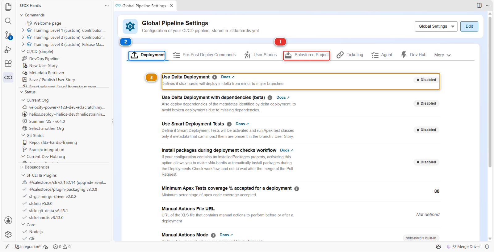

# Lab 3.4 - Trois Pull Requests se percutent : choisir l'ordre de merge

**Niveau** : 3 Release Manager

**Durée** : ~35 min

**Vous allez** : décider de l'ordre dans lequel trois Pull Requests passent, quand deux d'entre elles
se disputent le même fichier et qu'une troisième ne marche pas.

## La situation

Vendredi après-midi. Trois stories portent la semaine :

| Pull Request                              | Auteur             | Contrôles    | Ce qu'elle touche                                |
|-------------------------------------------|--------------------|--------------|--------------------------------------------------|
| **US-018** Cap the crew size              | Mariia Pyvovarchuk | verts        | le flow d'affectation, `Helios_Delivery_Manager` |
| **US-019** Quote PDF                      | Romain Panda       | verts        | `Helios_Delivery_Manager`                        |
| **US-020** Refactor InstallationScheduler | Mariia Pyvovarchuk | **en échec** | `InstallationScheduler`                          |

Deux d'entre elles modifient le même permission set. Une ne se déploie pas. Tout le monde veut
rentrer chez soi.

Décider de ce qui passe, dans quel ordre, et de ce qui attend, c'est le métier.

## Avant de commencer

- [ ] [Lab 3.3](3-3-deploy-to-integration-and-read-the-log.md) terminé
- [ ] Rien de non commité

## Les étapes

### 1. Créer les Pull Requests que vous pouvez encore créer

**Training: Level 3** > **Simulate my teammates**, deux fois : **US-020 Refactor
InstallationScheduler**, et **US-019 Generate a quote PDF from an opportunity**.

C'est sur la Welcome page, où chaque menu de niveau est une page de cartes, et dans la vue
**SFDX HARDIS** de la barre de gauche, où chaque niveau est un dossier à déplier. Les deux chemins
lancent la même chose :

**US-018 n'en fait pas partie.** Vous l'avez mergée au [Lab 2.7](../level-2-contributor-advanced/2-7-resolve-a-git-merge-conflict.md), et chaque scénario de collègue sert
une fois : en rejouer un sur une branche qui a déjà ses fichiers signale "Nothing to commit" et
n'ouvre rien.

US-019 peut faire de même, et ce n'est pas un défaut non plus. Cela dépend de la façon dont vous êtes
arrivé ici : l'épreuve finale du Niveau 2 merge US-019, donc si vous êtes passé directement du
Niveau 2 au Niveau 3 elle est déjà dans `integration`, et si vous avez réinitialisé au Niveau 3 elle
vous attend. Si elle signale "Nothing to commit", ouvrez plutôt sa Pull Request mergée et lisez-la.
Chaque étape ci-dessous fonctionne dans les deux cas.

Deux des trois décisions de ce lab peuvent donc être des décisions que vous avez déjà prises. Les
reprendre avec des yeux de release manager coûte moins cher que de les reprendre, et sert à peu près
autant.

Attendez les contrôles. Ceux de US-020 échoueront.

### 2. Trier avant de toucher à quoi que ce soit

Classez les trois, dans cet ordre de questions :

**Lesquelles sont vertes ?** Une Pull Request en échec n'est pas une décision, c'est une tâche pour
son auteur. Ne passez pas votre vendredi à réparer le refactor de Mariia.

**Lesquelles touchent le même fichier ?** US-018 et US-019 modifient toutes deux
`Helios_Delivery_Manager`. Celle qui merge en second hérite de ce que la première a fait à ce
fichier, et l'étape 5 parle de ce que "hériter" veut dire au juste.

**Laquelle est la plus petite ?** Toutes choses égales par ailleurs, mergez la plus petite d'abord.
Son auteur a moins à refaire si l'autre atterrit mal.

L'ordre que vous voulez : **US-019 d'abord** (petite, verte, personne ne dépend d'elle), puis
**US-018** (verte, plus grosse), et **US-020 repart chez Mariia**. Là où elles sont déjà mergées,
l'onglet **Pull Requests** de la fenêtre `integration` du panneau DevOps Pipeline les liste dans
l'ordre où elles sont passées, ce qui est la même question posée à l'envers.

### 3. Renvoyer US-020, correctement

Ouvrez-la et lisez l'échec. C'est un vrai échec, dans son code, et c'est à elle de le corriger.

Lisez-le correctement avant d'écrire quoi que ce soit, parce que ce n'est pas ce que les mots "tests
en échec" laissent croire. `earliestInstallDate` renvoie désormais un `Datetime`, et
`InstallationSchedulerTest` l'assigne encore à une `Date`, à deux endroits. La classe ne compile pas,
donc aucun test ne tourne. Ce que le commentaire sfdx-hardis vous donne, sous **Deployment errors**,
est une erreur de compilation avec un nom de classe, deux fois, pas une assertion en échec.

Laissez un commentaire de revue qui fait trois choses :

> The check fails to compile `InstallationSchedulerTest`: `earliestInstallDate` returns a `Datetime`
> now and the test still assigns it to a `Date`, in two places. No tests ran. Not blocking anything else, so US-019
> and US-018 go out in this week's release and this one can land on Monday.

Il nomme l'échec, dit à qui il appartient, dit ce qu'il advient de la livraison. Laissez la Pull
Request ouverte et passez à autre chose. Sur un vrai projet vous l'enverriez en **Request changes**.
GitHub ne le propose pas sur une Pull Request ouverte depuis votre propre compte, et dans ce fork les
Pull Requests de collègues sont ouvertes depuis le vôtre : un simple commentaire fait donc l'affaire
ici.

!!! tip "Ne corrigez pas vous-même la Pull Request d'un contributeur"
    C'est plus rapide une fois et coûteux toutes les fois suivantes. L'auteur n'apprend pas l'échec,
    et vous devenez la personne à qui l'on remonte chaque contrôle en échec.

### 4. Merger US-019, ou lire comment elle est passée

Regardez son diff sur `Helios_Delivery_Manager` : un nouveau bloc `<fieldPermissions>` pour
`Panel_Batch__c.Quote_Pdf_Url__c`, ajouté vers le bas du fichier, là où vivent les autorisations
`Panel_Batch__c`.

Verte, petite, rien sur son chemin. Relisez-la comme le [Lab 3.2](3-2-review-a-contributor-pull-request.md) l'a enseigné, puis mergez. Si elle
est déjà mergée, lisez plutôt celle qui l'est et notez combien il y avait peu à en dire.

Rien ici n'a été difficile, et c'est exactement pour cela qu'il vaut la peine de savoir ce qui s'est
passé ensuite.

### 5. Trouver le conflit qui n'a jamais eu lieu

US-018 a accordé `Installation__c.Crew_Capacity_Cap__c`, vers le haut du même fichier. US-019 a
accordé `Panel_Batch__c.Quote_Pdf_Url__c`, vers le bas. Deux personnes, même fichier, même semaine.

**Git les a mergées sans un mot.** Pas de conflit, pas de résolution, pas de second regard. Ouvrez le
fichier sur `integration` et les deux autorisations y sont, dans l'ordre, comme si une seule personne
les avait écrites.

Ce n'est ni de la chance ni de l'intelligence de la part de git. Un conflit demande que les deux
modifications atterrissent au même endroit, dans les quelques lignes de contexte que git compare.
Celles-ci sont à environ soixante-dix lignes l'une de l'autre dans un fichier trié alphabétiquement :
git a donc pris les deux et est passé à autre chose. Le [Lab 2.7](../level-2-contributor-advanced/2-7-resolve-a-git-merge-conflict.md) vous a donné l'autre cas : votre
autorisation `Crew_Notes__c` était à une ligne du `Crew_Capacity_Cap__c` de Mariia, git n'a pas pu
choisir, et il s'est arrêté pour demander.

Ce que le release manager doit en retenir n'est pas "les permission sets entrent rarement en conflit".
C'est ceci :

**Un merge silencieux est le cas courant, et un conflit est le cas rare.** Git vous avertit du cas
rare. Rien ne vous avertit du cas courant : si vous voulez savoir que les deux autorisations ont
survécu, vous devez aller regarder. C'est l'étape 6, et sur un vrai projet c'est une habitude plutôt
qu'une étape.

Quand git s'arrête et demande, les conflits de permission set sont presque toujours **prendre les
deux** : un champ chacun, et le permission set en contient autant qu'il en faut. Résolvez en gardant
les deux blocs `<fieldPermissions>` dans l'ordre alphabétique, puis **attendez que les contrôles
retournent**. Un conflit résolu dans l'éditeur web est un nouveau commit, et il n'a jamais été
validé. Merger sans revalider est la façon dont une résolution qui a perdu une balise fermante
atteint une org.

### 6. Regarder le permission set dans l'org

Dans `helios-integration`, vérifiez que `Helios_Delivery_Manager` a **les deux** nouvelles
permissions de champ : `Crew_Capacity_Cap__c` sur Installation et `Quote_Pdf_Url__c` sur Panel Batch.

S'il en manque une, quelque chose l'a perdue entre la branche et l'org, et la correction est une Pull
Request de suite, pas une modification dans l'org.

### 7. Comprendre ce qui a rendu cela survivable, et ce qui n'est pas là

Trois mécanismes méritent qu'on sache les montrer du doigt. Ouvrez **Pipeline Settings** depuis le
panneau DevOps Pipeline et regardez chacun, parce que seul le premier fait réellement quelque chose
ici.

**Le nettoyage** (`autoCleanTypes`, dans l'onglet **Salesforce Project** **(1)** des **Global
Settings**) est activé, et c'est pourquoi ces deux autorisations étaient deux petits blocs dans un
permission set plutôt que deux modifications dans un profil de mille lignes. Un conflit de profil est
un mauvais après-midi. C'est l'essentiel de la raison pour laquelle le projet interdit les
permissions sur les profils.

**Le gestionnaire d'écrasement** (`packageNoOverwritePath`) protège les composants délibérément
différents d'une org à l'autre. Tout ce qui est listé dans `manifest/package-no-overwrite.xml` est
retiré du package quand l'org cible le possède déjà, pour qu'un déploiement ne puisse pas aplatir un
named credential qui pointe vers un endpoint différent dans chaque environnement. Le projet démarre
avec la liste que reçoit tout projet sfdx-hardis. Elle couvre rapports, tableaux de bord, connected
apps et credentials, Helios ne déploie rien de tout cela, donc rien de ce qu'il déploie n'est encore
protégé : le [Lab 3.5](3-5-promote-to-uat-and-write-release-notes.md) y ajoute la première entrée qui compte, avant la première promotion
vers `uat`. Son emplacement peut être changé par branche, c'est pourquoi vous ne le trouverez pas
dans l'onglet **Deployment** **(2)** global : basculez la portée sur `Branch: integration` et il y
est, sous **Branch-scoped custom Package-No-Overwrite path**.

**Le déploiement delta** est **Use Delta Deployment** **(3)**, dans l'onglet **Deployment** global,
et le [Lab 3.3](3-3-deploy-to-integration-and-read-the-log.md) vous a montré qu'il est **Disabled** ici. Activé, chaque merge déploie les composants
qui ont changé plutôt que le package déclaré. C'est une décision de rapidité et de rayon d'impact,
pas un filet de sécurité : il n'empêche pas un merge d'en écraser un autre, parce que les deux
déploiements envoient ce que leur propre commit contient.

Sous le capot : les trois mécanismes et où chacun vit

| Mécanisme                 | Configuration                                                     | Ce qu'il fait                                                                               |
|---------------------------|-------------------------------------------------------------------|---------------------------------------------------------------------------------------------|
| Nettoyage                 | `autoCleanTypes` dans `config/.sfdx-hardis.yml`                   | Réécrit les sources **au moment du commit**, dans la branche du contributeur                |
| Gestionnaire d'écrasement | `packageNoOverwritePath` plus `manifest/package-no-overwrite.xml` | Retire des composants du package **au moment du déploiement**, quand l'org les possède déjà |
| Delta                     | `useDeltaDeployment`                                              | Réduit le package à ce qui a changé depuis le dernier commit déployé                        |

La distinction entre les deux premiers mérite d'être tenue au clair, parce qu'ils échouent
différemment.

Le nettoyage est une décision **de source** : ce que le repository a le droit de contenir. Quand il
écarte quelque chose, le composant n'est réellement plus dans le repository, et le diff le montre.

L'écrasement est une décision **de déploiement** : ce que cette org-là a le droit de recevoir. Le
composant reste dans le repository, et il n'est simplement pas envoyé à une org qui a déjà sa propre
version. Une org neuve, qui n'a rien, le reçoit.

C'est pourquoi un named credential a sa place dans la liste d'écrasement et pas dans les règles de
nettoyage : une org neuve doit en recevoir un, et une org existante doit garder le sien.

## Ce que vous devez voir

- US-019 et US-018 toutes deux dans l'historique d'`integration`
- US-020 ouverte, avec une revue qui nomme l'erreur de compilation
- `Helios_Delivery_Manager` dans `helios-integration` portant les deux autorisations

## En cas de problème

**Simulate my teammates dit "Nothing to commit".**
Ce scénario est déjà dans votre `integration`. Attendu pour US-018 toujours, et pour US-019 si vous
arrivez directement de l'épreuve finale du Niveau 2. Lisez la Pull Request mergée plutôt que de la
recréer.

**Une des deux autorisations manque dans le permission set.**
Quelque chose a pris un côté du fichier en bloc, très probablement un merge manuel pendant le
Niveau 2. Remettez-la dans une Pull Request de suite, pas en modifiant l'org.

**Deux Pull Requests attendent et les deux sont vertes.**
Mergez-les une à la fois, en attendant la fin de chaque déploiement. Merger deux choses à la fois
dans la même branche est la façon dont un release manager perd une soirée.

## Vérifiez votre travail

Welcome page > **Training: Level 3** > **Check my work**, puis choisissez le **Lab 3.4**.

## Pour aller plus loin

- [Nettoyage automatique](https://sfdx-hardis.cloudity.com/salesforce-devops-config-cleaning/)
- [Déploiements delta](https://sfdx-hardis.cloudity.com/salesforce-devops-config-delta-deployment/)
- [Gestion des écrasements](https://sfdx-hardis.cloudity.com/salesforce-devops-config-overwrite/)

[Suite : Lab 3.5 - Promouvoir en UAT et écrire les notes de version](3-5-promote-to-uat-and-write-release-notes.md){ .md-button .md-button--primary }
