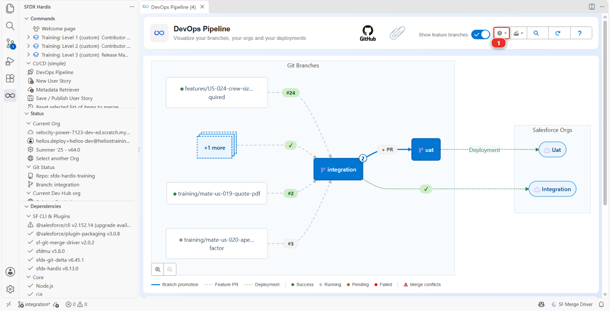

# Lab 3.6 - Livrer en production et lire vos métriques DORA

**Niveau** : 3 Release Manager

**Durée** : ~35 min

**Vous allez** : livrer en production, puis mesurer si votre pipeline vaut quelque chose.

## La situation

L'UAT a validé. La livraison part en production ce soir.

C'est le même mécanisme qu'au [Lab 3.5](3-5-promote-to-uat-and-write-release-notes.md), deux fois : `uat` dans `preprod`, puis `preprod` dans `main`.
Avec une différence qui n'est pas technique : si vous vous trompez, de vraies personnes ne pourront
pas faire leur travail demain. Tout ce qui, dans ce lab, ressemble à du cérémonial est là parce que
quelqu'un l'a sauté une fois.

## Avant de commencer

- [ ] [Lab 3.5](3-5-promote-to-uat-and-write-release-notes.md) terminé : `uat` porte la livraison et les testeurs l'ont validée
- [ ] `helios-preprod` et `helios-prod` connectées, alimentées, et configurées comme orgs de
      `preprod` et `main` au Lab 3.1
- [ ] Authentification JWT fonctionnelle pour `preprod` et `main`

## Les étapes

### 1. Vérifier les trois choses qui méritent de l'être

Avant de créer quoi que ce soit :

**Un : l'UAT est-elle vraiment validée ?** Pas "le déploiement était vert". Quelqu'un a testé et a
dit oui. Sur ce projet cette personne, c'est vous, et vous l'avez fait au [Lab 3.5, étape 6](3-5-promote-to-uat-and-write-release-notes.md#6-verifier-avec-des-yeux-de-testeur).

**Deux : quelles étapes manuelles cela va-t-il transporter ?** Regardez les deployment actions des
stories qui sortent. Une étape manuelle en production est quelque chose que vous ferez, en direct,
devant personne, à l'heure qu'est la livraison. Sachez-le maintenant.

**Trois : la production est-elle là où vous le croyez ?** Ouvrez `helios-prod` et regardez. Elle
devrait porter ce que le cours y a semé et rien d'autre pour l'instant. Sur un vrai projet, les
admins modifient la production à la main entre deux livraisons, et le [Lab 3.7](3-7-hotfix-and-retrofit.md) parle exactement de
cela. Ne présumez rien.

### 2. Répéter en preprod

De la même façon que vous avez créé la promotion au [Lab 3.5](3-5-promote-to-uat-and-write-release-notes.md) : la pastille **+ PR** sur la flèche
d'`uat` vers `preprod`, dans le diagramme DevOps Pipeline. GitHub s'ouvre sur la Pull Request d'`uat`
vers `preprod`.

Son job de contrôle est le premier à se connecter à `helios-preprod`, et il le fait avec la clé et
les secrets du [Lab 3.1](3-1-configure-the-pipeline-up-to-production.md) : un contrôle vert ici, c'est votre installation JWT de `preprod` qui
fonctionne.

Intitulez-la simplement :

> Promotion 2026-09 to preprod

Son premier contrôle s'arrête en **rouge**, exprès, comme celui de la promotion vers `uat` au
[Lab 3.5 étape 4](3-5-promote-to-uat-and-write-release-notes.md) : l'étape de délivrabilité de US-026 s'exécute avant le déploiement, et
personne ne l'a faite dans `helios-preprod`. Faites-y le clic, cochez sa case dans le commentaire
sfdx-hardis (ou **Mark as done in preprod** dans l'onglet **Deployment Actions** de VS Code), puis
**Re-run all jobs** sur le contrôle. Il passe au vert.

Lisez le contrôle, mergez, et regardez l'exécution **Process Deployment (sfdx-hardis)** sur
`preprod`. Ouvrez ensuite `helios-preprod` et faites-y d'abord les vérifications de l'étape 6.

C'est à cela que sert `preprod`. Elle contient ce que contient la production, personne n'y travaille,
et une livraison qui s'y déploie proprement et se comporte bien n'a plus grand-chose pour vous
surprendre en production. Une livraison qui échoue ici ne vous a rien coûté.

### 3. Créer la Pull Request de production

La pastille **+ PR** sur la flèche de `preprod` vers `main`, de `preprod` dans `main`. Son job de
contrôle est la première connexion JWT à `helios-prod`. Intitulez-la simplement :

> Release 2026-09 to production

Son premier contrôle s'arrête en rouge pour la même raison qu'à l'étape 2, dans la dernière org où
personne n'a fait l'étape de délivrabilité : `helios-prod`. Faites le clic en production, cochez la
case, **Re-run all jobs**, et lisez le contrôle vert qui suit.

### 4. Lire le contrôle comme si cela comptait

Quand le contrôle se termine, lisez le commentaire sfdx-hardis comme le [Lab 3.2](3-2-review-a-contributor-pull-request.md) l'a enseigné, et
ajoutez deux questions qui ne valent que pour la production :

| Question                                     | Où regarder                                                                                                                        |
|----------------------------------------------|------------------------------------------------------------------------------------------------------------------------------------|
| **Est-ce que cela supprime quelque chose ?** | Le chiffre `deleted` de la ligne de compteurs. Une suppression en production est définitive et emporte des données avec elle       |
| **Combien de temps cela va-t-il prendre ?**  | La durée du contrôle est une estimation raisonnable. Si c'est 40 minutes, ce sont 40 minutes pendant lesquelles l'org est modifiée |

Si ce chiffre n'est pas zéro et que vous ne vous y attendiez pas, **arrêtez-vous**. Le commentaire ne
vous dira pas ce qui part : `manifest/destructiveChanges.xml` et le diff, si. Découvrez de quoi il
s'agit et qui l'a voulu. Ce n'est pas de la prudence, c'est le métier.

### 5. Merger, et rester

Mergez. L'exécution **Process Deployment (sfdx-hardis)** démarre, cette fois sur `main`.

Regardez-la. Non parce que vous pouvez faire quoi que ce soit pendant qu'elle tourne, mais parce que
savoir si elle a échoué à la deuxième minute ou à la trente-cinquième change ce que vous faites
ensuite.

Quand elle se termine, faites les éventuelles étapes manuelles post-déploiement, puis vérifiez
l'org. Celles de pré-déploiement se font avant le merge : faites-les, cochez leurs cases dans le
commentaire du contrôle, puis mergez, et le job de déploiement les enregistre, comme au
[Lab 3.5](3-5-promote-to-uat-and-write-release-notes.md).

### 6. Vérifier en production

Ouvrez `helios-prod` depuis **Orgs Manager** : trouvez-la par son alias **(2)**, vérifiez qu'elle dit
**Connected** **(3)**, puis **Open** dans le menu d'actions au bout de sa ligne. Une ligne
déconnectée propose **Reconnect** dans ce même menu ; **Add Org** **(1)** est pour une org que le
tableau n'a pas.

Vérifiez ensuite, comme pour l'UAT et avec davantage de soin :

- Les deux stories fonctionnent
- Quelque chose qui fonctionnait déjà fonctionne toujours : ouvrez une installation, vérifiez le
  composant de timeline, enregistrez un enregistrement

Cette dernière vérification existe parce que l'incident de production le plus fréquent après une
livraison n'est pas la nouvelle fonctionnalité qui échoue. C'est une ancienne.

### 7. Mesurer la pipeline, maintenant

Vous avez livré. La question qu'on pose ensuite à un release manager est "où en est-on", et elle
mérite mieux qu'une impression.

**Pointez-vous d'abord sur `helios-prod`.** Ouvrez **Orgs Manager**, trouvez la ligne `helios-prod`,
et choisissez **Set as Default Org** dans son menu d'actions. Le rapport mesure l'org vers laquelle
vous êtes pointé : lancez-le pendant que `helios-dev` est votre org courante et vous obtenez un
rapport sur votre sandbox, correctement mis en forme et totalement hors sujet.

Ouvrez ensuite le panneau **DevOps Pipeline**, cliquez sur l'engrenage **(1)** en haut à droite, et
choisissez **Generate DORA Metrics Report**. Le menu contient trois entrées et vous avez utilisé les
deux autres : **Pipeline Settings** au [Lab 3.1](3-1-configure-the-pipeline-up-to-production.md), **Add/Configure Org** au [Lab 3.1](3-1-configure-the-pipeline-up-to-production.md).

Il couvre les 90 derniers jours par défaut, et il rend compte de cinq nombres, pas quatre :

| Métrique                   | Ce qu'elle compte vraiment                                                            | À quoi ressemble le bon                                                                                       |
|----------------------------|---------------------------------------------------------------------------------------|---------------------------------------------------------------------------------------------------------------|
| **Deployment Frequency**   | Les déploiements réussis enregistrés **dans l'org**, divisés par la période           | Hebdomadaire convient. Trimestriel veut dire que chaque livraison est énorme                                  |
| **Lead Time for Changes**  | Par Pull Request : de sa création au déploiement survenu dans les 14 jours            | Des jours, pas des semaines. Un long délai veut dire que du travail stagne                                    |
| **Change Failure Rate**    | Les déploiements en échec divisés par tous les déploiements                           | Sous 15 %. Au-dessus, le contrôle n'attrape pas ce qu'il devrait                                              |
| **Mean Time to Recovery**  | Médiane en heures, malgré le nom, d'un déploiement en échec au suivant qui réussit    | Des heures                                                                                                    |
| **Deployment Rework Rate** | Les Pull Requests de hotfix, et les déploiements qui suivent un échec dans la journée | Bas. Lisez la note ci-dessous avant d'attendre du [Lab 3.7](3-7-hotfix-and-retrofit.md) qu'il le fasse bouger |

Deux d'entre elles ne sont pas ce que leur nom suggère, et il vaut la peine de savoir lesquelles.
**Le change failure rate est ici un taux d'échec de déploiement** : une livraison qui s'est déployée
au vert et a cassé la production le mardi n'y apparaît pas. **Le Mean Time to Recovery est l'écart
entre un déploiement cassé et un déploiement qui marche**, pas entre un incident et sa correction.
Elles mesurent votre pipeline, pas votre org.

### 8. Lire ce qui est là, et savoir ce qui manque

Vous avez livré une fois. Sur une org de production neuve, c'est à peu près ce que le rapport
montrera : une poignée de déploiements sur une fenêtre de 90 jours qui était vide jusqu'à cette
semaine, ceux que **Set up one of my training orgs** a faits pour alimenter `helios-prod` et votre
livraison. Il n'y a pas encore de courbe à lire, et un rapport qui le dit dit la vérité.

C'est la version honnête de cette étape, et c'est aussi tout l'intérêt. Un rapport DORA sur un
pipeline qui a tourné une fois est une ligne de base vide. Il devient utile à la quatrième ou
cinquième livraison, quand les nombres ont d'où bouger. Prenez la ligne de base maintenant.

Le rapport est un fichier, `docs/dora/dora-report-<date>.md`, et le panneau vous l'ouvre. Laissez-le
là où il est : il est reconstruit depuis l'org et les Pull Requests à chaque nouvelle exécution du
rapport, rien n'est donc commité, et le [Lab 3.11](3-11-capstone-run-a-weekly-release-cycle.md) compare le suivant avec celui-ci. Le fichier porte le
nom du jour : un second rapport le même jour le remplace. Si vous enchaînez avec le
[Lab 3.11](3-11-capstone-run-a-weekly-release-cycle.md) aujourd'hui, notez d'abord les cinq chiffres, ou copiez le fichier sous un autre nom.

Sous le capot : d'où viennent les nombres DORA

La commande était :

    sf hardis:doc:dora-report

et elle lit **deux** sources, ce qui est ce qu'il faut savoir d'elle :

- **Salesforce**, via la Tooling API : chaque `DeployRequest` sur l'org cible dans la période, avec
  son statut et ses dates, en ignorant les exécutions de validation seule. La fréquence de
  déploiement, le taux d'échec et le temps de rétablissement sont calculés à partir de cela et de
  rien d'autre
- **Le fournisseur git**, pour les Pull Requests mergées dans la branche courante. Le lead time
  apparie chacune avec le premier déploiement réussi terminé dans les 14 jours suivant son merge. Le
  taux de reprise utilise les noms de branches, reconnaissant une correction à un préfixe `hotfix/`,
  `fix/` ou `bugfix/`, et il retient le plus grand entre ce compte et les déploiements ayant suivi un
  échec dans les 24 heures

Il ne lit donc pas `productionBranch`, il ne lit pas `developmentBranch`, et il n'a aucune idée de
laquelle de vos orgs est la production. **L'org vers laquelle vous le pointez est la portée.**
Pointez-le vers une sandbox et il mesurera la sandbox, avec entrain.

**Une chose à vérifier sur n'importe quel projet.** Le taux de reprise reconnaît une modification
corrective à son nom de branche, et il cherche `hotfix/`, `fix/` ou `bugfix/`. Ce projet nomme ses
branches de correction `fix/`, le hotfix que vous livrerez au [Lab 3.7](3-7-hotfix-and-retrofit.md) compte donc. Renommez ce
préfixe en autre chose et la métrique affiche discrètement zéro, sans avertissement. Un nombre bâti
sur des noms de branches ne vaut que ce que vaut la convention de nommage, ce qui mérite d'être
vérifié avant d'en citer un à quiconque.

Deux dégradations à savoir reconnaître plutôt qu'à déboguer :

- **Pas d'org cible** : les trois métriques Salesforce affichent "No data available" et le rapport
  s'imprime quand même
- **Pas de token de fournisseur git** : il retombe sur la lecture de `git log`, reconnaissant les
  commits de merge de GitHub et GitLab et les commits de squash de GitHub et Azure DevOps. Le lead
  time affiche alors zéro : un commit porte le jour où il a été mergé, et pas le jour où sa Pull
  Request a été ouverte

Le rapport atterrit dans `hardis-report/` et est copié dans `docs/dora/`.

Les nombres sont honnêtes d'une façon qu'un tableau de bord rempli à la main ne sera jamais.
Personne ne peut améliorer la fréquence de déploiement en éditant un tableur. Ils sont aussi plus
étroits que ce que les noms DORA laissent croire, et un release manager qui les cite devrait savoir
quelle part ils couvrent.

<!-- command-links:start -->
Documentation de la commande : [hardis:doc:dora-report](https://sfdx-hardis.cloudity.com/hardis/doc/dora-report/)
<!-- command-links:end -->

## Ce que vous devez voir

- `preprod` et `main` portant la livraison
- Une exécution **Process Deployment (sfdx-hardis)** verte sur `preprod`, puis une sur `main`
- Les stories fonctionnelles dans `helios-prod`
- Un rapport DORA mesuré sur `helios-prod`, dans `docs/dora/`

## En cas de problème

**Le déploiement en production échoue sur un composant qui marchait en preprod.**
La production a dérivé, ou elle a quelque chose que preprod n'a pas : une règle de validation en
plus, un type d'enregistrement, de vraies données qui violent une nouvelle contrainte. Lisez
l'erreur. C'est l'échec de déploiement en production le plus fréquent, et c'est l'argument pour
garder preprod aussi proche de la production que possible.

**Le déploiement a réussi à moitié.**
Les déploiements Salesforce sont atomiques par déploiement : cela veut donc généralement dire qu'une
action post-deploy a échoué après un déploiement réussi. La métadonnée est entrée, l'action non.
Relancez l'action, pas le déploiement.

**Le rapport DORA dit "No data available" pour trois des métriques.**
Il n'avait pas d'org cible. Dans **Orgs Manager**, mettez `helios-prod` comme org par défaut, puis
rouvrez **Generate DORA Metrics Report**.

**Le rapport parle de la mauvaise org.**
Même cause, dans l'autre sens : il a mesuré votre org par défaut, qui n'était pas `helios-prod`.

**Le lead time est à zéro ou absent.**
Aucune donnée de Pull Request : il n'y a pas de token de fournisseur git dans l'environnement, et le
repli sur `git log` ne peut pas savoir quand une Pull Request a été ouverte.

## Vérifiez votre travail

Welcome page > **Training: Level 3** > **Check my work**, puis choisissez le **Lab 3.6**.

## Pour aller plus loin

- [Déployer vers les orgs majeures](https://sfdx-hardis.cloudity.com/salesforce-devops-deploy-major-branches/)
- [Métriques DORA](https://sfdx-hardis.cloudity.com/hardis/doc/salesforce-devops-dora-report/)

[Suite : Lab 3.7 - La production est cassée : hotfix et retrofit](3-7-hotfix-and-retrofit.md){ .md-button .md-button--primary }
