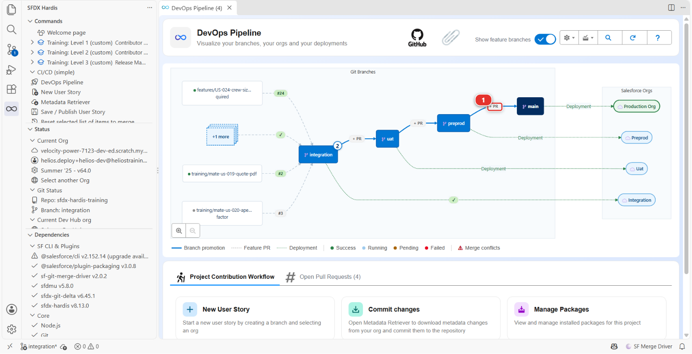
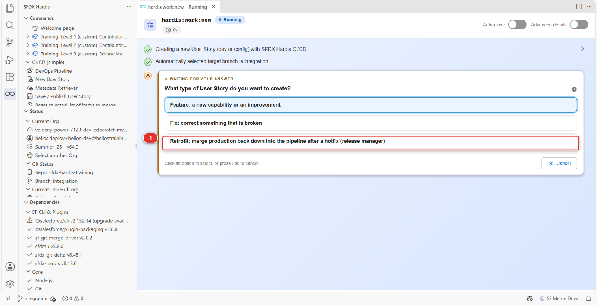
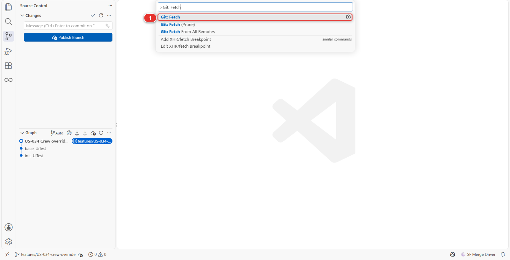
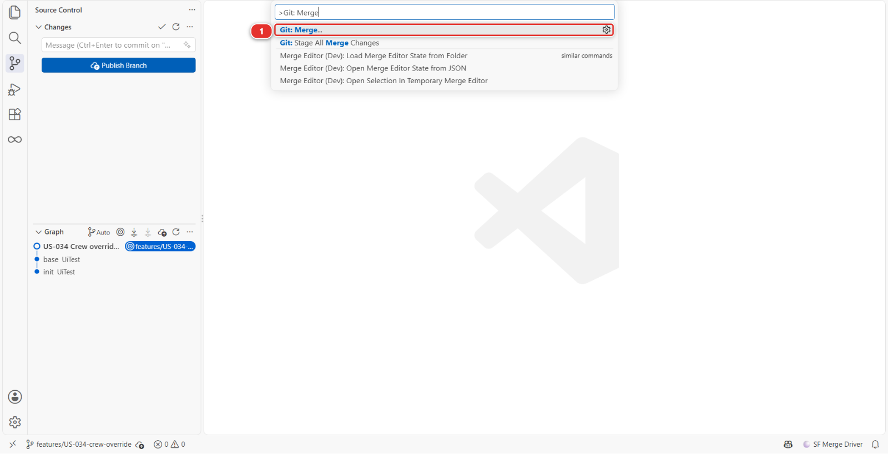
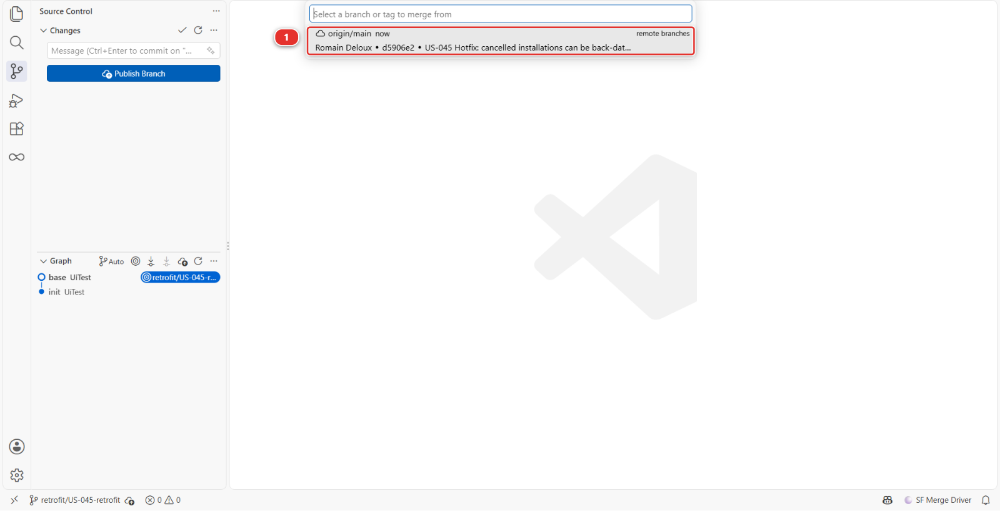

# Lab 3.7 - La production est cassée : hotfix et retrofit

**Niveau** : 3 Release Manager

**Durée** : ~35 min

**Vous allez** : mener une formule cassée de la production jusqu'à un correctif en ligne, puis
ramener ce correctif dans la pipeline pour que rien ne le défasse.

## La situation

**17h40, un vendredi.** Les planificateurs bouclent la semaine en annulant les installations que les
équipes n'ont pas pu atteindre et en les antidatant au jour où le chantier a été décommandé. Chacun
de ces enregistrements est refusé.

La formule de la règle de validation `Installation_Date_Not_Past` exempte les installations
`Completed` et ne dit rien de celles qui sont `Cancelled` : un chantier qui n'aura jamais lieu se
voit donc opposer une règle sur sa planification. C'est une condition manquante, et cela empêche les
planificateurs de boucler leur semaine.

**Un hotfix ne saute pas la pipeline.** Il y entre plus loin. Une story ordinaire part
d'`integration` et voyage `integration` vers `uat` vers `preprod` vers `main`. Un hotfix part de
`preprod`, la branche qui contient exactement ce que la production fait tourner, et voyage `preprod`
vers `main`. Mêmes branches, même protection, mêmes contrôles, mêmes jobs de déploiement. Seul le
point d'entrée diffère, et c'est pourquoi le [Lab 3.1](3-1-configure-the-pipeline-up-to-production.md) a mis `preprod` dans `availableTargetBranches`.

Une chose en découle, et la Partie 3 en parle : `uat` et `integration` n'ont jamais vu le commit, la
prochaine livraison depuis `integration` déploierait donc l'ancienne formule par-dessus le correctif
et ramènerait l'incident. Ramener `main` vers le bas est le **retrofit**, et il n'est pas facultatif.

## Avant de commencer

- [ ] [Lab 3.6](3-6-release-to-production-and-read-dora-metrics.md) terminé : la livraison est en production
- [ ] `helios-preprod` et `helios-prod` connectées dans **Orgs Manager**
- [ ] Rien en attente dans le panneau **Source Control** auquel vous teniez encore

## Partie 1 : le correctif

### 1. Voir ce qui est cassé, en production

Ouvrez `helios-prod` et regardez la règle elle-même : **Setup > Object Manager > Installation >
Validation Rules** **(1)**, puis `Installation_Date_Not_Past` **(2)**.


Sa formule aujourd'hui :

```
AND(
  ISCHANGED(Install_Date__c),
  Install_Date__c < TODAY(),
  NOT(ISPICKVAL(Status__c, "Completed"))
)
```

Trois conditions, et deux d'entre elles ont déjà fait leur travail. `ISCHANGED` est la raison pour
laquelle un ancien enregistrement peut encore être enregistré tant que personne ne touche à la date,
et l'exemption `Completed` est la raison pour laquelle un chantier terminé peut être daté du jour où
il l'a été. Celui qui a écrit cela y avait réfléchi. Il a simplement écrit la liste des exceptions
avant que quiconque ait inventé une deuxième façon d'être une exception.

**Confirmez avant d'appeler cela un incident.** Ouvrez n'importe quelle installation dans
`helios-prod`, mettez son statut à `Cancelled`, mettez la date d'hier dans **Install Date**, et
enregistrez. Le message d'erreur de l'image ci-dessus est ce que vous obtenez. C'est le signalement
reproduit, sur la vraie org, en trente secondes.

### 2. Le développeur branche le correctif depuis preprod

Le correctif est à Romain de l'écrire, pas à vous : un release manager relit et livre ce que les
contributeurs envoient, et n'écrit pas leurs fonctionnalités. **Training: Level 3** > **Simulate my
teammates**, et choisissez **US-045 Hotfix: cancelled installations can be back-dated again**.


Cela ouvre sa Pull Request de `fix/US-045-installation-date-hotfix` vers **`preprod`**. Sa branche a
été tirée de `preprod`, ce que fait **New User Story** quand la cible est `preprod`.

!!! danger "Ne branchez jamais un hotfix depuis integration"
    `integration` porte le travail de la semaine prochaine. Un correctif branché depuis elle livre le
    travail de la semaine prochaine en production ce soir, par-dessus un incident, sans que personne
    l'ait testé. C'est l'erreur la plus coûteuse disponible dans ce lab, et la raison d'être de
    `preprod`.

### 3. Relire le correctif

Ouvrez la Pull Request, **Files changed** **(1)**. Un fichier, la règle de validation **(2)**, et la
modification est la ligne ajoutée **(3)** :


```
  NOT(ISPICKVAL(Status__c, "Cancelled"))
```

Une installation annulée est du travail terminé, exactement comme une installation achevée, et la
description de la règle dit elle-même que le travail terminé est exempté. Lisez-la avec les questions
du [Lab 3.2](3-2-review-a-contributor-pull-request.md) : elle correspond à la story, rien ne disparaît, et elle est réversible en une ligne.

Petite, et son rayon d'impact tient en une phrase : **les installations annulées peuvent à nouveau
être datées dans le passé, et rien d'autre ne change.** C'est cela, un hotfix.

## Partie 2 : vers la production

### 4. Le merger dans preprod

Quand le contrôle est vert, mergez-la avec **Squash and merge**, depuis la flèche à côté de **Merge
pull request** **(1)** : la branche de Romain est un correctif, et un correctif se squashe comme
chaque User Story ([Lab 1.6](../level-1-contributor-basics/1-6-pull-request-deployment-check-and-merge.md)). La promotion vers `main` qui suit est mergée, pas squashée.


Le déploiement vers `helios-preprod` suit tout seul. C'est la répétition, sur une org qui contient ce
que contient la production, et elle vous coûte deux minutes.

### 5. Livrer preprod dans main

Une pastille **+ PR** est posée sur chaque flèche entre branches majeures dans le diagramme DevOps
Pipeline. Cliquez sur celle de la flèche de `preprod` vers `main` **(1)** :



Intitulez-la simplement, et employez le mot **Hotfix** plutôt que **Release**, pour que dans un an la
liste des Pull Requests vers `main` dise lesquelles ont pris le chemin court :

> Hotfix US-045 to production

Son contrôle déploie contre la production en mode validation, ce qui est exactement ce qu'on veut à
17h40 : la même barrière, sur la vraie org, en deux minutes.

### 6. Confirmer que c'est en ligne

Mergez, et regardez l'exécution **Process Deployment (sfdx-hardis)** sur `main`. Quand elle se
termine, le commentaire sfdx-hardis dit ce qui a atteint l'org : la bannière **(1)**, la ligne de
compteurs **(2)**, et la ligne Quick Deploy **(3)** : le merge a libéré la validation que son contrôle
avait déjà faite sur la production, au lieu de déployer à nouveau. L'image est le commentaire d'un
déploiement précédent, vos compteurs sont donc différents.


Confirmez ensuite comme vous avez reproduit : annulez une installation dans `helios-prod`,
antidatez-la, et enregistrez. Cela s'enregistre. Les planificateurs peuvent boucler leur semaine.

**Un log de déploiement n'est pas une confirmation.** Le log dit ce que Salesforce a accepté. Seule
l'org dit si la chose dont les gens se plaignaient fonctionne maintenant.

## Partie 3 : le retrofit

### 7. Démarrer la branche de retrofit

`main` et `preprod` portent le correctif. `uat` et `integration` non. Laissez-le là et la prochaine
story venue d'`integration` qui touche à cette règle déploiera l'ancienne formule par-dessus, et
l'incident reviendra un jour où personne ne l'attend.

C'est à vous de le faire, pas à un contributeur : vous êtes celui qui sait ce qui est parti en ligne
ce soir, et un conflit entre un hotfix et du travail en cours est une décision de release manager.

Dans le panneau **DevOps Pipeline**, sous **Project Contribution Workflow** **(1)**, cliquez sur
**New User Story** **(2)** :


Prenez le troisième type de branche, **Retrofit: merge production back down into the pipeline after
a hotfix (release manager)** **(1)** :



| Question        | Votre réponse                                                              |
|-----------------|----------------------------------------------------------------------------|
| Branche cible   | `integration`, la branche dans laquelle le retrofit revient                |
| Type de branche | **Retrofit**                                                               |
| Nom             | `US-045-retrofit`, la story dont vous ramenez le hotfix                    |
| Org de travail  | `helios-dev` : rien n'est construit ici, l'org n'a donc guère d'importance |

Cela crée `retrofit/US-045-retrofit` depuis la dernière `integration`. Le préfixe est une ligne de
`branchPrefixChoices`, et il dit à quiconque lit la liste des branches que c'est la production qui
redescend, pas du travail nouveau.

### 8. Y merger main

Assurez-vous d'abord que votre machine sait ce qui est parti en ligne. Ouvrez la **Command Palette**
(**View > Command Palette**, ou `Ctrl+Shift+P`, `Cmd+Shift+P` sur un Mac), tapez `Git: Fetch` et
choisissez **Git: Fetch** **(1)** :



Puis la Command Palette à nouveau, tapez `Git: Merge`, et choisissez **Git: Merge...** **(1)** :



Elle demande quelle branche merger. Choisissez **origin/main** **(1)**, listée sous
**remote branches** :



!!! danger "origin/main, pas main"
    `main` toute seule est la copie de votre machine, que vous n'avez pas mise à jour depuis avant le
    hotfix, et la merger ne ramène rien. `origin/main` est ce que la production vient de déployer. La
    liste marque les branches distantes, et c'est le clic autour duquel tout ce lab tourne.

Ce soir, cela merge tout seul : personne d'autre n'a touché à cette règle de validation cette
semaine. Quand il y a conflit, c'est que quelqu'un a modifié les mêmes lignes dans `integration`, et
la réponse est celle du [Lab 2.7](../level-2-contributor-advanced/2-7-resolve-a-git-merge-conflict.md) : ouvrez chaque fichier sous **Merge Changes**, **Resolve in Merge
Editor**, et gardez les deux intentions, l'exception du hotfix **et** ce qu'`integration` a ajouté.
Aucun des deux côtés ne perd son travail.

### 9. Le publier, et le merger dans integration

**Save / Publish User Story**, comme au [Lab 1.5](../level-1-contributor-basics/1-5-retrieve-commit-and-publish-your-changes.md). Quand la commande se termine, la barre d'actions du
bas commence par **Create Pull Request** **(1)**. À côté se trouvent le `package.xml` généré par la
commande **(2)** et les deployment actions de cette Pull Request **(3)** : sur un retrofit, les deux
sont courts, parce qu'un retrofit transporte ce que la production a déjà et ne déclare rien de
nouveau.


Ouvrez la Pull Request vers `integration`, intitulez-la
`Retrofit: US-045 back down into integration`, attendez ses contrôles, et mergez-la. `integration`
porte maintenant tout ce que la production porte, et la prochaine story construite dessus ne peut
plus emporter le correctif.

<details markdown="1"><summary>Sous le capot : le hotfix et le retrofit, en commandes</summary>

**Le hotfix** n'a rien utilisé de spécial. Romain a lancé `hardis:work:new` avec `preprod` comme
branche cible, ce qui tire sa branche de `preprod`, et `hardis:work:save` a calculé le package par
rapport à `preprod`. La pipeline traite `preprod` comme n'importe quelle autre branche majeure. Ce
qui en fait un hotfix est la cible, pas un mode.

Le préfixe de branche mérite une seconde de réflexion, pour une raison qui dépasse le rangement : le
**rework rate** DORA du [Lab 3.6](3-6-release-to-production-and-read-dora-metrics.md) compte les Pull Requests de hotfix, et en reconnaît une à un préfixe
de branche `hotfix/`, `fix/` ou `bugfix/`. Ce projet appelle ses branches de correction `fix/`,
celle-ci compte donc.

**Le retrofit** est du Git de bout en bout, et rien n'est récupéré d'aucune org :

    git checkout -b retrofit/US-045-retrofit origin/integration
    git fetch origin
    git merge origin/main
    # résoudre les conflits si git en signale, puis commiter
    git push -u origin retrofit/US-045-retrofit

La direction est tout le sujet. Le travail remonte normalement **vers le haut**, d'une branche de
story vers `integration`, puis `uat`, puis `preprod`, puis `main`. Un retrofit est la seule chose qui
descend, et il existe parce qu'un hotfix a rejoint la pipeline au-dessus des branches sur lesquelles
l'équipe travaille.

**Faites-le le soir même.** Un retrofit remis à lundi est un retrofit qui se heurte à une semaine de
travail neuf, et le merge cesse d'être une formalité.

<!-- command-links:start -->
Documentation des commandes : [hardis:work:new](https://sfdx-hardis.cloudity.com/hardis/work/new/), [hardis:work:save](https://sfdx-hardis.cloudity.com/hardis/work/save/)
<!-- command-links:end -->

</details>

## Ce que vous devez voir

- `helios-prod` enregistre une installation annulée et antidatée
- Trois Pull Requests dans votre fork, dans cet ordre : vers `preprod`, `preprod` vers `main`, et le
  retrofit vers `integration`
- La même ligne `NOT(ISPICKVAL(Status__c, "Cancelled"))` sur `preprod`, sur `main` et sur
  `integration`

## En cas de problème

**La Pull Request du hotfix cible `integration`.**
La simulation l'ouvre vers `preprod`. Si vous voyez `integration`, vous regardez une autre Pull
Request : vérifiez que sa branche source est `fix/US-045-installation-date-hotfix`.

**`origin/main` n'est pas dans le sélecteur de branche.**
VS Code ne l'a pas récupérée. Relancez **Git: Fetch**, puis **Git: Merge...**. Rien ne change dans
vos fichiers quand vous faites un fetch.

**Le merge n'a rien ramené.**
Vous avez choisi `main` plutôt que `origin/main`. Relancez **Git: Merge...** et prenez l'entrée
listée sous **remote branches**.

**La Pull Request de retrofit montre des centaines de fichiers modifiés.**
Votre branche a été tirée d'autre chose que la dernière `integration`. Supprimez-la et reprenez
l'étape 7 : **New User Story** branche toujours depuis la dernière cible.

**Le contrôle du retrofit échoue sur une erreur de déploiement.**
Lisez-la comme le [Lab 3.3](3-3-deploy-to-integration-and-read-the-log.md) l'a enseigné. Un retrofit déploie ce que la production a déjà : une erreur
ici est donc presque toujours un composant qu'`integration` a modifié et que `main` n'a pas vu, pas
le hotfix lui-même.

## Vérifiez votre travail

**Training: Level 3** > **Check my work**.

Il cherche l'exemption `Cancelled` sur `preprod` et sur `main`, et la même ligne sur `integration` :
le hotfix est parti, et le retrofit l'a ramené.

## Pour aller plus loin

- [Hotfixes](https://sfdx-hardis.cloudity.com/salesforce-devops-hotfixes/)
- [Retrofit](https://sfdx-hardis.cloudity.com/salesforce-devops-retrofit/)
- [Guide du release manager](https://sfdx-hardis.cloudity.com/salesforce-devops-release-home/)

[Suite : Lab 3.8 - Monitorer votre org de production](3-8-monitor-your-production-org.md){ .md-button .md-button--primary }
